<div align="center">

# EdgeGround-VLA

**A Lightweight Model Fusing Heterogeneous Grounding Encoders for Goal-Directed Navigation in Wheeled Robots**

[](docs/01.paper/EdgeGround-VLA.hwp)
[](https://minuum.github.io/EdgeGroundVLA/)
[](#핵심-결과)
[](#아키텍처)
[](#)

[**Results**](#핵심-결과) · [**Architecture**](#아키텍처) · [**Key Findings**](#주요-발견) · [**Dataset**](#데이터셋) · [**Checkpoints**](#체크포인트) · [**Docs**](#문서)

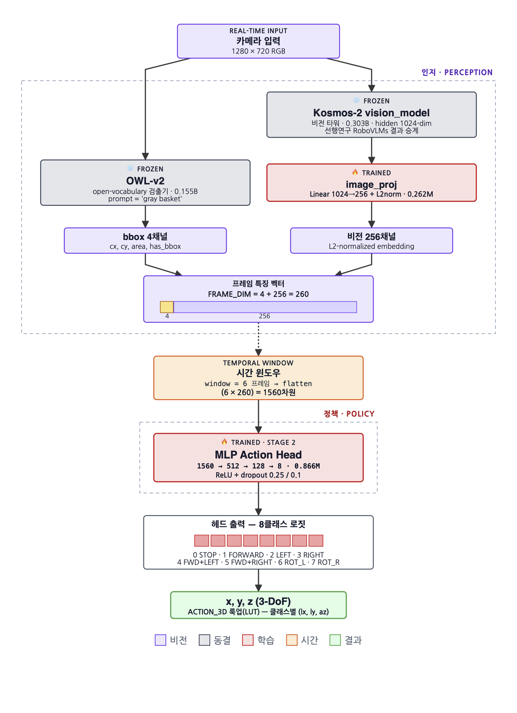

</div>

> Open-vocabulary detection + lightweight action head for mobile robot basket navigation — no LLM decoder,
> no cloud connectivity, no pre-built map. Fully on-device on a Jetson Orin NX.

**마지막 업데이트**: <!-- SYNC:updated -->2026-09-03<!-- /SYNC:updated -->
**GitHub Pages**: https://minuum.github.io/EdgeGroundVLA/

---

## Latest Updates

- **2026-09-03** — README 전면 재작성 (VLA 오픈소스 레포 스타일 참고: OpenVLA/Octo/openpi/LeRobot), 아키텍처·로봇 사진 임베드
- **2026-08-27** — `model_architecture_brief.html` 전면 리빌드, 레거시 실험 서사(cadence-aligned·bbox_scale 딥다이브) 결론만 남기고 정리
- **2026-08-19** — 추론 사용 파라미터 정확 실측(459,274,896) 반영, 오류 심각도 분해 도판 추가
- **2026-08-07** — exp73 배포 전환(image_proj + MLP 헤드 재학습), 실기 100건 재검증 95/100 달성
- **2026-08-01** — Kosmos-2 언어 디코더 로드 제거 적용 (host RAM 10.59GB → 3.20GB, 출력 bitwise 동일)

---

## 핵심 결과

<!-- SYNC:results_table:start -->
| Method | Architecture | 실기 성공률 ↑ | val_acc | Note |
|---|---|---|---|---|
| E2E VLA (Exp11) | Kosmos-2 + LoRA | 0.0% (CL) | 58.6% PM | Text attn 0%, structural failure |
| Decomp v1 (Exp14) | CLIP + BBox MLP | 66.7% (CL) | 75.9% PM | First decomposition baseline |
| Simple MLP (Exp65b) | CLIP + plain MLP | 10.3% (CL) | — | No L2-norm, no aug → pipeline ablation |
| Ours (Exp66, legacy) | CLIP + L2-norm + aug | 96.6% (CL, 시뮬) | 93.5% | 구 SOTA · 시뮬 closed-loop 기준 |
| **Ours (exp73) ★** | **OWL-v2 + Kosmos-2 vision + image_proj + MLP** | **95.0% (실기 95/100)** | **74.1%** | **현재 배포 구성** |
<!-- SYNC:results_table:end -->

**병목은 검출, 액션 헤드가 아니다** — 세션 내 검출 성공률(gnd%) ≥80%일 때 주행 성공률 98.8%(79/80),
<80%일 때 51.2%(41/80). 타겟을 계속 보고만 있으면 거의 반드시 도달하고, 실패는 전부 "보지 못한" 경우.
0.866M짜리 MLP 헤드는 이미 충분하며, 자원을 투입할 곳은 검출 단계다.

<p align="center">
  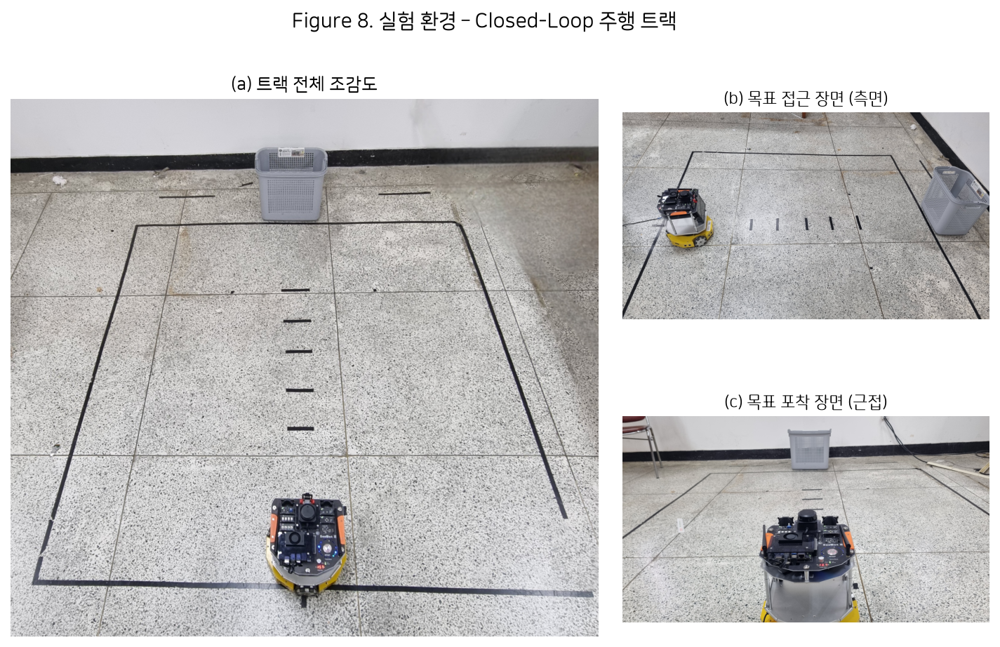
</p>

---

## 아키텍처

현재 배포 구성(exp73)은 VLA가 아니라 **"오픈 보캐블러리 객체 검출 + 경량 액션 헤드"**다.
Kosmos-2 언어 디코더는 로드조차 하지 않고(2026-08-01 제거, host RAM 10.59GB→3.20GB, 출력 bitwise 동일),
텍스트는 OWL-v2 검출 쿼리("gray basket")를 지정하는 런타임 불변 상수로만 쓰인다.

```
[Camera 720×1280 RGB]
       ├──────────────────────────────┐
       ↓                              ↓
[OWL-v2, 0.155B, zero-shot]   [Kosmos-2 vision_model, 0.303B, frozen]
  "gray basket" 검출                  ↓ 1024-dim
       ↓                       [image_proj → 256-dim, L2-normalize]  ← Stage 1 학습, 배포 시 frozen
[cx, cy, area, has_bbox] (4-dim)      ↓
       └──────────────→ [프레임 특징 260-dim] ← window=6 → [1560-dim]
                                       ↓
                         [MLP 액션 헤드: 1560→512→128→8]  ← Stage 2 학습 대상 (0.866M)
                                       ↓
                    [8 Actions: STOP / FWD / LEFT / RIGHT / FWD+L / FWD+R / ROT_L / ROT_R]
                                       ↓
                         3-DoF (x,y,z) 룩업(LUT) → CAN → 바퀴
```

<p align="center">
  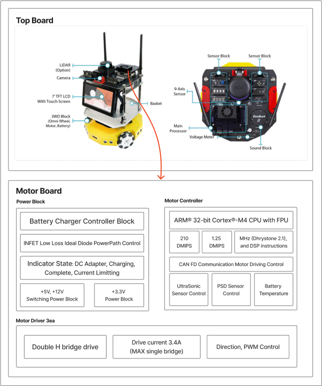
</p>

- **Stage 1** (image_proj, 5-class 대조학습): val_acc 94.09% · 225ep · OWL-v2 라벨
- **Stage 2** (MLP 액션 헤드, 8-class): val_acc 74.13%(stride=1 정확 채점) · window=6 · bbox_scale=3.0
- 추론 사용 파라미터 **459.3M** / 학습 파라미터 **1.128M**(0.262M image_proj + 0.866M MLP)
- 상세: [model_architecture_brief.html](https://minuum.github.io/EdgeGroundVLA/v5/model_architecture_brief.html)

<table>
<tr>
<td width="50%">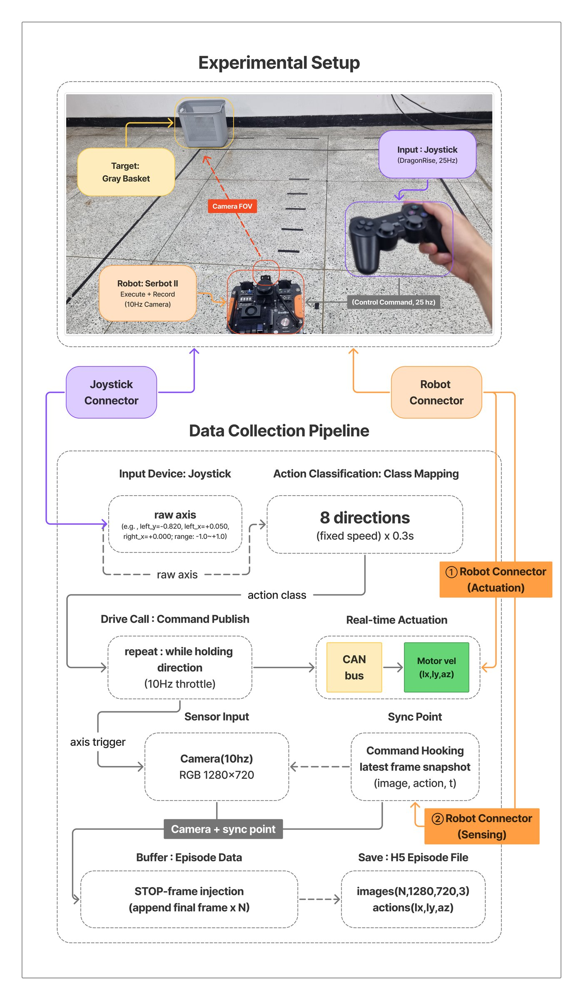<br><sub><b>Fig. 3</b> — Data collection: 225 teleoperated episodes (16,599 frames), 5 target directions.</sub></td>
<td width="50%">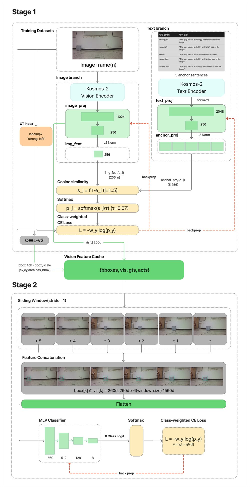<br><sub><b>Fig. 4</b> — Two-stage training: Stage 1 trains image_proj, Stage 2 trains the MLP action head on top of it (frozen).</sub></td>
</tr>
<tr>
<td width="50%">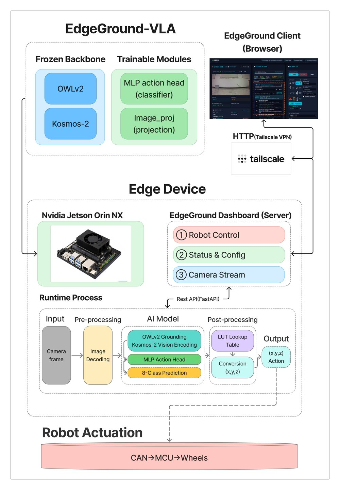<br><sub><b>Fig. 8</b> — Deploy &amp; runtime: checkpoints ship to the Jetson Orin NX; a FastAPI dashboard exposes control/status/camera over Tailscale.</sub></td>
<td width="50%">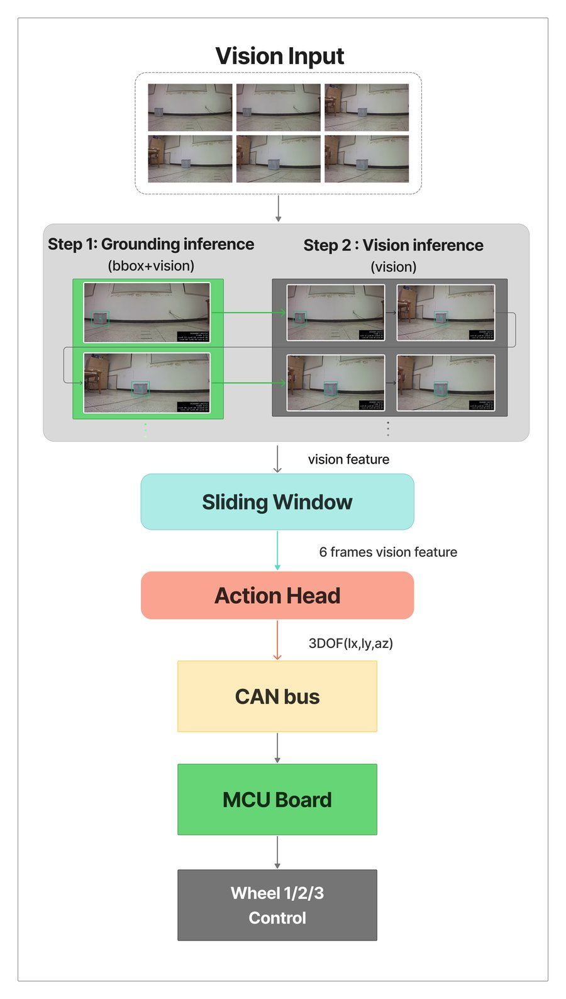<br><sub><b>Fig. 9</b> — Runtime control logic: a sliding 6-frame window feeds the action head; the 3-DoF command goes out over CAN → MCU → wheels.</sub></td>
</tr>
</table>

---

## 주요 발견

1. **Text attention = 0%** — Google-robot post-trained Kosmos-2의 구조적 사망. LoRA/head-only 모두 복구 불가. E2E(Exp11) 실패의 근본 원인이자 현재 구성으로 이탈한 이유.
2. **성패를 가르는 건 검출 가용성** — gnd% ≥80%면 성공률 98.8%, <80%면 51.2%. 병목은 액션 헤드가 아니라 OWL-v2 검출.
3. **레이턴시 병목도 검출기** — OWL-v2(0.155B)가 전체 지연의 ~97%(1901.7ms), Kosmos-2 비전(0.303B)은 ~3%(53.7ms), MLP 헤드는 <1ms. 파라미터 수와 속도가 역전돼 있어 "파라미터 줄이기"가 아니라 도메인 특화 소형 검출기가 다음 단계.

<table>
<tr>
<td width="25%">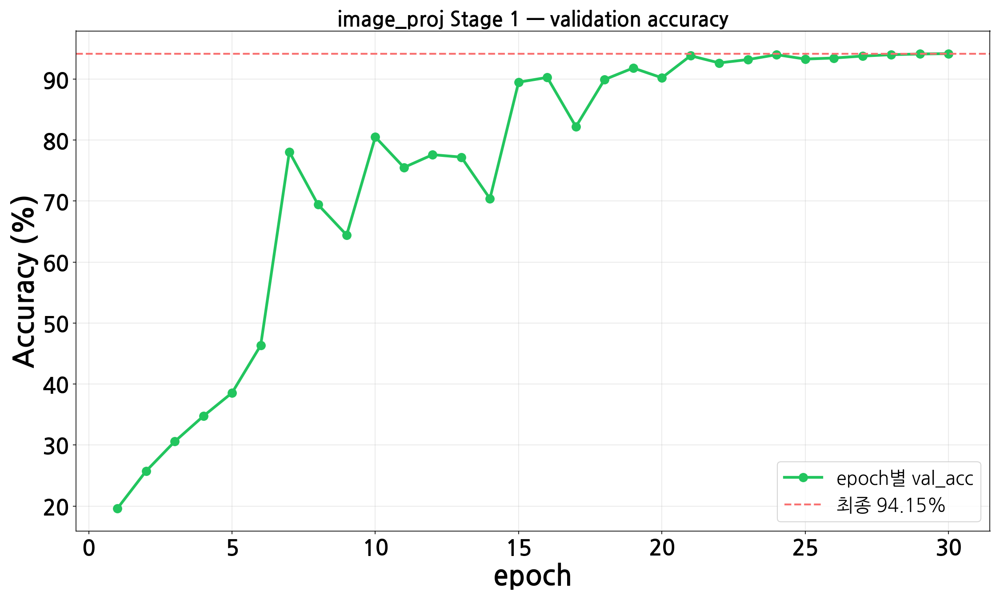<br><sub><b>Fig. 5</b> — image_proj acc: train 96.10% / val 94.09%.</sub></td>
<td width="25%">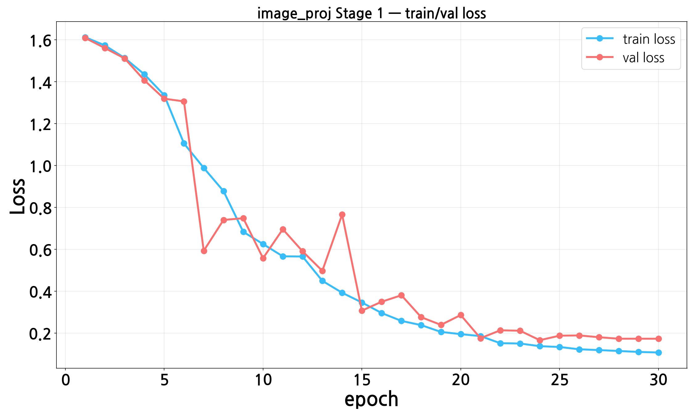<br><sub><b>Fig. 5</b> — image_proj loss: train 0.107 / val 0.173.</sub></td>
<td width="25%">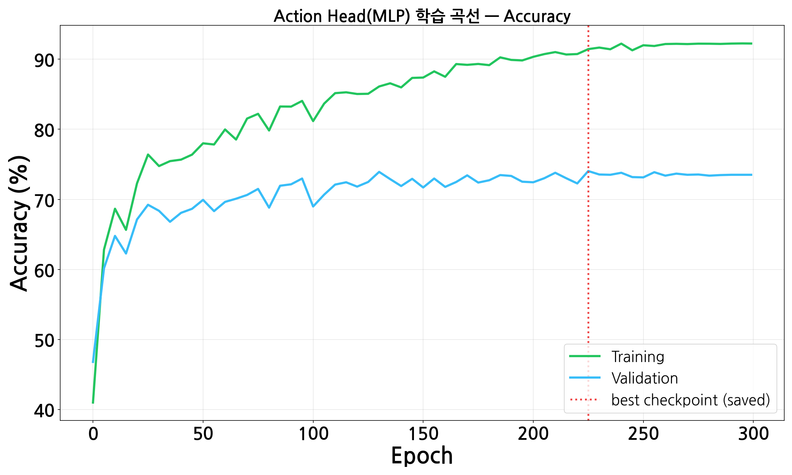<br><sub><b>Fig. 6</b> — Action head acc: train 91.44% / val 74.04% (epoch 225).</sub></td>
<td width="25%">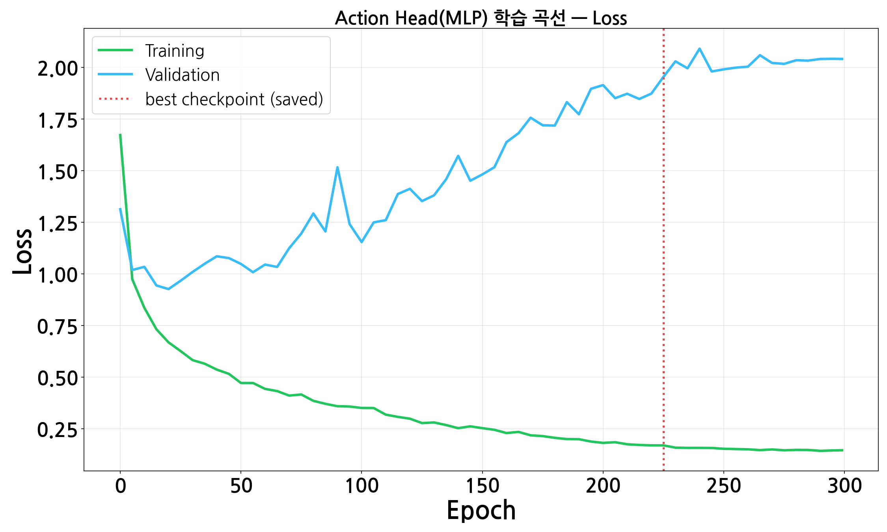<br><sub><b>Fig. 6</b> — Action head loss: val loss rises after ep.20 while val acc keeps improving.</sub></td>
</tr>
</table>

<p align="center">
  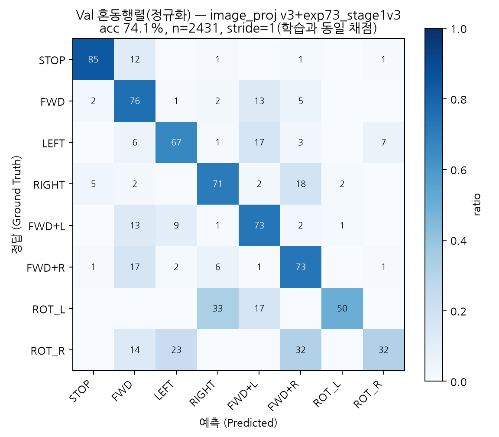
  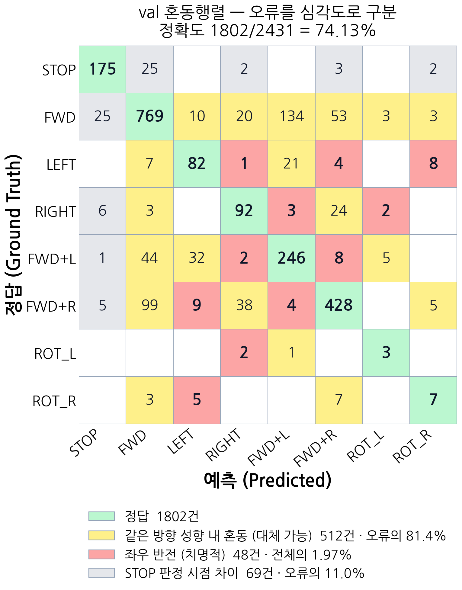
</p>

<p align="center"><i>Fig. 7 (왼쪽): 배포 헤드 val 혼동행렬(74.1%, stride=1 채점). Fig. 8 재색칠(오른쪽): 같은 오류를 심각도로 재색칠 — 81.4%는 방향성이 같은 대체 가능한 혼동이고, 실제 성공/실패를 가르는 좌우 반전은 1.97%뿐.</i></p>

---

## 데이터셋

| 경로 | 에피소드 | 비고 |
|---|---|---|
| `ROS_action/mobile_vla_dataset_v5/` (V6 학습셋) | 225개 (트랙A 180 + 트랙F 45) | 16,599 프레임, train/val 192/33 (seed 42) |
| `ROS_action/mobile_vla_dataset_v5_add_free/` | 220개 | 리밸런싱 버전 (legacy, Exp66 계열) |
| `ROS_action/mobile_vla_dataset_v5_2/` | 59개 | 의자 (별도 모델 필요) |

---

## 핵심 파일

| 파일 | 설명 |
|---|---|
| `robovlm_nav/serve/stage2_v2_inference_server.py` | 현재 배포 추론 서버 |
| `scripts/train_exp54_stage2_v2_action.py` | Stage 2 (MLP 액션 헤드) 학습 |
| `scripts/train_stage1_v3_5cls_owl_fastloss.py` | Stage 1 (image_proj) 학습 |
| `scripts/eval_confusion_matrix_stage1v3_correct.py` | 배포 헤드 정확 채점(stride=1) |
| `scripts/sim/evaluate_closed_loop_v5.py` | Closed-loop 평가 |
| `scripts/measure_attention.py` | Text attention 측정 |
| `docs/v5/bbox_nav_owl/bbox_dataset_v6_owl.json` | Stage2 bbox 레이블 (OWL-v2, 배포 학습에 사용) |

## 체크포인트

<!-- SYNC:checkpoints:start -->
| 모델 | 경로 | 비고 |
|---|---|---|
| Stage 1 (image_proj, 5-class) ★ | `runs/v5_nav/mlp/stage1_v3_5cls/stage1_v3_5cls_owl_projs.pt` | val_acc 94.09% · 225ep · OWL-v2 라벨 |
| Stage 2 (MLP action head) ★ | `runs/v5_nav/mlp/exp73_stage1v3/exp73_owl_stage1v3_v6_mlp.pt` | val_acc 74.13% · window=6 · bbox_scale=3.0 |
| 비전 특징 캐시 | `docs/v5/closed_loop_eval/exp73_v6_vis_cache_stage1v3.pt` | 225ep 재인코딩 (Stage1 완료 후 생성) |
| Stage 1 v2 (legacy, CLIP) | `runs/v5_nav/mlp/shared/stage1_v2_projs.pt` | Exp66 계열 |
| Stage 2 MLP w=4 (legacy, Exp66) | `runs/v5_nav/mlp/exp66/action_mlp.pt` | Exp66 계열 |
<!-- SYNC:checkpoints:end -->

배포 이력 전체(체크포인트 교체 시점, A/B 미확정 항목 포함)는
[model_architecture_brief.html 부록](https://minuum.github.io/EdgeGroundVLA/v5/model_architecture_brief.html) 참조.

---

## 문서

- **메인 랜딩 페이지 (논문 요약)**: [index.html](https://minuum.github.io/EdgeGroundVLA/)
- **모델 구조 & 학습 방식 정리**: [model_architecture_brief.html](https://minuum.github.io/EdgeGroundVLA/v5/model_architecture_brief.html)
- **OWL-v2 그라운더 정리**: [owlv2_grounder_brief.html](https://minuum.github.io/EdgeGroundVLA/v5/owlv2_grounder_brief.html)
- **논문 / 수정사항 브리핑**: [revision_briefing.html](https://minuum.github.io/EdgeGroundVLA/01.paper/revision_briefing.html)
- **연구 대시보드 & 상태 로그(구 전체 연구 여정)**: [research_dashboard.html](https://minuum.github.io/EdgeGroundVLA/research_dashboard.html)
- **에이전트 진입점**: `docs/AGENT_ENTRYPOINT.md`

---

## Citation

```bibtex
@article{lee2026edgeground,
  title   = {EdgeGround-VLA: A Lightweight Model Fusing Heterogeneous
             Grounding Encoders for Goal-Directed Navigation in
             Wheeled Robots},
  author  = {Lee, Min-Woo and Choi, In-Yeop},
  journal = {Journal of The Korea Society of Computer and Information (JKSCI)},
  volume  = {29},
  number  = {11},
  year    = {2026},
  publisher = {Korea Society of Computer and Information}
}
```

---

> ⚠️ `third_party/RoboVLMs/` 수정 금지 — frozen backbone. 단, 현재 배포 파이프라인은 RoboVLMs 코드를 전혀 참조하지 않는다(baseline/비교 대상으로만 참고).
> ⚠️ Google-robot backbone으로 `generate()` 절대 호출 금지 — 무한 반복
