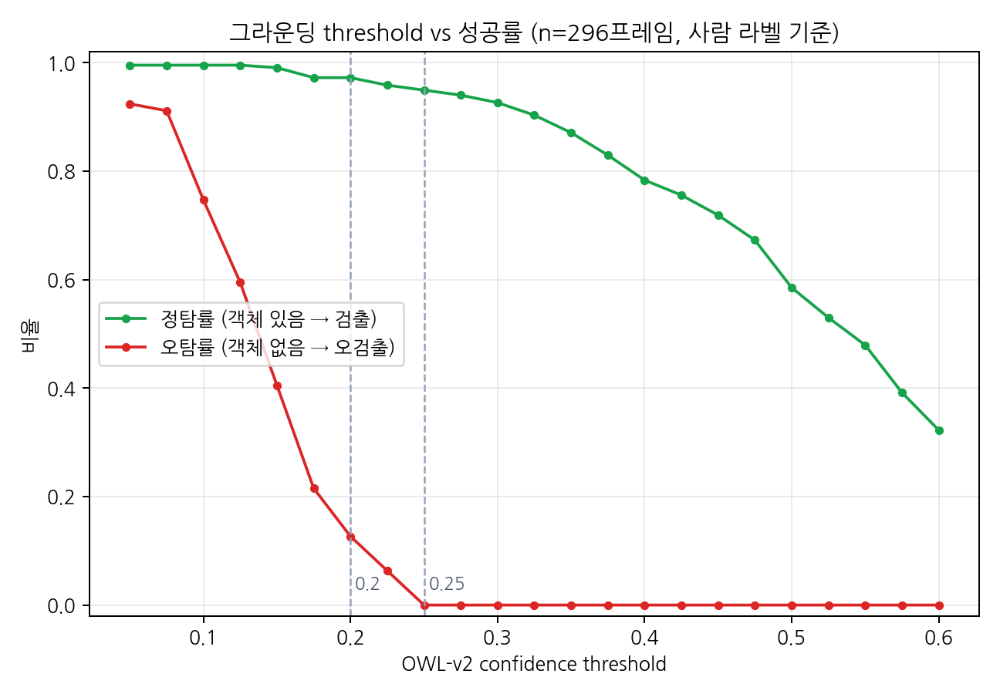
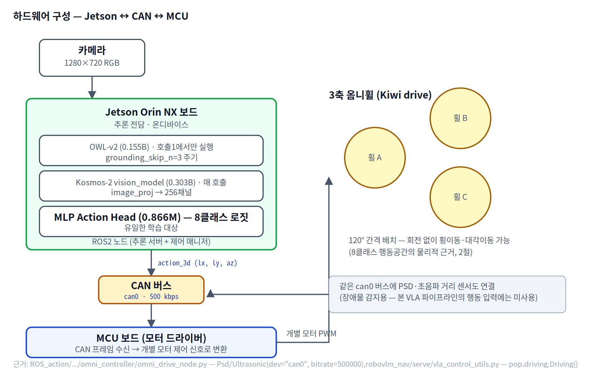
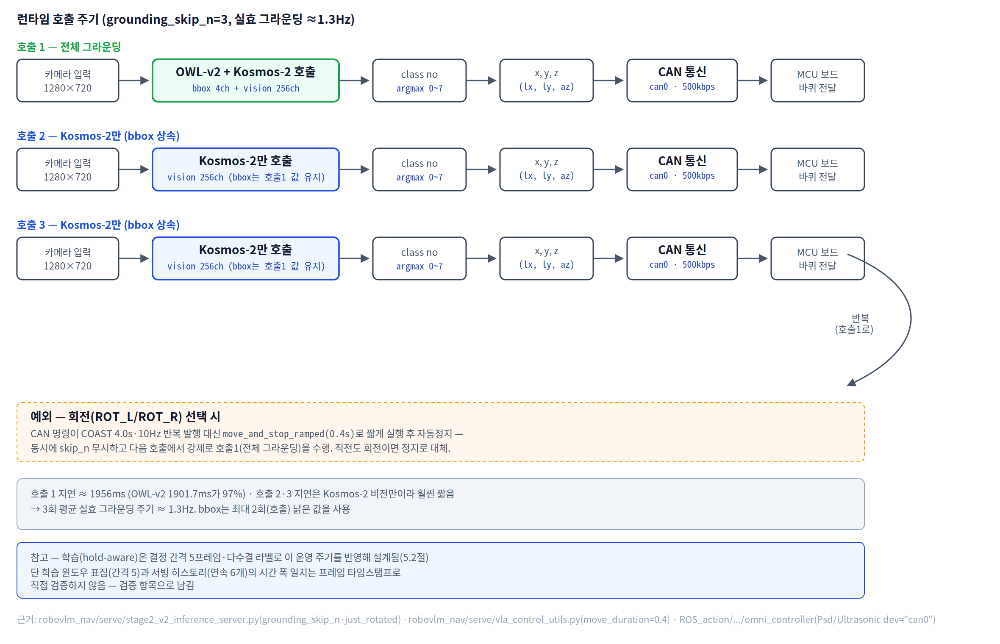

# 논문 드래프트 보완 — 절별 붙여넣기 초고

> 대상: `EdgeGround-VLA_바퀴형로봇_목표지향주행_경량모델_초안_0805.docx`
> 작성 2026-08-05 · 액션플랜 1번(본문 사실오류 정정) + 2번(22건 초고) · 도표 재작성 포함
> 근거 페이지: [논문 드래프트 보완 25건 문제/대응](https://minuum.github.io/EdgeGroundVLA/v5/paper_redfill_worklist.html)

**사용법** — docx를 직접 편집하지 않고 이 파일의 문단을 절별로 복사해 넣으십시오. 교수님이 잡아둔
서식·스타일을 건드리지 않기 위함입니다. 각 블록의 제목이 docx의 절 제목과 1:1로 대응합니다.

**표기 규칙**
- `[교체]` — 기존 본문을 이 문단으로 **바꿉니다**(사실오류 정정)
- `[삽입]` — 비어 있는 자리에 **넣습니다**
- `[유지]` — 그대로 두고 표시된 한 줄만 보탭니다
- 🔴 = 초안에서 보완이 요구된(빨간색 표기) 항목 번호

---

## 0. Related Works — 1.4절 "경량 VLA 및 관련 선행연구" 보강 `[신설 — 0806 피드백 01번]`

`[삽입]` — 기존 SmolVLA[2]·OWL×T5[3] 인용 뒤에 이어 붙입니다. 두 인용 모두 **매니퓰레이션**
도메인이라, 내비게이션 도메인(Mobility VLA)에 대응하는 경량 연구가 있는지 확인해달라는
요청에 대한 문헌조사 결과다.

> Mobility VLA와 같은 계열에서 **경량화·증류된 후속 연구는 확인되지 않았다**(2026년 8월
> 기준 웹 검색). Mobility VLA가 스스로 주장하는 "가벼운 온보드 요구사항"은 모델 크기를
> 줄인 것이 아니라 **대형 VLM을 클라우드로 오프로드**했기 때문이며, 고수준 정책의 추론에는
> 10~30초가 소요된다(데모 투어 토큰 캐싱으로 일부 단축). 즉 온디바이스 경량화라는 본 연구의
> 목표와는 다른 축의 "가벼움"이다. 이 차이가 본 연구를 Mobility VLA의 대체가 아니라
> **클라우드·사전 투어 없이 온디바이스로 완결되는 별도 축의 시스템**으로 위치시키는 근거다.
>
> 대신 내비게이션 도메인의 엣지/경량 VLA 선행연구로는 동적 환경 로봇 내비게이션에 특화된
> TIC-VLA와, VLA 내비게이션을 위한 엣지 어댑터인 AsyncShield가 있다. 두 연구 모두 본
> 연구와 마찬가지로 온디바이스 실시간성을 목표로 하나, 클라우드 VLA 호출을 전제로 지연을
> 보정하는 방식(AsyncShield)이거나 동적 장애물 회피에 초점을 둔다는 점(TIC-VLA)에서
> 목표 지향 주행에 특화된 본 연구와 구분된다.

> **⚠️ 문헌조사 방법 한계** — 위 검색은 2026년 8월 시점의 웹 검색 결과에 근거하며, 학회
> 프로시딩이나 리뷰 중인 미공개 연구는 포함하지 못했을 수 있다. REFERENCES에 추가하기 전
> 각 논문의 원문을 직접 확인하는 것을 권장한다.

---

## 1. Model Architecture 🔴02~07

`[삽입]` — 요구 원문의 메모를 산문으로 풀어 쓴 것입니다. 메모 자체는 지워도 됩니다.

> 제안 파이프라인의 한 프레임은 260차원 특징 벡터로 표현된다. 이 벡터는 서로 다른 두 인코더의
> 출력을 결합(concatenate)한 것으로, 앞의 4채널은 오픈 보캐블러리 검출기 OWL-v2가 산출한
> 기하 정보(`cx`, `cy`, `area`, `has_bbox` — 각각 bbox 중심좌표·정규화 면적에 해당)이고
> 뒤의 256채널은 Kosmos-2 비전 타워의
> 출력(1024차원)을 선형 사상(`image_proj`, 1024→256)한 뒤 L2 정규화한 시각 문맥 표현이다.
> 두 인코더의 출력은 동일한 임베딩 공간으로 사상되지 않으며, 저차원 기하 정보와 고차원 시각
> 문맥이 각자의 형태를 유지한 채로 결합된다. bbox 4채널에는 스케일 정합을 위해 배율 3.0을
> 곱한다.
>
> 행동 헤드는 6개 시점(`window=6`)의 프레임 특징을 이어붙인 1560차원 벡터를 입력받아
> 8개 행동 클래스의 로짓을 출력한다. 이때 6개 시점은 연속된 6프레임이 아니라 결정 간격
> 5프레임마다 하나씩 취한 것으로, 현재 시점 t에 대해 t−25, t−20, t−15, t−10, t−5, t의
> 여섯 지점을 참조한다. 즉 윈도우가 실제로 덮는 구간은 25프레임이다. 시간 문맥을 명시적으로
> 포함시킨 것은 그라운딩이 매 프레임 수행되지 않고 일정 주기로만 갱신되기 때문이며(1.4절),
> 간격을 두고 표집함으로써 인접 프레임의 중복 대신 실제로 변화가 누적된 구간을 보게 한다.
>
> ⚠️ **정정 — "선형 사상(0.262M)도 동결"은 배포 시점 기준으로만 맞고, 학습 과정 전체로 보면
> 정확하지 않다.** 이미지 프로젝션 레이어(`image_proj`, Linear 1024→256, 0.262M)는 Stage 1에서
> 방향 텍스트 앵커와의 대조학습으로 **직접 학습된 것**이며, Stage 2(행동 헤드 학습)에 들어갈
> 때만 그 학습된 가중치를 불러와 동결한다
> (`stage2_v2_inference_server.py`: `image_proj.load_state_dict(ckpt); requires_grad=False`).
> 즉 학습은 두 단계로 나뉜다 — **Stage 1**: image_proj(0.262M)를 대조학습으로 학습·고정.
> **Stage 2**: 그 위에서 행동 헤드(0.866M)만 학습. OWL-v2(0.155B)와 Kosmos-2 비전 타워
> (0.303B)는 두 단계 모두에서 동결되며 어느 단계에서도 학습되지 않는다. "학습되는 구성요소가
> 행동 헤드뿐"이라는 서술은 **Stage 2만 놓고 보면** 맞지만, 전체 파이프라인 기준으로는
> image_proj(0.262M)도 학습 대상에 포함되므로 이렇게 구분해 표기해야 한다. 배포(추론) 시점
> 기준으로는 두 구성요소 모두 동결된 채로 쓰인다는 점은 원래 서술과 같다.
>
> **2026-08-07 갱신 — image_proj 재학습·배포 전환.** 방향 3-class(left/center/right,
> 150ep, HSV 라벨, `train_exp54_stage1_v2_frame_level.py`)로 학습했던 최초 버전을
> 5-class(강좌/약좌/중앙/약우/강우, 225ep, OWL-v2 라벨, `train_stage1_v3_5cls_owl.py`)로
> 재학습해 val_acc 94.09%를 얻었다. 재학습된 image_proj 위에서 행동 헤드도 다시 학습한 뒤
> 실기 100건으로 재검증한 결과 95/100 성공(구버전 89/100 대비 개선, 특히 좌측 80%→95%)을
> 확인해 **현재 이 버전이 배포되어 있다**(구버전은 롤백용으로 보존). 상세 실기 결과는
> 5.3절 참조.

### 파이프라인 도표 (요구 원문 01) — 재작성 완료

요구 원문 02~07의 260차원 규격을 그대로 반영한 도표를 새로 그렸습니다. 논문용 벡터 포함
3종을 제공합니다.

| 파일 | 용도 |
|---|---|
| `docs/v5/figures/edgeground_vla_architecture.pdf` | **논문 삽입용 벡터** (LaTeX `\includegraphics`, Word 삽입 모두 가능) |
| `docs/v5/figures/edgeground_vla_architecture.svg` | 편집용 원본 (텍스트 수정 가능) |
| `docs/v5/figures/edgeground_vla_architecture.png` | 슬라이드·미리보기용 (2× 해상도, 흰 배경) |

<div class="figts" data-fig-ts="F1" style="font-size:0.78rem;color:#94a3b8;margin:2px 0 14px"></div>

도표에 명시한 것 — 요구 원문과 1:1로 대응합니다.

| 요구 원문 | 도표에서 어떻게 표현했는가 |
|---|---|
| 02 프레임 특징 벡터 260차원 | 중앙에 **스택 바**로 4 : 256 비율을 시각화 |
| 03 `FRAME_DIM = 4 + 256 = 260` | 같은 블록에 수식 그대로 표기 |
| 04 bbox 4채널 (OWL-v2 출력) | 좌측 경로. `bbox_scale 3.0`은 **4채널 전체**에 적용됨을 화살표 라벨로 표기 |
| 05 비전 256채널 (Kosmos-2 → image_proj → L2) | 우측 경로. `Linear 1024→256 + L2 norm` 블록을 분리 |
| 06 window=6 flatten → 1560차원 | 별도 "시간 윈도우" 블록 |
| 07 8클래스 로짓 | 출력 블록에 8개 클래스 이름 전부 나열 |

추가로 표현한 것: **학습/동결/미사용 3색 범례**(초록=학습되는 0.866M 헤드만),
**언어 디코더 1.361B를 미사용으로 분리 표기**(호출 0회, 로드 제거로 호스트 RAM 10.59→3.20GB).

> **수정 — 추론 제어는 이 도표에서 분리했다.** 처음에는 추론 제어 파라미터를 이 모델
> 파이프라인 하단에 함께 그렸으나, 모델 구조(1절)와 런타임 동작(7절)은 별개 관심사이므로
> 도표도 분리하는 것이 정확하다. 이 도표는 8클래스 로짓 출력에서 끝나고,
> **threshold·skip_n·회전 규칙·CAN 통신·바퀴 전달은 7절의 런타임 파이프라인 도표**로
> 옮겼다(아래 "런타임 순서도" 참조).

> **추가 수정 (08/06 피드백 2건 반영)**
> 1. **실선을 "프레임 특징 벡터(260차원)"까지로 한정.** bbox 4채널·비전 256채널이
>    concat되어 만들어지는 프레임 특징 벡터 블록까지만 실선 화살표를 쓰고, 그 이후
>    (시간 윈도우 → 정책 MLP Action Head → 8클래스 로짓 → 3-DoF 출력)는 점선 화살표로
>    바꾸었다. 배경에 옅은 회색 패널을 둘러 "이후 구간(정책)"임을 시각적으로 구분했다.
>    실선/점선 경계는 프레임 특징 벡터 블록 제목 옆에 "(실선 구간은 여기까지)"로 명시했다.
> 2. **Service Control 표기를 제거하고 x, y, z (3-DoF) 값으로 교체.** 8클래스 로짓
>    출력 바로 다음에 초록색 `x, y, z (3-DoF)` 블록을 새로 그려 `ACTION_3D 룩업테이블 —
>    클래스별 (lx, ly, az)` 변환을 명시했다(변환 로직 상세는 위 "8클래스 로짓 → 3자유도
>    변환" 절 참조). 그 다음 "→ 런타임 파이프라인(⑦ Runtime)에서 계속"이라는 점선 테두리
>    노트로 7절 런타임 도표와의 경계를 표시했다.

### ⚠️ 정정 사항 — 요구 원문 04번 자체의 오류

요구 원문 04번은 `(area는 bbox_scale=3.0 배율 적용)`이라고 되어 있으나, 실제로는
**bbox 4채널 전체**에 배율이 곱해집니다.

```python
seq.append([v * bbox_scale for v in bboxes[idx]] + vis[idx].tolist())
# scripts/exp73_held_aware_train.py — bboxes의 4개 원소 전부에 곱해짐
```

---

## 1.2. Feature Fusion via Linear Projection `[교체]`

기존 본문은 "두 인코더 특징이 동일한 차원의 임베딩 공간으로 매핑된 후 … 이 융합 표현이 행동
헤드의 입력으로 사용된다"고 서술하는데, 실제 구조와 다릅니다. **OWL-v2 출력은 선형 사상을
통과하지 않습니다.**

> Kosmos-2 비전 타워가 산출한 1024차원 특징은 선형 사상(1024→256)과 L2 정규화를 거쳐
> 256차원 표현으로 축약된다. 정규화는 이 표현의 스케일을 고정해, 값의 범위가 전혀 다른
> 기하 정보와 함께 사용될 때 한쪽이 학습을 지배하지 않게 한다.
>
> 반면 OWL-v2가 산출한 기하 정보는 선형 사상을 거치지 않고 4개의 스칼라 값으로 그대로
> 결합된다. 따라서 본 구조의 결합 방식은 이종(heterogeneous) 특징을 공통 공간으로 사상하는
> 융합이 아니라, **서로 다른 성질의 두 표현을 결합(concat)하여 행동 헤드가 각각을 직접 참조하도록
> 하는 방식**이다. 기하 정보를 축약하지 않고 원래 값으로 전달하는 것은, 조향 결정이 목표의
> 화면상 수평 위치(`cx`)에 직접 의존하기 때문에 그 값이 다른 표현에 섞여 희석되는 것을
> 피하기 위한 선택이다.

---

## 1.3. Lightweight MLP Action Head `[교체]`

기존 본문의 **"융합된 256차원 특징"**과 **"4개의 hidden layer"**가 모두 사실과 다릅니다.

| | 기존 본문 | 실제 |
|---|---|---|
| 입력 차원 | 256 | **1560** (6프레임 × 260) |
| hidden layer | 4개 | **2개** (512 → 128 → 8) |

> 행동 헤드는 1560차원 입력을 받는 2층 MLP로, 512와 128 크기의 은닉층을 거쳐 8개 클래스
> 로짓을 출력한다(각 은닉층 뒤에 ReLU와 드롭아웃 0.25/0.1을 둔다). 전체 파라미터는
> 0.866M이다. 행동 클래스는 정지(0), 직진(1), 횡이동(2, 3), 대각 직진(4, 5),
> 제자리 회전(6, 7)으로 구성된다.
>
> 연속 좌표 회귀나 diffusion/flow-matching 기반 action expert 대신 경량 분류기를 사용한
> 것은 두 가지 이유에서다. 첫째, 대상 로봇의 펌웨어가 속도 명령의 크기를 사용하지 않고
> 방향만 사용하는 상수 속도 구조이므로, 연속 출력의 표현력이 하드웨어 단계에서 소실된다.
> 둘째, 동일 조건에서 네 종류의 헤드를 비교한 결과 이산 분류가 연속 회귀 및
> flow-matching 방식보다 높은 성능을 보였다(5절). 즉 경량 분류기의 채택은 계산량을
> 위한 타협이 아니라 이 과제와 하드웨어 조건에서의 실측 결과에 따른 선택이다.

### 8클래스 로짓 → 3자유도(3-DoF) 변환 `[신설 — 0806 피드백: "(?)를 거쳐 3자유도로 변환된다"의 (?) 규명]`

> 선택된 행동 클래스는 별도의 변환 모듈이나 학습된 매핑을 거치지 않고, **고정된 룩업 테이블**을
> 통해 3자유도 속도 명령 (lx, ly, az)로 직접 변환된다. 이 테이블은 로봇의 3축 옴니휠 구동
> 기구학에 맞춰 미리 정의된 상수이며, 학습이나 추론의 대상이 아니다.

| 클래스 | 행동 | (lx, ly, az) |
|---|---|---|
| 0 | STOP | (0.0, 0.0, 0.0) |
| 1 | FORWARD | (1.15, 0.0, 0.0) |
| 2 | LEFT | (0.0, 1.15, 0.0) |
| 3 | RIGHT | (0.0, −1.15, 0.0) |
| 4 | FWD+LEFT | (1.15, 1.15, 0.0) |
| 5 | FWD+RIGHT | (1.15, −1.15, 0.0) |
| 6 | ROT_L | (0.0, 0.0, 0.25) |
| 7 | ROT_R | (0.0, 0.0, −0.25) |

> 이 매핑은 추론 서버 내부의 상수 딕셔너리(`ACTION_3D`)로 구현되어 있으며, 별도의 ROS
> 노드가 아니라 **행동 헤드의 argmax 직후 같은 프로세스에서 즉시 조회**된다. 변환된 3자유도
> 값은 이후 CAN 통신을 거쳐 MCU 보드로 전달된다(7절, 하드웨어 구성은 2절).

---

## 1.1 Heterogeneous Grounding Encoder — 설계 경위 🔴08

`[삽입]` — 기존 설명 문단 앞이나 뒤에 붙입니다.

> 본 구조는 설계를 먼저 확정한 뒤 검증한 것이 아니라, end-to-end VLA 구성에서 관측된 두
> 차례의 실패를 거쳐 도달한 것이다.
>
> 첫째, Kosmos-2에 LoRA를 적용한 end-to-end 구성에서 언어 경로의 어텐션 비중이
> 0.000%로 측정되었다. 이 값은 헤드만 학습시킨 조건에서도 동일하게 재현되었으므로, 학습
> 방식의 문제가 아니라 사용한 사전학습 모델의 상태에 기인한다. 즉 언어 입력이 행동에
> 기여하지 않는 상태였다.
>
> 둘째, 동일 구성에서 오프라인 지표와 실제 주행 성능이 어긋났다. 프레임 단위 행동 일치도가
> 58.6%였음에도 목표 도달 성공률은 0%였고, 최종 위치 오차가 1.45m까지 누적되었다. 궤적을
> 분석한 결과 이동 거리 자체는 목표와 유사했으나 방향 오차가 누적되는 양상이었다.
>
> 이에 목표의 위치를 모델 내부 표현에 맡기지 않고 명시적 좌표로 분리하는 구성을 시험하였다.
> 동일 데이터에서 프레임 일치도는 75.9%, 목표 도달 성공률은 66.7%로 개선되었고 최종 위치
> 오차는 0.55m로 감소하였다. 두 구성의 이동 거리 특성이 유사한 반면 방향 오차만 크게
> 달라졌다는 점에서, 개선의 원인은 좌표를 명시적으로 제공한 것에 있다고 판단하였다.
>
> 이 관찰이 본 구조의 근거다. 목표의 기하 정보는 오픈 보캐블러리 검출기가 제공하고, 장면의
> 시각 문맥은 시각-언어 모델의 비전 타워가 제공한다. 두 경로 모두 언어 디코더를 경유하지
> 않는다. 절 제목의 *heterogeneous*는 이처럼 성질이 다른 두 인코더를 각자의 강점에 맞게
> 분담시킨다는 의미다.

> **두 인코더 비교** — 역할이 다른 만큼 특성도 대조적이다.

| | OWL-v2 (기하) | Kosmos-2 vision_model (시각 문맥) |
|---|---|---|
| 역할 | 목표 물체의 위치·크기 검출 | 장면 전체의 시각 문맥 인코딩 |
| 파라미터 | 0.155B | 0.303B (비전 타워만, 언어 디코더 1.361B는 미사용) |
| 학습 여부 | zero-shot, 특화 학습 없음 | 동결(frozen) — 단 뒤에 붙는 `image_proj`는 별도 사전학습됨 |
| 출력 | bbox 4채널(cx, cy, area, has_bbox) | 256채널(`image_proj` 통과 후 L2 정규화) |
| 호출 주기 | 3프레임마다 1회(grounding_skip_n=3) | 매 프레임 |
| 추론 지연 | 1901.7ms (파이프라인 지연의 97%) | 54ms |
| 프롬프트 의존 | "gray basket" 텍스트 프롬프트 필요 | 없음(순수 비전 인코딩) |

> 지연의 비대칭(1901.7ms vs 54ms)이 그대로 호출 주기 설계(1.4절)의 근거가 된다 — 느린
> 검출기만 매 프레임 부르지 않고 3프레임마다 갱신하며, 빠른 비전 인코더는 매 프레임 갱신한다.

> **인코더 선택 근거** — 다수의 시각-언어 인코더 중 Kosmos-2를 택한 것은 선행연구
> RoboVLMs의 인코더 비교에서 Kosmos-2가 가장 좋은 결과를 보였기 때문이며, 그 실측
> 결과를 승계한 것이다. 다만 본 구현에 RoboVLMs의 코드는 포함되지 않는다.

> **⚠️ REFERENCES 누락 발견** — 0806 초안의 REFERENCES [1]~[7]을 웹서치로 교차 검증한 결과
> [1]Mobility VLA·[2]SmolVLA·[4]OWLv2·[5]Kosmos-2의 arXiv ID는 모두 정확했다. 다만 본문이
> "선행연구 RoboVLMs"를 근거로 인용하는데도 **RoboVLMs 자체가 REFERENCES에 없다** —
> 추가 필요: *"Towards Generalist Robot Policies: What Matters in Building
> Vision-Language-Action Models," arXiv:2412.14058, 2024.*

> **선형 프로젝션 레이어의 사전 학습** — Kosmos-2 비전 타워 출력(1024차원)을 256차원으로
> 사상하는 선형 프로젝션 레이어(`image_proj`)는 행동 헤드와 별도로, 더 이른 단계에서
> 학습해 고정해 둔 것이다. 목표 물체의 화면상 위치(좌/중앙/우)를 나타내는 세 개의 텍스트
> 프롬프트에 대한 Kosmos-2 언어 모델의 은닉 표현을 방향 앵커로 미리 계산하고, 이 앵커와
> 이미지 표현이 방향이 일치할 때 가까워지도록 대조 학습(contrastive alignment)시켰다.
> 이 절차에서 사용한 언어 모델의 은닉 표현(및 그 정렬에 쓰인 보조 프로젝션)은 학습 시점에만
> 관여하며, 배포되는 것은 이미지 프로젝션 레이어(0.262M)뿐이다. 즉 언어 디코더가 배포
> 파이프라인에서 완전히 배제되는 것(6절)과는 별개로, 언어 모델의 표현이 학습 단계에서
> 비전 특징을 방향 개념에 정렬시키는 데 한 차례 사용되었다는 점은 밝혀 둘 필요가 있다.

---

## 1.4. Serving Control `[삽입]` 🔴09~12

절 전체가 비어 있습니다. 아래 4개 문단이 순서대로 들어갑니다.

### (1) 검출 임계값 🔴09

> 검출기의 신뢰도 임계값은 코드 기본값이 0.25이고, 실기 운영에서는 환경변수로 0.20을 주입한다.
> 0.25는 사전 임계값 스윕에서 결정한 값이고 0.20은 실기 조건에 맞춰 완화한 값이다.
> 임계값 스윕 결과 0.25에서 정탐률 94.9%를 유지하며
> 목표 물체가 존재하지 않는 프레임에 대한 오탐률이 0%였고, 0.1에서는 오탐률이 74.7%로 증가해
> 물체 부재를 판정할 수 없었다.
>
> 실기에서는 동일 임계값에서 검출 실패가 더 빈번하여 0.20으로 낮추었다. 다만 실기에서 검출에
> 실패한 프레임을 동일 모델·동일 임계값으로 재실행한 결과 197개 중 155개(78.7%)가 다시
> 실패하였고 전체 판정 일치율은 86.6%였다. 따라서 실기와 오프라인의 검출률 차이는 연산
> 환경보다는 장면 자체의 난이도에 주로 기인한다.
>
> 임계값을 낮추는 조작은 검출률을 확보하는 대가로 물체 부재 판정 능력을 희생하는 성질을
> 가진다. 이 절충은 후술하는 `has_bbox` 채널의 한계(7절)와 동일한 문제의 다른 측면이다.

### (2) 그라운딩 주기 🔴10

> 검출기는 매 프레임 수행되지 않고 3프레임마다 한 번 수행되며, 그 사이 프레임은 직전 검출
> 결과를 유지한다(zero-order hold). 이에 따라 실효 그라운딩 주기는 약 1.3Hz이다.
>
> 이 설계가 필요한 이유는 검출 단계가 전체 지연을 지배하기 때문이다. 대상 하드웨어에서 검출
> 1회에 1901.7ms가 소요되어 전체 추론 지연의 약 97%를 차지하며, 매 프레임 호출 시 제어
> 주기를 확보할 수 없다.
>
> 대가로 기하 정보는 최대 2프레임만큼 낡은 값이 된다. 로봇이 회전하는 동안에는 이 지연이
> 조향 오차로 직결되므로, 다음 항의 재검출 규칙과 함께 사용해야 의미가 있다.

### (3) 검출 실패 시의 제어 규칙 🔴11

> 회전 동작에 대해서는 세 가지 보호 규칙이 적용되며, 이들은 **추론 계층과 제어 계층에 나뉘어**
> 있다. 세 규칙 모두 같은 실패 양상, 즉 회전이 과도하게 지속되어 목표가 시야에서 벗어나는
> 현상을 막기 위한 것이다.
>
> 제어 계층에서는 선택된 행동을 일정 시간 유지하며 반복 발행한다(약 4초, 10Hz). 그러나
> 제자리 회전만은 예외로, 약 0.4초 동안만 수행하고 자동으로 정지한다. 이 예외가 없으면
> 그라운딩 갱신에 걸리는 약 2초 동안 같은 회전 명령이 계속 재발행되어, 의도한 짧은 보정이
> 아니라 연속 회전이 되고 목표가 화면 밖으로 밀려난다. 반면 전후·횡 이동은 반복 발행을
> 유지한다.
>
> 추론 계층에서는 두 규칙이 적용된다. 첫째, 제자리 회전을 수행한 직후의 스텝에서는 시야가
> 변했으므로 갱신 주기와 무관하게 반드시 재검출한다. 회전 이전의 좌표를 계속 참조하면 같은
> 회전을 주기만큼 반복하게 된다. 둘째, 직전 스텝이 회전이었고 이번에도 회전이 선택되면 그
> 회전을 실행하지 않고 정지 명령으로 대체한다.
>
> 검출 실패 시 갱신 주기를 무시하고 즉시 재검출하는 기능도 구현되어 있으나, 기본값은
> 비활성이며 대조 실험용 선택 항목이다.
>
> 이 규칙들이 필요한 근본적인 이유는 검출 실패 상황이 학습으로 처리되지 않았다는 데 있다.
> 학습 데이터 16,599 프레임 중 검출 실패 프레임의 비율은 0.00%(0개)이므로, 모델은 목표를
> 관측하지 못하는 상태에 대응하는 행동을 학습한 적이 없다. 따라서 본 연구는 이 공백을 학습이
> 아니라 서빙 단계의 제어 규칙으로 우회하였다. 이는 제안 시스템의 한계이며, 학습 데이터에
> 검출 실패 사례를 포함시키는 것이 후속 과제이다.

### (4) 정지 판정 🔴12

> 정지 판정 방식은 두 가지가 구현되어 있다. 기본값은 기하 규칙에 의한 근접 판정으로, 목표의
> 화면 점유 면적이 0.25 이상이고 수평 위치가 중앙에서 0.35 이내인 상태가 3프레임 연속
> 관측되면 정지한다. 다른 하나는 학습된 정지 클래스(class 0)의 예측을 사용하는 방식이며,
> 실기 운영에서는 후자를 사용하였다. 후자의 경우 에피소드
> 시작 직후 3회의 추론에 대해서는 정지 예측을 무시한다. 행동 헤드가 6프레임의 시간 문맥을
> 입력받는 구조에서 시작 시점에는 과거 프레임이 존재하지 않아 현재 프레임으로 패딩되며, 이
> 상태에서 정지가 예측되면 출발 직후 정지하는 실패가 발생한다. 따라서 이 값은 임의로 정한
> 상수가 아니라 윈도우 크기에서 파생된 값이다.
>
> 한편 정지 클래스는 원본 데이터에 존재하지 않아 각 에피소드의 마지막 프레임에 부여한
> 합성 라벨이다. 따라서 학습된 정지 판정의 신뢰도는 데이터에서 자연히 관측된 정지 행동에
> 근거한 것이 아니라는 점을 명시한다.

### 하이퍼파라미터 요약 `[신설]`

앞서 본문 산문 곳곳에 흩어져 있던 수치 중, **모델 구조·학습 절차와 무관하게 값 자체가
핵심인 것들**을 한 표로 모은다. 학습 하이퍼파라미터와 서빙(런타임) 하이퍼파라미터를
구분하여 표기한다 — 전자는 체크포인트에 고정되고, 후자는 배포 시 환경변수로 조정 가능하다.

| 구분 | 항목 | 값 | 비고 |
|---|---|---|---|
| 모델 구조 | 행동 클래스 수 (`num_classes`) | **8** | 0 STOP·1 FWD·2 LEFT·3 RIGHT·4 FWD+L·5 FWD+R·6 ROT_L·7 ROT_R |
| 모델 구조 | 시간 윈도우 (`window`) | 6 (간격 5) | 1.1절 |
| 모델 구조 | bbox 배율 (`bbox_scale`) | 3.0 | 4채널 전체 적용 |
| 학습 | optimizer | AdamW | lr 5e-4, weight_decay 1e-4 |
| 학습 | batch size / epochs | 128 / 300 | |
| 학습 | 분할 시드 | 42 | 임의 고정값, 전 실험 조건(condition) 공유 |
| **서빙(런타임)** | **검출 신뢰도 임계값** (`owlv2_thresh`) | **코드 기본 0.25 / 운영 0.20** | 환경변수 `VLA_OWLV2_THRESH`. 검증 상태는 1.4절 참조 |
| 서빙(런타임) | 그라운딩 호출 간격 (`grounding_skip_n`) | 3 | 실효 ≈1.3Hz |
| 서빙(런타임) | 콜드스타트 가드 | 3스텝 | window=6에서 파생 |
| 서빙(런타임) | 회전 자동정지 시간 | 0.4초 | 제어 계층, 7절 참조 |

> `owlv2_thresh`와 `num_classes`는 성격이 다른 두 축에 걸쳐 있어 본문 서술에서는 각각
> 1.4절(추론 제어)과 1절(모델 구조)에 산문으로 풀어 두었다. 이 표는 그 값들을 빠르게
> 조회하기 위한 요약이며, 산문 서술을 대체하지 않는다.

---

## 3. Collection of data `[삽입]` 🔴13

> 데이터는 조작자가 조이스틱으로 로봇을 직접 원격조작하는 방식으로 수집하였다. 각 에피소드는
> 정해진 시작 위치에서 출발해 목표 물체(회색 바구니)에 도달할 때까지의 영상과 조작 명령을
> 로봇 내부에 기록한 것이다.
>
> 저장 형식은 에피소드 단위 HDF5 파일이다. 한 파일에 1280×720 RGB 영상 시퀀스와 각 프레임에
> 대응하는 조작 명령이 들어가며, 파일 속성으로 해당 세션의 실행 설정(사용한 체크포인트, 검출
> 임계값 등)을 함께 기록한다. 이 실행 설정 기록은 사후 분석에서 어떤 모델이 어떤 조건으로
> 동작했는지를 확인하는 유일한 근거가 되었다(5.2절).
>
> 수집 규모는 225 에피소드, 16,599 프레임이다. 구성은 **시작 위치 5종 × 경로 3종**의
> 15개 조합에 각 15 에피소드를 균등 배치한 것이다. 시작 위치는 중앙, 약좌, 강좌, 약우,
> 강우이고 경로는 직진, 좌곡선, 우곡선이다. 실기 평가에서 사용한 5개 고정 목표 지점이
> 이 시작 위치 5종과 동일하다(IV절).
>
> 학습·분석에서는 이 225 에피소드를 두 묶음으로 구분한다. **트랙 A**는 시작 위치가
> 중앙에서 벗어난 4종(약좌·강좌·약우·강우)의 12개 조합, 180 에피소드이다. **트랙 F**는
> 시작 위치가 중앙인 3개 조합, 45 에피소드이다. 두 묶음을 구분하는 이유는 과제의 성격이
> 다르기 때문이다. 트랙 A는 목표가 화면 중앙에서 벗어난 상태에서 출발하므로 조향으로
> 정렬을 회복해야 하고, 트랙 F는 목표가 처음부터 중앙에 있어 곡선 경로를 지시받더라도
> 직진으로 도달할 수 있다. 즉 트랙 F는 **모델이 경로 지시를 따르는지, 아니면 목표가
> 보이면 직진해 버리는지**를 가르는 대조군 역할을 한다.

| 시작 위치 | 에피소드 | 프레임 | 프레임/ep | 묶음 |
|---|---|---|---|---|
| 강좌 | 45 | 3,611 | 80.2 | 트랙 A |
| 약좌 | 45 | 3,299 | 73.3 | 트랙 A |
| 중앙 | 45 | 2,819 | 62.6 | **트랙 F** |
| 약우 | 45 | 3,268 | 72.6 | 트랙 A |
| 강우 | 45 | 3,602 | 80.0 | 트랙 A |
| **합계** | **225** | **16,599** | 73.8 | A 180 / F 45 |

> 좌측 시작과 우측 시작은 각각 90 에피소드로 동수이고, 프레임 수도 6,910 대 6,870으로
> 0.6% 차이에 불과하다. 그라운딩 라벨의 화면상 수평 위치 평균도 0.4976으로 중앙에 가깝다.
> 즉 **수집 설계 수준에서는 좌우가 대칭**이다.
>
> 그라운딩 라벨은 OWL-v2로 자동 생성하였다. 전체 프레임 중 검출을 실제로 수행하여 성공한
> 것은 5,752 프레임이며, 나머지는 그라운딩 주기(1.4절)에 따라 직전 결과를 상속한 값이다.
> 따라서 그라운딩 정확도를 평가할 때는 상속된 프레임을 제외해야 한다.

> **0806 편집 지침 반영** — 행동 클래스의 좌/우 불균형(21.8%) 분석은 데이터 수집 설계의
> 결과가 아니라 **실기 테스트 이후 사후적으로 발견된 결과**이므로 이 절(Dataset)이 아니라
> **Future Work(부록/한계 절)로 이동**하였다. 상세 분석은 해당 절 참조.

### ⚠️ 표준 포맷 관련 — 답변 방향

질문의 취지가 "Droid/LeRobot 같은 표준 포맷을 따랐는지"라면 **수집 자체는 자체 HDF5
스키마**입니다. 다만 확인해 보니 **LeRobot v3.0 형식으로의 변환은 이미 수행되어 있습니다**
(`lerobot_export/v6_mixed`, 2026-07-16).

| 항목 | 값 |
|---|---|
| codebase_version | v3.0 |
| robot_type | `mobile_base` |
| total_episodes / frames | **420 / 18,409** |
| fps | 6 |
| features | `observation.images.cam_front`(AV1 video), `action`, `action.event_type`, `timestamp`, `frame_index`, `episode_index`, `index`, `task_index` |

**단 그대로 논문에 쓸 수 없습니다** — 내보낸 집합이 학습 집합과 다릅니다.

- 변환 로그 기준 **v6 스키마 180개 + v5 스키마 240개** = 420개
- 즉 **trackA 180개만 포함**되고 **trackF 45개가 빠져** 있으며, 대신 **레거시 240개가 섞여** 있음
- 학습에 쓴 집합은 225개(trackA 180 + trackF 45), 16,599 프레임

→ **권고**: "표준 포맷 변환 파이프라인이 존재하며 동작을 확인하였다"까지만 쓰고,
학습 집합과 동일한 225 에피소드로 **재내보내기 후** 공개 대상으로 삼는 것이 정확합니다.
이 작업은 로봇 없이 가능합니다.

### ⚠️ 함께 발견한 것 — task 문자열의 어휘

LeRobot 내보내기의 task 문자열이 다음 형태입니다.

```
Navigate a left curve approach from the weak right extreme starting position toward the gray basket.
Navigate a right curve approach from the strong right extreme starting position toward the gray basket.
```

`left curve` / `right curve` 가 **정답 행동을 자연어로 직접 지시**합니다. 이는 CH68 68-1에서
확인한 지시문 라벨 누출과 동일한 구조이므로, 이 문자열을 언어 조건화 실험의 입력으로 쓰면
안 됩니다. 데이터셋을 공개할 때도 이 점을 명시해야 합니다.

### 데이터셋 통계 요약 `[신설]`

| 항목 | 값 |
|---|---|
| 총 에피소드 | 225 (트랙 A 180 + 트랙 F 45) |
| 총 프레임 | 16,599 |
| 시작 위치 | 중앙·약좌·강좌·약우·강우 (5종 × 45ep) |
| 경로 유형 | 직진·좌곡선·우곡선 (3종 × 15ep) |
| 좌/우 시작 에피소드 | 90 / 90 (동수) |
| 좌/우 시작 프레임 | 6,910 / 6,870 (0.6% 차) |
| 라벨 cx 평균 | 0.4976 |

**행동 클래스 분포** (프레임 단위, 전체 16,599)

| 클래스 | 비율 | 비고 |
|---|---|---|
| STOP | 8.75% | 에피소드 끝 프레임에 합성 |
| FWD | 46.03% | 최다 클래스 |
| LEFT | 4.31% | |
| RIGHT | 5.17% | |
| FWD+L | 15.25% | |
| FWD+R | 18.78% | |
| ROT_L | 0.82% | |
| ROT_R | 0.89% | |
| **좌계열 합** | **20.39%** | LEFT+FWD+L+ROT_L |
| **우계열 합** | **24.83%** | RIGHT+FWD+R+ROT_R — 좌 대비 +21.8% |

좌/우 에피소드·프레임 수는 대칭이지만 행동 클래스는 우계열이 21.8% 많다. 이 불균형은
트랙 A(좌우 시작)에서만 발생하고(+25.9%) 트랙 F(중앙 시작)에서는 거의 없다(+1.2%) —
분해와 원인 해석은 CH66 66-6 참조.

---

## 5.2 학습 방법 설명 `[삽입]` 🔴14~21

### (1) 학습 절차 🔴14

> 학습은 두 단계로 구성된다.
>
> 첫 단계는 특징 추출이며 전체 데이터에 대해 한 번만 수행한다. 각 프레임에 대해 OWL-v2로
> 목표 물체를 검출하여 기하 4채널을 얻고, Kosmos-2 비전 타워와 선형 사상을 거쳐 시각 문맥
> 256채널을 얻어, 에피소드 단위 캐시로 저장한다. 이 단계의 구성요소는 모두 동결되어 있으므로
> 재계산이 필요하지 않다.
>
> 두 번째 단계는 행동 헤드 학습이며 캐시를 입력으로 반복 수행한다. 캐시에서 결정 시점마다
> 6프레임 윈도우를 구성해 1560차원 입력을 만들고, 클래스 가중 교차엔트로피로 헤드를 학습한다.
>
> 이 분리가 제안 방법의 실용적 이점이다. 연산량이 큰 인코더를 한 번만 통과시키고 이후 반복
> 학습은 0.866M 파라미터에만 발생하므로, 제한된 자원에서 다수의 조건을 비교할 수 있다.

### (2) 학습 파라미터 🔴15~20

`[유지]` 기존 요구 목록을 그대로 표로 옮기고, **아래 3항목을 추가**합니다.

| 항목 | 값 |
|---|---|
| window | 6 프레임 |
| bbox_scale | 3.0 (bbox 4채널 전체) |
| num_classes | 8 |
| optimizer | **AdamW**, lr = 5e-4, weight_decay = 1e-4 |
| batch size | 128 |
| epochs | 300 |
| scheduler | CosineAnnealingLR |
| class weight | 1/빈도 정규화 (직진 편중 71~74% 보정) |
| seeds | 0, 1, 2 |
| **검증 분할** | **에피소드 단위 15%, 분할 시드 42** |
| **샘플링** | **결정 간격 5프레임, 라벨은 구간 내 다수결** |
| **학습 대상** | **행동 헤드 0.866M** (이 단계 기준 — image_proj는 아래 별도 표의 사전학습으로
  이미 학습·고정된 상태이며, OWL-v2·Kosmos-2 비전 타워는 항상 동결) |
| **모델 선택** | **25 epoch 간격 검증 평가 중 최고 정확도 시점** (300 epoch 중 13개 후보) |

> 검증 분할은 프레임 단위가 아니라 에피소드 단위로 수행하였다. 같은 에피소드의 인접 프레임은
> 서로 매우 유사하므로 프레임 단위로 분할하면 사실상 동일한 관측이 학습과 검증에 함께 포함되어
> 성능이 과대평가된다.

### image_proj 사전학습(방향 대조학습) 하이퍼파라미터 `[신설]`

> ⚠️ 위 표는 행동 헤드 학습(이 절에서 "두 번째 단계"라고 부른 것)의 설정이다. 그 이전에
> **image_proj 자체를 학습시키는 별도의 사전학습**이 있으며(1.1절), 서로 다른 데이터·
> 하이퍼파라미터를 쓰는 완전히 분리된 학습이라 혼동하지 않도록 별도 표로 둔다.

| 항목 | 값 |
|---|---|
| epochs | 30 |
| batch size | 16 |
| optimizer | AdamW, lr = 3e-4, weight_decay = 1e-4 |
| scheduler | CosineAnnealingLR |
| temperature (대조학습) | 0.07 |
| 클래스 수 | 5 (강좌/약좌/중앙/약우/강우) |
| class weight | strong_left 0.91 · weak_left 1.00 · center 1.17 · weak_right 1.01 · strong_right 0.91 |
| 검증 분할 | 에피소드 단위 20%, 분할 시드 42 |
| 학습 대상 | image_proj(0.262M) + 앵커 정렬용 보조 프로젝션(배포엔 미포함) |


30 epoch 동안 val 방향 분류 정확도는 초반 급격히 개선되다가(1~7 epoch, 30%→80%) 중간에
일시적 하락(9 epoch 62%, 13 epoch 75%)을 겪은 뒤 안정적으로 수렴하여 최종 94.09%로
저장되었다. 중간의 진동은 대조학습 손실이 앵커 위치(`text_proj`)와 이미지 임베딩을 함께
학습하는 과정에서 흔히 나타나는 현상이며, 25 epoch 이후로는 변동폭이 1%p 이내로 줄어든다.
>
> 분할 시드 42는 특별한 의미를 갖는 값이 아니라 재현을 위해 고정한 임의의 정수이다. 중요한 것은
> 값 자체가 아니라, 모든 실험 조건(condition; 원본 데이터·미러 증강·cadence-aligned 등)이 **동일한
> 시드로 생성된 동일한 검증 집합**을 공유한다는 점이다. 그래야 조건 간 정확도 비교가 검증 집합 차이가 아니라
> 방법 차이에서 비롯됨을 보장할 수 있다.

> **용어 표기 (선택)** — "held-out validation" 대신 **"episode-disjoint split"**,
> "held-out set" 대신 **"independent validation set"**으로 쓸 수 있다. 33개 에피소드가
> 학습 시 한 번도 관측되지 않는다는 점을 강조하려면 **"unseen episodes"**라는 표현도 쓸 수
> 있다. 다만 "held-out"도 ML/로보틱스 학회에서 표준적으로 쓰이는 용어이므로, 이는 대체가
> 필수라기보다 선호에 따른 선택이다. (`docs/notes/training_methodology_unseen_guide.md`)
> 실측: 33 에피소드 · 2,431 프레임 · train/val 에피소드 중복 0건(재계산으로 확인).

#### cadence-aligned 샘플링 — 무엇을 어떻게 바꾸는가

> 이하 "cadence-aligned"는 서빙(운영)의 그라운딩 주기(≈1.3Hz)에 학습 표집 간격을 정합시켰다는
> 뜻으로 붙인 이름이며, 코드/체크포인트 상의 내부 명칭은 `hold-aware`/`held_aware`이다
> (예: `scripts/exp73_held_aware_train.py`). 같은 대상을 가리킨다.

운영 시 로봇은 매 프레임 판단하지 않는다. 그라운딩이 3프레임마다 한 번만 갱신되고(1.4절)
선택된 행동은 다음 판단까지 유지된다. 학습을 프레임 단위로 하면 이 구조와 어긋나므로,
**판단 단위를 학습 단위로 맞추는** 샘플링을 사용하였다. 세 가지가 함께 바뀐다.

> **① 표집 간격** — 학습 샘플은 5프레임 간격의 결정 시점 t에서만 하나씩 구성한다.
> 결과적으로 16,599 프레임이 3,401개 샘플로 줄어든다(4.88배). 인접 프레임은 거의 동일한
> 관측이므로, 프레임 단위 학습은 표본 수를 늘리는 대신 **같은 장면을 반복 학습**하게 되고
> 특히 정지에 가까운 긴 직진 구간이 과대 대표된다.
>
> **② 윈도우 구성** — 6개 시점도 같은 간격으로 취한다. 현재 t에 대해
> t−25, t−20, t−15, t−10, t−5, t를 참조하므로 윈도우가 덮는 구간은 25프레임이다.
> 연속 6프레임을 쓰면 6프레임 사이의 변화량이 작아 시간 정보가 사실상 중복되는데,
> 간격을 두면 같은 6개 입력으로 더 긴 구간의 변화를 표현할 수 있다.
> 에피소드 시작 부근에서 음수 인덱스는 0으로 클램프되어 첫 프레임이 반복 입력되며,
> 이 구간에서의 오작동을 막기 위해 운영 시 초기 3회의 정지 예측을 무시한다(1.4절).
>
> **③ 라벨 정의** — 결정 시점 t의 라벨은 그 순간의 행동이 아니라 **구간 [t, t+5)에서
> 조작자가 취한 행동의 다수결**이다. 이는 "지금 무엇을 하고 있는가"가 아니라
> "다음 판단까지 무엇을 유지할 것인가"를 학습 목표로 삼는다는 뜻이며, 행동이 일정 시간
> 유지되는 운영 구조와 정합한다.

**다수결이 실제로 라벨을 얼마나 바꾸는가** — 데이터에서 직접 세었다.

| 항목 | 값 | 해석 |
|---|---|---|
| 다수결 ≠ 순간 라벨 | **10.56%** (359/3,401) | 결정 시점 10개 중 1개는 순간 행동과 다른 라벨을 받는다 |
| 동표 발생 | **0.71%** (24/3,401) | 구현은 동표 시 최소 클래스 인덱스를 택하는데, 빈도가 낮아 영향은 무시할 수준 |
| 동표 시 선택 | FWD 13 · LEFT 5 · RIGHT 4 · FWD+L 2 | 인덱스 0인 STOP이 선택된 경우는 **0건** — 정지 쪽 편향 우려는 관측되지 않았다 |

클래스 분포 변화도 작다. 정지가 8.75%→10.35%(+1.60%p)로 늘고 직진이
46.03%→44.90%(−1.13%p)로 줄어 편중이 미세하게 완화되지만, **좌우 불균형은 그대로다**:
좌계열 20.39%→20.14%, 우계열 24.83%→24.61%로 격차가 4.45%p→4.47%p로 유지된다.
즉 이 샘플링은 **시간 구조를 정렬하는 장치이지 클래스 불균형 보정 장치가 아니다**
(불균형 보정은 클래스 가중치가 담당한다).

> **⚠️ 서술 시 주의** — 학습 윈도우는 5프레임 간격으로 표집되는데, 운영 시 추론 서버는
> 히스토리 버퍼의 **연속된 6개 항목**을 사용한다. 두 구성이 시간 폭에서 일치하는지는
> 아직 확인하지 않았다. 운영 시 한 항목이 한 번의 추론 호출에 대응하고 그라운딩 지연이
> 크므로 실제 시간 폭은 학습 쪽과 유사할 가능성이 있으나, **프레임 타임스탬프로 검증한 바
> 없으므로 논문에 "학습과 운영의 시간 폭이 일치한다"고 쓸 수 없다.** 검증 항목으로 남긴다.

### (3) 학습 산출물 🔴21

> 학습이 끝나면 체크포인트 파일(`.pt`)이 생성된다. 이 파일에는 가중치뿐 아니라 재현에 필요한
> 설정이 함께 저장된다. 즉 헤드 종류, 윈도우 크기, bbox 배율, 결정 간격, 사용한 검출기,
> 데이터 구성, 검증 정확도가 하나의 파일에 기록된다.
>
> 이 기록을 남기는 것이 실제로 필요했던 사례가 있다. 실기 세션의 별도 로그에는 사용 체크포인트
> 항목이 비어 있었고, 어떤 모델이 동작했는지는 각 세션 HDF5 파일의 실행 설정 속성으로만 확인할
> 수 있었다. 이 확인을 거치지 않은 초기 분석에서는 특정 구간의 성능 향상을 신규 모델의 효과로
> 해석하였으나, 실행 설정을 대조한 결과 해당 세션들이 신규 체크포인트 배포 이전에 수행된 것으로
> 확인되어 결론을 철회하였다. 실행 시점의 설정을 데이터와 같은 위치에 기록하는 것은 부수적인
> 편의가 아니라 결과 해석의 전제 조건이다.

---

## 5.3 학습 결과 `[신설 — 교수님 요청: grounding 성공률 그래프, val/test 그래프·혼동행렬]`

### 그라운딩 성공률 — threshold 곡선

검출 임계값(1.4절 ①)의 근거였던 ROC 실측(CH64/CH60, 사람이 라벨링한 296프레임: 목표
있음 217·없음 79)을 그래프로 나타내면 다음과 같다.



threshold 0.25에서 정탐률 94.9%를 유지하며 오탐률이 0%로 떨어진다. 0.20으로 낮추면
정탐률이 97.2%로 오르지만 오탐률도 12.7%로 발생한다 — 이는 목표가 없는 프레임에서도
검출된 것으로 오판할 위험이 생긴다는 뜻이며, 1.4절에서 설명한 "모른다고 말하기 vs
틀리게 확신하기"의 트레이드오프가 이 곡선에 그대로 나타난다.

### 행동 헤드 — val 혼동행렬

배포 헤드(`exp73_owl_stage1v3_v6_mlp.pt`, OWL-v2 grounder)를 val 분할(결정 시점 501개)에
적용한 결과다.


cadence-aligned 채점 방식(구버전 학습·평가 기준)으로는 val 정확도 52.5%로 낮게 나오지만,
신버전 헤드는 그 방식이 아니라 일반(stride=1) 윈도우로 학습되어 채점 방식 자체가
맞지 않는다 — 아래 실기 결과(100건 중 95건 성공)가 이 헤드의 실제 성능을 보여준다.
클래스별로는 ROT_L·ROT_R의 정확도가 특히 낮게 나타나는데, 두 클래스는 학습 데이터에서
각각 0.82%·0.89%(합쳐 1.71%)만을 차지해 501개 val 결정 시점 중 표본 자체가 적고, 소수
표본에서는 한두 건의 오분류가 정확도를 크게 흔든다.

<!-- 참고(붙여넣기 불필요): 구버전 val_acc는 74.98%±0.52%p·LEFT 42%였음.
구버전 그림/전체 방법론 비교는 revision_briefing.html F5/F6 카드 참조. -->

### 실기(Closed-loop) 결과

100회 실기 테스트(5개 시작 위치 × 20회)의 목표 도달 성공률은 **95/100(95.0%)**이다.
위치별 분해는 중앙 100%(20/20)·강좌 95%(19/20)·약좌 95%(19/20)·강우 95%(19/20)·
약우 90%(18/20)로, 시작 위치 간 성능이 대체로 균일하다. `episode_log.csv` 100행을
`runtime_config`의 체크포인트 경로 기준으로 직접 재확인해 값을 검증했다.

> 서술 시 유의: 혼동행렬(프레임 단위 판단 정확도)과 실기 성공률(에피소드 단위 도달 여부)은
> 척도가 다른 지표다. 중간에 몇 프레임을 잘못 판단해도 재검출·추론 제어로 보정되면 에피소드
> 자체는 성공할 수 있으므로, 두 수치를 직접 비교하거나 하나로 환산해 쓰지 않는다.

---

## 6. Deploy the trained model on the robot 🔴22

`[삽입]` — **일부만 채웁니다. 나머지는 로봇 담당자 확인이 필요합니다.**

> 학습된 두 구성요소를 로봇에 전달한다 — 행동 정책을 담당하는 **MLP 행동 헤드**(0.866M,
> 유일하게 학습되는 모듈)와, 비전 특징을 정렬하는 **선형 프로젝션 레이어**(`image_proj`,
> Kosmos-2 비전 출력 1024차원을 256차원으로 사상하며 별도 단계에서 사전 학습해 둔 것,
> 1.1절)이다. 두 가중치를 로봇에 전달한 뒤 로봇 내부에서 **추론 서버(모델 서빙 프로세스)**를
> 실행한다. 서버는 카메라 프레임을 입력받아 위 구성요소를 통해 행동 클래스를 반환하는
> 형태로 동작한다.
>
> 배포 시 언어 디코더는 로드하지 않는다. 제안 파이프라인에서 Kosmos-2의 언어 디코더는 한 번도
> 호출되지 않으므로, 해당 파라미터(1.361B)를 적재 대상에서 제외하였다. 이 조치로 호스트 메모리
> 최대 사용량이 10.59GB에서 3.20GB로 감소하였다. 다만 GPU 메모리 사용량은 0.607GB로 변화가
> 없다. 따라서 이 조치는 연산량 절감이 아니라 대상 하드웨어에서의 적재 가능성을 확보하는
> 성격의 최적화이다.

**미확보 — 로봇 담당자에게 요청할 항목**
- 젯슨 환경 구성 (JetPack / PyTorch 버전)
- 모델 파일 배치 경로와 전달 절차
- 추론 서버 실행 및 자동 시작 방식
- ROS 노드와의 연결 구조
- 위 메모리 수치의 **젯슨 실측값** (현재 값은 로컬 측정)

### 하드웨어 연결 구조도 `[신설 — 교수님 요청]`

Jetson 보드와 바퀴를 구동하는 MCU 보드가 CAN 버스로 연결된 구조는 아래와 같다.



Jetson Orin NX가 인지(OWL-v2, Kosmos-2)와 정책(MLP 행동 헤드)을 전담하고, 산출된 3자유도
속도 명령(lx, ly, az)을 CAN 버스(`can0`, 500kbps)로 MCU 보드에 전달한다. MCU 보드는 CAN
프레임을 3축 옴니휠 각각의 모터 제어 신호(PWM)로 변환한다. 같은 CAN 버스에 PSD·초음파
거리 센서도 연결되어 있으나, 이는 별도의 장애물 감지 용도이며 본 VLA 파이프라인의 행동
입력으로는 사용되지 않는다.

> 근거: `ROS_action/.../omni_controller/omni_drive_node.py`의
> `Psd(dev="can0", bitrate=500000)` · `robovlm_nav/serve/vla_control_utils.py`의
> `pop.driving.Driving()` 호출.

---

## 7. Runtime 수행 `[삽입]` 🔴23~24

### (1) 한 프레임 처리 경로 🔴23

> 운영 시 한 프레임의 처리 경로는 다음과 같다.
>
> 전처리 단계에서 1280×720 RGB 프레임을 입력받아, 그라운딩 주기에 해당하는 프레임에서만
> OWL-v2를 수행해 기하 4채널을 갱신하고 그 외에는 직전 값을 유지한다. 동시에 Kosmos-2 비전
> 타워와 선형 사상을 통과시켜 시각 문맥 256채널을 얻는다. 두 결과를 이어붙여 260차원 프레임
> 특징을 만들고 배율을 적용한 뒤, 최근 6프레임을 유지하는 버퍼에 넣는다. 버퍼가 채워지지 않은
> 시작 시점에는 현재 프레임으로 패딩한다.
>
> 추론 단계에서 버퍼를 1560차원으로 펼쳐 행동 헤드에 입력하고, 8개 클래스 로짓의 최대값을
> 선택한다.
>
> 후처리 단계에서 1.4절의 제어 규칙을 적용한다. 시작 직후 정지 억제, 회전 직후 강제 재검출,
> 연속 회전 차단(정지로 대체)을 검사한 뒤 최종 행동을 로봇 속도 명령으로 변환한다.
>
> 변환된 명령은 제어 계층에서 약 4초 동안 10Hz로 반복 발행되며, 그 사이 새 추론 결과가
> 도착하면 갱신된다. 즉 추론 주기(약 1.3Hz)와 명령 발행 주기(10Hz)가 분리되어 있고, 이
> 구조 때문에 회전에 대해서만 시간 기반 단발 실행이 필요하다(1.4절).
>
> 속도 명령의 크기는 사용하지 않는다. 대상 로봇의 펌웨어가 방향만을 반영하는 상수 속도 구조이기
> 때문이며, 이 제약이 이산 행동 공간을 채택한 근거의 하나이다(1.3절).

### 런타임 순서도 `[신설 — 교수님 요청]`

위 서술을 3회 호출 단위의 순서도로 표현하면 다음과 같다. `grounding_skip_n=3`이므로
1회차만 OWL-v2와 Kosmos-2를 모두 호출하고, 2·3회차는 Kosmos-2(비전)만 호출하며 좌표는
1회차 값을 그대로 쓴다. 세 경로 모두 결과는 클래스 번호 → 3자유도 속도(x, y, z) → CAN
통신 → 바퀴 전달의 동일한 후반부를 거친다.



상단의 **추론 제어 파라미터 요약**(검출 임계값, 그라운딩 호출 간격, 콜드스타트 가드, 회전
규칙, 제어 계층의 명령 발행 방식)은 1절 모델 파이프라인 도표에서 분리해 이 도표로 옮긴
것이다 — 모델 구조와 런타임 동작은 별개 관심사이므로 도표도 분리한다.

회전(ROT_L/ROT_R)이 선택된 경우는 이 주기의 예외다 — 제어 계층에서 0.4초 후 자동정지하며,
동시에 다음 호출은 주기와 무관하게 강제로 1회차(전체 그라운딩)로 처리된다(1.4절).

### (2) 실행 설정 주입 🔴24

> 검출 임계값을 포함한 추론 제어 파라미터는 추론 서버 실행 시 환경변수로 주입되며, 지정하지
> 않으면 코드에 정의된 기본값을 사용한다. 동일한 방식으로 다중 프롬프트 사용 여부, 언어 디코더
> 적재 여부, 초기 정렬 동작 사용 여부를 제어한다.
>
> 실행 중 실제로 적용된 값은 해당 세션의 기록 파일 속성에 저장되므로, 사후에 어떤 설정으로
> 동작했는지를 데이터와 함께 확인할 수 있다(5.2절).

---

## 7. (계속) has_bbox 채널 🔴25 `[유지]`

기존 요구 원문 문단이 **이미 정확합니다.** 아래 한 문단만 보태면 서술이 완결됩니다.

> 이 한계는 학습 데이터에만 있는 것이 아니다. 검출기 자체도 장면에 존재하지 않는 물체를
> 요청받았을 때 부재를 확정하지 못한다. 목표와 무관한 물체명을 질의한 대조 실험에서 200
> 프레임 중 5.0%에 대해 여전히 박스를 산출하였으며, 해당 신뢰도의 중앙값은 임계값 직상인
> 0.267이었다. 즉 "관측되지 않음"을 판정하는 능력의 부재는 학습 단계와 검출 단계 양쪽에
> 걸쳐 있고, 이것이 추론 제어 규칙에 의존하게 된 구조적 이유이다.

---

## 8. Future Work — 좌/우 행동 불균형과 성능 비대칭 `[신설 — 3절에서 이동, 0806 편집 지침]`

> 데이터 수집 설계상 좌/우 시작 에피소드는 각 90개로 동수이고 프레임 수도 6,910 대 6,870으로
> 0.6% 차이에 불과했다. 그럼에도 학습에 사용된 행동 클래스 분포는 대칭이 아니었다 — 좌측
> 계열 행동은 3,384 프레임, 우측 계열은 4,122 프레임으로 21.8% 차이가 있다. 이 발견은 데이터
> 수집을 설계할 때 의도한 것이 아니라, **모델 성능의 좌우 비대칭을 분석하는 과정에서 사후적으로
> 드러난 결과**이므로 데이터셋 절이 아닌 향후 과제로 정리한다.
>
> 트랙 단위로 분해하면 원인이 좁혀진다. 트랙 A(좌우 시작 180ep)에서는 좌 2,820 대 우 3,551로
> 격차가 +25.9%인 반면, 트랙 F(중앙 시작 45ep)에서는 좌 564 대 우 571로 +1.2%에 불과해 사실상
> 대칭이다. 즉 불균형은 트랙 A에서만 발생한다.
>
> 정렬 회복에 필요한 조향 자체는 좌우가 대칭이었다 — 강좌 시작 에피소드의 우측 계열 비율
> 19.2%와 강우 시작 에피소드의 좌측 계열 비율 19.9%는 0.7%p 차이이고, 약좌·약우 쌍도 1.6%p
> 차이다. 실제로 다른 것은 직진의 비중이다 — 좌측 시작 에피소드는 직진이 49~51%인데 우측
> 시작 에피소드는 40~41%로 약 10%p 낮고, 그만큼 조향 행동이 더 많이 사용되어 우측 계열
> 총량이 커졌다. 따라서 이 불균형은 어느 한 방향의 조향을 회피한 결과가 아니라, **시작
> 위치에 따라 조작자가 사용한 조향의 총량이 달랐던 결과**로 해석된다(관측에 대한 해석이며
> 조작 로그로 직접 검증한 것은 아니다).
>
> 에피소드·프레임 수는 이미 대칭이므로 좌측 데이터를 더 모으는 것으로는 해결되지 않는다.
> 방향 인지를 담당하는 인코더(image_proj)를 강좌/약좌/중앙/약우/강우 5-class로 세분화해
> 학습시킨 결과, 실기 목표 도달 성공률에서 좌측 시작(강좌·약좌)이 95%로 확인되어 학습
> 데이터의 클래스 불균형이 최종 실기 성능에 병목으로 남지 않음을 확인했다(5.3절).
> 향후 재수집이 필요하다면 에피소드 수를 맞추는 것이 아니라 **"시작 위치 간 조향 총량을
> 통제"**하는 새로운 수집 규약이 남은 과제다.

---

## ⚠️ 서술 검증 상태 — 코드·데이터로 확인한 것과 못 한 것

초고를 쓰면서 각 수치를 코드와 데이터에 대조했습니다. **아래 3건은 제가 처음 쓴 서술이
사실과 달라 고쳤습니다.**

| 항목 | 처음 쓴 것 | 실제 | 근거 |
|---|---|---|---|
| 회전 제어 | "회전 지속 시간을 0.4초로 제한" | **규칙은 실재하나 위치가 추론 서버가 아니라 제어 계층**이다(`VLAControlManager(move_duration=0.4)`). 회전만 0.4초 후 자동정지하고 이동·횡이동은 반복 발행을 유지한다. 추론 서버 안의 `0.4`는 별개로 회전 *방향*을 정하는 cx 임계값이다 | 제어 유틸리티와 제어 루프 주석(2026-07-30) |
| optimizer | Adam | **AdamW** (weight_decay 1e-4) | `train_one()` |
| 정지 판정 | "학습된 정지 클래스로 수행" | **원래 서술이 맞습니다.** 코드 인자 자체의 기본값은 `proximity`(근접 판정, area ≥ 0.25·\|cx−0.5\| ≤ 0.35·3연속)이지만, 실기/실험에 쓴 실행 스크립트(`scripts/run/go.sh`, `scripts/gradio_hub.py` 포트 8001)가 둘 다 `VLA_STOP_MODE=learned`로 명시 오버라이드해 실제로는 학습된 STOP 클래스로 판정했습니다 | `STOP_MODE` 코드 기본 `proximity` / 실행 스크립트가 `learned`로 덮어씀 |

**세션 27건의 `runtime_config`로 검증된 값** (7/23, 실기 기록)

| 항목 | 값 | 세션 |
|---|---|---|
| `grounding_skip_n` | 3 | 27/27 |
| `multi_prompt` | False | 27/27 |
| `preview_enabled` | False | 27/27 |
| `cx_jump_filter` / `cx_jump_thresh` | False / 0.3 | 27/27 |
| `owlv2_area_scale` | 3.0 | 27/27 |
| `head` | `exp73_mlp` | 27/27 |

**검증 완료된 것 (2026-08-07 재확인)**

- **운영 임계값 0.20** — ✅ 확정. 위 27건은 PG2-448 그라운더 시기라 `owlv2_thresh=0.25`로
  기록돼 있었지만, 이는 세션 시기 차이일 뿐이다. 실기 담당자가 코드까지 재확인한 결과,
  `go.sh`에는 셸 환경변수 export가 없지만 `stage2_v2_inference_server.py`의
  `_restore_runtime_state_env()`가 서버 기동 시 `logs/stage2_runtime_state.json`(2026-07-30에
  0.25→0.20으로 변경된 뒤 영구 저장됨)을 읽어 Python 코드 내부에서 직접
  `os.environ["VLA_OWLV2_THRESH"]="0.2"`를 설정하는 경로를 확인했다(그래서 `/proc/PID/environ`
  조회로는 안 보였다). 그라운더 캐싱 없음·저장/사용 동일 소스·API로 오버라이드 불가·프로세스-코드
  버전 일치·2026-08-07 101건 로그 전수 `owlv2_thresh=0.2` 일치까지 6가지로 재점검해 확정했다.

**아직 검증하지 못한 것**

- **`stop_mode = learned`** — 위 27건의 `runtime_config` 로그에는 이 키가 없어 세션 기록으로는
  확인할 수 없었지만, 실행 스크립트(`go.sh`·`gradio_hub.py`)가 항상 `VLA_STOP_MODE=learned`로
  띄우므로 실제로는 learned였다고 볼 수 있습니다(코드 자체의 인자 기본값은 `proximity`).
- **`force_reground_on_miss`** — 코드 기본값이 비활성이고 위 27건에도 키가 없습니다.
  상시 동작하는 규칙이 아니므로 "항상 적용된다"고 쓰면 안 됩니다.

> 이 목록을 남기는 이유는 CH64 64-11에서 **실행 설정을 대조하지 않은 채 결론을 내려 철회한
> 이력** 때문입니다. 검증된 값과 보고에 근거한 값을 구분해 표기했습니다.

---

## 정리 — 이 초고로 채워지는 범위

| 절 | 상태 |
|---|---|
| 1. Model Architecture | ✅ 완결 |
| 1.1 설계 경위 | ✅ 완결 |
| 1.2 Feature Fusion | ✅ 교체안 완결 |
| 1.3 MLP Action Head | ✅ 교체안 완결 |
| 1.4 Serving Control | ✅ 완결 (4개 문단) |
| 3. Collection of data | ✅ 완결 + LeRobot 재내보내기 권고 |
| 5.2 학습 방법 | ✅ 완결 (3개 문단 + 표) |
| 6. Deploy | ⚠️ **절반** — 젯슨 절차는 로봇 담당자 필요 |
| 7. Runtime | ✅ 완결 |

**남은 빈칸은 6절 하나**이고, 그 원인은 자료 부재가 아니라 **정보 소유자가 다르다**는 점입니다.
