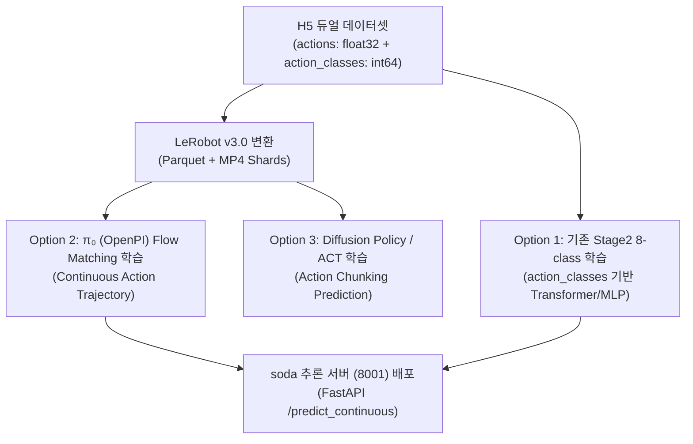

# 🚀 [MoNaVLA] 3-Mode 조이스틱 제어 & LeRobot v3.0 파이프라인 핸드오프 리포트
**문서 버전**: v1.0  
**작성 일시**: 2026-08-12  
**대상 시스템**: `soda` (Robot Host: 100.85.118.58) ➔ `minum` (Training/Server Host: 100.111.109.55)

---

## 1. 개요 및 배경 (Background & Objectives)

1. **비가역성(Irreversibility) 문제 해결**:
   - **이산 $\rightarrow$ 아날로그**: 스틱의 미세 기울기, 속도, 부드러운 가감속 정보가 잘려나가 복원 불가능(비가역적).
   - **아날로그 $\rightarrow$ 이산**: 단순 양자화(임계값 분류)이므로 사후에 100% 손실 없이 변환 가능.
   - **해결책**: 조이스틱 주행은 미세 아날로그 연속값으로 수집하되, H5 저장 시 **연속 실수 궤적(`actions`)**과 **8-class 이산 라벨(`action_classes`)**을 모두 함께 저장하는 **듀얼 레코딩(Dual-Representation)** 구조 구축.

2. **$\pi_0$ (OpenPI / Flow Matching) & LeRobot v3.0 표준 포맷 지원**:
   - Hugging Face **LeRobot v3.0 (Parquet + MP4 비디오 샤드)** 표준 데이터셋 변환 파이프라인 구축.
   - 기존 Stage2 8-class VLA와 차세대 $\pi_0$ 연속 궤적 모델을 동일한 데이터셋으로 모두 학습 가능하도록 지원.

3. **7800 웹 대시보드 UX 강화**:
   - 3-Mode 순환 전환 UI (`[🕹️ 이산(8방향)]` ➔ `[∿ 아날로그(연속)]` ➔ `[⚡ 듀얼(연속+이산)]`).
   - 데이터셋 및 세션 히스토리 화면에 **3대 정렬(Sort) 및 실시간 검색** 기능 탑재.

---

## 2. 3대 제어/수집 모드 스펙

| 모드 (`control_mode`) | 실시간 주행 방식 | H5 저장 데이터 구조 | 호환성 및 주요 용도 |
| :--- | :--- | :--- | :--- |
| **1. `discrete`** <br>(기존 레거시) | 8방향 양자화 (W/A/S/D/Q/E/R/T) + 고정 속도/PWM | `actions: float32 [N, 3]` (이산 방향 벡터) | **기존 Stage2 VLA (MLP/Transformer 8-class)** 학습 100% 하위 호환 |
| **2. `continuous`** | 조이스틱 스틱 기울기 비례 PWM / 속도 제어 | `actions: float32 [N, 3]` (정밀 연속 실수 궤적) | **$\pi_0$ (OpenPI) / Flow Matching / Diffusion Policy** 전용 |
| **3. `dual`** <br>*(권장 ★)* | 조이스틱 스틱 기울기 비례 PWM / 속도 제어 | **`actions: float32 [N, 3]` (연속 실수)** <br>+ **`action_classes: int64 [N]` (8-class 이산 라벨)** | **정보 손실 제로.** 하나의 데이터셋으로 $\pi_0$와 기존 8-class VLA 모델을 모두 학습 가능 |

---

## 3. 코드 변경 사항 및 구조 (Codebase Changes)

### 3.1. `robovlm_nav/serve/vla_control_utils.py`
- **`VLAController.move_analog_continuous(linear_x, linear_y, angular_z, speed_scale)`**:
  - 축별 데드존 필터링 (`threshold=0.08`).
  - 스틱 기울기 크기에 비례하는 동적 스로틀 PWM 계산 (`throttle = round(mag * base_throttle)`).
  - 모터 PWM 및 조향 제어 후 127.0.0.1:8001 `/robot/control`로 상태 발행.

### 3.2. `robovlm_nav/serve/mona_dashboard.py`
- **`DashboardJoystickReader`**:
  - `control_mode`: `"discrete"`, `"continuous"`, `"dual"` 상태 머신 관리.
  - `cycle_control_mode()`: 3대 모드 순환 전환.
  - `_loop`: 모드별 주행 제어 및 상태 라벨(`🕹️`, `∿`, `⚡`) 실시간 갱신.
- **`DataCollectSession._save_episode_data`**:
  - H5 파일 저장 시 `actions` (float32 연속 속도), `action_classes` (int64 8-class), `action_event_types` 저장.
  - `attrs["control_mode"]`, `attrs["action_space"]` 메타데이터 기록.
- **FastAPI Endpoints**:
  - `POST /joystick/cycle_control_mode`: 3-Mode 순환 전환.
  - `POST /joystick/set_control_mode`: 특정 모드 지정 (`{"mode": "dual"}`).
  - `POST /joystick/toggle_sync_async`: SYNC / ASYNC 주행 모드 토글.
  - `POST /dataset/export_lerobot_v3`: LeRobot v3.0 변환 실행.
  - `GET /dataset/list`: `control_mode`, `action_space` 반환.
- **대시보드 UI**:
  - 📷 **데이터수집 (`tab-collect`)**: 3-Mode 순환 버튼 (`#btn-collect-ctrlmode`), SYNC/ASYNC 버튼, LeRobot Export 버튼.
  - 🗂 **데이터셋 히스토리 (`tab-dataset`)**:
    - 제어 모드 모니터링 칩 (`⚡ 듀얼`, `∿ 아날로그`, `🕹️ 이산`).
    - 3대 정렬 셀렉트박스 (`#ds-sort-select`): 날짜시간순, 프레임수순, 듀얼/아날로그 모드 우선순, 시나리오순.
  - 📂 **세션 히스토리 (`tab-history`)**:
    - 실시간 검색창 (`#session-search`): SID 및 인스트럭션 검색.
    - 3대 정렬 셀렉트박스 (`#session-sort-select`): 시간순, 스텝순, 라벨수순, 인스트럭션순.

### 3.3. `robovlm_nav/datasets/export_lerobot_v3.py` (신규)
- **Hugging Face LeRobot v3.0 표준 포맷 변환기**:
  ```text
  lerobot_v3_export/
  ├── meta/
  │   ├── info.json          # features (action float32[3], observation.images video, timestamp, fps)
  │   ├── episodes.jsonl     # 에피소드별 메타데이터 및 청크 인덱스
  │   └── tasks.jsonl        # 태스크(인스트럭션) 매핑
  ├── data/
  │   └── chunk-000/
  │       └── episode_000000.parquet  # [action, action_class, timestamp, frame_index, task_index]
  └── videos/
      └── chunk-000/
          └── observation.images/
              └── episode_000000.mp4  # H.264 압축 비디오 스트림 (10 fps)
  ```

---

## 4. minum 서버 적용 가이드 (Sync & Deploy to minum)

`minum` 서버(100.111.109.55)에서 이 변경사항을 반영하고 학습을 진행하는 절차입니다.

### 4.1. 파일 동기화 (Git Push / Rsync)
`soda` 서버에서 커밋 후 푸시:
```bash
# soda에서 커밋
git add robovlm_nav/serve/mona_dashboard.py \
        robovlm_nav/serve/vla_control_utils.py \
        robovlm_nav/datasets/export_lerobot_v3.py \
        docs/ANALOG_3MODE_AND_LEROBOT_V3_HANDOFF.md
git commit -m "feat: 3-Mode joystick control (discrete/continuous/dual) and LeRobot v3 exporter"
git push origin main
```

`minum` 서버에서 풀:
```bash
# minum 서버에서
cd ~/MoNaVLA
git pull origin main
```

### 4.2. 데이터셋 H5 파일 동기화 (soda ➔ minum)
`soda`에서 수집한 H5 데이터셋을 `minum`으로 전송:
```bash
# soda에서 실행
rsync -avz --progress docs/data_collection/v6_eval_set/ \
    minum@100.111.109.55:~/MoNaVLA/docs/data_collection/v6_eval_set/
```

### 4.3. minum에서 LeRobot v3.0 포맷으로 변환 실행
`minum` 서버에서 H5 데이터셋을 Parquet + MP4 비디오 샤드로 일괄 변환:
```bash
# minum 서버에서
python3 robovlm_nav/datasets/export_lerobot_v3.py \
    --input_dir docs/data_collection/v6_eval_set \
    --output_dir datasets/monavla_lerobot_v3 \
    --fps 10 \
    --video_codec mp4v
```

---

## 5. 넥스트 플랜 (Next Plans on minum)



### 🎯 Next Step 1: $\pi_0$ (OpenPI / Flow Matching) 학습 파이프라인 연동
1. **데이터 로더 (`LeRobotDataset`)**:
   - `datasets/monavla_lerobot_v3` 경로를 지정하여 `lerobot` 공식 라이브러리 또는 `torch.utils.data.Dataset`으로 로드.
2. **Flow Matching Loss 구성**:
   - Time step $t \in [0, 1]$, 가우시안 노이즈 $x_0 \sim \mathcal{N}(0, I)$, 타겟 액션 $x_1 = a \in \mathbb{R}^3$.
   - $v_t(x_t, \text{vlm\_embed}) = x_1 - x_0$ 타겟 벡터 예측 학습.

### 🎯 Next Step 2: 기존 Stage2 8-Class 모델과의 비교 평가 (A/B Test)
1. **동일 데이터셋 기준**:
   - `action_classes`로 학습한 **Stage2 Transformer (exp71 계열)**.
   - `actions` 연속 궤적으로 학습한 **$\pi_0$ Flow Matching**.
2. **성공률 및 FPE, 궤적 매끄러움(Smoothness)** 실기 비교.

---

## 6. 결론 (Conclusion)

- **비가역성 문제의 완벽한 해결**: 아날로그 연속 제어로 수집하되 H5에 이산 라벨을 함께 저장하는 듀얼 포맷을 구축하여 기존/차세대 모델 모두 호환.
- **표준화 달성**: LeRobot v3.0 포맷 변환을 통해 Hugging Face 생태계 및 최신 VLA 아키텍처 학습 준비 완료.
- **운영 편의성 극대화**: 7800 대시보드에서 3대 제어 모드 순환, 데이터셋/세션 3대 정렬, 원클릭 LeRobot 변환까지 완벽 지원.
