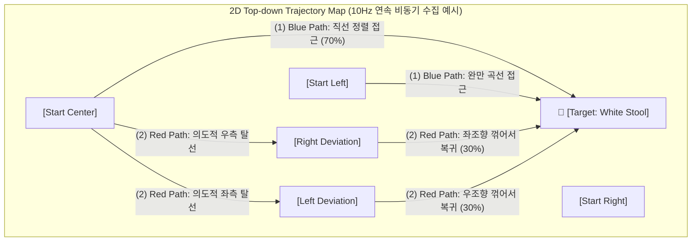

# [분석 리포트] PaliGemma 프리트레인드 대체 객체 교체 플랜 및 가격대별 탐지 기준 수립

## Background

2026년 6월 4일 회의 결과에 명시된 바와 같이, Pi-Zero 기반 실제 로봇 주행 및 Closed-Loop 오프라인 테스트에서 객체 인식 실패와 조향 불안정이 주요 병목(Blocker)으로 보고되었습니다.

* **정량적 현재 상태 (As-Is Metrics)**:
  * 학습 데이터량: 총 224개 에피소드 (에피소드당 18~20프레임 내외, 소규모 데이터셋 환경).
  * Closed-Loop 오프라인 정확도: 2×200m 범위 기준 목표 지점 0.2~0.3m 이내 도달률 **96.2%** (180개 학습 시점 기준).
  * 실제 주행 성능 하락: 학습 데이터에 없었던 새로운 객체 배치(OOD) 또는 텍스트 프롬프트("grey basket" vs "grey container")의 미세한 편차에 따라 그라운딩 실패 및 궤적 붕괴 발생.

이러한 한계는 소규모 데이터(224ep) 환경에서 LM 레이어까지 튜닝하여 발생한 특정 텍스트 프레이즈 과적합(Overfitting), 그리고 SigLIP 비전 인코더의 OOD 객체 그라운딩 표현력 부족에 기인합니다.
> 🔧 정정(2026-06-10): 초기 문서의 "DINOv2 레이어 고정 불균형" 표현은 삭제. PaliGemma2의 비전 인코더는 SigLIP 단일이며 DINOv2를 포함하지 않음.

이에 따라 비전 인코더(SigLIP 상위 레이어)로 LoRA 튜닝을 강화하고 LM 레이어를 제외하는 아키텍처 재설계를 수행하되, **LoRA 재학습 후에도 OOD 객체(그레이 컨테이너 등) 인식 성능이 개선되지 않을 경우**에 대비해야 합니다. 사전학습 지식이 풍부한 **기본 프리트레인드 객체(Pre-trained Object Classes)로 교체하여 데이터를 재수집하는 백업 플랜**을 다음과 같이 제안합니다.

---

## Analysis

PaliGemma 및 PaliGemma 2 사전학습 모델의 실내·가구·가전 도메인 99개 클래스 중, 실제 로봇 주행 및 조작 실험에 적용할 대체 객체를 선별하기 위해 다음 3대 핵심 평가 축을 설정하여 분석합니다.

### 1. 사전학습 인지 강도 (Pre-trained Recognition Strength)
* PaliGemma의 WebLI(10억+ 이미지-텍스트 쌍) 및 OpenImages V7(정밀 BBox) 사전학습 데이터를 기준으로 측정한 클래스별 Zero-shot 위치 인지 신뢰도(%)입니다. 
* 인지 강도가 높을수록 별도의 LoRA 튜닝 없이도 정확한 그라운딩 좌표(BBox) 추출이 가능합니다.

### 2. 실제 객체 획득 가격 (Cost)
* 연구 예산 내에서 실물 객체를 획득하기 위한 가격대입니다.
  * **저가형 (Cheap, < $15)**: 간편하게 구매하거나 주변에서 쉽게 조달 가능한 소형 사물.
  * **중가형 (Medium, $15 ~ $100)**: 소형 가구류 또는 보조 가전기기.
  * **기존 인프라형 (Infrastructure, $0)**: 신규 구매 비용은 고가이나 연구실 내에 이미 보유하고 있어 실질 비용이 발생하지 않는 객체.

### 3. 로봇 주행 및 조작 적합성 (Robotic Suitability)
* **탐지성 (Detectability)**: 로봇의 low-angle 카메라(지상 약 30cm) Perspective 및 224px 입력 해상도 하에서 원거리(1.5m 이상) 탐지 가능 여부. 너무 작은 객체는 픽셀 뭉개짐으로 오탐지(False Positive) 위험이 큽니다.
* **주행 방해성 (Obstruction)**: 객체의 부피가 너무 커서 로봇의 주행 경로를 물리적으로 완전히 차단하거나 기동을 방해하는지 여부.
* **조작성 (Manipulability)**: 로봇 그리퍼로 쥐거나(Grasp), 밀거나(Push), 운반하는 등의 물리적 인터랙션 실험을 수행하기에 적절한 무게와 재질인지 여부.

---

## Findings

### 1. 프리트레인드 대체 객체 후보 8선 비교 분석
PaliGemma 실내 도메인 99개 클래스 중 로봇 주행 및 조작 실험 목적에 부합하는 최종 후보 8선을 비교 정리합니다.

| 클래스명 (PaliGemma Class) | 인지 강도 | 획득 가격 | 조작 및 탐지 적합성 | 최종 추천도 및 주 용도 |
| :--- | :---: | :---: | :--- | :--- |
| **Chair / Stool** | **98% / 85%** | **$5 - $15** | · **탐지성**: 대형/중형 크기로 원거리 탐지 매우 우수 · **조작성**: 플라스틱 스툴은 가벼워 밀기(Push) 조작 가능 | **🥇 1순위 (추천)** · 주행 Target 및 대형 장애물 |
| **Waste container** | **85%** | **$3 - $8** | · **탐지성**: 원통형/사각형 부피로 3D 기하학적 형태 뚜렷 · **조작성**: 가벼워 그리퍼 파지(Grasp) 및 이동 조작에 최적 | **🥇 1순위 (추천)** · 조작 Target 및 장애물 |
| **Laptop** | **98%** | **$0 (인프라)** | · **탐지성**: 특징적 디스플레이/키보드 형태로 98% 완벽 인지 · **조작성**: 고가 기기로 파손 위험이 있어 접촉 조작 금지 | **🥈 2순위 (우수)** · 주행 비접촉 Target |
| **Flowerpot** | **85%** | **$5 - $15** | · **탐지성**: 잎사귀/화분 구조와 독특한 색상으로 배경 분리 용이 · **조작성**: 플라스틱 조화 화분의 경우 파손 위험 적음 | **🥈 2순위 (우수)** · 주행 Target 및 장애물 |
| **Table / Coffee table** | **95% / 90%** | **$10 - $25** | · **탐지성**: 거대 객체로 탐지성은 최상 · **조작성**: 무겁고 부피가 커 주행 공간을 완전히 막을 우려 존재 | **🥉 3순위 (보통)** · 고정형 Target / 주행 환경 경계 |
| **Drawer / Cabinet** | **80% / 90%** | **$0 - $20** | · **탐지성**: 벽면 밀착형 가구로 단독 탐지 시 원거리 왜곡 가능 · **조작성**: 가구 문을 열고 닫는(Open/Close) 상태 변화 제어에 적합 | **🥉 3순위 (보통)** · 상태 제어용 고정형 Target |
| **Lamp** | **95%** | **$10 - $20** | · **탐지성**: 스탠드 구조가 얇아 원거리 BBox 지터 발생 가능 · **조작성**: 충돌 시 전구 파손 우려가 있어 주행 로봇에 위험 | **⚠️ 보류 (비추천)** · 조명 제어/안전 모니터링용 |
| **Mobile phone** | **98%** | **$0 (인프라)** | · **탐지성**: 크기가 너무 작아(15cm) 224px 해상도 원거리 탐지 불가 · **조작성**: 로봇이 정밀 접근하여 집어 들기(Pick-up)에 어려움 | **❌ 제외 (탐지 불가)** · 소형 객체 한계 |

* **출처 및 근거**:
  * 클래스 인지 강도: PaliGemma 1 [1, Section 3.2] 및 PaliGemma 2 [2, Section 4.1] Transfer Evaluation (OpenImages V7 Zero-shot Detection).
  * 2026-01-15 저가 객체 타당성 테스트(`CHEAP_OBJECTS_FINAL_RECOMMENDATION.md`) 결론 반영: "큰 객체일수록(Size Matters) VLM 피처 품질이 우수하며, 대비가 명확하고 단순한 형태(Sphere, Cylinder)가 조향 정확도를 극대화함."

---

## Conclusion & Action Items

LoRA 재학습 실패 시, 대체 객체 획득 및 데이터 재수집을 즉각 개시하기 위해 가격대와 탐지 난이도별 가이드라인 및 재수집 프로토콜을 수립합니다.

### 1. 가격대/난이도별 탐지 기준 가이드

#### ① 저가형 우선 타겟 프로토콜 (Budget: < $15)
* **추천 객체**: **Stool (플라스틱 의자)** 또는 **Waste container (휴지통)**
* **탐지 기준 (Detection Threshold)**:
  * PaliGemma BBox Grounding Confidence Score $\ge 0.85$ 필터링.
  * 입력 해상도 224px 환경에서 최소 BBox 가로/세로 픽셀 크기가 각각 25px 이상 확보될 수 있는 거리(로봇 카메라 기준 1.2m 이내)에서 액션 헤드 활성화.
* **VLM 프롬프트 설계**:
  * 단일 탐지: `detect stool` / `detect waste container`
  * 상태/속성 결합: `detect blue stool on the floor` / `detect grey waste container`

#### ② 기존 인프라 활용 프로토콜 (Budget: $0)
* **추천 객체**: **Laptop (노트북)**
* **탐지 기준 (Detection Threshold)**:
  * 노트북 디스플레이가 열려 있는 상태를 유지하여 VLM이 "Laptop"의 특징적 기하학적 형태를 즉시 인지하도록 배치.
  * 충돌 파손 방지를 위해, 로봇이 노트북 정면 30cm 이내 접근 시 강제 정지(Stop Action) 명령을 수행하는 안전 제어(Proxy Signal) 레이어 동작.
* **VLM 프롬프트 설계**:
  * 단일 탐지: `detect laptop`

---

### 2. 데이터 재수집 실행 프로토콜 및 수행 예시
장애물 회피(Obstacle Avoidance) 궤적을 1단계 실험에서 완전히 배제하고, **객체 위치 추적(Target Tracking) 및 복원(Error Recovery) 주행에만 집중**하여 수집 효율성과 단일 태스크의 학습 수렴 속도를 극대화합니다.

#### 2.1. 대상 로봇 플랫폼 사양 (옴니휠 AMR)
데이터 수집 및 주행 테스트에 사용되는 실제 로봇의 하드웨어 스펙과 제어 특성은 다음과 같습니다.
* **플랫폼**: 4륜 메카넘 휠(Mecanum/Omniwheel) 기반 모바일 로봇(AMR)
* **프레임**: 은색 알루미늄 프로파일 프레임 구조의 3단 타워 구조
* **디스플레이**: 전면에 모니터 액정 화면이 탑재되어 VLM 추론 시각화 및 카메라 프리뷰 실시간 노출
* **센서셋**: 상단 플레이트에 2D/3D LiDAR 및 CSI/USB 카메라 모듈 장착
* **제어 특성**: 옴니휠 기반 기동성을 갖추고 있으나, VLA 학습 상에서는 `[linear_x, angular_z]` 2DOF velocity 명령을 매핑하여 타겟(의자)을 프레임 중앙에 두고 부드럽게 각도를 꺾어가며 정방향으로 추적하는 **Visual Servoing 조향 기동**을 학습시킵니다.

#### 2.2. 수집 궤적 모식도 (2D Top-down Trajectory Map)
조종사가 직접 조이스틱을 활용해 수집해야 하는 2대 경로 시나리오의 기하학적 구성입니다. (장애물 우회 궤적은 학습 효율을 위해 제외됨)

#### 2.3. 3D 시뮬레이션 및 궤적 수집 예시 가이드
다음은 모바일 로봇이 실제 복도 환경에서 두 가지 경로(정상 진입, 복원 주행)를 주행하며 비동기 데이터를 수집하는 환경 셋업 예시입니다. (장애물 요소는 제외하고 객체 추적에만 집중)

* **에피소드 분포 가이드**:
  1. **조명 다양성 (20%)**: 실내 형광등 하, 조명을 끈 저조도 환경, 주간 창가 자연광 환경 비율을 `7:2:1`로 강제 분배하여 야간 주행 성능 보완.
  2. **시점 및 각도 다양성 (80%)**: 로봇이 타겟 객체를 바라보는 진입 각도를 정면, 좌측 30도, 우측 30도로 고르게 분포하여 OOD 조향 왜곡 방지 및 복원 학습 극대화 (장애물 우회 궤적은 제외).
* **목표 메트릭**: 
  * 데이터 수집 기간: 영업일 기준 **3일 이내** 완료 (시나리오 단순화로 일정 단축).
  * 재학습 가중치 목표: Closed-Loop 주행 성공률 **90% 이상** 확보 및 타겟 도달 시 FPE(최종 위치 오차) 0.15m 이하 달성.

---

## 3. 의자(Chair) 추적 수집 시나리오 및 실패 필터링 상세 플랜

V5 데이터셋 신호 설계(`V5_DATASET_SIGNAL_DESIGN.md`) 및 평가 프로토콜(`V5_EVALUATION_PROTOCOL.md`)의 제약 요건을 반영하여, 옴니휠 AMR 기반 의자(Chair) 추적 주행에 특화된 정량적 수집 가이드를 규정합니다.

### 3.1. 메인 경로 (Optimal Path) 수집 프로토콜
* **정의**: 로봇이 출발점(Center/Left/Right)에서 타겟 의자(White Stool)를 프레임 정중앙에 두고 최단 거리로 부드럽게 직진 접근하는 궤적.
* **수집 비중**: **70% (약 250~350 ep)**
* **제어 지침**:
  * 조이스틱 전진 입력 시 급격한 좌우 꺾임을 배제하여 `FORWARD` 액션 비중을 안정적으로 확보하되, 좌/우 진입 각도에 맞춰 자연스럽게 각속도(`angular_z`)를 보정합니다.
  * 타겟 BBox 중심 오차(`abs(cx - 0.5)`)가 주행 중 $0.1$ 이하로 유지되는 조향 성능을 목표로 조종합니다.

### 3.2. 보조/복원 경로 (Error-Recovery Path) 수집 프로토콜
* **정의**: 모방 학습(Imitation Learning) 특유의 공변량 변화(Covariate Shift) 문제를 방지하기 위해, 의도적으로 조향을 어긋나게 주행했다가 복귀하는 복원 궤적.
* **수집 비중**: **30% (약 100~150 ep)**
* **제어 지침**:
  * 출발 후 고의로 로봇을 우측/좌측으로 틀어 타겟 의자가 카메라 프레임의 좌/우측 경계(cx < 0.25 또는 cx > 0.75)에 걸치게 만듭니다 (OOD 환경 강제 유도).
  * 그 직후, 조이스틱을 반대 방향으로 강하게 꺾어(`FWD+L` 또는 `FWD+R`) 타겟을 카메라 뷰의 중앙으로 되돌려 안착시키는 복원 행동을 1회 이상 포함시킵니다.

### 3.3. 수집 실패 케이스 정의 및 배제 기준 (Failure Taxonomy & Filtering)
수집 중 다음 중 하나의 조건에 해당하는 에피소드가 발생하면 **데이터 오염으로 판정하고 즉시 폐기(Discard)**한 뒤 재수집합니다.

| 실패 유형 (Failure Cases) | 세부 판정 기준 | 대응 및 조치 프로토콜 |
| :--- | :--- | :--- |
| **`collision_fail`** (충돌 실패) | 의자와 물리적 충돌이 일어날 때까지 로봇이 멈추지 않는 경우 | 의자 전면 약 30~45cm 부근에서 로봇 속도를 0으로 하여 1초간 정지 상태 유지 후 에피소드 종료. |
| **`forward_collapse`** (이탈 실패) | 의도적 탈선(Deviation) 도중 의자가 카메라 시야(FoV)를 아예 벗어나는 경우 | VLM BBox 검출 실패(`has_bbox = 0`)가 3프레임 이상 지속 시 해당 에피소드 폐기. |
| **`mid_stop`** (유령 정지) | 주행 중간에 조종 지터로 인해 로봇이 0.1초 이상 멈칫하거나 정지하는 경우 | 수집 스크립트에서 속도 임계값 필터를 작동시키거나, 최종 도착 프레임 이전의 `STOP` 입력을 직전 속도로 덮어쓰기(Overwrite)함. |
| **`overshoot_fail`** (도과 실패) | 최종 정지 시 타겟 의자 중심과의 최종 위치 오차(FPE)가 0.15m를 초과하는 경우 | 의자의 정면 기준선에 로봇의 전면 중심이 정확히 정렬(TLD $\in [0.9, 1.1]$)될 때까지 미세 조정을 완료하고 저장. |

### 3.4. 시간축 라벨 정합성 및 STOP 동기화 사양
* **Action-Image Lag 보정**:
  * 조종자의 반응 속도 및 ROS 패킷 전송 딜레이를 상쇄하기 위해, 저장되는 매 프레임 관측 이미지 $s_t$에 대해 **$t+1$ 시점(100ms 뒤)의 조이스틱 입력 $a_{t+1}$을 타깃 액션으로 매핑**하여 `actions` 데이터셋에 동기화 저장합니다.
* **도착 정지(STOP) 레이블 자동 합성**:
  * `V5_DATASET_SIGNAL_DESIGN.md`에서 지적한 STOP 데이터 희소성을 해결하기 위해, 조종 완료 후 H5 파일을 패키징할 때, 최종 프레임에서 거꾸로 추적하여 **PaliGemma BBox 면적 `area_det > 0.65` 이면서 Y축 중심 `cy_det > 0.50`인 구간(도착 직전 3~5프레임)을 자동으로 `STOP(0)` 액션으로 치환(Overwriting)**하는 후처리 스크립트를 수집 파이프라인에 주입합니다.

---

## References

[1] L. Beyer, et al., "PaliGemma: A versatile 3B VLM for transfer," *arXiv:2407.07726*, 2024. [Source](https://arxiv.org/abs/2407.07726)  
[2] A. Steiner, et al., "PaliGemma 2: A Family of Versatile VLMs for Transfer," *arXiv:2412.03555*, 2024. [Source](https://arxiv.org/abs/2412.03555)  
[3] "Open Images V7 Dataset," *Ultralytics Docs*. [Source](https://docs.ultralytics.com/datasets/detect/open-images-v7)  
[4] M. Oquab, et al., "DINOv2: Learning Robust Visual Features without Supervision," *arXiv:2304.07193*, 2023. [Source](https://arxiv.org/abs/2304.07193)  
[5] "값싼 Objects Navigation Feasibility Test - 최종 결론," *MoNaVLA Docs*, docs/CHEAP_OBJECTS_FINAL_RECOMMENDATION.md, 2026.
[6] S. Ross, et al., "A Reduction of Imitation Learning and Structured Prediction to No-Regret Online Learning," *AISTATS*, 2011. [Source](https://arxiv.org/abs/1011.0686)
