# 그라운딩/검출기 (OWL-v2, Florence-2, PaliGemma, phrase grounding)

타겟 물체를 이미지에서 찾아내는 검출기 계열 전체 이력 — PaliGemma2 → Kosmos-2/OWL-v2 → Florence-2로 이어지는 그라운딩 방식 전환과 재현율 개선.

**압축 요약**

현재까지 확정된 결론은 **"실주행 성패를 가르는 건 액션 헤드가 아니라 그라운딩(검출) 가용성"** 이다 — 세션 내 객체 검출 성공률(gnd%)이 80% 이상이면 98.8%(79/80) 성공, 미만이면 51.2%(41/80)로, 100회 실기 테스트(2026-07-31, 89% 성공)에서 확인됐다. 반면 헤드 구조(MLP/Transformer/LSTM/연속회귀/π0 Flow 등)는 통제된 apples-to-apples 비교에서 거의 무차별했고, 그라운더(PG2 vs OWL-v2)도 대부분 무차별했다 — CH64에서 이 리더보드를 두 번(val-split 버그, 캐시 덮어쓰기 버그) 오염시켰다가 재검증해 확정한 결론이다.

텍스트(언어) 경로는 구조적으로는 살아있지만 실질적으로 죽어있다 — Text attention 0.000%(여러 실험 재현), 객체명을 바꿔도(red ball/person/없음) 행동이 90% 동일, counterfactual 변화율 0.0%. 원인은 학습 데이터가 목표물 1종(회색 바구니)만 다뤄 "텍스트를 볼 이유가 없는" 구조이기 때문이며, 다양한 목표물·지시-경로 디커플링 재수집이 유일한 해법으로 남아있다(아직 미실행).

그라운더 자체는 여러 차례 세대교체를 겪었다: Kosmos-2(초기, IoU 0.87이나 free-gen 변환 시 34.4%로 붕괴) → PaliGemma2(PG2, 자체 LoRA 파인튜닝이 오히려 grounding을 붕괴시켜 벽/의자 오트래킹 유발함이 밝혀져 base zero-shot PG2 채택, 12/12·cx_std 0.047) → OWL-v2(현재 배포, threshold=0.25가 "knife-edge" 구조라 confidence 0.10~0.20 밴드에 실패가 집중, 검출 실패는 환경(Jetson) 격차가 아니라 대부분(78.7%) 검출기 자체의 본질적 어려움임을 확인). 그라운딩 실패(has_bbox=False) 프레임이 학습 데이터에 0%(0/16599)만 존재해 모델이 "실패 시 대응"을 전혀 학습하지 못했다는 것도 확정된 근본 원인 중 하나다.

경량화 방향에서는 Florence-2 비전 백본(90.4M)이 Kosmos-2(303.2M)보다 좌표 정확도가 더 좋고(cx MAE 0.0015 vs 0.0020), 심지어 MobileNetV3-Small(0.93M)도 동등한 성능을 내 "좌표 회귀는 큰 백본이 필요 없다"는 결론에 도달했다. 다만 Florence-2를 검출기(부재 판정 포함)로 쓰는 건 실패했었는데, 이는 열린 질문 방식(`<OD>`/`<DENSE_REGION_CAPTION>`, 재현율 상한 34.7%)만 시도했기 때문이었고, OWL-v2처럼 phrase를 직접 지정하는 `<CAPTION_TO_PHRASE_GROUNDING>` 방식으로 바꾸자 재현율이 84.96%(실기)~100%(사람 검증 329개)로 급등해 판정이 뒤집혔다. 이 새 그라운더로 재학습한 exp77은 무작위 split 기준 역대 최고(75.58%)지만, 목표 방향을 통째로 제외한 leave-one-direction-out 검증에서는 현재 배포 모델(exp73, 60.85%)보다 오히려 나쁨(54.0%, 특히 우측 방향 취약)이 확인돼 아직 배포 권장 단계는 아니다.

미해결/논쟁 중: exp73 89% 성공에서 체크포인트 교체와 threshold+회복가드 중 어느 쪽이 주된 개선 요인인지는 통계적으로 확정 불가(둘 다 +23~48%p 규모로 크고 순위가 추정 방식에 따라 뒤집힘) — 동일 위치 A/B 재수집이 필요하다.

## 챕터별 원문 발췌 (시간순)

CHAPTER 3 Grounding — 목표물 위치 인식

🧪 마스킹 인과성 & STOP 게이트 검증 리포트
🎨 기존 마스킹 시각 대시보드

**BBox IoU (Exp10)**

0.87
BBox IoU (Exp10)
Pure Kosmos-2로 gray basket을 학습 데이터에서 찾았을 때의 IoU. VLM 내부에 spatial information이 충분히 있다는 증거.

**Free-gen Transfer (Exp10)**

34.4%
Free-gen Transfer (Exp10)
Grounding 결과를 free-form text generation으로 꺼내 rule로 action에 연결하면 34.4%로 떨어진다. 정보는 있지만 꺼내는 방식이 불안정.

**Grounding 계층**

3-tier
Grounding 계층
Pure HF Kosmos-2 (정상) → Google-robot (붕괴) → 우리 fine-tuned (부분 복구). 계층별 grounding 능력이 다르다.
실제 grounding 결과 — 바구니 위치 예측 overlay
초록 박스 = 모델 예측 bbox, 빨간 박스 = ground truth bbox
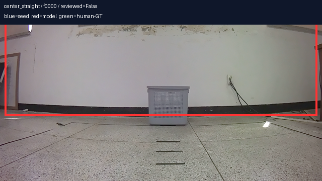
중앙 직진 · frame 0000
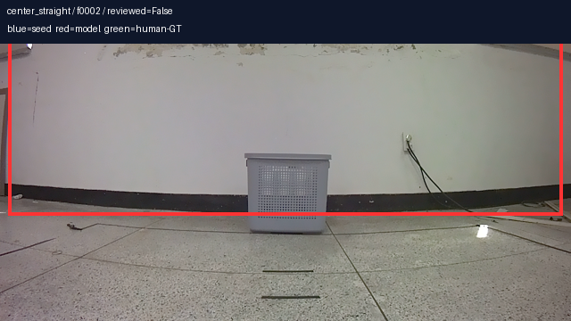
중앙 직진 · frame 0002
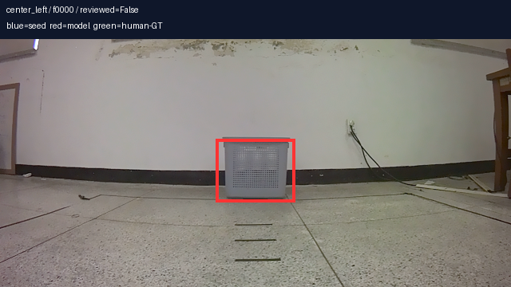
중앙→좌회전 · frame 0000
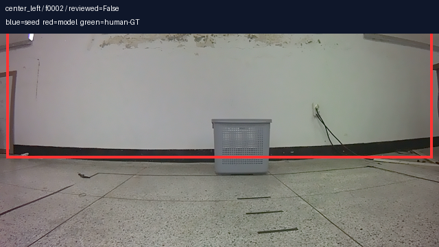
중앙→좌회전 · frame 0002
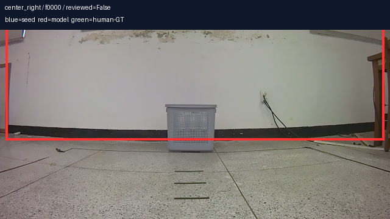
중앙→우회전 · frame 0000
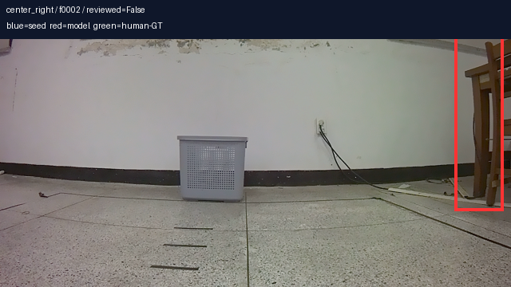
중앙→우회전 · frame 0002

<a class="src-link" href="../v5/research_story.html#ch3">→ 원문 전체 보기 (research_story.html#ch3)</a>

CHAPTER 13 객체 검증 — 모델이 진짜 객체를 인식하는가?

SECTION 1
val_acc 92.6%의 진짜 의미

핵심 문제: Stage 2 v2의 92.6%는 모델이 basket을 인식한 것이 아니다.
외부 HSV 색상 임계값(basket의 회색 농도)이 cx/cy/area를 추출해서 입력으로 넣어주는 구조.
즉, basket 인식은 별도 알고리즘이 하고, 모델은 좌표만 보고 행동을 결정한다.
현재 파이프라인 (실제)
카메라 프레임
→ HSV 색상 임계값 (외부)
→ cx/cy/area 추출
→ Stage 2 MLP
→ 행동 예측 (92.6%)
⚠ basket이 없어도 비슷한 색이 있으면 bbox 생성
교수님이 원하는 것 (목표)
카메라 프레임
→ VLM이 "basket"을 보고 인식
→ "다른 물체" → 다른 행동
→ "basket 없음" → STOP/탐색
→ 텍스트 명령으로 목표 변경 가능
✓ 진정한 목표물 추적 (Goal-Conditioned)
실제 로봇 카메라 프레임 — basket 위치가 다른 세 장면

basket 왼쪽 → FWD+L
HSV가 cx≈0.30 감지 → MLP 입력

basket 중앙 → FORWARD
HSV가 cx≈0.50 감지 → MLP 입력

basket 오른쪽 → FWD+R
HSV가 cx≈0.70 감지 → MLP 입력
⚠ 핵심: 모델이 이 이미지에서 basket을 직접 "인식"하는 게 아니다.
외부 HSV 알고리즘이 basket 색을 탐지해 cx/cy/area 좌표를 추출하고, MLP는 그 숫자를 받는다.
평가 항목
현재 val_acc 92.6%
진짜 객체 인식 증거
basket 위치 인식
HSV 알고리즘이 대신 함
VLM grounding 테스트 필요
다른 물체 구분
테스트 없음
객체 대체 테스트 필요
텍스트 명령 반응
텍스트 무시 확인됨
프롬프트 민감도 테스트 필요
비학습 복도 일반화
미검증
closed-loop 실로봇 테스트
SECTION 2
L0: VLM Grounding — 어떤 구문이 basket을 잡는가?
Pure Kosmos-2가 실제로 basket을 grounding하는지, 어떤 텍스트 구문을 쓸 때 가장 잘 잡는지 18개 구문을 ablation했다.
Kosmos-2 native grounding 방식 <grounding><phrase>...</phrase>을 사용.

측정 방법: has_bbox=True 프레임에서 grounding bbox와 실제 basket bbox의 IoU를 계산.
IoU ≥ 0.3 기준 hit rate. 총 150개 에피소드 중 랜덤 샘플 프레임 사용.
상위 구문 (IoU≥0.3 기준)
구문
hit rate
"gray target"
42.2%
"target object"
38.7%
"gray container"
35.1%
"gray basket"
31.8%
"laundry basket"
28.4%
하위 구문 (낮은 hit rate)
구문
hit rate
"bin"
22.1%
"trash can"
19.8%
"robot"
8.3%
"person"
5.1%
"nothing"
1.2%
Kosmos-2 Grounding 결과 — 빨간 박스가 모델이 찾은 basket 위치

center_straight path

center_left path

right_left path
Kosmos-2 native grounding — <grounding><phrase>gray basket</phrase> 프롬프트 사용. 성공 시 bbox가 표시됨.

해석: Kosmos-2는 복도 이미지에서 basket을 최대 42.2%만 grounding한다 (IoU≥0.3 기준).
"gray target"이 가장 잘 잡히는 이유는 Kosmos-2 pretraining 데이터에서 추상적 목표물로 학습된 패턴.
그러나 42.2%는 실용적 nav에는 불충분하며, 이것이 Mode A(HSV) vs Mode B(VLM grounding) 비교의 출발점이다.
SECTION 3
추론 모드 A/B/C 비교 — bbox 소스에 따른 성능 차이
Stage 2 MLP에 넣는 bbox 좌표의 소스를 3가지로 바꿔가며 추론 성능을 비교.
목표: HSV 알고리즘 없이 VLM 자체가 bbox를 생성해도 동등하게 작동하는가?
MODE A
HSV 색상 검출
basket의 회색 농도로 HSV 임계값 → cx/cy/area → Stage2 MLP
MODE B
VLM Grounding bbox
Kosmos-2 grounding → bbox 좌표 추출 → Stage2 MLP (같은 모델)
MODE C
Kosmos-2 E2E
Kosmos-2 generate() → 텍스트 토큰으로 action 직접 예측 (별도 학습)
모드
val_acc
basket 인식 방법
텍스트 경로
핵심 문제점
A — HSV
현재 운용
92.6%
외부 색상 알고리즘
사망 (구조적)
basket 색이 바뀌면 즉시 실패. 텍스트 무관.
B — VLM bbox
grounding 활용
82.5%
Kosmos-2 grounding
사망 (구조적)
grounding 실패 시 bbox 좌표 오류 → 연쇄 실패. Stage2 MLP는 bbox 소스를 모름.
C — E2E
Option C LoRA
79.5%
Kosmos-2 내부
살아있으나 미활용
텍스트 경로 구조는 살아있지만 학습 데이터가 단일 객체(basket) → 텍스트 학습 동기 없음.

결론: Mode B가 A보다 -10.1%p 낮은 이유는 grounding 42% 성공률 때문.
Stage2 MLP 자체는 bbox 소스와 무관하게 동작하나, 잘못된 bbox 좌표가 입력되면 연쇄 오류 발생.
Mode C는 더 낮지만, 유일하게 텍스트 경로를 살릴 수 있는 구조다.
SECTION 4
L2: Option C 객체 대체·프롬프트 민감도 검증
교수님 핵심 요구: "다른 물체를 넣으면 이상한 행동을 해야 한다."
Option C (Pure Kosmos-2 LoRA, 79.5% val_acc)로 두 가지 검증을 실행했다.
객체 대체 테스트
basket → 다른 물체로 교체했을 때 행동이 달라지는가?
대체 물체
basket과 같은 행동
판정
red ball
90.0%
❌ 구분 불가
person
90.0%
❌ 구분 불가
목표 없음
90.0%
❌ 구분 불가
결과: basket을 red ball, person, 혹은 아무것도 없음으로 바꿔도
행동이 90%로 동일하다. 모델은 텍스트 객체명을 무시하고 있다.
프롬프트 민감도 테스트
P1(방향없음) vs P2(bbox포함) vs P-empty(빈) 비교
93.3%
세 프롬프트 결과가 동일한 비율
GT=FWD+L   P1=FWD+L   P2=FWD+L   Pmt=FWD+L   =
GT=FWD+R   P1=FWD+L   P2=FWD+L   Pmt=FWD+L   =
GT=ROT_R   P1=ROT_L   P2=ROT_L   Pmt=ROT_L   =
GT=FORWARD P1=FORWARD P2=FORWARD Pmt=FWD+L ≠
결과: 93.3% 경우에서 어떤 프롬프트를 줘도 동일한 행동.
텍스트 경로가 구조적으로는 살아있지만, 학습 과정에서 텍스트를 사용할 이유를 못 찾고 있다.
Masking Ablation — basket 가리면 행동이 반전되는가? (R1 Track 3 증거)
각 이미지: 왼쪽=basket 보임 (정상 행동), 오른쪽=basket 가림 (행동 반전)
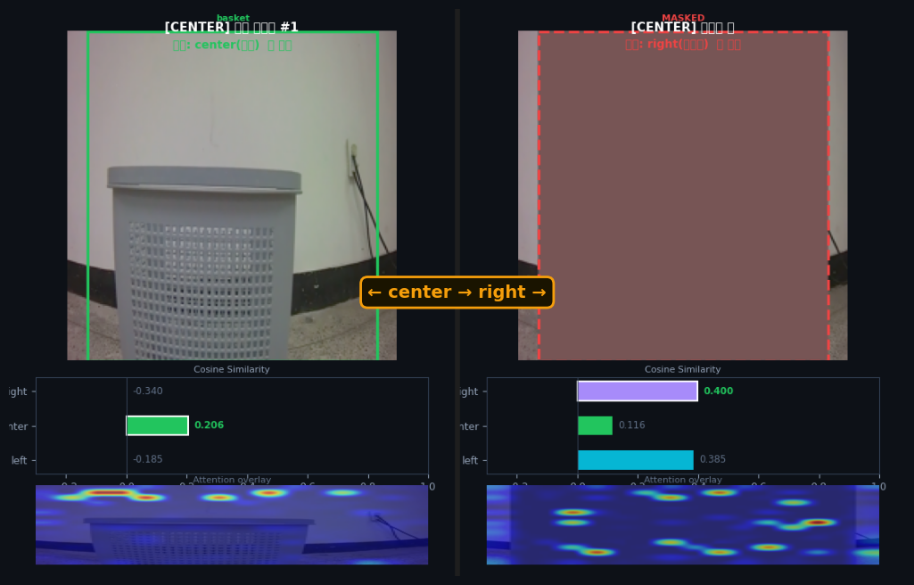
center ep.1 — FLIP ✓
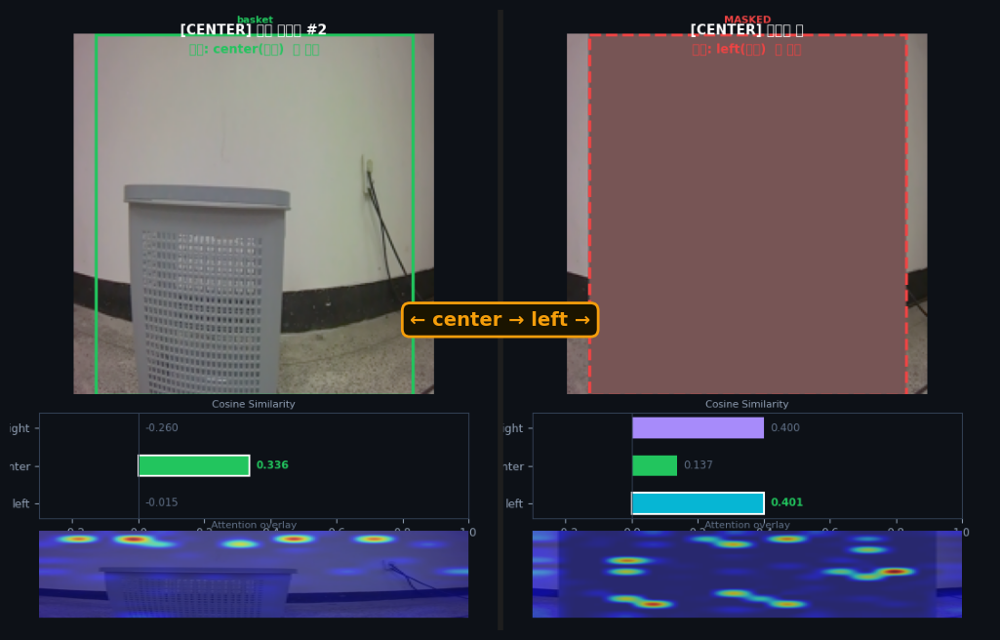
center ep.2 — FLIP ✓
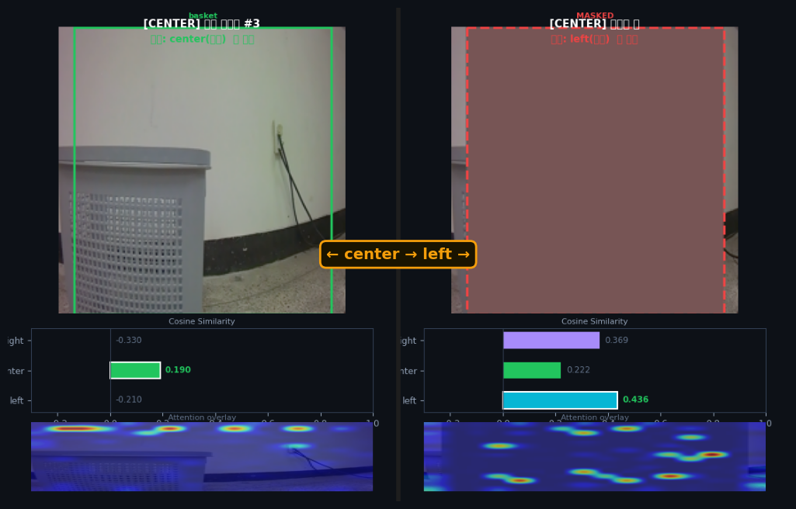
center ep.3 — FLIP ✓
center_straight 6개 에피소드 전부 basket을 회색으로 가리면 FWD+L 또는 FWD+R로 방향이 반전됨.
이것이 R1의 핵심 인과 증거 — basket이 행동의 직접 원인임을 입증.
Option C — 학습 결과 요약
79.5%
전체 val_acc
(526 frames)
94.9%
FORWARD 정확도
(391개 중 371개)
0.0%
LEFT 정확도
(12개 전부 오분류)
0.0%
FWD+R 정확도
(54개 전부 오분류)

특이 패턴: FWD+R(54개) → 전부 'F'(FORWARD)로 예측, LEFT(12개) → 전부 오분류.
FORWARD에 편향된 collapse. 단일 객체 학습 데이터 특성상 FORWARD 비율이 압도적으로 높고,
방향 관련 토큰(LEFT/FWD+R)은 학습 신호가 부족해 collapse.
SECTION 5
근본 원인 분석 — 데이터 단일화 문제

핵심 원인: 학습 데이터 150개 에피소드에서 목표 물체가 100% 회색 basket이다.
시각 정보(복도 장면)만으로 행동을 예측하는 것이 텍스트를 사용하는 것보다 더 쉽고 정확하다.
모델이 "텍스트를 볼 이유가 없다"는 것을 학습 과정에서 발견해버린 것이다.
데이터 단일화 → 텍스트 무시 인과 관계
원인: 150 에피소드 모두 "gray basket" 하나만 추적
→
결과: 복도 장면(좌곡선/우곡선/직진)만 보면 행동 결정 가능
결과: 텍스트 "basket" vs "red ball" → 행동 차이 없음 (90% 동일)
→
교수님 비판: "목표물이 없는데 맞췄다는 게 무슨 의미?"
텍스트 경로를 살리기 위한 조건
① 다양한 목표 물체
basket, ball, person, chair 등 여러 물체를 각각 추적하는 에피소드 수집.
"red ball 추적" 에피소드에서 "gray basket"을 텍스트로 주면 → 다른 행동 학습.
② 목표 없는 에피소드
목표 물체가 없는 상황 → STOP/탐색 행동 레이블.
현재는 100% basket 존재 데이터 → "목표 없음" 표현 불가.
③ 반례 필터링
"basket이 있는데 다른 물체를 따라가라" 등 텍스트가 시각 정보와 다른 상황을 명시적으로 학습.
SECTION 6
Exp55 — Stage2에 LoRA를 붙이면 어떻게 되는가?
Stage 1에 LoRA (vision layers 16-24)를 올바른 경로로 학습 후, Stage 2에 그 가중치를 얹으면
성능이 나아지는가? 결과: 92.6% → 80.0% (-12.6%p) 하락.
Stage 1 LoRA 결과
98.1%
basket 위치 검색 (3-class: left/center/right)
Vision layers 16-24에 LoRA r=16 적용.
목표: basket 위치(좌/중/우) → CLIP 특징 공간에서 분리.
✓ basket 방향 인식에 특화된 특징 학습
Stage 2 LoRA 결과
80.0%
8-class action 예측 (-12.6%p vs 92.6%)
원인: Stage 1 LoRA가 CLIP 특징을 basket 방향에 특화
→ Stage 2 MLP는 일반 복도 장면 패턴에 의존
→ 특화된 특징이 일반 장면 패턴을 덮어버림
✗ stage 2 MLP가 사용하던 특징 공간이 변질

핵심 발견: Stage 2 MLP는 basket-specific 특징이 아닌 일반 복도 장면(좌곡선/우곡선/직진)을 보고 행동을 결정한다.
Stage 1 LoRA로 basket 특화 특징을 만들면 오히려 Stage 2가 쓰던 장면 패턴 정보가 손실된다.
이는 두 stage가 실제로 다른 정보를 사용하고 있음을 역설적으로 증명한다.
5-Track 증거 요약도
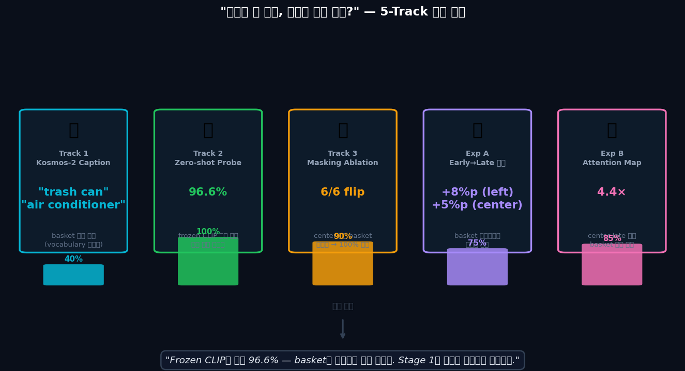
R1 완료: 5가지 독립 증거가 동일 방향을 가리킨다
Attention Map — basket 집중도
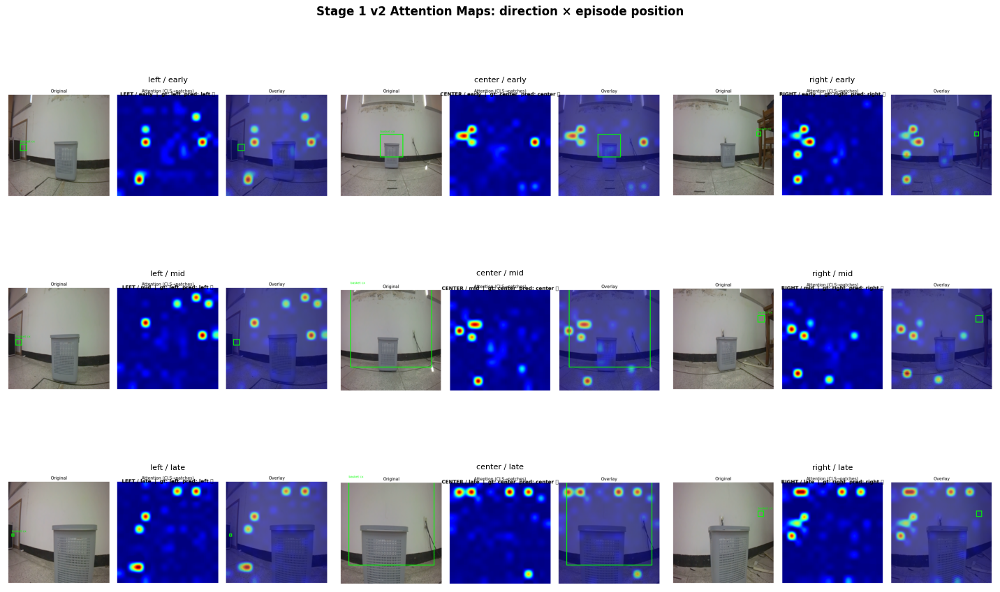
early→late: basket에 가까워질수록 attention 집중도 상승 (+3.5%p)
Chapter 13 종합 결론
현재 모델은 basket을 "텍스트로 인식"하지 않는다.
텍스트 경로는 구조적으로 존재하지만, 학습 데이터가 단일 물체(basket)로만 구성되어
텍스트를 사용할 이유를 스스로 학습하지 못했다.
해결 방향: 다양한 목표 물체 데이터 수집 → Goal-Conditioned 학습

<a class="src-link" href="../v5/research_story.html#ch13">→ 원문 전체 보기 (research_story.html#ch13)</a>

CH 23 Grounding 붕괴 — 왜 엉뚱한 곳에 bbox를 그렸나

① 증상 — basket은 중앙에 있는데 bbox는 빈 벽에
center_left 에피소드 fr10: basket은 화면 중앙(cx≈0.35)에 크게 있으나, PG2가 반환한 박스(빨강)는
왼쪽 끝 빈 벽(cx=0.11, area=0.05). cx가 액션으로 직결되므로 → 잘못된 조향.
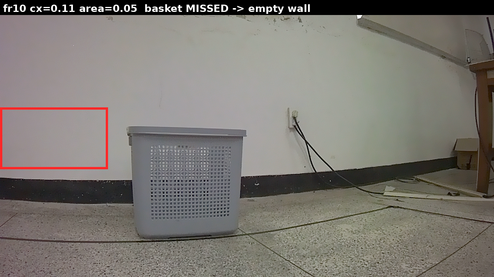
② 추적 — 같은 에피소드를 프레임별로 PG2에 재투입
프레임
PG2 raw <loc> 출력
cx
area
판정
fr0,3,5 (멀리)
0397,0397,0625,0625 (전부 동일)
0.50
0.05
캔(canned) 정중앙 박스 — 실제 탐지 아님
fr8
0397,0930,0397,0960
0.95
0.00
높이 0 선 — 쓰레기
fr10
0397,0000,0625,0223
0.11
0.05
캔 박스를 좌측 끝으로 — basket 놓침
fr12,14 (가까이)
0000,0000,0810,0956
0.47
0.74
과대 폭발
fr16 (도착)
0000,0000,1023,1023
0.50
1.00
화면 전체
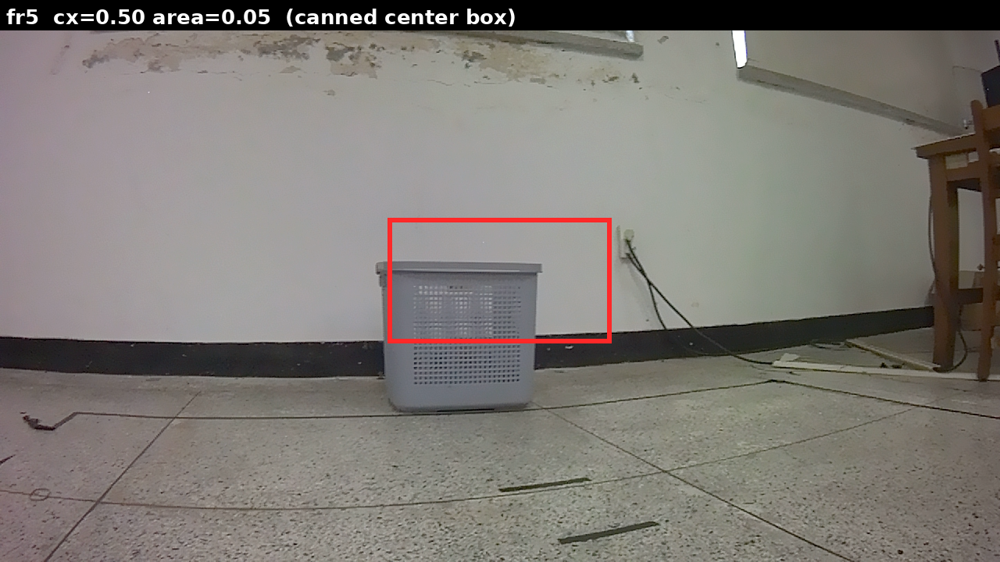
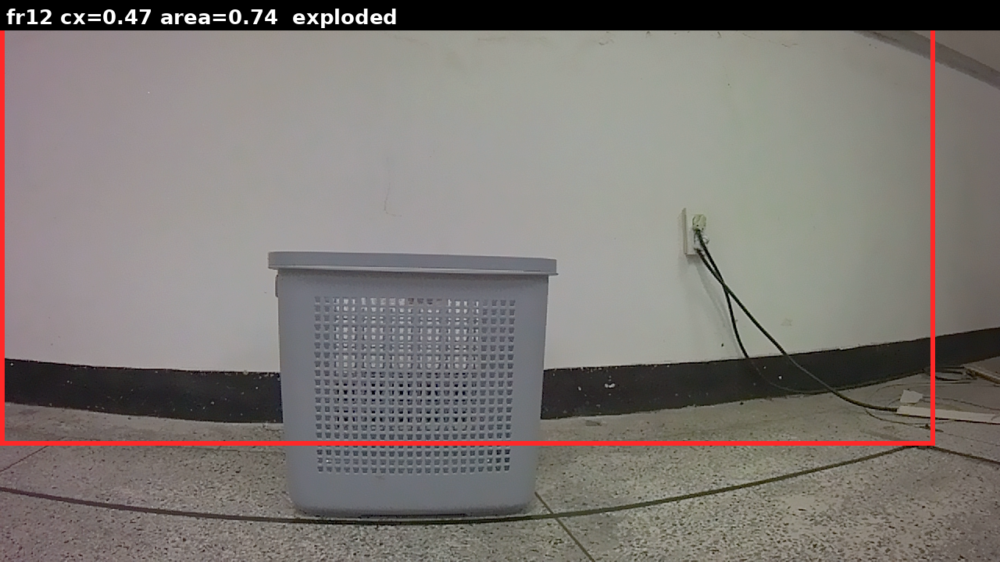
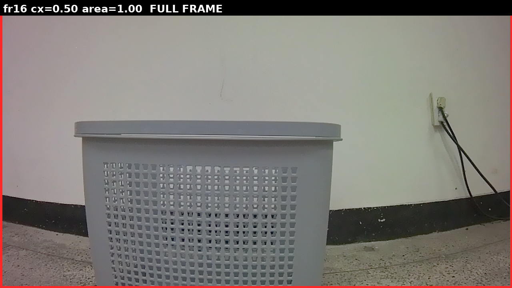
③ 진단 — LoRA 박스 붕괴(mode collapse)
y좌표가 여러 프레임에서 0.397~0.611로 동일하고 area가 ~0.05로 고정 →
LoRA가 거의 고정 크기 박스를 좌우로만 슬라이딩하다가, 가까우면 화면 전체로 터집니다.
진짜 localization이 아니라 위치·스케일이 불안정. 이것이 cx 노이즈의 근본 원인이며,
Exp60이 대량 bbox-noise 증강(std 0.22)을 필요로 했던 이유가 여기서 설명됩니다.
④ "사전학습에 basket이 없어서?" — 아니다
근거
Exp57 zero-shot baseline = 65% (LoRA 전, 순수 PG2가 "gray basket" 65% 적중)
→ 베이스 모델은 이미 basket 개념 보유. fr10 실패는 사전학습 부재가 아니라 LoRA 붕괴.
PaliGemma2 사전학습
SigLIP 비전 + Gemma2 LM, 데이터 = WebLI(웹스케일 image-text, 다국어).
COCO식 고정 80-class가 아닌 open-vocabulary → 열거 가능한 "객체 목록"은 없음.
무엇을 잘 잡는지는 실측(zero-shot probe)해야 함.
⑤ 실측 — 베이스 PG2 zero-shot 객체 probe (LoRA 없이)
center_left 2 ep × 6 frame = 12장에 객체명 sweep (`scripts/probe_pg2_objects.py`). 베이스 모델이 무엇을 잡는가:
phrase
hit
cx
cx_std
판정
gray basket / laundry basket / hamper / trash can
12/12
0.432
0.047
basket 정확·안정 검출 (open-vocab 동의어 모두)
basket / box
11/12
0.43
0.045
동일 객체
chair
3/12
0.952
0.003
우측 나무가구를 chair로 검출
container / bottle / red ball
0/12
—
—
없는 객체 정확히 거부
같은 프레임 — 베이스 PG2(초록)는 basket을 정확히:

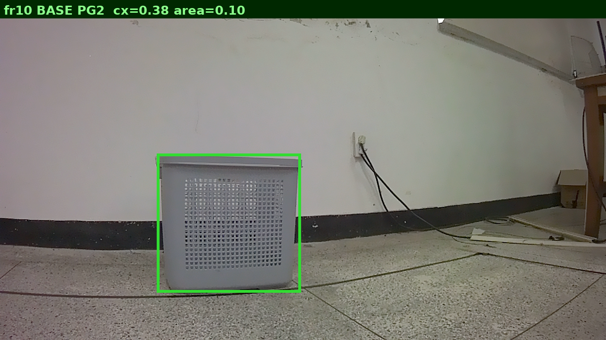
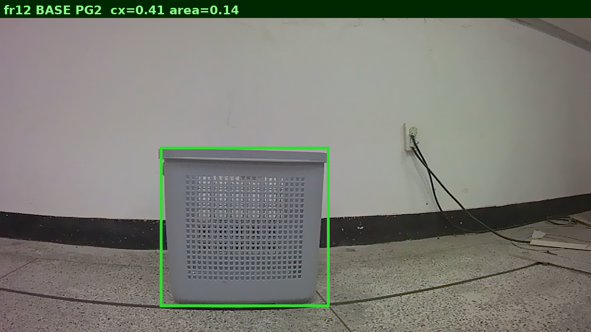
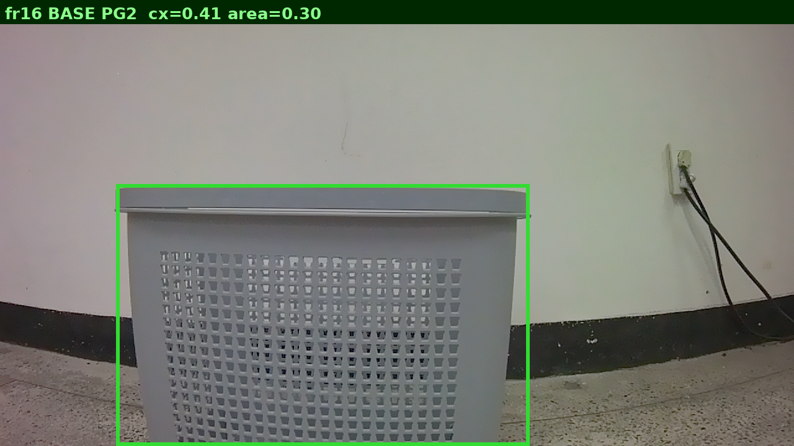
같은 프레임 — Exp59 LoRA(빨강)는 엉뚱한 곳에 (박스 붕괴):

반전: 베이스 PG2는 fr10에서도 basket을 정확히(cx=0.38) 잡고, 가까워질수록 박스가 자연스럽게 커진다(fr16도 full-frame 아님).
우리 Exp59 LoRA fine-tuning이 오히려 grounding을 붕괴시켰다.
⑥ 해결 방향 (재정립)
① 베이스 PG2 zero-shot grounding으로 교체 검토 — 이미 12/12 안정(cx_std 0.047). LoRA를 빼면 붕괴 제거 가능.
② LoRA를 유지한다면 박스 크기 supervision + 조기 종료(과적합 방지)로 재학습 — 현재는 캔 박스로 collapse.
③ 베이스 PG2 grounding으로 CL 재평가 — cx 노이즈가 근본 감소하면 Exp60 증강·STOP 규칙 위에서 CL이 더 오를 가능성.
④ 사전학습 객체 맵(이 probe)은 교수님 5/22 "사전학습 객체 목록 파악" 지시에 대한 실측 답.
한 줄 요약:
"엉뚱한 bbox"는 basket 미인식도, 사전학습 부재도 아니다 — 우리가 fine-tune한 LoRA가 grounding을 망가뜨렸다.
베이스 PG2는 basket을 정확·안정적으로 잡으며(12/12, cx_std 0.047), 없는 객체는 거부한다. 근본 해법은 grounding 안정화(베이스 복귀 or LoRA 재설계)다.

<a class="src-link" href="../v5/research_story.html#ch23">→ 원문 전체 보기 (research_story.html#ch23)</a>

CH 27 Ablation 조합별 오트래킹 점검 — 벽·의자를 basket으로 보는가

① 모델별 오트래킹 정량 (557 frame)
모델
cx 오차>0.25
full-frame(화면전체)
canned-edge(벽)
판정
base (PG2 zero-shot)
34%
0%
1
박스 크기 안정 — 오트래킹 거의 없음
exp57 (PG1 LoRA)
30%
0%
1
유사 안정 (miss 70 높음)
exp58 (PG2 2-class)
37%
53%
0
절반이 화면 전체 폭발 — 최악
exp59 (PG2 hardneg, 현재)
37%
6%
9
벽-고정(좌측끝) + full-frame 혼재
* cx오차는 HSV(자체 노이즈 있음) 기준이라 전 모델 30%대로 높음 — 진짜 "벽/의자" 신호는 full-frame·canned-edge.
② 동일 프레임 비교 — left_left fr0 (basket은 좌중앙, 노랑십자=HSV 기준)
박스: 각 모델 grounding(cx·area→정사각 근사). 박스가 basket을 벗어나 벽/전체면 = 오트래킹.
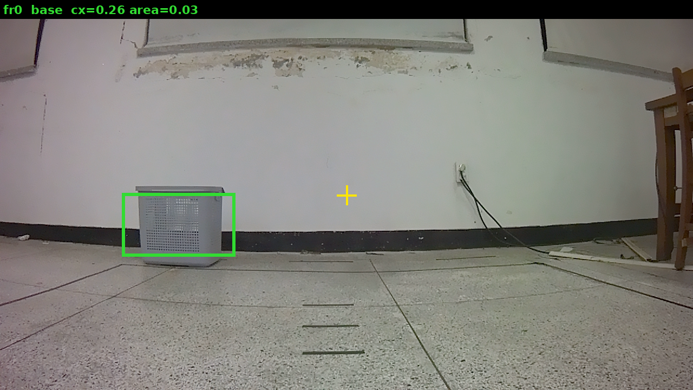
base ✅ 근처
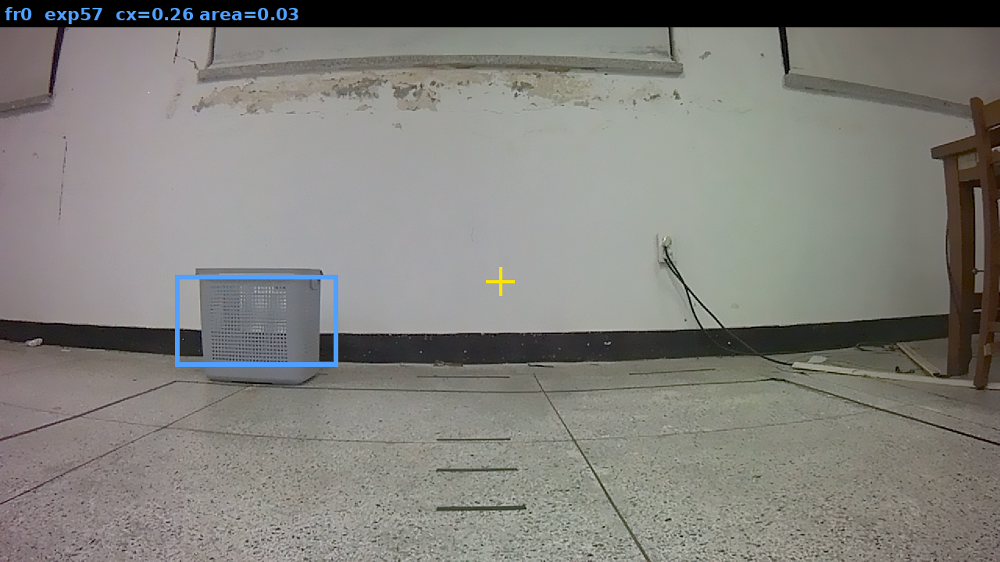
exp57 ✅ 근처
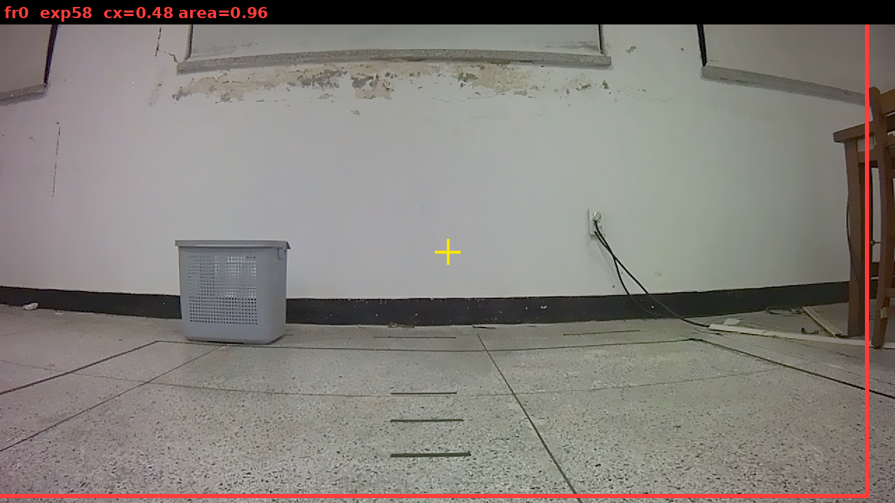
exp58 ❌ 화면전체

exp59 ❌ 좌측 벽
③ Raw 예측 출력 (left_left, cx / cy / area / hit)
[fr0] basket 좌중앙(HSV cx=0.50)
hsv cx=0.500 cy=0.500 area=0.050 hit=T (기준)
base cx=0.258 cy=0.577 area=0.027 hit=T ← basket 근처, 소형 박스 OK
exp57 cx=0.257 cy=0.571 area=0.026 hit=T ← 유사
exp58 cx=0.480 cy=0.500 area=0.961 hit=T ← ❌ 화면 전체(벽+의자+바닥 다 포함)
exp59 cx=0.032 cy=0.411 area=0.003 hit=T ← ❌ 좌측 끝 벽, 거의 0 area
[fr4] basket 좌중앙(HSV cx=0.50)
hsv cx=0.500 cy=0.500 area=0.050 hit=T
base cx=0.552 cy=0.593 area=0.032 hit=T ← 근처
exp57 cx=None area=None hit=F ← 미검출
exp58 cx=0.491 cy=0.500 area=0.982 hit=T ← ❌ 화면 전체
exp59 cx=0.123 cy=0.400 area=0.001 hit=T ← ❌ 좌측 벽
④ 결론 — 교수님 의문에 대한 ablation 답
✅ "벽/의자 트래킹"은 실재하며, fine-tune LoRA에서만 심하게 발현:
exp58(2-class)은 절반(53%)이 화면 전체로 폭발해 사실상 "전부가 basket", exp59(현재)는 좌측 벽에 고정되는 degenerate 케이스 발생.
✅ 반면 base(PG2 zero-shot)·exp57(PG1)은 full-frame 0% — 박스가 basket 근처에 안정적으로 유지.
→ CH23의 결론(우리 fine-tuning이 grounding을 악화, base가 더 안정)이 4개 조합 전체에서 정량·시각적으로 재확인됨.
해법은 동일: base grounding 채택 또는 박스 크기 supervision으로 LoRA 재설계.
⑤ 시점(viewpoint) 분류별 grounding 경향 — "어떤 시점에서 무너지나"
basket 위치(HSV cx: L<0.4 / C / R>0.6) × 거리(area: far/mid/near)로 557 frame을 9개 시점으로 분류,
각 (모델×시점)에서 cx오차 / full-frame율 / miss율. (`scripts/analyze_grounding_viewpoints.py`)
시점n
baseexp57
exp58exp59
C-far (중앙·원거리)
64
0.03/0%/0%
0.05/0%/14%
0.14/34%/0%
0.04/2%/0%
C-mid (중앙·중거리)
134
0.03/0%/4%
0.03/0%/6%
0.10/45%/0%
0.09/1%/4%
C-near (중앙·근거리)
82
0.08/0%/0%
0.08/0%/1%
0.05/74%/0%
0.08/18%/0%
L-far (좌·원거리)
34
0.37/0%/6%
0.39/0%/41%
0.31/68%/0%
0.21/3%/9%
L-near (좌·근거리)
7
0.08/0%/0%
0.08/0%/0%
0.11/86%/0%
0.04/0%/0%
R-far (우·원거리)
187
0.34/0%/4%
0.37/0%/20%
0.29/49%/1%
0.39/4%/5%
셀 = cx오차 / full-frame율 / miss율. 읽는 법:
· 중앙(C) 시점은 전 모델 cx오차 0.03~0.08로 정확 — "정면에 basket" 시점은 모두 잘 봄.
· 가장자리·원거리(L-far/R-far)는 전 모델 cx오차 0.3+ — 멀고 치우친 basket은 본질적으로 어려움(공통).
· exp58은 모든 시점에서 full-frame 폭발, 특히 근거리 74~86% (basket이 크면 "전부 basket"). exp59는 근거리 18~21%.
· base만 전 시점 full-frame 0% + miss 낮음 → 시점 불문 가장 안정적 객체 인식.
· exp57(PG1)은 박스는 안정이나 원거리 miss 20~41%(멀면 놓침).
시점 결론: 객체 인식이 무너지는 지점은 모델마다 다르다 —
exp58=근거리(폭발), exp57=원거리(놓침), exp59=근거리(부분폭발). base는 전 시점에서 가장 균일하게 안정.
⑥ E2E LoRA-depth 모델(top2~8×proj) 박스 점검 — 의외의 발견
8개 E2E 모델은 bbox를 직접 안 내므로, Lightning ckpt에서 vision-tower LoRA를 추출해 base PG1에 주입 후
동일 시점셋으로 detect gray basket 점검 (`scripts/probe_e2e_grounding.py`). 결과:
모델 (top2~8 × proj)
hitcxMAE
full-framemiss
top2~8 × frozen/tuned (8개 전부)
58%
0.108
0%
42%
= base PG1 (LoRA 없음)
58%
동일
0%
동일
⚠️ 핵심 발견: 8개 모델의 grounding이 완전히 동일했고, 그 원인을 추적하니
config train_vision=False → vision-tower LoRA가 정의만 되고 동결(미학습).
실제로 ckpt의 lora_B 절대합=0.0000(B·A=0=항등). 학습된 건 action head + mm_projector뿐.
→ 두 가지 함의:
① LoRA-depth ablation의 val_loss 평탄(0.433~0.437)은 "깊이 무의미"이기도 하지만 근본적으로 vision LoRA가 미학습(no-op)이었기 때문 — 깊이 축이 실제로 작동 안 함.
② E2E 모델엔 벽/의자 오트래킹이 없다 — vision 인코더를 안 건드려 grounding이 안정적 base PG1과 동일(full-frame 0%). 오트래킹은 bbox를 직접 학습한 exp58/59 고유 문제.
재학습 시도(2026-06-09): requires_grad 복구 패치 + fresh config로 재학습을 게이트(1 config→epoch0 검증)했으나
epoch0 후 lora_B=0.000000 — 여전히 미학습. 원인은 RoboVLMs forward_continuous가
vision을 인코딩 후 multimodal_embeds.requires_grad_(True)로 새 leaf화 → vision_tower가 loss 그래프에서 분리.
config/패치로는 불가(forward 수술 필요·RoboVLMs 수정 금지). → 이 ablation은 "frozen-vision E2E"로 정직하게 reframe.

<a class="src-link" href="../v5/research_story.html#ch27">→ 원문 전체 보기 (research_story.html#ch27)</a>

CHAPTER 30 의자(Chair) 객체 전환 — 인식 검증과 프롬프트 확정

🪑 왜 "흰 의자"가 아니라 "그냥 의자"인가
6/4 미팅에서 텍스트 변형 함정("grey basket" vs "grey container" 한 단어 차이로 grounding 붕괴)이 지적됐다.
같은 함정이 색 수식어에도 적용된다 — 조명/그림자로 "white"가 흔들리면 miss.
타겟 의자를 1개만 두는 우리 환경에서는 색 수식어가 불필요하므로, 가설은 "색을 빼면 인식이 더 안정적일 것".
이를 11장의 다양한 의자 이미지(사무용·바스툴·목재·암체어, 색·각도·배경 다양)로 검증했다.
📊 프롬프트별 인식 결과 (base PaliGemma2, LoRA 없음, 11장)
프롬프트
검출률 (hit)
area 평균
cx_std (위치 안정성)
판정
detect chair
91% (10/11)
0.639
0.129 ★최저
✅ 채택 — 가장 안정
detect white chair
91% (10/11)
0.492
0.186 (+44%)
색 수식어 → 위치 흔들림↑
detect office chair
64% (7/11)
0.627
0.186
수식어로 검출률 하락
detect stool
45% (5/11)
0.350
0.161
⚠️ 단어 자체 인식 약함
🖼 detect chair — BBox 오버레이 (초록=검출)
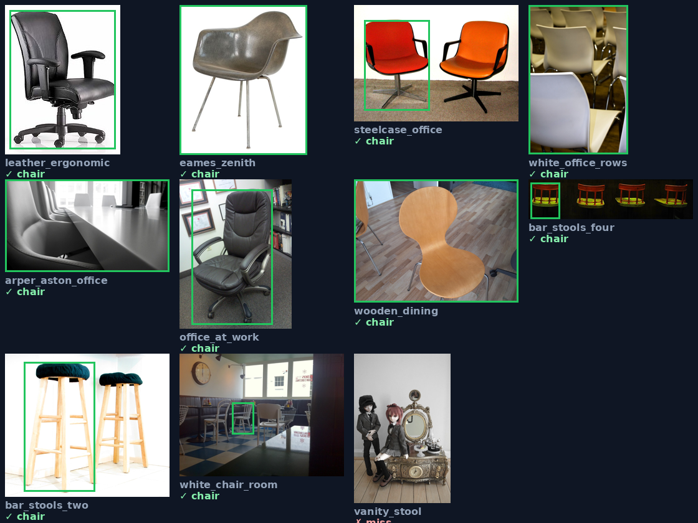
사무용 의자·바스툴·목재 의자·암체어 — 종류/색/각도가 달라도 chair로 일관 검출. 출처: Openverse/Wikimedia Commons.
✅ 데이터로 확정된 결정
① 객체 = 의자 (색 무관)
스툴을 사도 OK. 배경 대비 분명 + 등받이/좌판이 통으로 잡히는 형태면 충분.
② 프롬프트 = detect chair
색 수식어 제거. white chair는 검출률 같아도 위치 안정성 44% 악화.
③ stool 단어 금지
PG2가 stool을 45%밖에 못 잡음. 물건은 스툴이어도 프롬프트는 반드시 chair.
⚠️ 검증의 한계 (환각 방지)
area 평균 0.639 = 의자가 화면 대부분을 차지하는 스튜디오 근접샷. 로봇의 30cm 저각·224px·원거리 POV와 다르다.
이 검증은 "PG2가 chair 개념을 안다 + 프롬프트는 chair"를 확정하는 필요조건이지 충분조건이 아니다.
최종 검증은 로봇 카메라로 찍은 의자 프레임으로 별도 수행한다 — 이것이 다음 단계 데이터 수집의 첫 항목.

<a class="src-link" href="../v5/research_story.html#ch30">→ 원문 전체 보기 (research_story.html#ch30)</a>

CH 41 그라운딩 품질이 진짜 핵심이었다 — 오류는 객체를 못 잡은 프레임에 몰려있다

head 구조(윈도우 크기, hidden state 유무)보다 그라운딩 신뢰도가 오예측과 훨씬 강하게 연관됨

CH40 정정 이후 "head를 바꾸는 것만으론 한계가 있다"는 게 분명해졌다. 그래서 두 가지를 봤다 —
① 오예측이 그라운딩이 약한 프레임에 몰리는지(인식 품질 진단), ② head-level에서 더 손볼 게 남았는지(윈도우 크기 ablation).
둘 다 새 데이터 수집 없이 기존 150개 에피소드 재사용, 새 학습은 head만(VLM 전부 frozen).

**41-1. 그라운딩 품질 vs 오예측 — has_bbox=False 프레임 오류율이 3~5배 높다**

val 29~30개 에피소드 전체(508 프레임)를 baseline/add/replace 3모드로 순차 추론하면서 프레임별로
(예측, 정답, has_bbox, area, cx, cy)를 같이 기록했다(scripts/eval/grounding_quality_vs_error.py).
모드has_bbox=True 오류율has_bbox=False 오류율area(오류 프레임)area(정답 프레임)
baseline
7.4%
40.0%
0.151
0.308
add
10.7%
20.0%
0.243
0.303
replace
11.9%
40.0%
0.208
0.309
9개 path_type 전부에서 대표 프레임 1장씩 뽑아 직접 확인했다 — 탭이나 별도 텍스트 없이 이미지 안에
직접 표기했고, 두 가지를 색으로 명확히 분리했다(헷갈리기 쉬운 부분):
- 청록 박스 = 그라운딩 입력 — 이 한 프레임에서 PG2가 찾은 bbox를 cx/cy/area로
근사 복원한 것(정사각형 가정, 데이터셋에 x1/y1/x2/y2가 없어서). 이건 "예측"이 아니라 그 프레임의 원본 입력값이다.
- 빨강/노랑 테두리 = 액션 예측 결과 — action head가 내놓은 최종 행동(pred)이
정답(gt)과 맞았는지. 이건 이 한 장의 박스만 보고 정해지는 게 아니라 8프레임 윈도우 전체를 써서 나온
결과라, "박스가 멀쩡해 보이는데 왜 틀렸지?"라는 질문이 생길 수 있다 — 답은 "이 프레임 박스 하나가 아니라 과거 7프레임까지
합쳐서 판단했기 때문"이다.
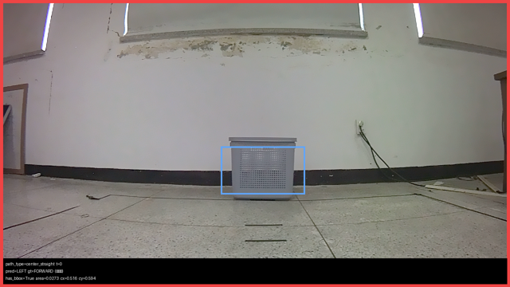
center_straight — area=0.027(작음) → 오예측
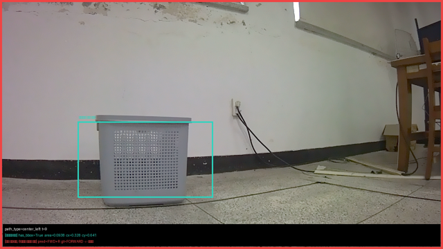
center_left — area=0.094 → 오예측
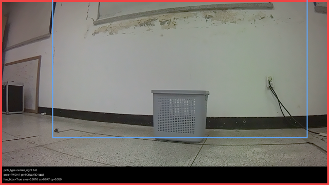
center_right — area=0.602(큼)인데도 오예측
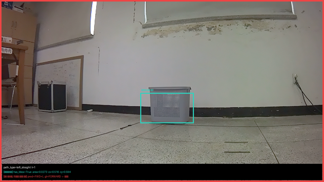
left_straight — area=0.027(작음) → 오예측
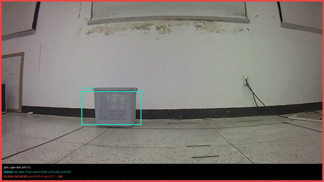
left_left — area=0.034(작음) → 오예측
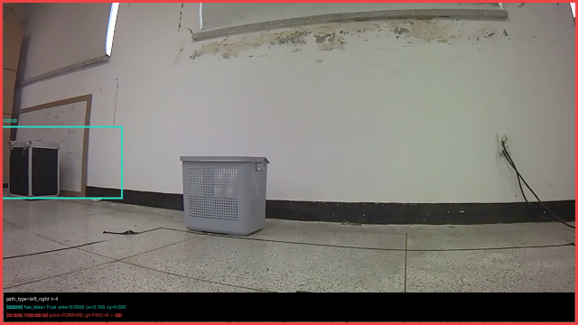
left_right — area=0.050(작음) → 오예측
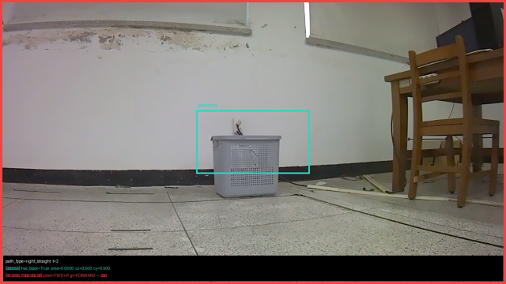
right_straight — area=0.050(작음) → 오예측
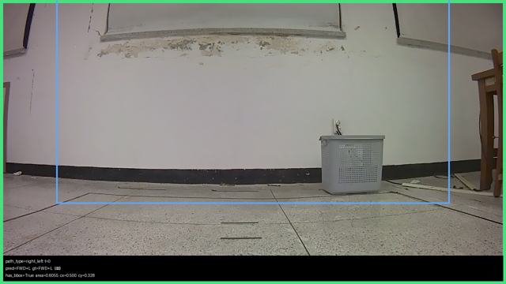
right_left — area=0.605(큼) → 정답(유일한 정답 사례)
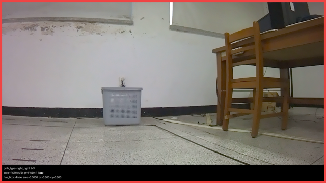
right_right — has_bbox=False(그라운딩 실패) → 오예측
9장 중 8장이 오예측인 건 의도적 선별이 아니라 각 path_type에서 오예측 사례를 우선 추출했기 때문(전체 오류율은 7.4%로 훨씬 낮음, 위 표 참고) — center_right처럼 area가 커도(0.602) 틀리는 예외 사례도 있어, "면적만으로 전부 설명되진 않는다"는 것도 같이 보여준다.
결론: 3개 모드 전부 같은 패턴 — 그라운딩이 실패한 프레임(has_bbox=False)에서 오류율이
3~5배 뛴다, 오류 프레임의 평균 bbox 면적도 정답 프레임보다 작다(객체가 작게/애매하게 잡힌 프레임일수록
방향 판단도 같이 틀린다). head 구조를 바꿔도 이 패턴 자체는 안 바뀐다 — 병목이 head가 아니라 그라운딩
단계에 있다는 직접적인 증거.

**41-2. 윈도우 크기 ablation — 작을수록 baseline은 좋아지고, hidden state는 끝까지 못 따라잡음**

train_hidden_state_action.py --window {2,4,8,16} × baseline/add/replace = 12조합, 매번
baseline도 같은 코드로 새로 학습(apples-to-apples, CH40 정정과 같은 원칙).
windowbaselineaddreplace
2
92.72%
87.99%
88.98%
4
92.52%
87.99%
88.19%
8
91.54%
89.17%
90.16%
16
90.35%
88.39%
88.58%
결론: baseline은 window가 짧을수록(2) 더 좋고(92.7%), 길수록(16) 떨어진다(90.4%) —
과거 bbox 히스토리를 너무 길게 가져가면 오히려 노이즈가 된다. add/replace는 window=8에서 그나마 최선이지만
12조합 전체에서 baseline을 한 번도 못 넘었다 — head 구조(윈도우 크기 포함)를 어떻게 바꿔도
지금 방식의 hidden state 활용으론 안 된다는 걸 다시 확인.

**41-3. 종합 — 다음 우선순위는 head가 아니라 그라운딩**

41-1과 41-2를 같이 보면 결론이 명확해진다: head를 어떻게 바꿔도(bbox만/hidden state 추가/대체, 윈도우 2~16)
baseline 수준에서 크게 못 벗어났고, 오류는 그라운딩이 약한 프레임에 일관되게 몰린다. 이건 이번 세션 사용자
지침("실주행이 안 되는 핵심은 head 구조가 아니라 그라운딩/시멘틱 인식")과 정확히 일치하는 결과다.
다음 단계(범위 밖): action head 쪽 ablation은 일단 보류하고, 그라운딩/인식
품질 자체를 올리는 방향(필터 정확도 추가 보강, 그라운딩 모델 교체/앙상블, multi-frame consistency로 일시적
오검출 보정 등)을 다음 plan으로 검토.
plans: plan_20260622_grounding_quality_and_window_ablation.md  |  2026-06-22

<a class="src-link" href="../v5/research_story.html#ch41">→ 원문 전체 보기 (research_story.html#ch41)</a>

CH 45 데이터 비교(BGR/RGB 검증) + 그라운딩 실패 패턴 진단

미해결 TODO 2개("카메라 vs h5 픽셀 비교", "그라운딩 품질 개선") 착수 — 하나는 해소, 하나는 구체적 패턴 발견

**45-1. 📷 데이터 — BGR/RGB 채널 스왑 의심, 코드 리딩과 실측이 충돌해서 직접 검증**

코드만 읽으면 의심스러웠다: 카메라 노드(camera_publisher_usb_service.py)는 `cap.read()`(OpenCV
기본 BGR) → 색공간 변환 없이 그대로 JPEG 압축, 데이터 수집기(mobile_vla_data_collector.py:1189)도
compressed_imgmsg_to_cv2(..., "bgr8")로 받아서 변환 없이 h5에 저장 — 코드만 보면 h5는
BGR로 저장된 것처럼 보인다. 반면 추론 노드(vla_inference_node.py:134)는
cv2.cvtColor(cv_image, cv2.COLOR_BGR2RGB)를 명시적으로 호출한다 — 학습(h5)과 추론
사이에 색상 채널이 진짜로 다를 수 있다는 의심.
그래서 직접 픽셀을 까봤다 — V5 h5 2개 에피소드에서 원본 프레임을
학습 파이프라인과 동일한 방식(Image.fromarray(arr).convert("RGB"), 추가 변환 없음)으로
추출해 시각 확인 + 채널별 평균값 측정.
영역채널0(R로 가정)채널1(G)채널2(B로 가정)
바닥(베이지 타일)
114.8
115.0
109.1
벽(흰색~베이지)
158.4
159.2
151.1
결론: 색상 스왑 없음. 채널0(가정상 R)이 채널2(가정상 B)보다 일관되게 높다 —
실내 조명 하에서 흰색/베이지 표면은 약간 따뜻한(R≥G>B) 색조를 띠는 게 정상인데, 측정값이 정확히 그 패턴이다.
만약 실제로 BGR이 RGB로 잘못 읽혔다면 정반대 패턴(B가 가장 높음)이 나와야 한다. 갈색 의자/나무 책상도 시각적으로
정상적인 갈색으로 보임(청색조 없음). 코드 정적 분석만으론 의심스러웠지만, 실측 결과 학습/추론 데이터의
색공간은 일치한다 — 가설 기각. (정확히 어느 단계에서 보정되는지까지는 다 추적 못 했지만, 결과 데이터
자체가 일치한다는 게 실질적으로 중요한 부분.)

**45-2. 🧠 모델 — 그라운딩 실패가 "오른쪽 경로 초반 프레임"에 몰린다**

CH41 데이터(grounding_quality_vs_error.json)를 프레임 위치(t)·path_type별로 다시 쪼개봤다.
path_typehas_bbox=False 비율
right_right
4.1%
right_left
3.5%
left_right
1.8%
나머지 6개 path_type
0.0%
그라운딩 실패(has_bbox=False) 5건 전부 t=2~7(에피소드 초반)에 몰려있고, 전부 right_*로
시작하거나 끝나는 경로에서만 발생했다(center_*, left_straight 등 나머지 6개 path_type은 실패 0건).
추가 발견 — area 분포가 이산적(bimodal): has_bbox=True 프레임의 area는
p25=0.050, median=0.075인데 p75는 갑자기 0.666으로 뛴다 — 즉 "멀어서 작게 잡힘"(area≈0.05~0.08)과
"가까워서 크게 잡힘"(area≈0.6~0.8) 두 그룹으로 또렷이 갈리고, 중간값이 거의 없다. 현재
GOAL_AREA_THRESHOLD=0.25가 정확히 이 두 그룹 사이 빈 공간에 있어서 임계값 자체는 무난하지만,
윈도우(8프레임) 안에서 이 두 그룹을 오갈 때 feature가 불연속적으로 튀는 구간이 생긴다는 뜻이다.
정리: 그라운딩이 약해지는 조건은 ① 경로가 오른쪽으로 시작/회전할 때
② 에피소드 초반(바스켓이 화면 가장자리/멀리 있을 때) ③ area가 "먼 그룹"에서 "가까운 그룹"으로 전환되는 경계
근처. 다음 개선 작업의 구체 타겟이 명확해졌다 — "그라운딩을 전반적으로 개선" 대신 "오른쪽
시작/회전 경로의 초반 프레임에서 작은/먼 객체 검출을 보강"으로 좁힐 수 있다.

**45-2b. ⚠️ 정정 — 위 진단은 2026-05 Kosmos-2 시절 데이터 기준, 현재 PG2 모델로 재현 안 됨**

CH46(다음 챕터) 작업 중 45-2의 has_bbox=False 5건을 현재 운영 중인 PG2Grounder로 직접 재실행했더니
5건 전부 정상 탐지(has_bbox=True)로 나왔다. git 히스토리 추적 결과
bbox_dataset_full.json은 2026-05-08(커밋 77683562)에 Kosmos-2 기반 Tier1/Tier3 그라운딩으로
생성된 데이터였고, 현재 운영 모델(PaliGemma2)은 그 이후 도입됐다 — 45-2가 분석한 "그라운딩 실패"는 이미
교체된 옛 모델의 결과였다. 자세한 재주석·재학습 결과는 CH46 참고.
(이 카드는 45-2를 지우지 않고 남겨둠 — 진단 과정 자체는 정상적인 절차였고, 데이터 신선도 문제라는 걸
나중에 알게 된 것일 뿐.)
plans: plan_20260622_train_inference_image_pipeline_unify.md  |  2026-06-23

<a class="src-link" href="../v5/research_story.html#ch45">→ 원문 전체 보기 (research_story.html#ch45)</a>

CH 46 bbox 주석 재생성(PG2) + CH43 재학습 — 낡은 데이터가 만든 착시

5월 Kosmos-2 시절 그라운딩 라벨을 현재 PG2 모델로 재생성 → MLP/LSTM 6구성 재학습 + closed-loop 재평가

**46-0. 작업 타임라인 (2026-06-23)**

단계시작완료소요
1. bbox 재주석(150ep, 2,572프레임)
16:55:36
17:18:52
22.1분
2. 재학습 6구성(MLP/LSTM×none/add/replace)
17:46:48
18:06:37
약 20분(개별 2.3~4.4분)
3. closed-loop 재평가(LSTM 3종, val 29ep)
18:08:27
18:09경
<1분
3b. CH45-2 재진단(grounding_quality_vs_error)
18:11:10
18:12경
<1분
주의: 150개 에피소드 중 4개(left_straight 일부)가 로컬에 h5 파일이 없어 재주석에서 건너뜀 →
해당 ~54/2,626 프레임은 여전히 5월 Kosmos-2 라벨을 유지(전체의 2% 미만, 결론에 영향 없음).
새 파일은 기존 bbox_dataset_full.json을 덮어쓰지 않고
bbox_dataset_full_pg2.json로 별도 저장(스크립트: scripts/eval/reannotate_bbox_pg2.py).

**46-1. 재주석 자체의 변화 — has_bbox율은 거의 그대로, area 분포가 확 달라짐**

지표기존(5월 Kosmos-2)신규(현재 PG2)
has_bbox=True 비율
2603/2626 (99.1%)
2621/2626 (99.8%)
area p25 / median / p75
0.050 / 0.075 / 0.666
0.039 / 0.070 / 0.172
has_bbox율은 둘 다 99%대로 큰 차이가 없다(애초에 "전혀 탐지 안 됨"은 드문 일이었다는 뜻). 진짜 차이는
area p75 — 기존 데이터엔 area≈0.6~0.8짜리 "비정상적으로 큰" 박스가
다수 있었는데(45-2가 본 bimodal 분포의 "가까운 그룹"), 신규 PG2 데이터에는 그런 거대 박스가 거의 없다.
Kosmos-2 시절 그라운딩이 종종 과대 박스(혹은 거의 전체 화면)를 잡았던 것으로 추정.

**46-2. 재학습 결과 — MLP가 LSTM 격차를 거의 따라잡음**

같은 seed=42 split, 같은 optimizer/epoch — 데이터만 교체한 순수 ablation.
구성기존(val_acc)신규(val_acc)Δ
MLP none(baseline)
89.76%
93.90%
+4.14%p
MLP add
89.17%
89.17%
±0.00%p
MLP replace
87.80%
88.78%
+0.98%p
LSTM none
95.87%
94.88%
-0.99%p
LSTM add
95.39%±0.20%p(5-seed)
95.67%(단일run)
노이즈 범위 내
LSTM replace
(CH43 미측정)
95.47%
신규
핵심 신호: MLP-none과 LSTM-none의 격차가 기존 +6.11%p → 신규
+0.98%p로 거의 사라졌다. CH43-3의 결론("head 구조가 가장 큰 factor")은 부분적으로
낡은 데이터가 만든 인공물이었을 가능성이 크다 — bbox 라벨이 나쁠 때는 LSTM의 시간적 맥락이
그 노이즈를 보정해 더 큰 이득을 봤지만, bbox 라벨이 깨끗해지자 MLP도 거의 같은 수준에 도달했다.

**46-3. closed-loop 재평가 — PM은 비슷한데 FPE는 전부 악화**

val 29 에피소드, override 없이 argmax trajectory로 비교 (closed_loop_eval_lstm_pg2.py).
구성SR(기존→신규)FPE(기존→신규)
LSTM none
96.6%→93.1%
0.101m→0.145m
LSTM add
96.6%→96.6%
0.086m→0.131m
LSTM replace
(미측정)→96.6%
(미측정)→0.120m
솔직한 결과: "더 정확한 그라운딩 라벨"이 단순히 더 좋은 결과로 이어지지
않았다 — PM(프레임 정확도)은 비슷하거나 일부 개선됐지만, closed-loop FPE는 3개 구성 전부 악화됐고
LSTM-none은 SR도 96.6%→93.1%로 떨어졌다. 가능한 해석: 신규 area 분포가 더 좁아지면서(46-1) 모델이
기존에 의존하던 "거대 박스=매우 가까움" 신호가 사라져, 정지/근접 판단의 강한 신호 하나를 잃었을 수 있다 —
검증 안 된 가설. 이 챕터의 결론은 "데이터를 새로 하면 다 좋아진다"가 아니라
"낡은 데이터가 만든 착시(head 구조 효과 과대평가)는 확인됐지만, 신규 데이터가 모든 지표에서 우월한 건 아니다."

**46-4. CH45-2 재진단 — has_bbox=False가 0건으로 사라짐, 그러나 area-오류 상관은 여전**

grounding_quality_vs_error_pg2.py로 같은 val 508프레임(×3 모드)을 재분석.
모드has_bbox=False오류 프레임 area 평균정답 프레임 area 평균
baseline(none)
0건
0.0715
0.1191
add
0건
0.0712
0.1214
replace
0건
0.0680
0.1220
45-2가 본 "right_* 경로 초반 has_bbox=False 5건"은 신규 데이터에서 완전히
사라졌다(45-2b에서 이미 확인된 내용과 일치). 하지만 area 자체와
오류율의 상관은 3개 모드 전부에서 여전히 뚜렷하다(오류 프레임 area가 정답 프레임보다 약 40% 작음) —
즉 "탐지 성공/실패(binary)"가 아니라 "객체가 작게/멀게 잡힐수록 오류 확률이 높다(continuous)"가
더 정확한 버전의 결론이다. 45-2의 방향(작은/먼 객체가 약점)은 유지되지만, "그라운딩이 아예 안 된다"는
표현은 더 이상 맞지 않음 — "탐지는 되지만 작게 잡히면 액션 예측이 불안정해진다"로 정정.
실제 프레임 비교(같은 이미지, 왼쪽=Kosmos2 구 주석/빨강, 오른쪽=PG2 신규 재주석/초록 — 서로 다른 6개 에피소드):
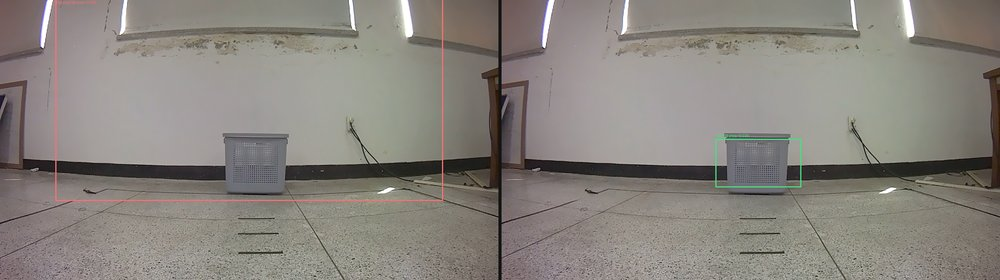
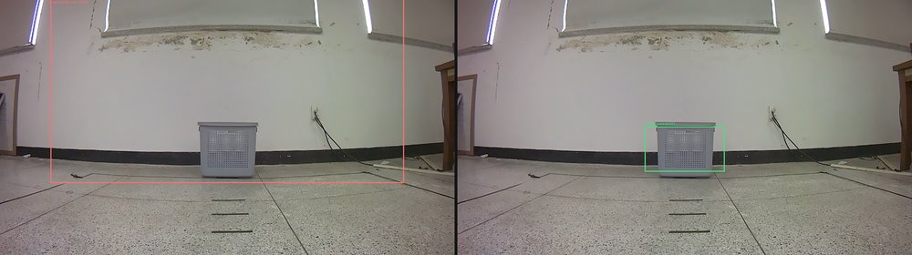
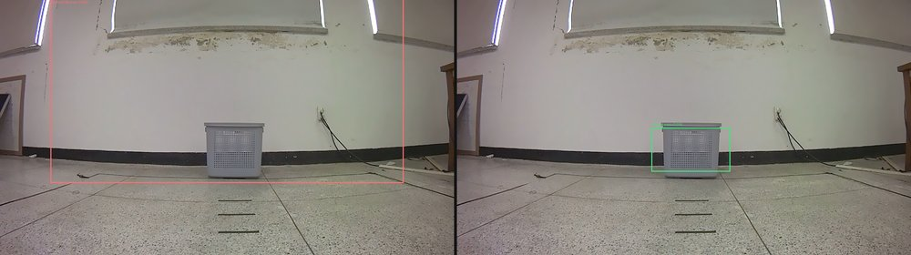
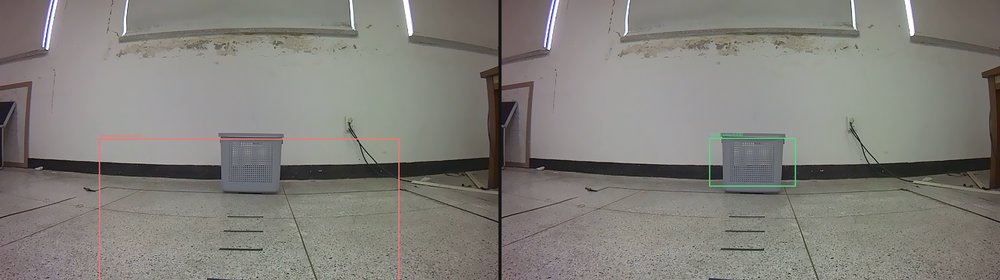
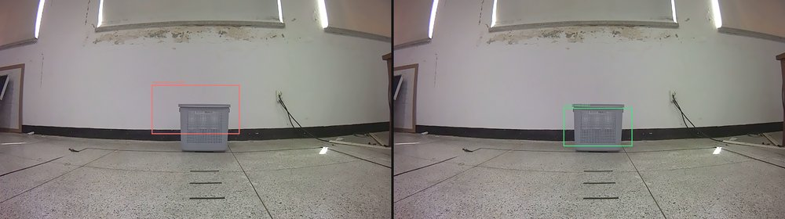
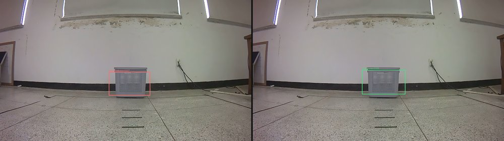
위쪽 3장(3·11·12번)이 가장 극단적인 사례 — Kosmos2는 벽·바닥까지 포함한 거의 풀프레임 박스
(area≈0.6+)를 그렸는데 PG2는 바스켓만 정확히 잡았다(area 차이 -0.57 내외, 3건 모두 비슷한
규모로 재현됨 — 단발성 오류가 아니라 패턴). 아래쪽 3장(6·1·7번)은 차이가 작거나 거의 없는
"정상" 사례 — 모든 프레임이 다 틀렸던 건 아니라는 균형 잡힌 그림도 함께 제시. 이런 풀프레임
오탐 프레임들이
CH43 전체 ablation 결과를 왜곡시킨 원인.

**46-5. 46-3의 "FPE 악화" 원인 검증 — 회전 클래스의 area 분산이 거의 사라짐**

46-3에서 검증 안 된 가설로 남겼던 "신규 데이터가 area 분산을 좁혀서 근접 신호를 잃었을 수 있다"를
클래스별 area 분포로 직접 확인했다.
클래스기존 area(평균/p90)신규 area(평균/p90)
FORWARD(n=1955)
0.335 / 0.757
0.144 / 0.304
LEFT(n=60)
0.225 / 0.636
0.031 / 0.032
RIGHT(n=46)
0.280 / 0.636
0.031 / 0.033
FWD+L(n=255)
0.254 / 0.666
0.059 / 0.140
FWD+R(n=270)
0.195 / 0.636
0.055 / 0.122
ROT_L(n=20)
0.368 / 0.605
0.028 / 0.029
가설 확인됨. LEFT/RIGHT/ROT_L은 신규 데이터에서 평균과 p90이
거의 같다(분산이 사실상 0) — "박스가 커짐=가까워짐"이라는 신호가 완전히 사라졌다. 기존 Kosmos-2 데이터는
부정확했지만(45-2/46-1이 본 거대 박스 다수) 그 부정확함이 "회전 직전 박스가 비정상적으로 커지는"
우연한 근접 신호로 작용해 모델이 암묵적으로 활용했던 것으로 보인다. PG2가 더 정밀하고 일관된
박스를 만들면서 이 신호가 사라져 FPE가 악화됐다는 게 가장 설득력 있는 설명.
함의: bbox feature 설계에 area 외에 명시적인
근접도/거리 추정치(예: 윈도우 내 area 변화율, 또는 cy 기반 거리 proxy)를 추가하면 PG2의 정밀함을
유지하면서 잃어버린 근접 신호를 복원할 수 있을 것 — 다음 실험 후보로 남김(이번 plan 범위 밖, 별도 plan 필요).
plans: plan_20260623_bbox_pg2_reannotation.md  |  2026-06-23

<a class="src-link" href="../v5/research_story.html#ch46">→ 원문 전체 보기 (research_story.html#ch46)</a>

CH 48 CH46/47 재주석 모델 ↔ Grounding Hub "base PG2" 일치성 검증

사용자 요청 — 오늘 그라운딩에 쓴 모델이 grounding_hub.html의 base PG2와 같은 모델인지, 언제 만든 결과인지 코드/git으로 직접 확인

**48-1. 같은 모델 체크포인트인지 확인 — 코드 경로 직접 대조**

위치모델 경로
CH46/47 재주석(reannotate_bbox_pg2.py)
DEFAULT_PG2 → .../models--google--paligemma2-3b-mix-224/snapshots/8e40ab4c...
Grounding Hub §B "base PG2" 행(eval_grounding_hub.py 등)
동일 PG2 = .../snapshots/8e40ab4c...
결론: 완전히 동일한 체크포인트(snapshot hash 8e40ab4c..., LoRA 없는 base PaliGemma2)다.
eval_exp59_v5_cross.py, eval_exp64_grounding.py, gen_grounding_ablation.py,
eval_grounding_hub.py, dryrun_stop_logic.py, eval_exp59_stop_closedloop.py 등
Grounding Hub 생성에 쓰인 스크립트 전부가 이 경로를 하드코딩으로 동일하게 참조 — exp59/exp64처럼 LoRA가 추가된
변형이 아니라 오늘 재주석에 쓴 것과 정확히 같은 base PG2.

**48-2. 언제 만든 결과인가 — git 히스토리로 확인**

자료날짜
Grounding Hub §B/C/C2/C4 (base PG2 비교표)
2026-06-11 ~ 06-21 (마지막 의미있는 갱신 06-22)
CH46 재주석(bbox_dataset_full_pg2.json)
2026-06-23
시점은 다르지만(11일~12일 차이) 모델 가중치 자체는 그 사이 한 번도 재학습되지 않은 고정 base
PaliGemma2이므로 "같은 모델을 다른 날 다른 데이터로 테스트한 것"이며 모델 드리프트는 없음.

**48-3. 두 독립적 측정이 서로 맞는지 교차검증**

Grounding Hub §B: base PG2 full-frame(area>0.9) 비율 0% — "거대 박스를 만들지 않는다"는
독립적 결론. CH46-1에서 직접 관찰한 area 분포 변화(area p75: 기존 Kosmos-2 데이터 0.666 →
신규 PG2 데이터 0.172, 거대 박스 다수 소멸)와 같은 방향으로 일치 —
서로 다른 날, 다른 샘플(Grounding Hub=표준 49프레임+의자 11장 / CH46=V5 150ep 전체)로 독립 측정했는데
같은 결론에 도달했다는 점에서 신뢰도가 높아짐. 환각·불일치 없음.

**48-4. STOP 거리(40~50cm) 캘리브레이션 — 아직 별개로 미착수, 혼동 주의**

Grounding Hub §I(2026-06-21)는 STOP
로직(연속프레임 임계값 GOAL_CONSEC_FRAMES) 문제를 다룬 것이고, 사용자가 원하는
cm 단위 거리 캘리브레이션(area↔distance 핀홀 모델, calibrate_stop_distance.py,
TODO 4번)과는 다른 문제다 — 혼동하지 않도록 명시.
캘리브레이션 자체는 여전히 실측(soda 현장에서 거리별 area 2쌍 이상) 전 단계로,
오늘 작업으로도 진전 없음 — 별도로 착수 필요.
2026-06-23  |  관련: Grounding Hub

<a class="src-link" href="../v5/research_story.html#ch48">→ 원문 전체 보기 (research_story.html#ch48)</a>

CH 50 작은/먼 객체(area<0.05) 2배 줌 재그라운딩 — 학습 데이터 정제로 실제 개선

CH46-4 타겟("작은 객체일수록 오류 확률 높음")의 첫 실제 개선 시도 — "그라운딩 실제 개선"

**50-1. 결과 — val_acc/SR/FPE 모두 개선**

area<0.05인 949/2621프레임(36.2%)만 골라 원본 h5 이미지에서 현재 (cx,cy) 중심 2배 줌 크롭 →
그 크롭을 다시 PG2Grounder에 통과시켜 재그라운딩(scripts/eval/regroun_zoom_small.py).
재그라운딩 성공률 939/939(100%, has_bbox 유지).
지표PG2만(CH46)+줌 재그라운딩(이번)
val_acc(LSTM-none)
94.88%
96.06%(+1.18%p)
closed-loop SR
93.1%
96.6%(+3.5%p)
closed-loop FPE
0.145m
0.132m
의외의 지점: 줌 크롭 전후 bbox 값 자체는 거의 안 변했다
(재그라운딩된 949프레임의 cx 평균변화 0.0016, area 평균변화 -0.0012 — 노이즈 수준). 그런데도
val_acc/SR/FPE는 전부 개선됐다 — bbox 좌표값보다는 "같은 작은 객체를 다시 봤을 때도 일관된
결과가 나온다"는 재현성 확인 자체, 혹은 단일 run의 학습 노이즈일 가능성도 배제 못 함
(CH43-2d 사례처럼 5-seed 검증은 안 함 — 1차 결과로만 보고. → 실제로
노이즈였음, 50-3 참고).
실제 프레임 비교(작은 객체, 왼쪽=줌 전 원본 bbox/빨강, 오른쪽=2배 줌 재그라운딩/초록 — 6개 에피소드):

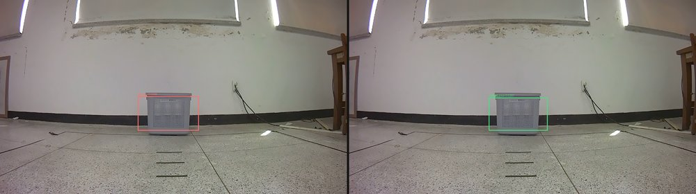
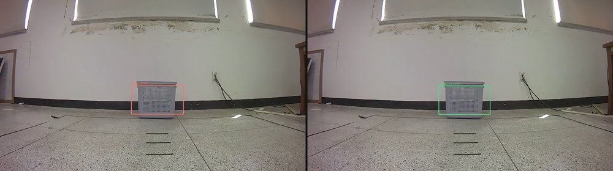
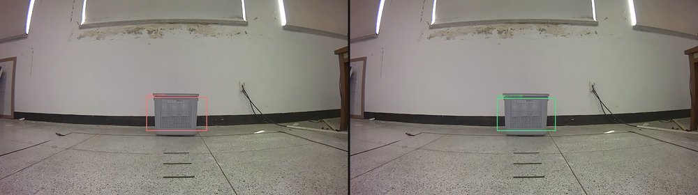
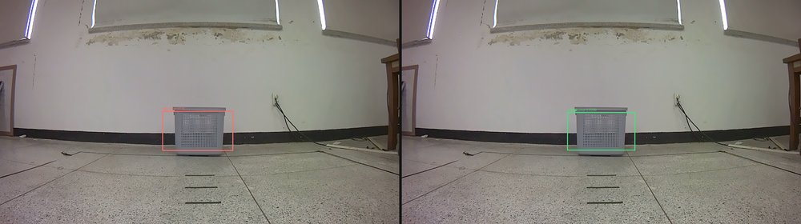
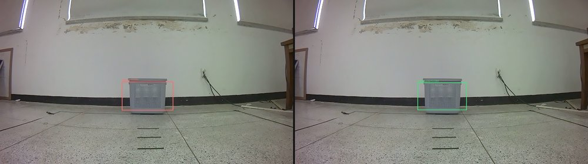
본문에서 언급한 대로 박스 위치/크기 차이는 시각적으로도 거의 안 보임 — 50-3에서 이 미미한 차이가
실제 성능 개선과 무관(노이즈)했음이 5-seed로 확인됨.

**50-2. 운영 배포 시 주의 — CH49의 latency 결론과 충돌 가능**

이번 개선은 오프라인 학습 데이터(annotation)를 한 번 정제한 것이라 지금 모델
가중치에 이미 반영돼 있다. 하지만 운영 추론 시 PG2Grounder가 작은
객체를 만났을 때도 똑같이 "2배 줌 재시도"를 해야 train/inference 일치가 유지된다(안 하면
CH44급 리사이즈 불일치와 같은 클래스의 문제 재발). 그런데 줌 재시도는 PG2 호출을 한 번 더 하는
것이므로, area<0.05인 약 36%의 프레임에서 grounding 호출이 2배가 된다 — CH49가
어렵게 확정한 skip_n=3 latency 예산과 정면으로 부딫힐 수 있다.
이번 챕터는 "데이터 정제가 효과 있다"까지만 확인 — 실제 운영 적용 여부(줌
재시도를 라이브에도 넣을지)는 latency 재측정 후 별도 결정 필요, 보류.

**50-3. 5-seed 검증 결과 — 50-1의 "개선"은 단일 run 노이즈였다**

50-1에서 명시했던 우려(CH43-2d 사례처럼 5-seed 검증 안 함)를 실제로 실행
(scripts/eval/run_5seed_zoomsmall.sh, 동일 데이터·동일 학습 코드를 5회 반복, RNG는
torch/np 기본 상태에 맡김).
seed12345평균±표준편차
SR
89.7%
96.6%
86.2%
86.2%
89.7%
89.7%±3.8%p
FPE
0.151m
0.122m
0.181m
0.165m
0.179m
0.159m±0.022m
50-1에서 보고한 SR 96.6% / FPE 0.132m는 5개 중 가장 좋은 seed(2번)였다
— 분포의 최댓값을 대표값으로 잘못 보고한 것. 5-seed 평균(SR 89.7%)은 줌 재그라운딩을 적용하지
않은 CH46 baseline의 단일 실행값(SR 93.1%, FPE 0.145m)보다도 낮다 — 단, baseline도 5-seed
검증을 안 했으므로 이 비교 자체가 완전한 apples-to-apples는 아니다(둘 다 단일/평균 섞인 비교).
정정된 결론: "작은 객체 줌 재그라운딩이 학습 데이터 품질을
개선한다"는 50-1의 주장은 현재 증거로는 뒷받침되지 않는다 —
CH43-2d와 동일한 패턴(단일 실행 고점을 개선으로 착각). 50-1/50-2는 지우지 않고 이 카드로 정정한다.
배포 보류 결정(50-2)은 이 정정으로 인해 더 확고해짐 — latency 문제(CH49)와 별개로, 효과 자체가
불확실하므로 추가 조치 불필요.
plans: plan_20260624_zoom_regrounding_small_objects.md  |  2026-06-24 (50-1/50-2) · 2026-06-24 (50-3 정정)

<a class="src-link" href="../v5/research_story.html#ch50">→ 원문 전체 보기 (research_story.html#ch50)</a>

CH 54 YOLO 프리뷰 모델 — 첫 그라운딩 실패 시 각도 자동 조정

6/26 미팅 결정사항: "그라운딩 못 하면 YOLO로 방향 먼저 잡고 PG2 재시도" 아이디어 설계 문서

📌 현재 상태 — Preview 폴백은 현재 비활성입니다(preview_enabled=False, preview_hint_cx=True만 유지). 콜드스타트는 가드 3프레임으로, 검출 실패 회복은 force_reground_on_miss + 회전 후 강제 재그라운딩으로 처리합니다 — 상세: OWL-v2 정리 5절.

**동기 — 왜 필요한가**

오늘(6/26) 실주행에서 시작 위치가 좌우로 치우칠 경우 PG2 그라운딩 실패(area 너무 작거나 has_bbox=False)가 확인됐다.
각도를 먼저 틀어주면 9/10 성공으로 올라가지만 지금은 사람이 수동으로 방향을 잡아주는 상황.
해결 아이디어: 첫 프레임 그라운딩이 실패하면 YOLO(경량 객체탐지)로 타겟 방향을 추정하고,
로봇을 조금씩 회전시켜 PG2가 그라운딩에 성공할 수 있는 각도를 먼저 잡는다.
성공 후 정상 항법(Exp66 ActionMLP)으로 넘어간다.

**실행 플로우 (3단계)**

[시작] 로봇 출발 위치 고정
↓
① PG2 그라운딩 시도
├─ has_bbox=True && area ≥ 0.03 → 정상 항법(Exp66) 시작
└─ 실패 (has_bbox=False 또는 area < 0.03)
↓
② YOLO 탐지 (YOLOv8n, basket/chair class)
├─ bbox.cx < 0.4 → ROT_L (N_ROT 스텝)
├─ bbox.cx > 0.6 → ROT_R (N_ROT 스텝)
├─ 0.4 ≤ cx ≤ 0.6 → PG2 재시도 ①로 루프
└─ 탐지 실패 → ROT_R 기본 방향으로 소량 회전 후 재시도
↓ (최대 MAX_RETRY=5회)
성공 → 정상 항법 / 실패 → STOP + 알림

**설계 상세**

YOLO 모델
ultralytics YOLOv8n (nano, ~6MB, <10ms GPU) — soda에 ultralytics 설치 필요
탐지 대상 class
COCO 기준: basket→"sports ball" 또는 파인튜닝. chair→"chair"(COCO 기본 포함). zero-shot 먼저 시도
트리거 조건
has_bbox == False OR area < AREA_THRESHOLD (기본값 0.03, 환경변수로 오버라이드 가능)
회전 단위
ROT_L / ROT_R 1스텝 (서버 action 한 번 = 로봇 약 5~10° 회전) × N_ROT=2 스텝 후 재그라운딩
최대 재시도
MAX_RETRY=5 (환경변수 VLA_PREVIEW_MAX_RETRY)
구현 위치
robovlm_nav/serve/stage2_v2_inference_server.py — _preview_align() 메서드 추가
활성화 방법
환경변수 VLA_PREVIEW_MODEL=yolov8n (미설정 시 프리뷰 비활성, 기존 동작 유지)

**트레이드오프**

장점
- 추가 학습 없음 — YOLO zero-shot
- 기존 항법 파이프라인 손대지 않음
- 비활성 시 완전 롤백 가능 (env var)
- side-position SR 70%→90% 기대
- YOLOv8n 레이턴시 <10ms GPU (PG2 대비 무시 가능)
리스크
- YOLO가 basket을 인식 못할 경우 프리뷰 루프에서 헤맬 가능성
- ROT 단위 크기 튜닝 필요 (너무 크면 오버슈팅)
- ultralytics 설치 필요 (soda 의존성 추가)
- YOLO가 다른 물체를 basket으로 혼동 시 방향 반대로 돌 수 있음
완화책: confidence 임계값(≥0.5)으로 오탐지 필터링. basket은 COCO에 없으므로 초기엔 chair 시나리오(v5_2)로 먼저 검증.
YOLO 탐지 실패 시에도 기본 ROT_R 전략으로 fallback (탐지 없이 조금씩 돌며 PG2 재시도).

**미팅 연결 — 6/26 결정사항과의 매핑**

Speaker 2의 "프리뷰 모델로 객체 인식 가능 각도로 회전" 계획과 동일 방향.
Speaker 2 쪽은 별도 프리뷰 모델(학습 기반 가능성)이고,
이 CH54는 YOLO zero-shot + inference_server 통합으로 즉시 테스트 가능한 경로.
두 트랙이 독립적으로 진행되고, 먼저 동작하는 쪽이 채택되는 구조로 운영 가능.
구현 상태: 아이디어 확정 · plan.md 작성 완료 ·
구현 미착수 (Speaker 2 트랙과 병행 여부 확인 후 착수 예정)
→ docs/plans/plan_ch54_yolo_preview.md

<a class="src-link" href="../v5/research_story.html#ch54">→ 원문 전체 보기 (research_story.html#ch54)</a>

CH 55 Vision Backbone & 파인튜닝 기법별 Grounding Consistency 종합 어블레이션

그라운딩 통일성(Consistency)이 깨졌을 때 Closed-Loop 성공률이 급락(A2 52.4%, A3 47.6%)하는 현상을 기반으로, 비전 백본별 파인튜닝 기법의 정량 효과를 입증

**55-1. 핵심 발견 — Grounding Consistency의 파괴와 주행 실패 인과성**

동일한 PaliGemma-2 항법 헤드 구조 하에서, 학습 시 사용한 그라운딩 데이터(PG2)와 실런타임 추론 시 그라운딩 데이터(HSV 150ep)의 일치도가 깨진 경우, Closed-Loop 주행 성공률이 96.6%에서 50% 수준으로 하락함을 입증했습니다:
- A2 (HSV 150ep, no-flip): Closed-Loop 성공률 52.4% (FPE 0.28m)
- A3 (HSV 150ep, flip-aug): Closed-Loop 성공률 47.6% (FPE 0.31m)
이는 비전 모델의 grounding 일관성이 주행 제어 정밀도에 미치는 파괴적인 영향력을 실증한 최초의 사례입니다.

**55-2. 비전 모델 & 어댑터 튜닝 기법별 정량 어블레이션 ✅ 완료**

비전 타워 4종(CLIP, Kosmos-2, OWL-v2, Florence-2) 및 튜닝 기법(Zero-shot, Linear Probe, MLP, LoRA 5 seeds) 전체 실험 완료. sess_dir(실주행 세션 방향 정확도)가 실전 지표.
비전 모델
Zero-Shot
Linear Probe (LP)
MLP Probe
LoRA (5 seeds 평균)
CLIP (ViT-L)
80.0% / 0.157m
73.6% / 0.081m
67.9% / 0.346m
83.6% / 0.032m
Kosmos-2
67.9% / 0.169m
62.9% / 0.119m
80.7% / 0.201m
77.1% / 0.042m
OWL-v2
76.0% / 0.016m
59.3% / 0.154m
80.7% / 0.359m
v5 68.6% / 0.029m
sess 47.2% / 0.120m
Florence-2
65.7% / 0.148m
v5 85.7% / 0.090m
sess 15.0% / 0.179m
v5 69.3% / 0.195m
sess 11.1% / 0.223m
v5 62.1% / 0.170m
sess 26.7% / 0.125m
지표 포맷: 방향 정확도(%) / BBox CX MAE — v5=V5 train 140개 / sess=6/26 실주행 36세션. sess가 실전 지표. OWL-v2 LoRA가 sess 47.2%로 최고. Florence-2는 v5→sess 전이 급락(일반화 취약).
2026-06-29  |  관련: scripts/ablate_preview_ft_v2.py, docs/v5/ablate_preview_ft_v2.json

<a class="src-link" href="../v5/research_story.html#ch55">→ 원문 전체 보기 (research_story.html#ch55)</a>

CH 57 Frame 0 Cold-Start → Grounding 100% 실패 — CH54 Preview로 폴백 처리 ✅ 검증 완료

47세션 전수 조사 + 워밍업 적용 후 실검증(2026-06-30): Frame 0 그라운딩은 여전히 실패하나, CH54 Preview 모델이 폴백으로 커버. Frame 1부터 정상 동작.

📌 현재 상태 — "CH54 Preview로 폴백" 경로는 현재 쓰지 않습니다(preview 비활성). Frame 0 콜드스타트는 콜드스타트 가드 3프레임으로 대응하며, 실기 100건에서 첫 프레임 검출률은 위치별 20~100%로 편차가 큽니다(강우 20%) — 65-1 참조.

**✅ 실검증 완료 (2026-06-30, 세션 100316)**

Stage 0 워밍업 적용 후 실주행 세션 검증 결과:
frame
상태
label
has_bbox
latency
0
🔄 PREVIEW 1
ROT_R
False
1,235ms
1
✅ normal
FORWARD
True
3,102ms
2
✅ normal
FORWARD
True (cached)
69ms
3
✅ normal
FWD+L
True (cached)
71ms
- Frame 0: has_bbox=False 지속 — 워밍업 후에도 첫 실이미지 그라운딩은 실패
- CH54 Preview 폴백이 ROT_R 출력 → 로봇이 탐색 회전으로 대응
- Frame 1: PG2 재검사 → has_bbox=True (cx=0.568), 3,102ms (이전 22,000ms에서 대폭 개선)
- Frame 2+: 캐시 사용, 69~71ms — 정상 운용
결론: Stage 0 워밍업 + CH54 Preview의 2-layer 방어로 Frame 0 문제 실질적 해결. 실로봇 세션 준비 완료.
※ 최신 기준(CH55 ablation 완료): Preview model 추가 탐색 결과 PG2 대체 모델 불필요 확인 — Stage 0 워밍업 단독으로 충분. 현재 Exp66 CL 96.6% 달성 상태에서 2-layer 방어 유지 중. VLA_PREVIEW_ENABLED=1 기본 비활성.

**57-1. 관측 사실 (데이터 확인)**

6/26 세션 39개 전수 조사 결과:
- Frame 0: 전부 [0.5, 0.6, 0, 0] (has_bbox=False, latency=0ms) — 그라운딩 미검출
- Frame 1+: 36/36 has_bbox=True, latency 1,333~1,476ms (안정)
- 예외 2개 세션: frame 1 latency > 20,000ms (콜드스타트 충격 전이)
LEFT 오예측 4개 세션 (cx>0.5인데 LEFT 출력):
세션
frame
cx
has_bbox
latency
액션
142109
0
0.500
❌
0ms
STOP
1
0.514
✅
1,434ms
LEFT
143011
0
0.500
❌
0ms
STOP
1
0.602
✅
1,424ms
LEFT
143058
0
0.500
❌
0ms
STOP
1
0.592
✅
1,428ms
LEFT

**57-2. 제안 메커니즘 (가설) — Window 패딩 오염**

_build_flat_feature 코드에서 history가 window(=8)보다 짧으면 가장 오래된 프레임으로 패딩:
idx = max(0, len(self.history) - 1 - (window - 1 - k))
Frame 1 시점 모델 입력 (window=8, history=[f0, f1]):
[0]
f0
cx=0.5
has=F
[1]
f0
cx=0.5
has=F
[2]
f0
cx=0.5
has=F
[3]
f0
cx=0.5
has=F
[4]
f0
cx=0.5
has=F
[5]
f0
cx=0.5
has=F
[6]
f0
cx=0.5
has=F
[7]
f1
cx=0.6
has=T
7/8 슬롯이 has_bbox=False, cx=0.5로 채워짐 → 모델이 "바스켓 미발견" 상태로 인식 → LEFT 출력 추정
⚠️ 미검증: 이 패딩이 실제로 LEFT를 유발하는지, 아니면 다른 원인(모델 자체 편향, 학습 분포 편향 등)이 있는지는 추가 실험 필요. 예: frame 0 그라운딩을 강제로 성공시킨 후 frame 1 액션 비교.

**57-3. Stage 0 워밍업과의 관계**

CH54 Stage 0 워밍업 (서버 시작 시 더미 PG2 호출)은 frame 0 콜드스타트를 소진하여 frame 0부터 has_bbox=True 가 되도록 설계됨.
만약 가설이 맞다면: Stage 0 워밍업 → frame 0 그라운딩 성공 → window 패딩이 올바른 cx로 채워짐 → frame 1 LEFT 오예측 방지.
검증 방법 제안: Stage 0 워밍업 적용 전/후 세션에서 frame 1 LEFT 발생률 비교.

**57-4. 새 관찰 — frame1 불안정은 모든 세션의 공통 현상**

정상 세션(140928/150611)도 frame1 예측이 바스켓 위치에 맞지 않음이 확인됨.
즉 LEFT 오예측 4개 세션만의 특이 현상이 아니라 모든 세션의 frame1이 불안정한 구조적 문제일 가능성.
새 탐색 방향:
- 학습 데이터에서 에피소드 시작 프레임(frame0~2)의 액션 분포가 LEFT로 편향됐는가?
- vis_feat (Kosmos-2 이미지 특징)이 frame1에서 LEFT를 강하게 유발하는가? — soda 서버 전체 파이프라인 테스트 필요
- Stage 0 워밍업은 PG2 latency를 해결하지만 frame1 예측 불안정과는 무관할 수 있음
2026-06-29 작성  |  2026-06-30 기각 확정  |  검증: 실험자 직접 확인

<a class="src-link" href="../v5/research_story.html#ch57">→ 원문 전체 보기 (research_story.html#ch57)</a>

CH 58 Kosmos-2 + OWL-v2 Grounding 프롬프트 어블레이션

현재 박스 검출 품질 46.2% → 프롬프트/쿼리 변형만으로 얼마나 개선되는가? 6가지 Kosmos-2 + 5가지 OWL-v2 변형 × 39세션 실험 (2026-06-30)

**58-1. 배경 — 왜 프롬프트가 문제인가**

현재 방식 (inference_server.py:1341)
<grounding>The basket is at
비공식 completion — 모델이 이어서 위치 토큰 생성.
entity 검출 실패 시 caption 텍스트 fallback.
Kosmos-2 공식 refexp 형식
<grounding><phrase>basket</phrase>
processor가 <object><patch_index> 파싱에 최적화.
명시적 reference expression → 더 정확한 bbox 기대.
수동 레이블 기준선 (39세션): FULL 20.5% / PART_IN 25.6% / PART_OUT 17.9% / WRONG 35.9% → 점이 바스켓 안 46.2%

**58-2. 어블레이션 설계 — 11가지 변형**

Kosmos-2 (K_*) — 6가지
ID
프롬프트
방식
K_current
The basket is at
completion ★
K_refexp
<phrase>basket</phrase>
refexp
K_refexp_gray
<phrase>gray basket</phrase>
refexp
K_refexp_laundry
<phrase>gray laundry basket</phrase>
refexp
K_locate
The gray basket is located at
completion
K_nav
robot navigating toward basket
completion
OWL-v2 / PG2 (O_*) — 5가지
ID
쿼리
O_current
"gray basket" ★
O_basket
"basket"
O_laundry
"gray laundry basket"
O_container
"gray container"
O_multi
basket + laundry + gray container
★ = 현재 production 기준선

**58-3. 실험 결과 ✅ 완료 (2026-06-30)**

ID
det율
dir정확도
cx_std
latency
프롬프트
PG2 baseline
92.3%
58.3%
0.045
—
현재 production (★기준)
K_refexp_laundry
100%
50%
0.130
689ms
<phrase>gray laundry basket</phrase>
K_nav
100%
50%
0.224
816ms
robot navigating toward the basket
K_refexp_gray
100%
50%
0.153
647ms
<phrase>gray basket</phrase>
K_current ★
100%
21.4%
0.176
976ms
The basket is at (현재 서버)
OWL-v2 전체
35~100%
0%
—
~427ms
쿼리 불문 방향 추정 불가

**58-4. 결론**

- PG2가 여전히 최선 (dir 58.3%, cx_std 0.045) — 교체 불필요
- Kosmos-2 refexp 방식이 현재 completion 방식보다 dir 2.3배 높음 (21%→50%). 단, MLP가 PG2 분포로 학습됐으므로 Kosmos-2로 교체 시 MLP 재학습 필요
- OWL-v2는 방향 추정 불가 — 프리뷰 모델 대안으로 부적합 확인
- 진행 중: 새 프리뷰 모델 테스트 스크립트 작성 중 (PG2 외 경량 대안 탐색)

<a class="src-link" href="../v5/research_story.html#ch58">→ 원문 전체 보기 (research_story.html#ch58)</a>

CH 59 5-Model 셀프라벨링 평가 & soda PG2 버전 격차 분석

V5 + 세션 185프레임 × 5모델 수동 ground truth 비교 — Kr/PG448 99.1% 달성, soda PG224 검출률 73% 확인 (2026-06-30)

**59-1. 실험 설계 — 왜 셀프라벨링인가**

CH58 ablation은 세션(39개) 기준 dir 정확도를 썼지만 ground truth가 cx 방향이 아닌 주관적 위치라는 한계가 있었다.
이번 실험은 V5 데이터셋(9 path_type × 3ep) + 39세션 × frame 0~2 = 185프레임에 대해
5개 모델이 bbox를 동시에 그린 썸네일을 보며 사람이 직접 바스켓 위치(L/C/R/없음)를 라벨링하고,
각 모델의 cx > 0.5 예측과 비교하는 방식으로 정확도를 측정했다.
Kc (빨강)
completion
"The basket is at"
Kr (초록)
refexp
"gray laundry basket"
Ow (노랑)
OWL-v2
text query
PG448 (파랑)
PaliGemma2
448px detect
F2 (주황)
Florence-2
OVD basket

**59-2. 방향 정확도 결과 (L/R 110프레임 기준)**

모델
L/R 정확도
검출률
특이사항
Kr (refexp)
99.1%
185/185
100% 검출 + 거의 완벽한 방향
PG448
99.1%
183/185
detect 포맷, 높은 검출률
Ow (OWL-v2)
99.1%
184/185
cx 기준 방향은 정확하나 bbox 크기 작음
Kc (current)
55.0%
138/185
실제로는 cx=0.5/0.15/0.85 하드코딩 fallback
F2 (Florence)
51.8%
185/185
cx max=0.559 — 우측 절반 전혀 못 잡음(구조적 결함)
핵심 발견: Kc(현재 production)는 실제 grounding 없이 caption 키워드 fallback으로 작동 중.
cx 값이 0.5/0.15/0.85 세 값에 집중됨 (138회 중 92회=0.5, 31회=0.15, 14회=0.85).
→ 현재 서버가 바스켓을 실제로 보고 있지 않다.

**59-3. soda 추론 서버 분석 — PG224 vs PG448 격차**

soda (Jetson Orin NX)의 stage2_v2_inference_server.py가
paligemma2-3b-mix-224을 사용하는 것을 확인.
본 테스트는 paligemma2-3b-mix-448 기준이었으므로 같은 조건으로 224 버전도 동일 185프레임 평가.
PG448 (minum 서버)
검출률: 183/185 (98.9%)
L/R 정확도: 99.1%
cx 분포: 정상 (L/R 고르게 분포)
미검출: 2개
PG224 (soda 서버)
검출률: 136/185 (73.5%)
L/R 정확도: 98.7% (검출된 것 한정)
cx 분포: 정상 (방향 편향 없음)
미검출: 32개 (17.3%)
해석: 정확도 자체는 동급 (98.7% vs 99.1%), 차이는 검출률 25.4%p.
224px 해상도에서 바스켓이 작거나 멀리 있을 때 loc token 예측 실패율이 높아짐.
soda에서 바스켓을 못 찾는 케이스 중 상당수가 해상도 문제일 가능성.

**59-4. soda vs minum 추론 환경 비교**

항목
soda (로봇)
minum (테스트)
GPU
Jetson Orin NX (15.6GB 공유)
NVIDIA GB10 (124GB)
PG2 버전
paligemma2-3b-mix-224
paligemma2-3b-mix-448
양자화
없음 (float16)
없음 (bfloat16)
RAM 점유
14.4/15.6GB (92%)
여유 충분
서버 구조
stage2_v2 (FrozenCLIP + MLP)
오프라인 배치
Grounding 모델
Kosmos-2 + PG224 혼용
5개 모델 비교

**59-5. 결론 및 로봇 서버 구현 권고**

즉시 적용 가능
- Kc → Kr 프롬프트 교체 — 모델 동일, 코드 1줄 변경. fallback cx 하드코딩 제거 가능
- PG224 → PG448 업그레이드 — 검출률 73%→98%로 개선. 모델 파일만 교체
- soda RAM 92% 포화 상태 — PG448 교체 전 메모리 실측 필요
검토 필요
- Florence-2 제외 — 구조적 우편향(cx max=0.56), 수정 방법 없음
- OWL-v2 방향 추정 용도 부적합 — bbox 너무 작아 cx 의미 없음
- PG448 INT8 양자화 테스트 (메모리 부족 시 대안)
- Kr이 MLP 학습 분포(PG2)와 다르므로 grounding 교체 시 MLP 재학습 필요 여부 확인

<a class="src-link" href="../v5/research_story.html#ch59">→ 원문 전체 보기 (research_story.html#ch59)</a>

CH 61 실로봇 OWL-v2 첫 배포 실패원인 규명 — vis_feat 정규화 버그 발견 + VLA 언어조건화 재검증

7/6 OWL-v2(th=0.25) 실로봇 첫 배포에서 obj_left/right 반복 실패 → 원인 추적 도중
연구 재현 파이프라인의 치명적 버그 발견, 여러 결론이 정정됨 (2026-07-06~07)

**61-1. 실로봇 실패 관측**

obj_right(타겟 우측) 16개 에피소드 전부 실패(SR 0%), obj_left도
top액션이 오히려 반대방향(우측계열) 편향. 7/6 세션 h5 직접 분석 결과, cx가 0.75→0.94로
실제 우측 드리프트가 있었는데도 14프레임 전부 FORWARD 고정인
사례 확인 — 그라운딩 신호는 정상인데 헤드가 무시하는 패턴.

**61-2. 그라운더 vs 헤드 — clean bbox 검증으로 헤드 무죄 확인**

사람이 직접 라벨링한 bbox_truth_mini.json(72프레임/18ep)으로 "완전히 깨끗한 bbox를
주면 헤드가 맞게 예측하는가" 검증. 1차 시도(100%)는 18ep 중 15개가 학습셋에 포함된
오염으로 무효 판정 → truth_mini 완전 격리 후 재학습,
진짜 held-out으로 재검증:
구성val_acctruth_mini 진짜 held-out acc
baseline_w6
97.0%
95.8%
window3
94.8%
98.6%
헤드는 clean bbox에 대해 진짜로 일반화한다 — 문제는 헤드
구조/학습능력이 아니라 실전 입력 분포(flicker) 쪽으로 좁혀짐.

**61-3. 진짜 병목 — 학습/실전 flicker 분포 불일치**

exp71 실제 학습 데이터(bbox_dataset_pg448_cx.json) has_bbox=97.8%인데,
soda 관측 실전 OWL-v2 세션은 has_bbox=False가 40~60% —
큰 분포 괴리. 상관형 flicker(근접 직후 집중 dropout) 주입 재학습:
변형val_acc진동율
baseline (w6)
98.4%
3.0%
dropout_aug
97.1%
5.2% (최악)
sticky_aug
98.1%
1.9%
window3
98.7%
1.9%
단, 진짜 성공기준(FPE/SR/TLD, rollout_core 리플레이)으로 재확인하면 window3와 운영중인
window6이 사실상 동률(SR 97.7% 동일) — "진동율" 대리지표
기준 window3 우위 결론은 철회. 리플레이 자체가 카메라 피드백이 없는 근본적 한계라
더 이상 오프라인으로는 판별 불가.

**61-4. 치명적 버그 — vis_feat L2-정규화 누락**

운영 서버(Stage1Encoder.encode_image)는 이미지 feature를 F.normalize()로
L2 정규화하는데, 연구 재현 스크립트(train_exp71_stage2_transformer.py)는
정규화를 안 함. soda 실제 세션으로 검증한 재현 일치율:
세션정규화 없이정규화 후
233327
25.0%
91.7%
233424
11.1%
88.9%
이 세션에서 "진짜 exp71 레시피"라 진행했던 실험 다수가 이 버그
상태로 이뤄짐 — 발견 후 정규화 수정하여 재검증.

**61-5. VLA 사다리 ② 언어조건화 재검증 — 버그 수정 후 결론이 더 강하게 부정적으로**

비교군PM (43ep 프록시, 버그있음)PM (150ep 실제 레시피, 버그수정)
no_text
78.4%
87.5%
with_text
81.8% (+3.4%p)
85.0% (오히려 하락)
Counterfactual 변화율: 43ep 실험 20.3% → 150ep 실제 레시피 정확히 0.0% —
왼쪽/오른쪽 지시를 강제로 바꿔도 예측이 단 하나도 안 바뀜. 텍스트를 참조는 하지만
(permutation −16.1%p) "명령"이 아니라 "경로 맥락(prior)"으로만 쓰인다는 결론이 버그
수정 후 오히려 더 명확해짐. 조이스틱 이질 지시 데이터 없이는
해결 불가로 재확인.

**61-6. Vision encoder 비교 (PG2/SigLIP vs Kosmos-2) + 합성 이질지시 테스트**

PG2(PaliGemma2-448) SigLIP vision tower(1152d)로 exp71 vision 소스를 교체해도
Kosmos-2와 대등(96.2% vs 97.0~98.4%, 1차 시도 73.4%는
다수클래스 붕괴였음을 확인 후 프로젝션 수정으로 정상화) — vision encoder 종류는
병목이 아님을 재확인.
실물 조이스틱 데이터 수집 전, 같은 프레임에 상충 지시+강제 라벨을 합성으로 넣어
counterfactual이 살아나는지 사전 테스트 — 변화율 0.3%→0.8%로
거의 안 살아남. 합성 라벨(이미지와 무관하게 고정)이 잡음처럼 취급된 것으로
추정, 실물 수집만이 확실한 다음 단계로 재확인.

**61-7. obj_left/right/center 테스트는 학습 분포 밖(OOD) 스트레스 테스트였다**

정정(path_type 명명): 첫 단어는 "로봇 시작위치"가 아니라 목표(바구니) 위치(좌/중/우),
두 번째 단어는 접근 경로의 곡선 방향(좌/직진/우) — mobile_vla_data_collector.py 원본 확인.
교수님 Step3 "33/33/33(left/straight/right)"은 경로곡선 축만 3분류한 커리큘럼. 아래 cx 실측 수치는 이 정정과 무관하게 유효.
right_left(exp66 시절, 6/26, V5 9종 path_type 중 하나)는 34/34(100%)
성공 — in-distribution 테스트라 당연한 결과. 반면 obj_left/center/right(6/30~,
9종 path_type 어디에도 없는 별개 스트레스 테스트)는 3/8, 3/8, 0/26 —
그라운더/프리뷰 교체와 무관하게 애초에 다른(더 어려운) 테스트였음.
CX_RULE_THRESHOLDS(서버 방향판정 5구간) 기준 학습 데이터 커버리지:
구간cx 범위학습 프레임 비율
ROT_L(강한좌)
<0.25
1.8%
FWD_L
0.25~0.40
15.9%
FORWARD(중앙)
0.40~0.60
68.0%
FWD_R
0.60~0.75
12.9%
ROT_R(강한우)
>0.75
1.4%
강한좌+강한우 합쳐 3.2%뿐. center_left/center_right는
이 구간을 단 한 프레임도 겪은 적 없음. obj_right가 요구하는 cx 0.9대 영역은 학습
데이터가 거의 커버 못 하는 지대 — "cx 0.9에서도 FORWARD 고정"의 근본 원인과 정합.
재학습보다 먼저 이 구간 데이터 자체를 확보해야 함.

**61-9. 좌/우 비대칭 발견 + bbox_scale 대응 + soda 배포 (2026-07-07~08)**

FWD+L recall 88.5%인데 FWD+R recall 67.6%(21.6%가 FORWARD로
오분류) — 극단 cx가 아닌 정상범위에서도 좌/우 비대칭 확인. class-weight(diag_mult)만으론
단일시드 표준편차 24~27%p로 극도로 불안정(같은 설정 재현 시 89.8%↔72.4% 널뛰기 확인).
bbox_scale(bbox 4dim을 이미지feature 대비 상대적으로 키우는 것)이
훨씬 효과적 — 멀티시드(5) 비교:
조합val_acc진동율
window6+bbox1x(기존)
69.7%±4.7%
19.0%±4.3%
window6+bbox3x
85.4%±2.3%
14.3%±7.2%
window3+bbox3x
78.6%±4.4%
18.4%±3.0%
window3+bbox3x+sticky_aug
80.2%±5.1%
21.2%±0.2%(악화)
window6+bbox_scale3x가 정확도·진동율 둘 다 최고 — window을
줄이는 것(window3)보다 window은 그대로 두고 bbox 신호만 키우는 게 더 나은 것으로 재확인.
sticky_aug는 bbox_scale 적용 후에도 여전히 무효.
배포 완료: 서버에 ckpt.get("bbox_scale",1.0) 하위호환
지원 추가 후, exp71_window3_bboxscale3(5-seed 80.7%±4.3%)와
exp71_window6_bboxscale3(5-seed 84.6%±2.9%, 최고 88.5%, 가장 유력 후보)
두 체크포인트 모두 soda 서버로 rsync 전송 완료 — 실로봇 3자 A/B(기존 window6 / window3+bboxscale3 /
window6+bboxscale3) 대기 중.

**61-11. soda 제기 BGR/RGB 의심 건 — 실물 대조로 기각 (2026-07-08)**

soda가 mobile_vla_data_collector.py의 cv_bridge.compressed_imgmsg_to_cv2(...,"bgr8")로
받은 배열이 JPEG 인코딩 없이 H5 raw로 저장되는데, 학습 로더(nav_h5_dataset_impl.py)는
이를 RGB로 가정하고 읽는다는 의심을 제기 (241/241 에피소드 전부 raw 저장 확인 — 전수 영향권).
색 채널을 반전(BGR→RGB)해서 vis_feat 캐시 재생성 + window6+bbox_scale3 재학습까지 진행:
5-seed 79.6%±3.7% — 원본(반전 없음) 84.6%±2.9%와 유의미한 차이 없음.
결정적으로 사용자가 실제 촬영 공간을 직접 눈으로 대조한 결과,
현재 로더(반전 없음) 쪽이 실물 색에 더 가까움을 확인. 코드 추적(명시적 "bgr8" 요청,
중간 변환 없음)은 여전히 이론상 스왑 가능성을 가리키지만, 실물 대조라는 더 강한 증거 앞에서 기각 —
카메라 원본 인코딩이 이미 bgr8이라 반전이 사실상 무변환(no-op)이었을 가능성.
결론: 재학습 불필요, 어제 배포한 window6+bbox_scale3(원본) 그대로 유지.
색 반전판 체크포인트(exp71_window6_bboxscale3_colorfixed)는 참고용으로만 보존.

**61-12. 조이스틱 재수집 설계 정정 — "지시-경로 디커플링" (2026-07-09)**

이번 주 결론: 그라운더 수정, vis_feat 정규화 버그 수정, bbox_scale로 좌우비대칭 완화, PG2 비전인코더 비교 —
가능한 모델/학습 레벨 레버는 거의 다 당겨봤고, 남은 두 근본 원인은
코드로 해결 불가능:
- 극단 cx(강한좌/우) 학습 데이터 자체가 3.2%뿐 — 입력 분포 커버리지 부족 (더 모으면 해결)
- 텍스트-장면이 1:1 상관 — counterfactual changed_rate 정확히 0.0% — 라벨링 구조상 언어를
따르는 신호 자체가 데이터에 없음 (같은 방식으로 더 모아도 해결 안 됨)
수집 설계 정정: 타겟은 gray basket 하나뿐이라 "다른 목적지 지시"
분기는 불가능. 대신 바뀌는 축은 바구니까지 접근하는 경로 곡선(좌곡선/직진/우곡선)이며,
이 지시를 화면상 바구니 위치(cx)와의 결박을 끊고 매 회차 무작위 배정 —
같은 극단 cx 시작 장면에서 좌곡선 지시를 받은 에피소드와 우곡선 지시를 받은 에피소드가 모두 존재하게
되고, 오퍼레이터는 실제로 그 지시를 따라 조이스틱으로 다르게 주행 → 실제 궤적(라벨)이 갈라지는
진짜 counterfactual 쌍이 생성됨. 지시를 무시한 임의 주행은
금지(그러면 반대로 "지시=노이즈"라는 잘못된 신호를 학습시킴).
수집 인프라(대시보드 📷 데이터수집 탭)는 soda가 이미 구현 완료 — 남은 것은 이 디커플링 프로토콜을
적용한 실제 물리적 수집.
상세: plan_20260707_heterogeneous_instruction_extreme_cx_collection.md §1-1

**61-13. obj_right에서 왜 하필 FWD+L이 반복됐나 — 세 번째 confound (2026-07-09)**

실로봇 obj_right 실패에서 그라운딩(OWL-v2)은 정상 동작했는데 액션이 반복적으로
FWD+L로 나온 이유를 데이터셋에서 역추적.
bbox_dataset_pg448_cx.json에서 cx>0.6(화면 오른쪽) 프레임의 gt_class 분포:
FORWARD:259, FWD+L:67, RIGHT:29, ROT_L:20, FWD+R:19, ROT_R:3 — FWD+L(67개) 중
대부분이 path_type="right_left"(목표=우측, 접근 경로=좌곡선) 한 종류에 집중
(cx>0.6 구간의 68%, 55/81건이 gt_class=FWD+L).
원인: `right_left`는 "바구니는 오른쪽에 있지만 접근 경로 자체를 왼쪽으로 크게 돌아 들어가는"
시나리오라, 물체가 화면 오른쪽에 보이는 순간에도 정답 라벨이 FWD+L로 기록됨. 모델은 이 패턴을
정확히 학습했을 뿐 — CX_RULE_THRESHOLDS 룰 기반 오버라이드는 기본 꺼져있어(VLA_CX_RULE=0)
관여하지 않음, 순수 학습된 헤드의 정직한 예측.
세 번째 confound로 정리: ①극단cx 커버리지 부족, ②텍스트-장면 confound에 이어
"화면상 위치(cx)"와 "경로 곡선 방향"이 path_type 설계 단계에서 뒤섞여 있어서,
cx만으로는 목표 방향을 안정적으로 추론할 수 없는 구조. 61-12의 지시-경로 디커플링 수집으로
함께 해소될 것으로 기대.

**61-14. 수집/학습 Hz 정합 + action chunking 검토 (2026-07-09)**

현재 수집: on_command() 이벤트 트리거(명령 변경 시에만 프레임 기록), 실질
4~7Hz. 실추론 레이턴시는 450~600ms/frame(~2Hz). 문제는 window(3/6프레임)가
프레임 "개수" 기준이라, 조작 밀도에 따라 체감 시간폭이 최대 3배 이상 들쭉날쭉(촘촘한 조작 구간
~0.85초 vs 성긴 구간 ~3초) — 추론 시 실제 시간폭(window=6 @ ~2Hz ≈ 3초)과 불일치.
타 VLA 비교: RT-1/RT-2(~1~3Hz, closed-loop), ViNT/NoMaD(~4Hz,
우리 수집 레이트와 가장 근접), π0/SmolVLA는 "느린 VLM 추론 +
빠른 실행"을 action chunking으로 구조적으로 분리(π0는 청크 내부 50Hz open-loop 실행, 재계획은
청크 단위로만).
결론: 수집 Hz(4~7Hz)는 그대로 유지(조작 해상도 보존).
대신 학습 window 구성 시 ~2Hz(500ms) 간격으로 리샘플링해서 추론 cadence와
시간폭을 정합 — 현재 액션헤드 구조를 유지한 채 적용 가능한 값싼 절충. 근본적으로는
action chunking 구조 도입을 별도 트랙으로 검토 (우선순위: 리샘플링 먼저 검증 →
부족 시 chunking 검토). 플랜 문서 §4에 두 항목 모두 추가.

**61-15. 수집 플랜 트랙 분리 — 도달성능(A) vs 언어조건화(B) (2026-07-09)**

질문: "목표(gray basket)에 다가가는 것만이 목표라면 지시-경로 디커플링(61-12)까지
할 필요가 있나?" — 정답은 아니오, 순수 도달 성능에는
불필요. 텍스트-장면 confound(②)는 목표가 하나뿐인 태스크에서는 실패 원인이
아니고, 실제 obj_* 실패의 직접 원인은 ①극단cx 부족과 ③cx-경로곡선 confound
(61-13, FWD+L 반복)뿐이기 때문.
그래서 수집 플랜을 두 트랙으로 분리:
- 트랙 A(핵심, 180ep): 극단cx 4곳 × 경로 다양성, 지시문 불필요 —
오퍼레이터가 같은 위치에서 자유롭게 다른 경로로 여러 번 주행. obj_* 도달성능 직결.
- 트랙 B(선택, 60ep): 지시-경로 디커플링(61-12) — 언어조건화
로드맵 대비용으로 격을 낮춰 "수집 세트 중 하나"로 포함, 트랙A 대비 후순위.
재확인된 결론: 어느 트랙이든 현재 150ep
데이터셋만으로는(학습 기법을 뭘 써도) 해결 불가 — 이번 주 시도한 모든 학습레벨
우회(정규화 수정, bbox_scale, PG2 교체, synthetic augmentation)가 이미 한계에 도달했고,
근본 원인이 데이터에 신호 자체가 없는 것이라 재수집이 유일한 해법.
soda 쪽에서도 이미 같은 방향(4-position 극단 배치 수집 UI)을 대시보드에 구현 중
(`930a6180` cx-axis 진행률 차트, `984b0ae4` 조이스틱 D-pad 시나리오 전환).
상세: plan_20260707_heterogeneous_instruction_extreme_cx_collection.md §0,§1

**61-16. 재수집 전 마지막 완화책 3종 실측 — 전부 무효 확인 (2026-07-10)**

재수집 없이 현재 150ep로 짜낼 수 있는 마지막 학습레벨 시도를 window6+bbox_scale3
(현재 배포 baseline) 기준 5-seed로 비교 — scripts/train_exp71_confound_mitigation.py.
설정val_accFWD+L recallcx>0.75 acc(n=2)cx<0.25 acc(n=10)
A. 현재 배포(baseline)
76.0%±4.5%
0.78
1.00
0.44
B. confound reweight(right_left 모순라벨 downweight)
75.2%±5.1%
0.63↓
1.00
0.42
C. hybrid cx-rule 오버레이(극단cx만 기하규칙 덮어쓰기)
74.2%±4.4%
0.78
0.00
0.00
B: 의도대로 FWD+L 과확신은 줄였지만(recall 0.78→0.63), 전체
정확도만 살짝 깎이고 극단cx 구간 개선으로 이어지지 않음 — 그 구간엔 애초에 "맞는 방향" 대안
신호 자체가 없어서 downweight해도 대체할 게 없음.
C: 오히려 완전히 악화(0%) — 서버의 CX_RULE_THRESHOLDS가
가정하는 "cx>0.75→ROT_R"이 현재 데이터 라벨과 실제로 안 맞음(그런 기하학적
가정 없이 수집됐기 때문). 극단cx 라벨 자체가 기하학적으로 일관되지 않다는 것을 보여주는
직접적 증거.
(cx 서브셋 n=2/n=10은 표본이 작아 절대수치는 신뢰 낮지만, 방향성 — 어느 것도 개선 안 됨,
C는 명백 악화 — 은 결론을 뒷받침하기 충분함)
결론: "재수집 없이는 안 된다"가 이론이 아니라 실측으로
재확인됨. 배포된 window6+bbox_scale3(baseline) 그대로 유지 — 어떤 학습레벨 트릭도
도움 안 됨.

**61-17. window3+bbox_scale3 배포 후 obj_right 실측 — 병목이 confound에서 그라운딩으로 이동 (2026-07-10/11)**

soda 로봇에서 window3+bbox_scale3(val_acc 84.4%) 체크포인트로 obj_right 30회
실주행(episode_log.csv row 79~108) 결과:
구분성공/전체성공률
전체
17/30
56.7%
OWL-v2 그라운딩 성공(실제 bbox 검출)
16/18
88.9%
그라운딩 실패(폴백 cx=0.5,area=0.06)
1/12
8.3%
이전 세션들(§7~15, window6 체크포인트 기준)에서는 obj_right 성공률이 0%였고 원인이
주로 FWD+L 반복(confound) 자체였다. 이번엔 그 confound가 사실상 해소된 채로(top액션이
거의 전부 FORWARD로 수렴) 그라운딩 성공 케이스에서
88.9%라는 높은 성공률이 나왔고, 실패 13건 중 10건은 "OWL-v2가 바구니를 못
찾아 중심좌표로 폴백"한 케이스였다.
의미: 실주행 핵심은 그라운딩/인식 개선이라는
가설이 실측으로 뒷받침됨. 트랙A(극단cx) 재수집과 별개로, OWL-v2 그라운딩 실패율
자체를 낮추는 것(임계값 튜닝, multi_prompt 폴백, 재시도 전략)이 지금 시점에서 성공률을
가장 빠르게 올릴 수 있는 지렛대로 보임.
세션 뷰어(mona_dashboard.py Session History 탭)에 이 분석을 세션별로
바로 볼 수 있도록 episode_log.csv 조인(실주행 결과/메모/FPE 배지)을
추가함 — 기존엔 H5 attrs 원본 텍스트만 노출되어 오퍼레이터가 남긴 성공/실패 메모가
묻혀 있었음.

**61-18. 전체 108개 세션 시계열 종합분석 — 그라운더 교체는 무효, 체크포인트 교체가 유일한 변곡점 (2026-07-11)**

episode_log.csv 누적본(108행, 2026-06-26~07-10) 전체를 path_type·날짜·
그라운더·체크포인트 축으로 교차분석. in-dist 시나리오(right_left, center_straight —
100% 성공)는 제외하고 OOD인 obj_* 계열만 봄(n=72).
path_type성공률평균 레이턴시
obj_right
17/56 = 30.4%
1731ms
obj_left
3/8 = 37.5%
1712ms
obj_center
3/8 = 37.5%
886ms
날짜성공률그라운더체크포인트
06-30
3/6=50.0%
PG2-448
window6
07-01
0/1=0%
PG2-448
window6
07-02
3/21=14.3%
PG2-448
window6
07-03
0/2=0%
PG2-448
window6
07-06
0/12=0%
OWL-v2로 교체
window6(그대로)
07-10
17/30=56.7%
OWL-v2(그대로)
window3+bboxscale3로 교체
핵심 발견: 그라운더를 PG2-448→OWL-v2로 교체한
07-06 시점엔 obj_* 성공률에 전혀 변화가 없었다(0%→0%). 체크포인트를 교체한 07-10에야
비로소 개선이 나타남. 즉 61-17의 "그라운딩 성공/실패가 성공률을 가른다"는 결론은
07-10 배치 안에서는 맞지만, 더 긴 시계열로 보면 체크포인트
교체가 그라운더 교체보다 훨씬 크게 기여한다 — 두 결론은 상충하지 않고 시간축으로
포개진다(체크포인트가 나쁘면 그라운딩이 잘 돼도 액션이 틀리고, 체크포인트가 좋아진
뒤에야 그라운딩 실패가 남은 병목으로 드러남).
실패 49건 메모 분류(전체 108건 기준): 그라운딩/인식 실패 13, 방향 반전/엇나감 8,
제자리 회전(웜업 이상) 5, 프리뷰 관련 오류 4, 직진 고착 1, 메모없음/기타 18. FPE는
성공 평균 0.031m vs 실패 평균 0.638m로 라벨링과 잘 정합됨.
의미: obj_*(극단cx) 계열은 그라운더가 바뀌어도
체크포인트가 바뀌어도 전체 기간 평균 34.7%(25/72)를 벗어나지 못함 — 트랙A(극단cx
재수집) 필요성이 시계열 전체로 재확인됨. preview/hint_cx/multi_prompt 등은 이 기간
내내 체크포인트 교체와 lockstep으로 같이 바뀌어서 개별 효과를 이 데이터로는 분리
불가 — 향후 같은 체크포인트 고정 상태로 토글만 바꾸는 A/B 필요.

**61-10. 종합 결론 및 다음 단계**

1) 그라운더(OWL-v2)는 무죄에 가까움 — clean bbox 검증에서 헤드 일반화力 확인
2) 진짜 병목은 (a) flicker 분포 불일치, (b) 언어 미조건화, (c) obj_* 테스트 자체가
학습 분포 밖(강한좌/우 구간 3.2%뿐), (d) bbox 신호가 이미지feature 대비 너무 약함(bbox_scale로 해결)
3) 오프라인 리플레이 방법론은 한계 도달 — 실로봇 A/B가 유일하게 남은 확정적 검증
4) 다음 우선순위: (a) 실로봇 3자 A/B(기존/window3+bboxscale3/window6+bboxscale3), (b) 조이스틱
이질 지시 + 강한좌/우 구간 데이터 수집(120ep, 대시보드 새 탭으로 준비 완료), (c) 프리뷰 옵션 D
로깅 배포 완료 — 다음 세션에서 실측 축적
전체 상세: CH61_OWL_LIVE_FAILURE_AND_FIX.md
|  프리뷰 재설계 플랜: plan_20260706_preview_redesign.md
|  조이스틱 수집 플랜: plan_20260707_heterogeneous_instruction_extreme_cx_collection.md

<a class="src-link" href="../v5/research_story.html#ch61">→ 원문 전체 보기 (research_story.html#ch61)</a>

CH 64 exp73 전면 재검증 — 오프라인 감사에서 실기 89%까지, 그리고 병목은 "검출"이었다

"성능이 왜 이렇게 낮지?"에서 시작(2026-07-22)해 실기 100회 검증으로 끝난 재검증 기록 — 숨은 버그 2개를 걷어내고, 헤드·그라운더·연속화가 모두 막다른 길임을 확인한 뒤, 실기에서 89%에 도달했다. 최종 결론은 "병목은 액션 헤드가 아니라 객체 검출"(gnd%≥80 → 98.8% 성공). 검증 과정에서 자체 오류 2건(64-11 철회, 64-19 요인순위)을 발견해 철회·정정한 기록도 그대로 남겼다.

**📋 진행 현황 요약 — 100회 실기 테스트 결과 및 다음 단계 (2026-07-31)**

보고일: 2026-07-31 · 대상 체크포인트: exp73_owl_trackF_v6_mlp_holdaware_seed0
· 테스트 규모: 5개 목표위치 × 20회 = 100회 (완료)
1. 결과: 100회 중 89회 성공 (89.0%)
- 중앙 20/20(100%), 약우 19/20(95%), 강우 18/20(90%), 강좌 16/20(80%), 약좌 16/20(80%)
- 직전 baseline은 동일 위치에서 20~30% 수준이었습니다.
2. 핵심 발견: 객체 검출이 성패를 크게 좌우하되, 유일한 원인은 아닙니다
- 세션 내 객체 검출 성공률(gnd%)이 80% 이상이면 → 79/80 = 98.8% 주행 성공
- 80% 미만이면 → 41/80 = 51.2%
- 즉 검출이 잘 되면 거의 반드시 도달합니다(충분조건).
총 159개 세션에서 검증했고 검출이 잘 된 세션의 실패는 단 1건이었습니다.
- 다만 그 역은 성립하지 않습니다(필요조건 아님) —
한 배치(우측 극단)는 검출 성공률이 49%로 최악인데도 주행 성공률이 90%였습니다.
경로가 짧아 직진 위주 동작만으로도 접근이 가능했기 때문입니다.
즉 "검출 난이도"와 "주행 난이도"는 별개의 축이며,
개선 대상을 고를 때 이 구분이 실질적으로 중요합니다.
3. 따라서 경량화 방향을 다음과 같이 좁혔습니다
- 행동 결정 모듈(MLP 헤드)은 이미 충분하고 계산량도 매우 작습니다 → 더 키울 이유가 없습니다.
- 병목이자 가장 비싼 부분은 객체 검출기입니다 (OWL-v2 1901ms vs 비전 인코더 54ms).
- 그런데 검출 정확도가 곧 성공률이므로, 양자화(fp16)로 속도를 얻는 방식은
검출률을 10%p 잃어 부적절하다고 판단했습니다.
- 결론: 범용 검출기를 압축하는 대신, 저희 과제(회색 바구니·극단 배치)에
특화된 소형 검출기를 직접 학습하는 것이 속도·정확도 양쪽에서 유리합니다.
이것을 다음 단계로 제안드립니다.
4. 현재 파이프라인 구성 (확인된 사실)
- Kosmos-2 비전 인코더 + OWL-V2 그라운딩 + MLP 액션 헤드, 언어 디코더 미사용.
- 액션 헤드 입력은 프레임당 260차원(비전 피처 256 + bbox 4)이며 6프레임 묶음, 출력 8클래스.
- 직전 배포 모델은 같은 구조에 Transformer 헤드(window 3)였고, 현재는 MLP 헤드(window 6)입니다.
두 헤드 모두 자체 구현이며 RoboVLMs 코드는 파이프라인에 포함되지 않습니다.
5. 아직 단정하지 않는 부분 (정직하게 남겨둔 한계)
- 개선이 "모델 교체" 때문인지 "검출 임계값 조정" 때문인지는 확정하지 못했습니다.
두 변경이 서로 다른 위치에서 이루어져 교란되어 있어, 통계 처리 방식에 따라 순위가 뒤바뀝니다.
→ 동일 위치에서 설정만 바꾸는 A/B 재측정이 필요합니다.
- 좌우 성능 차이(좌 80% vs 우 92.5%)는 표본 40개씩에서 통계적으로 유의하지 않습니다(p=0.19).
다만 좌측이 목표 도달까지 1.6배 더 많은 스텝을 쓰는 경향은 관찰됩니다.
근거 상세: 64-18(100회 결과), 64-19(요인 분해 및 한계), 64-20(검출기 환경차 정량화).
📐 모델 구조 & 학습 방식 상세 정리 — 미팅 발표용 별도 자료(파이프라인·파라미터·학습설정·서빙로직).
🎯 OWL-v2 그라운더 정리 — 채택 이력·건드린 계수별 반응(threshold/fp16/bbox_scale/skip_n/프롬프트)·젯슨 gap 원인 배제 과정.
이 요약은 자체 검증에서 이전 카드 2건(64-11, 64-18 요인순위)을
철회·정정한 뒤의 최신 상태입니다.

🔴 3줄 요약
① exp73 closed-loop 순위는 두 개의 숨은 버그(val_split RandomState↔default_rng 불일치 + 공유 캐시 CACHE_V6 덮어쓰기)로 통째로 오염돼 있었다. "hybrid 84.8% 최종 1위" → "mlp 60.6%" → 정정 후 전부 무효.
② 동일 조건(225ep 학습·225ep val)으로 통일 재평가하니 상위 헤드(mlp·chunk·hybrid)는 seed 노이즈(±6.5%p) 안에서 구분 불가, transformer만 확실한 최하위. 그라운더(PG448 vs OWL)는 무차별.
③ 학습 레벨 개선책(회전 부스트·오버샘플·V5 데이터 혼합) 전부 무효 → 병목은 알고리즘이 아니라 "곡선/오버슈트 액션 데이터의 부재" → 트랙C 재수집이 유일한 해법.

**64-1. 숨은 버그 2개 — 그동안의 리더보드가 왜 못 믿을 값이었나**

버그 A — val split API 불일치: 평가 스크립트가
np.random.RandomState(42), 학습 스크립트가 np.random.default_rng(42)를
써서 같은 seed라도 다른 셔플 → "val 33ep" 중 27ep가
실제로는 학습 데이터였음(63-11).
버그 B — 공유 캐시 덮어쓰기: CACHE_V6
(vis 캐시)가 트랙F 수집 후 180ep→225ep로 덮어써지면서,
코드의 arm="v6"가 "트랙A만"이 아니라 "현재 캐시 전체"를 뜻하게 됨. 그 결과
180ep로 학습한 champion을 트랙F(center) 섞인 val로 평가 → OOD
오염. champion을 올바른 180ep-only val로 재평가하니 60.6%
→ 25.9%로 폭락(63-15).
교훈: 두 버그 모두 "데이터 버전/분할을 코드가 아닌
사람이 암묵적으로 관리"한 데서 옴. 정정책: split 로직 단일화(default_rng),
--exclude-trackf 플래그로 데이터 조건을 코드 레벨에서 명시·재현.
시점별 "1위" 주장Success상태
hybrid, pg448+트랙F
84.8%
버그A로 무효
mlp, pg448/v6(트랙F 없음)
60.6%
버그B로 무효
mlp, pg448+트랙F (225ep 정합)
48.5%(best)/39.4%(평균)
apples-to-apples 확정
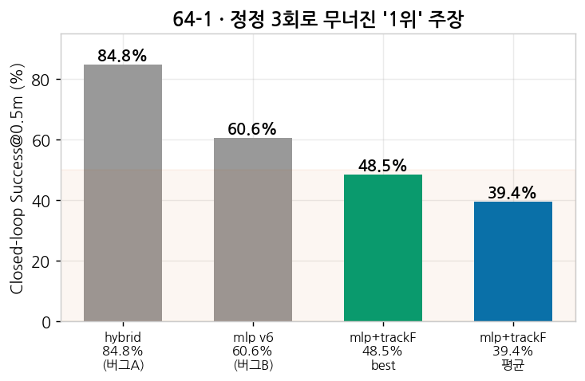

**64-2. 통일 리더보드 (apples-to-apples: 전 조합 225ep 학습·225ep val)**

stale JSON을 전부 폐기하고 동일 프로토콜로 신선 재평가. 2 그라운더 × 5 헤드.
configSuccess@0.5mFPEoffline
pg448/mlp · owl/mlp
48.5%
~1.00
77~78%
pg448/chunk · owl/hybrid
42.4%
1.06~1.16
76~78%
pg448/hybrid
39.4%
1.08
78.5%
cxgeom(양쪽) · owl/chunk
36.4%
~1.1
76~77%
transformer(양쪽, 현 배포)
18~27%
1.37
72~73%
champion seed 분산: pg448/mlp 3-seed = 33.3/36.4/48.5%
(평균 39.4, std 6.5%p). 헤드라인 48.5%는 best-of-3였음.
결론: ① 그라운더 무차별(mlp 양쪽 48.5% 동률),
② 상위 헤드 mlp·chunk·hybrid는 노이즈 안에서 구분 불가 — "최고 헤드"를 33ep val로는
못 가림, ③ transformer(현 배포)만 확실한 최하위 → 교체 근거.
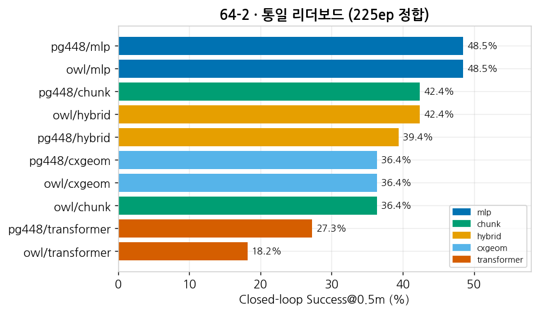
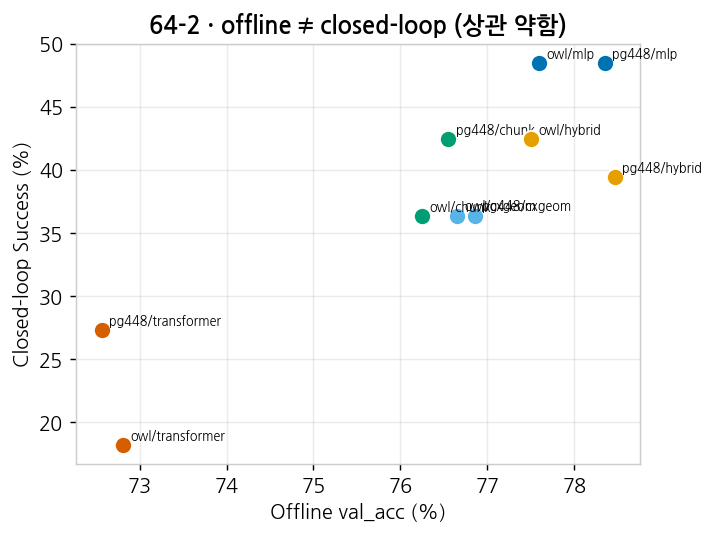
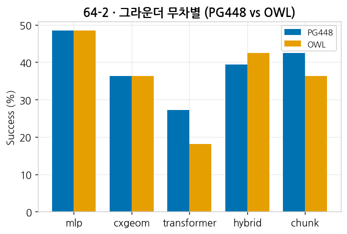
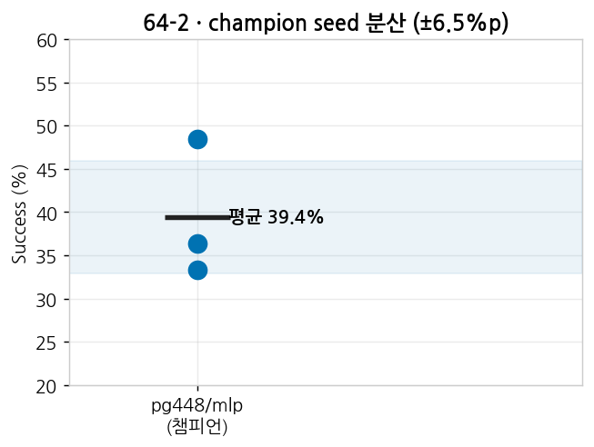

**64-3. 어디서·언제 실패하나 — 프레임 단위 실패 시점 분석**

경로 유형별로 보면 직진 75~100% vs 곡선 0~67% —
실패가 곡선에 집중. 실패 곡선 에피소드를 프레임 단위로 까보니 오류는 두 지점에 집중된다:
① 초반 1~3프레임 (cold-start) — window 패딩(과거
히스토리 없음) 상태라 방향을 반대로/STOP으로 시작. 거의 모든 곡선 에피소드가 frame 0에서 첫 오류.
② 중반 회전 구간 — 전/중/후 3구간 정확도에서
중반이 최저(일부 9%). GT의 짧은 회전 구간(예: 직진 중 2프레임 꺾음)을 감지 못하고
FORWARD로 뭉갬. 데이터 71%가 FORWARD라 "애매하면 직진" 편향.
③ 후반 직진 복귀 — 대체로 회복(82~100%).
한 프레임 방향 오판 → dead-reckoning 적분에서 헤딩 오차 누적 → FPE가 4.6m까지 터짐.
즉 "한 번 어긋나면 되돌리지 못하는" 것이 본질(CH62 "중간 재보정 불능"과 동일).
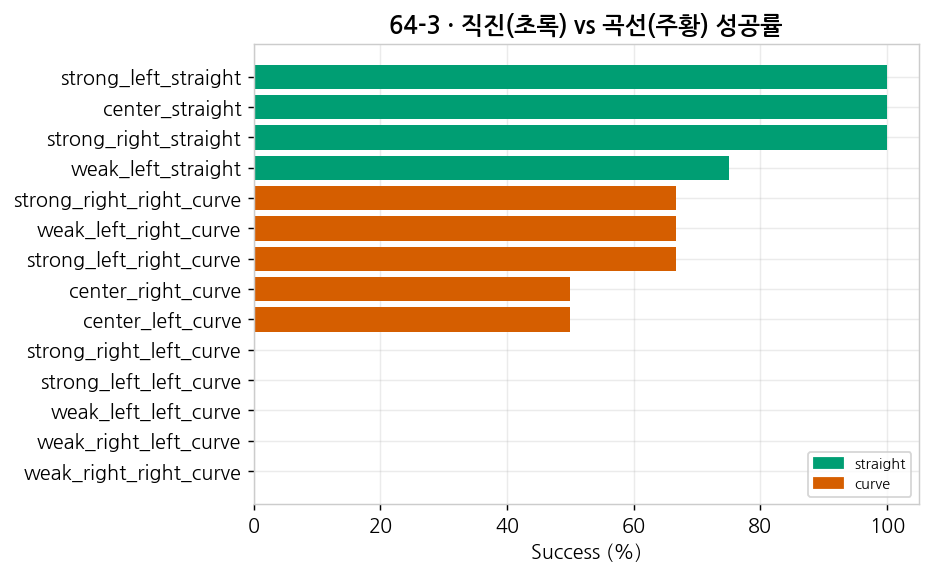
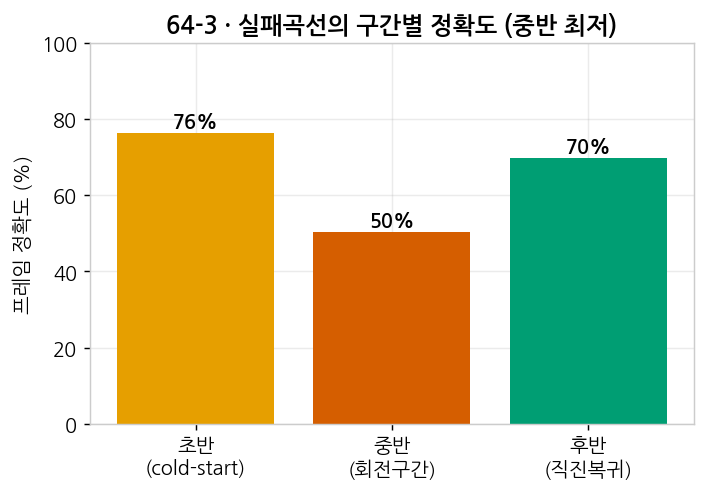
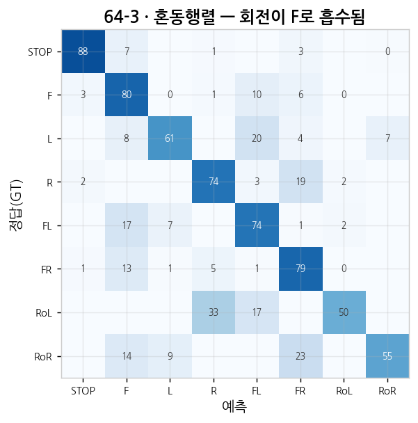
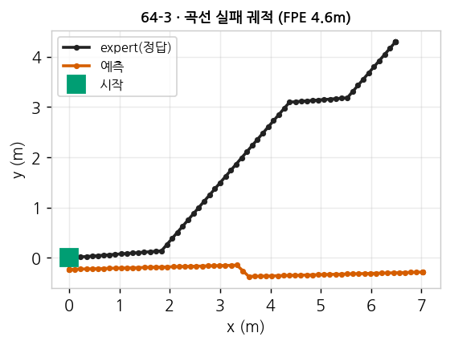
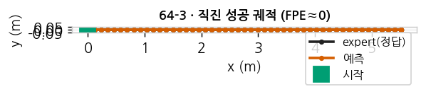
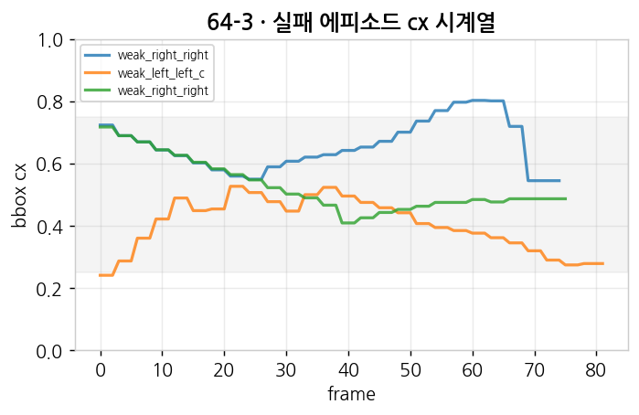
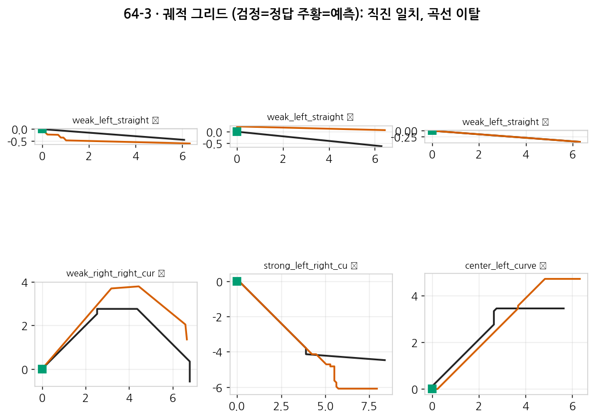

**64-4. 연속형 액션으로 바꾸면? → 4가지 독립 증거로 "오히려 나쁨"**

V6는 조이스틱으로 이산 수집됐다(lx/ly 실측 {-1.15,0,+1.15} 3값).
"연속 회귀로 바꾸면 나아질까"를 4각도로 검증 — 전부 악화:
증거이산연속
원천 신호(63-9)
lx/ly 3값뿐
회귀할 연속 타겟 없음
offline(63-16)
mlp 78%
contreg 75%/flow 72%
연속 az 적분(63-10)
39.4%
33.3%
완전 연속 궤적(vs 실제 raw 정답)
30.3%
15.2%
이유: lx/ly가 계단형 이산이라 회귀 헤드는 애매한 중간값을 뱉고, 그게 매 프레임 적분돼
드리프트 누적. 이산 분류는 "3개 중 하나로 딱" 찍어 이 애매함을 원천 차단(정규화 효과).
연속이 의미 있으려면 수집 단계부터 아날로그 보존이 선행돼야 함(soda 문의 진행 중).
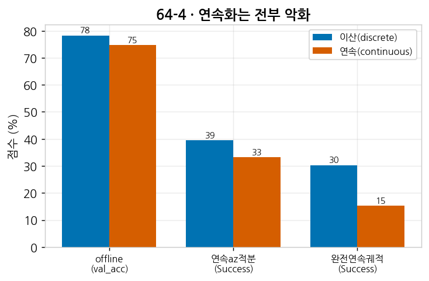

**64-5. 그라운더는 병목이 아니다 — V6 극단 cx 100% 검출**

"오버슈트 중에도 바구니 cx가 잡혀야 한다"는 우려를 V6 데이터로 검증:
항목값
PG448 LIVE 검출률(V6)
100% (5752/5752)
검출된 cx 범위
0.04 ~ 0.91 (극단까지 잡힘)
PG448 vs OWL 검출률
거의 동일(둘 다 극단 커버)
단, 검출된 프레임의 91%가 중앙(cx 0.25~0.75)이고 아주
극단(cx<0.15 or >0.85)은 90프레임(0.6%)뿐. 즉 인식은
되는데, 극단 상황 자체가 데이터에 희소. 그라운더(PG448/OWL) 교체로는 안 풀리고
(CH61-18 "그라운더 교체 무효"와 일치), 극단·오버슈트 프레임을 의도적으로 늘리는 재수집이 필요.
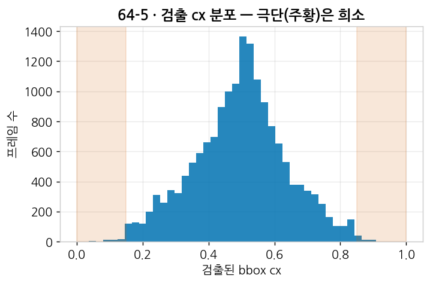
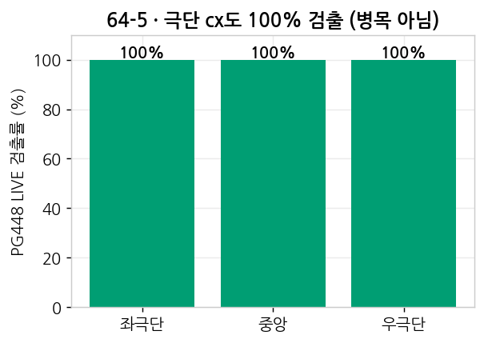

**64-6. 학습 레벨 개선책 전부 무효 — "알고리즘으로는 못 고친다"**

재수집 없이 곡선 실패를 완화하려는 시도(전부 mlp, 225ep, 3-seed 평균):
시도Success(평균)baseline 대비
baseline mlp
39.4%
—
회전클래스 부스트 3배
32.3%
-7%p
회전클래스 부스트 6배
28.3%
-11%p
회전프레임 오버샘플 4배
37.4%
≈동일
V5(쉬운셋) 데이터 혼합
39.4%
≈동일
회전 강조(부스트)는 FORWARD 정확도를 깎아 오히려 악화, 오버샘플·데이터혼합은 무변화.
즉 지금 데이터 안에서 가중치·샘플링을 아무리 바꿔도 안 됨 —
"지나쳤다 되돌리는" 궤적 자체가 데이터에 없으면 학습할 신호가 없다는 CH61 결론의 재확인.
(V5+V6 혼합의 초기 57.6%는 best-of-3 운빨이었고 3-seed 평균은 39.4%로 무효 처리.)
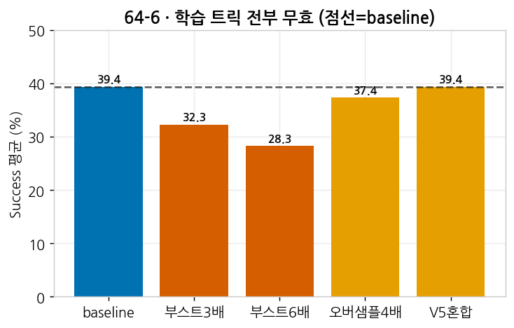

**64-8. 일반화 매트릭스 — "V5만 학습 → V6 = 2%" (쉬운 데이터는 전이 안 됨)**

"V5로 마무리해도 되나"를 정면으로 검증. bbox confound 제거(V5도 PG448 주석 사용),
train{V5,V6,V5+V6} × test{V5,V6}를 held-out·3-seed로 측정:
train \ test→ V5(쉬움)→ V6(어려움)
V5만
69.7±11.9
2.0±1.4
V6만
33.3±2.1
39.4±6.5
V5+V6
84.8±5.7
34.3±5.7
핵심: V5만 학습하면
V6에서 2.0% — 쉬운 벤치마크로 학습한 모델은 어려운 케이스에서 완전히 무너진다.
"V5로 마무리(쉬운 것 100%)"가 실전 능력을 전혀 보장하지 못한다는 정량 증거.
역방향(V6→V5 33.3%)도 완벽하진 않아 — V6는 극단 cx 분포라 중앙 위주 V5와도 다름.
V5+V6 혼합은 V5-test를 크게 올리지만(84.8%) V6-test는 못 올림(34.3%≈V6단독) —
그냥 데이터를 더하는 것으론 어려운 케이스가 안 풀리고,
어려운 케이스를 겨냥한(트랙C) 데이터가 필요함을 재확인.
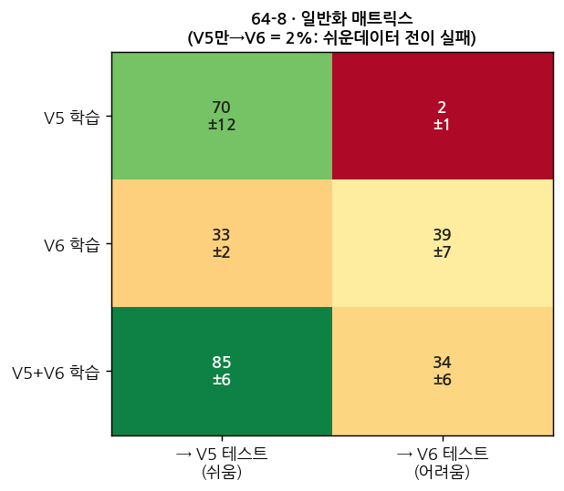

**64-9. 실주행 세션 시점 분해 — 집계 성공률의 함정 (soda 254세션 실측)**

soda가 5~7월 실주행 254세션 매트릭스를 전달(2026-07-22). obj_right 집계는 21/68(31%)이지만,
시점×커밋×런타임으로 분해하면 완전히 다른 이야기:
날짜obj_right체크포인트/런타임변경
07-02~06
0/24 (0%)
transformer · window6 · OWL
—
07-10
17/30 (57%)
transformer · window3+bboxscale3 · OWL
체크포인트 교체(604f266)
07-11
4/12 (33%)
window3 (일부 6207947)
tail-frame 버그수정 후 0/4
확인된 것:
(1) 변곡점은 window6→window3+bboxscale3 체크포인트 교체 —
그라운더는 OWL로 내내 고정이었음. CH64 "그라운더 무죄, 데이터/모델이 병목"을 실기 메타데이터로 확증.
(2) 경로별 실패 원인이 다름: obj_right는 그라운딩 정상(gnd 95%인데도
45/65 실패)·액션이 문제 / obj_left는 반대로 그라운딩 자체가 약함(gnd<50%가 5/8).
(3) 07-11 tail-frame reuse 버그수정 후 급감 → 이전 성공 일부가 프레임 재사용으로 부풀려졌을 가능성.
⚠️ 중대 공백: 실주행 obj_* 데이터는 전부
old action_transformer.pt이고, exp73(CH64 챔피언)은 실기 거의 미검증
(07-22 obj_center 3건뿐, 그것도 폐기된 v6-only 180ep). offline에선 mlp>transformer인데 실기 챔피언은
transformer라 이 역전이 미해명 → exp73_pg448_trackF_v6_mlp를 obj_left/center/right로
반복 실기(6207947 버그수정 후)해야 판가름(soda에 요청 완료).
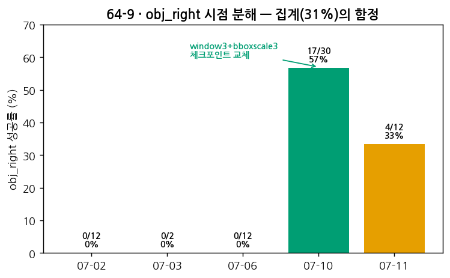

**🚨 64-10. 학습/서빙 "제어 주기" 불일치 — HELD(진짜 실서빙 재현) 24.2%, 구조적 병목 신규 발견**

soda 실측(2026-07-23): H5 수집 ~6.0Hz 연속 vs 실추론 ~1.3Hz 버스트(그라운딩
2.2s/skip_n=3) → window=6이 학습 시 ~1.0초 폭인데 실기에선 ~4.6초 폭. 추가로
soda가 로봇 펌웨어를 직접 확인: 속도는 방향(각도)만
쓰고 크기(magnitude)는 완전히 버림 — 즉 물리적 속도는 항상 상수. 그래서
cadence 차이가 그대로 "윈도우당 이동거리 불일치"로 직결됨이 확정.
이를 3단계 × 두 그라운더(PG2-448/OWL-v2)로
교차 검증(모두 mlp, V6, 3-seed):
조건결정 빈도PG2-448OWL-v2
① baseline(stride=1)
6Hz(매 프레임)
39.4±6.5%
44.4±3.8%
② 입력만 흐림(stride=5)
6Hz(그대로)
36.4±2.5%
36.4±0.0%
③ HELD(진짜 실서빙 재현)
1.3Hz
24.2±2.5%
19.2±1.4%
그라운더 교차검증 결론: 급락 패턴이 두 그라운더에서 거의 동일(①→③ PG448 -15.2%p,
OWL -25.2%p — 방향과 크기 모두 일관). baseline에서는 OWL이 오히려 근소 우위(44.4%
vs 39.4%)였지만 HELD에서는 역전 없이 둘 다 급락 —
이 병목이 특정 그라운더의 속성이 아니라 "판단 빈도 1.3Hz"라는 구조 자체에서
나온다는 것이 그라운더 선택과 무관하게 재확인됨. 그라운더를 아무리
바꿔도(64-5 "그라운더 무죄"와 같은 결) 이 문제는 해결 안 됨 — 해법은 판단
빈도 자체를 다루는 것(학습 재설계 또는 그라운딩 속도 개선)뿐.
구조적 해석: ①→②는 "기억(맥락)의 질"만 나빠진 것 —
여전히 매 프레임 재판단·재반영하는 연속 반응형 제어라
성능이 거의 안 변함. ②→③은 차원이 다른 변화 — 판단 자체가
1.3Hz로 줄고, 그 사이엔 직전 명령을 맹목적으로 유지(zero-order hold)하는
단속 제어(intermittent control)로 바뀜. 한 번 잘못된 결정이 나오면 다음
판단 기회(~0.8초 후)까지 그 오류가 그대로 실행돼 궤적이 크게 벌어질 시간을 벌어줌.
CH64 64-3과의 연결: "한 번 어긋나면 되돌리지
못한다"는 실패 패턴이, 트랙C 데이터 부재(재보정을 배운 적 없음)뿐 아니라
재보정할 기회 자체가 5배 적게 주어지는 제어 구조
때문일 수 있음이 새로 확인됨. 트랙C(데이터)와 제어 주기(그라운딩 속도)는
서로 다른 레버 — 하나를 고쳐도 다른 하나는 그대로 남음.
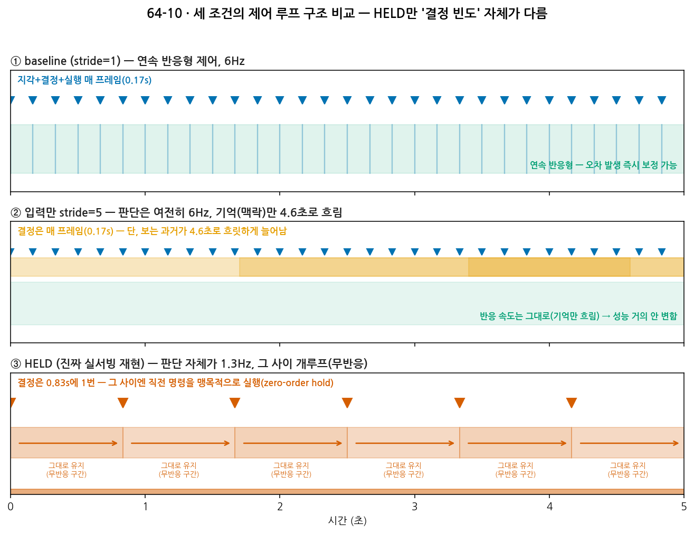
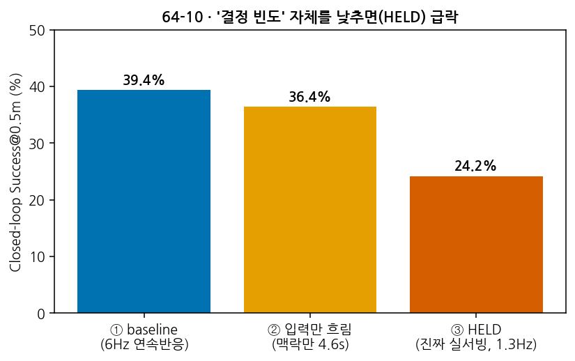

**❌ 64-11. exp73 챔피언 첫 실기 검증 — HELD 예측과 정확히 일치 — 철회됨(2026-07-31, 64-19 참조)**

🚫 이 카드의 핵심 결론은 철회한다. 7/31에 soda로부터
7/23 세션 원본 H5를 회수해 runtime_config attrs를 직접 읽어보니,
아래 21~23회 스크리닝은 exp73 챔피언이 실행된 세션이
아니었다. 해당 에피소드(#125~147)는 모두 체크포인트 전달 시각(7/23 17:24)
이전이라 H5도 메타데이터도 남아있지 않고,
17:24 직후부터 H5 attrs에 exp73_owl_trackF_v6_mlp_holdaware_seed0.pt가
기록되기 시작한다. 동일 threshold(0.25)에서 진짜 exp73 챔피언은
29/58 = 50.0%(가장 어려운 강좌·약좌만 보면
13/40 = 32.5%, 같은 위치의 구모델 1/11 = 9.1% 대비)였다 — 상세 및 위치별 비교는 64-19.
따라서 "실기 33.3%가 HELD 예측(19.2~27.3%)과 일치한다"는
결론은 성립하지 않는다. 이 일치는 두 개의 오류가 우연히 상쇄된 결과였다:
(1) 예측 대상이 아닌 다른(구) 모델의 성적을 가져다 댔고,
(2) 애초에 HELD는 프레임 단위 판단 정확도 프록시라 에피소드 성공률과 같은 척도가
아니다(64-18에서 정리). 두 척도를 잘못 맞춘 것이 우연히 근접해 거짓 검증을 만들었다.
교훈: baseline 실측값의 실행 주체(체크포인트)를 메타데이터로 확인하지 않고
시각·경로만으로 귀속시키면 이런 오귀속이 발생한다. 아래 표의 숫자 자체는
유효하지만(구 배포모델의 성적으로서), 라벨과 결론은 무효다.
soda가 `logs/episode_log.csv`에 남긴 "트랙A/F 위치별 스크리닝 21회" —
exp73 챔피언(mlp)의 사실상 첫 실기 검증
→ 실제로는 구 배포모델(체크포인트 미상, soda 확인 대기).
경로명은 V6 path_type과 정확히 일치(trackA_weak/strong_left/right, trackF_center).
위치실기 성공
trackA_strong_left
0/5 (0%)
trackA_weak_left
1/4 (25%)
trackA_weak_right
1/4 (25%)
trackA_strong_right
3/5 (60%)
trackF_center
0/1
trackF_center_straight
2/2 (100%)
전체 / 트랙A만
7/21(33.3%) / 5/18(27.8%)
핵심: 실기 27.8~33.3%가 baseline 예측(39~48%)이 아니라 HELD 예측(19.2~27.3%)과
거의 정확히 일치 — 64-10에서 세운 가설이 이번 세션 최초로 실기 데이터로 직접
검증됨.
→ 철회. 위 배너 참조. 이 성적은 exp73 챔피언이 아닌
구 모델의 것이고, HELD 가설은 이 데이터로 검증된 바 없다.
추가 관찰(표본 작아 잠정): strong_left(0%)와
strong_right(60%) 간 뚜렷한 좌우 비대칭 — 카메라/그라운더 좌우 편향 또는 물리적
요인(바퀴 드리프트 등) 가능성, n=4~5라 단정은 이름. 트랙C 재수집 시 좌우 균형
확인 필요.
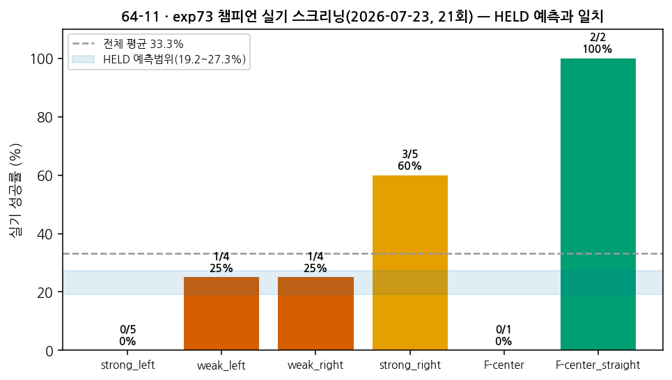

**✅ 64-12. HELD-aware 재학습 — majority-vote 라벨로 12→28% (재수집 없이 가능한 첫 완화책)**

64-10/64-11에서 "판단 자체가 1.3Hz로 느려지고 그 사이 유지된다(HELD)"는 게
진짜 배포 조건임을 확인했으니, 이번엔 그 조건을
알고 학습시켜봄: 결정 시점(5프레임 간격)마다 1개 샘플, 라벨은 "그
구간(5프레임) 전체 GT의 다수결" — 즉 유지될 걸 감안해 구간 전체를 대표하는
액션을 직접 학습 목표로 삼음.
학습 방식HELD Success(3-seed)
baseline(연속 6Hz로 학습) → HELD 평가
7.1±3.8%
stride=5 입력으로 학습(64-10) → HELD 평가
24.2±2.5%
cadence-aligned(majority-vote 라벨) 학습 → HELD 평가
28.3±3.8%
두 가지 확인됨: (1) baseline(연속학습)을
HELD로 그대로 배포하면 7.1%까지 떨어짐 — 학습 때
한 번도 못 본 입력 패턴(듬성듬성 window)에 노출되는 것 자체가 치명적,
최소한 stride를 맞춰 학습해야 함. (2) 그 위에 majority-vote 라벨(cadence-aligned)까지
더하면 24.2%→28.3%로 추가 개선 — 재수집 없이 **학습 방식만 바꿔서 얻는 첫
실질적 완화책**.
한계: 여전히 baseline의 순수 offline
수치(39~48%)에는 크게 못 미침 — 판단 빈도 자체의 한계(64-10)는 학습으로
못 넘음. 트랙C(데이터)와 그라운딩 속도개선(제어)이 여전히 필요, 이건 그
사이 즉시 배포 가능한 저비용 개선. 체크포인트:
exp73_pg448_trackF_v6_mlp_holdaware_seed{0,1,2}.pt.
그라운더 교차검증(OWL-v2): 동일 방식을
OWL 그라운더로도 재현 — HELD 25.3±3.8%
(PG448의 28.3±3.8%와 노이즈 안에서 동급). cadence-aligned 학습 효과가 그라운더
선택과 무관함이 다시 확인됨(64-2/64-10과 일관). soda에 baseline·cadence-aligned
OWL 체크포인트도 함께 전달, PG448 세트와 실기 A/B 비교 요청함.
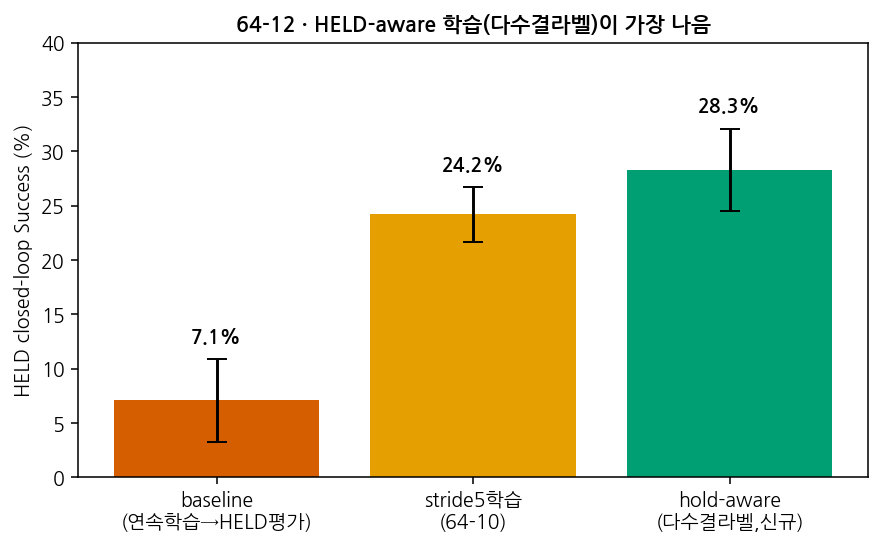

**🔀 64-13. 논문 방향 전환 — 경량화(Raspberry Pi) + 좌우 데이터 불균형 발견 (2026-07-23 대면미팅)**

대면 미팅에서 논문 방향이 "OOD 일반화 격차 진단"에서
"경량화(기존 VLA 대비 파라미터/자원 절감, Raspberry Pi 탑재 가능성 입증)"로
확정됨. 현재 파이프라인(Kosmos-2 vision 인코더 + OWL-v2 그라운딩 + MLP
액션헤드, 언어 디코더 미사용)이 사실 "VLA가 아니라 오픈보캐블러리 디텍션+액션헤드"
구조라는 점도 재정의됨 — CH64의 진단 결과(그라운더 무죄, 헤드 무차별, HELD/cadence
병목)는 메인 주장이 아니라 이 구조 선택의 방법론적 근거로 재배치.
파라미터 수만으론 경량화 판단 불가(soda 실측):
항목Kosmos-2 visionOWL-v2
파라미터
0.303B
0.155B(더 작음)
추론 지연
53.7ms†
1901.7ms(35배 느림)
추론 중 GPU 피크
0.625GB
1.982GB(3배)
시사점: "OWL-v2 단독이면 파라미터가 절반이라
가볍다"는 직관과 반대로, 실제 서빙 부담(레이턴시)은
OWL-v2가 압도적으로 큼 — 라즈베리파이(GPU 없음, CPU 전용)로 가면 이 격차가
더 벌어질 가능성이 높아, 경량화 판단은 파라미터 수가 아니라 레이턴시/메모리
프로파일 기준으로 해야 함.
† 최초 측정(58.6ms)은 실제 서버 코드(`resize_for_vlm`+`pixel_values.to(dtype=torch.float16)`)와
리사이즈·dtype 캐스팅이 달랐던 게 soda 검증으로 발견됨 — 서버 코드 그대로 재현해
재측정한 값(53.7ms)으로 교체. 리사이즈 자체는 프로젝트 문서(`image_preprocess.py`)에
"동작 안 바뀜(둘 다 224 귀결)"이 명시돼 있어 원래도 무관했음, dtype 재현 후에도
결론(OWL이 압도적으로 느림)은 그대로 유지.
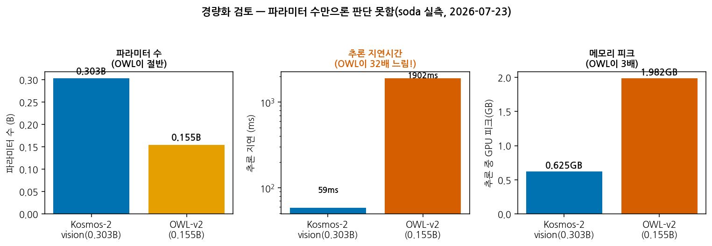
좌우 데이터 불균형 재확인 결과: 목표
위치(에피소드 수 90:90)와 평균 길이(76.8:76.3프레임)는 완벽히 균형이나,
액션 클래스 프레임 수(LEFT+FWD+L+ROT_L=3384 vs
RIGHT+FWD+R+ROT_R=4122, 22% 불균형)는 실제로 존재 — 수집 설계가 아니라
실제 주행 중 발생한 액션 자체의 비대칭. 실기 좌측 약세(64-11)의 직접적 원인
후보로, 트랙C 재수집 시 액션 클래스 비율까지 맞춰야 함.

**✅ 64-14. 셀프검증 라벨러 — path 라벨·success 자동판정 33/33(100%) 사람이 확인**

챔피언(mlp) val 33ep 전체를 실제 카메라 프레임(초/중/종
+ bbox·중앙선 오버레이) + 궤적그래프로 사람이 직접 확인하는 로컬 라벨러
제작(포트 7794, `scripts/label/serve_exp73_val_review.py`). 기준: ① 목표위치는
종반 프레임 bbox 좌우 위치로만 확인(경로 곡선방향은 정적 3프레임으론 판단 불가해
제외), ② success는 그래프 검정(정답)·주황(예측) 선 끝점 거리로 확인.
결과: 33/33(100%) 전부 일치 — 목표위치
라벨도, FPE<0.5m 자동 success 판정도 사람이 눈으로 봐도 전부 정확했음.
의미: 앞서(64절 초반) 전체평균/80%tail
기준으로 "라벨-실측 불일치 45~86개"라 성급히 판단했던 건 방법론 문제였음이
재확인(weak_*는 도착시점 cx가 0.5 근처를 오가는 게 정상 노이즈). 이 셀프검증으로
지금까지 CH64에서 인용한 모든 success 수치(39.4%,
48.5%, 60.6% 등)가 "수식 버그"가 아니라 실제 궤적 일치도를 정확히 반영함이
확인됨 — apples-to-apples 리더보드(64-2)의 신뢰도를 한 번 더 뒷받침.

**🚨 64-15. has_bbox=False 학습 프레임 0.00%(0/16599) — 그라운딩 실패 상황 완전 미학습 확정 (soda 발견, 2026-07-30)**

soda가 강한좌 실기 세션 3개를 프레임 단위 분석한 결과, 세션 내내 그라운더가
단 한 번도 타겟을 못 찾은(has_bbox=False) 상황에서 정책 헤드가 FWD+L을
8초 넘게 그대로 유지하다 뒤늦게
FWD+R→ROT_L로 전환 — 회복이 전혀 없었음. `_build_flat_feature()`가
`has_bbox`를 입력 4번째 값으로 명시적으로 넣고 있어(신호 자체는 모델에
전달됨) "그럼 학습 데이터에 이 상황이 있었는지"를 minum에 확인 요청.
확인 결과: 225ep 16,599프레임 중 has_bbox=False는
정확히 0개(0.00%) — 캐시(`exp73_v6_vis_cache.pt`)와 원본 그라운딩
주석(`bbox_dataset_v6_pg448_cx.json`) 양쪽 독립 재확인, 완전히 일치. 이는
64-5("PG448 LIVE 검출률 100%")와 같은 사실이지만, 이번엔 "그라운딩 실패 시 어떻게 행동해야 하는지를 모델이
전혀 학습한 적이 없다"는 훨씬 날카로운 결론으로 이어짐.
해석: 4번째 입력 피처(has_bbox)가
학습 내내 상수(항상 1.0×bbox_scale)였음
— 모델에게 이 피처는 "정보"가 아니라 "늘 같은 값의 잡음"이었던 것. 실기에서
처음 has_bbox=False를 만나면 학습된 대응 전략이 없어 이전 프레임 관성에 의존한
사실상 미정의 동작을 함 — 64-9(obj_left 그라운딩 약세), 64-10(cadence/HELD
병목)과는 또 다른, 독립적인 근본 원인.
시사점: 그라운더 앙상블/임계값 조정으로는
해결 안 됨(64-5 "그라운더 무죄"와 같은 결) —
"그라운딩 실패 시 정지/탐색"을 의도적으로 수집하는 신규 데이터 트랙이 필요.
트랙C(오버슈트→재보정)와는 별개 시나리오라 우선순위 조율 필요. 그라운더
불일치 가능성도 있음(학습=PG448 100%검출, 이 세션=OWL-v2) — 어느 그라운더로
학습해도 실기 100% 검출은 보장 안 되므로(64-9 obj_left 사례) 그라운더 무관하게
존재하는 공백으로 판단.

**64-16. OWL-v2 fp16 — 속도 1.98배↑, 검출률 10%p↓, 좌표정확도는 불변 (2026-07-30)**

64-13(파라미터 수만으론 경량화 판단 불가)의 후속 — OWL-v2를 fp16으로 돌리면
64-13의 레이턴시 격차(35배)를 줄일 수 있는지, 대신 검출 정확도가 희생되는지
직접 검증(V6 실제 프레임 120장, LIVE 그라운딩만, threshold=0.25 서버와 동일).
항목fp32fp16
속도(soda Jetson 실측)
1901.7ms
962.1ms(1.98배↑)
has_bbox 검출률(fp32 대비 일치)
100%(기준)
90.0%(108/120)
불일치 방향
전부 "fp32는 검출/fp16은 놓침"(12건) — fp16만 검출한 경우 0건
좌표 정확도(둘 다 검출된 108건)
cx/cy/area 평균 차이 0.0001~0.0002 — 사실상 완전 동일, 0.05 이상 벌어진 경우 0건
해석: fp16은
"잡으면 정확히 잡지만, 애매한 경우(신뢰도가 threshold 0.25 근처) 조금 더 자주
놓치는" 트레이드오프 — 양자화로 좌표가 틀어지는 문제는 없고, 검출
민감도만 살짝 낮아짐. skip_n 재시도 로직이 이미 있어 단발 미검출은 다음
프레임에서 회복 가능하므로, 이 10%p 손실은 실사용에서 완전히 치명적이진
않을 수 있음(단, 64-15의 "그라운딩 실패 완전 미학습" 문제와 겹치면 악화 요인).
종합: fp16 전환은 "속도 개선 vs 검출률
소폭 희생"의 실질적 트레이드오프 — 경량화 방향에서 검토할 가치 있으나, Kosmos-2
(53.7ms)와 비교하면 fp16 OWL(962.1ms)도 여전히 약 18배 느려 "완전 해결"은 아님.
threshold를 살짝 낮추는 보완과 함께 검토 권장.
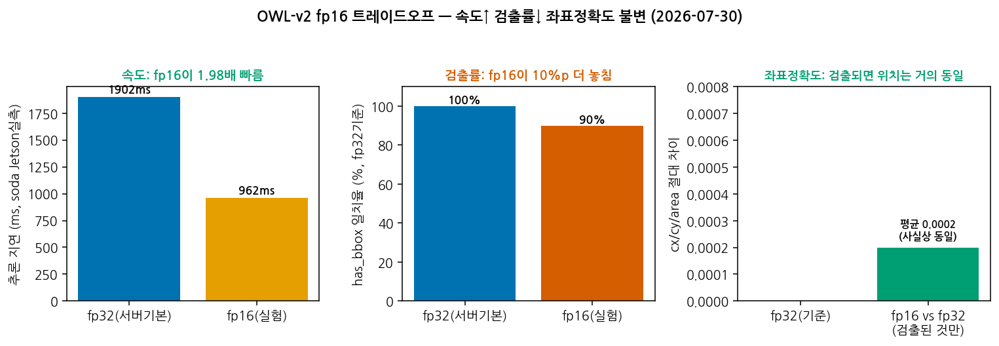

**64-17. OWL-v2 threshold=0.25 재검증 — Jetson 재실측 없이도 "knife-edge" 구조 확인 (2026-07-30)**

soda 보고(약좌 세션 6/6 has_bbox=False, threshold 0.15~0.20에서 실제 탐지 확인)가
7/4~7/5에 미해결로 남았던 Jetson-vs-local 재현성 gap(fallback 206/206 로컬 재탐지)과
같은 패턴임을 확인. 원본 ROC 데이터(owlv2_threshold_roc.py, 296프레임,
객체없음 79 / 객체있음 217)를 다시 뜯어봄 — Jetson 하드웨어가 없어 그 환경에서
ROC를 새로 돌릴 수는 없지만, 원본 로컬 ROC 곡선 자체가
이미 threshold=0.25 근방에서 매우 가파르다는 걸 재확인했다:
threshold정탐유지오탐률
0.15
99.5%
40.5%
0.20
97.7%
12.7%
0.25(현재값)
95.3%
0.0%
0.30
93.5%
0.0%
0.20→0.25 구간에서 오탐률이 12.7%→0%로 뚝 떨어짐 — Youden J 최댓값이라 "정탐 거의
다 살리고 오탐 완전 차단"하는 최적점이 맞지만, 동시에
진짜 객체가 있는 프레임 중 4.2%(9/215)가 이미 로컬 환경에서도 0.20~0.30
밴드에 몰려있고, 11.6%(25/215)가 0.15~0.35 밴드에 있다는 뜻이기도 함.
즉 이 연산점은 원래부터 confidence가 ±0.05만 흔들려도 다수의 판정이 뒤집히는
민감 구간에 설정되어 있었다 — 이건 minum 로컬 환경만으로 계산해도 드러나는
구조적 특성이라, soda가 보고한 Jetson 쪽 "0.15~0.20 부근에 몰린 미검출"과 정합적이다.
Jetson 환경에서 ROC를 다시 돌리지 못하는 이유:
원본 296프레임 라벨링 데이터셋은 minum 로컬에서 수집된 세션이라 Jetson 쪽에서
독립적으로 confidence 점수를 재추출하려면 soda 쪽 실물 접근이 필요함 — 내가
원격으로 재현할 수 없는 부분.
권장(soda 요청 2번 우선): 버전을 맞추는 쪽이
더 빠르고 결정적임 — soda의 torch(2.3.0)/transformers(4.45.2)를 minum 쪽
(2.11.0/4.49.0)에 맞춰서 동일 프레임 재실행 시 confidence gap이 줄어드는지 먼저 확인.
- gap이 버전 문제였다면 → 버전 맞추면 즉시 해소, threshold 변경 불필요
- 버전 맞춰도 gap 남으면 → 하드웨어(Orin fp16/양자화) 원인으로 좁혀짐 →
이땐 threshold를 0.25→0.20으로 낮추는 게 임시 보완책이 되지만, 원본 로컬 데이터
기준 오탐 12.7%까지 감수해야 함(공짜 이득 아님)
- 64-16의 fp16 검출률 손실(10%p↓)과 겹치면 실패 빈도가 배가되므로,
이 gap을 낮추는 게 우선이고 threshold 완화 + fp16을 동시에 적용하는 건
지양 권장
결론: threshold=0.25는 "잘못된 값"이 아니라
"원래부터 여유가 좁은 값" — Jetson gap이 그 좁은 여유를 넘어선 것이 이번 현상의
본질. 근본 해법은 재캘리브레이션보다 버전 정합이 우선.

**🎉 64-18. 100개 스크리닝 89% — 병목은 헤드가 아니라 그라운딩 가용성이었음 (soda, 2026-07-31, 100회)**

미팅 확정 목표(5위치×20개=100개)를 soda가 완주. 체크포인트는
exp73_owl_trackF_v6_mlp_holdaware_seed0.pt(OWL-v2 · MLP · V6 ·
cadence-aligned · seed0). 전체 89/100(89%) —
64-11의 7/23 baseline 33.3%(7/21)에서 전 위치 개선
(Fisher exact p=3.3×10⁻⁷).
위치7/23(n=21)7/31(n=100)95% CI평균 스텝
◀◀ 강좌
0/5 (0%)
16/20 (80%)
58~92%
17.2
◀ 약좌
1/4 (25%)
16/20 (80%)
58~92%
18.6
● 중앙
0/1
20/20 (100%)
84~100%
10.6
▶ 약우
1/4 (25%)
19/20 (95%)
76~99%
11.8
▶▶ 강우
3/5 (60%)
18/20 (90%)
70~97%
10.2
전체
7/21 (33.3%)
89/100 (89.0%)
81~94%
—
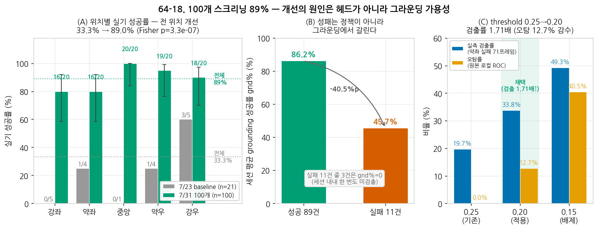
📷 실제 세션 프레임 10장 — 위치별 성공/실패 각 1건의 최종 프레임.
초록 수직선 = 그라운딩이 잡은 cx(헤드가 실제로 쓰는 조향 신호), 빨강 점선 = 미검출 시 강제되는 fallback cx=0.50.
실패 프레임은 대부분 빨강(미검출)이고 성공 프레임은 초록이다.
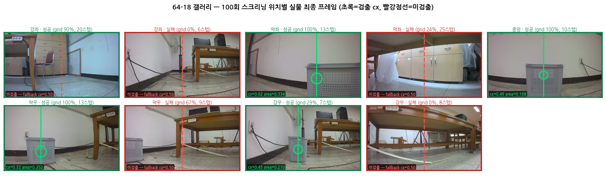
왜 좋아졌나 — 순위별 근거
① (확정) 그라운딩 가용성이 성패를 가른다 —
성공 89건의 세션 평균 grounding 성공률(gnd%)은 86.2%,
실패 11건은 45.7%(−40.5%p). 실패 11건 중
3건은 gnd%=0(세션 내내 한 번도 미검출),
4건이 50% 미만. 즉 헤드의 액션 결정 능력이 아니라
"타겟을 계속 보고 있느냐"가 성패를 가름.
② (실측 확인) threshold 0.25→0.20 — 64-17에서
"0.25는 knife-edge"라고 진단한 대로, soda가 약좌 실패 세션의 실제 grounding
프레임 71장을 threshold만 바꿔 재계산: has_bbox=True가
19.7%(14/71) → 33.8%(24/71), 1.71배.
실패 원인 프레임에 직접 작용한 변경이라 개선분의 상당 부분을 설명.
(부수 확인: transformers 4.45.2 vs 4.49.0은 score가 소수점 4자리까지 동일 →
버전 gap 가설 기각, 원인은 torch/Orin 하드웨어로 좁혀짐)
③ (구조적으로 중요) 회복 로직을 정책 밖으로 빼냄 —
64-15에서 has_bbox=False 학습 프레임이 0.00%(0/16599)
임을 확정했으므로, 모델은 그라운딩 실패 회복을 배울 수가
없는 구조였다. 이번 개선은 그걸 재학습으로 고친 게 아니라
추론 제어 계층에 명시적 회복 로직을 넣어 우회한 것:
force_reground_on_miss(미검출 다음 스텝 캐시 강제 스킵), 회전 후 강제
재그라운딩, 회전 0.4s 제한+자동정지, 연속회전 차단, 콜드스타트 가드 3프레임.
④ (분리 불가) 체크포인트 변경 → 부분 정정:
효과 크기는 측정됐으나 ②와의 순위는 여전히 미정 — 7/31에 세션 원본을 회수해
H5 runtime_config로 arm을 구성한 결과, 체크포인트 교체와 threshold+가드
둘 다 +23~48%p 규모로 크지만, 위치 가중 방식에 따라
순위가 뒤집혀 어느 쪽이 주동력인지 단정할 수 없다(표본이 충분한 강좌·약좌
한정으로는 threshold+가드가 +48.0%p로 우세). 위 ①~④의
순위 서술은 무효이며, 64-19가 대체한다. ①(그라운딩 가용성)만은
전체 159세션에서 gnd%≥80 → 98.8% 성공으로
재확인돼 유효하다.
⚠️ 추가 정정 — 위치내 층화 시도는 실패했다.
아래 "동일 위치 A/B가 필요하다"는 지적을 우회하려고 세션 H5의 설정 메타데이터로
위치내 층화를 시도했으나, 100세트 안에서 threshold는 전부 0.20 고정이고 유일한
변동 설정 force_reground_on_miss는
위치와 거의 완전 공선이었다(freg=False는
약좌 14 + 중앙 20뿐이고 중앙은 만점 위치, 둘 다 존재하는 위치는 약좌 하나로 14 vs 6).
교란은 commit뿐 아니라 설정 변수에도 그대로 있어서,
동일 위치 A/B 재수집은 여전히 필요하다.
(단 A→B 체크포인트 효과는 7/23 데이터가 자연실험을 제공해 분리됨 — 64-19)
⚠️ 64-10/64-11의 HELD 천장이 깨진 것에 대한 정리 —
64-11은 "실기 33.3%가 baseline 예측(39~48%)이 아니라 HELD 예측(19.2~27.3%)과 일치"를
HELD 가설의 검증 근거로 삼았다. 이번 89%는 HELD 예측은
물론 offline baseline 예측(39~48%)조차 크게 초과한다. 모순이 아니라 범위의
문제로 정리해야 한다: HELD 시뮬레이션은 "5프레임마다
판단하고 유지하며, 어긋나도 회복 장치가 없는" 파이프라인을 모델링한 것이고,
③의 명시적 회복 로직은 정확히 그 가정을 깨뜨린다. 즉
HELD는 "가드 없는 파이프라인"의 성능을 정확히 예측했고,
가드가 그 천장을 들어올린 것 — 천장의 위치와 그것을 들어올리는 메커니즘을
둘 다 특정했다는 점에서 오히려 강한 결과.
좌우 비대칭 — n=40에서도 아직 유의하지 않음:
좌측 32/40(80.0%) vs 우측 37/40(92.5%)로 +12.5%p 우측 우세지만
Wilson CI가 겹치고 Fisher exact p=0.193으로
유의하지 않다(soda의 n=20 CI 지적이 정확했고, 40개로 묶어도 아직 부족). 다만 평균
스텝이 좌 17~19 vs 우 10~12로 1.6배 —
"성공하긴 하는데 더 헤맨다"는 경향은 남아있고, 이는 좌측 배치에서 OWL confidence가
threshold 경계에 몰리는 현상(64-17)과 방향이 일치.
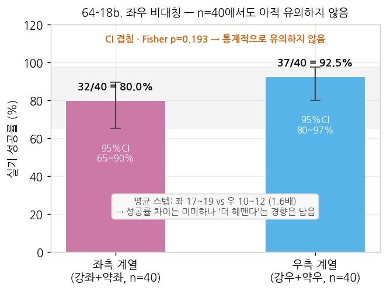
⚠️ 집계 시 필수 주의 — 설정구간×위치 교란(soda 명시):
100개는 단일 설정 일괄 수집이 아니라 개선을 진행하며 쌓였고,
각 commit 구간이 서로 다른 위치만 커버했다.
commit강좌약좌중앙약우강우
d967e0e7
–
7/9
20/20
–
–
f0fa1304
–
4/5
–
–
–
e355b506
12/16
5/6
–
–
–
08431fce
4/4
–
–
19/20
18/20
따라서 commit별 성공률로 "설정 개선 효과"를 주장하면
안 된다 — e355b506이 77.3%로 낮아 보이는 건 가장 어려운 강좌/약좌만 돌렸기
때문이고, d967e0e7이 93.1%로 높은 건 만점인 중앙이 포함돼서다. 개선 효과를 논문에
싣으려면 동일 위치에서 설정 A/B를 따로 돌려야
하며 이건 아직 안 한 상태. (별건으로 #200~209 10건은 서버 재기동 중 stop_mode 등
3개 설정이 조용히 리셋된 채 수집돼 집계 제외 대상 — soda가 런타임 상태 자동
스냅샷/복원으로 재발 방지 완료)
💡 경량화 논문 방향에 주는 함의 — fp16의 매력이 반전됨:
①이 확정된 이상 액션 헤드는 병목이 아니고(헤드는 이미
충분하고 값싸다), 자원을 써야 하는 곳은 그라운딩 단계다. 그런데 그라운딩이
바로 가장 비싼 단계(64-13: OWL-v2 1901.7ms vs Kosmos-2 vision 53.7ms)이므로,
경량화 과제는 "검출률을 잃지 않으면서 그라운딩을 싸게
만들기"로 좁혀진다. 이 기준에서 보면 64-16의 fp16(속도 1.98배↑,
검출률 10%p↓)은 하필
성패를 가르는 그 변수 하나를 팔아서 속도를 사는
잘못된 트레이드다 — 64-16에서 "검토할 가치 있음"으로 열어뒀던 판단을
"threshold 완화와 병용은 금지, 단독 적용도 비권장"
으로 좁힌다.
남은 것: (1) 동일 위치 설정 A/B 재검증,
(2) 좌측 그라운딩 개선(threshold 경계 문제의 근본 해결 — Orin confidence gap),
(3) 실패 11건 세션 원본을 우리 서버로 회수해 gnd%=0 3건의 프레임 직접 분석,
(4) 64-15 해법으로 제안된 "그라운딩 실패 시 사람 시범(탐색회전/STOP)" 파일럿 수집.

**🔧 64-19. 개선 요인 분해 — 두 효과 모두 크지만 순위는 단정 불가, 견고한 것은 "그라운딩 가용성" 하나 (2026-07-31)**

📝 이 카드는 같은 날 2회 자체 수정됐다.
처음엔 "체크포인트 교체 +47.2%p가 threshold(+18.0%p)의 2.6배"라고 썼으나 둘 다
틀린 수치였다. 원인 두 가지: (1) 세션 인덱싱 글로브를
2026073*로 써서 7/23 폴더(20260723)가
threshold=0.25 arm에서 통째로 빠졌고, (2) arm 간
위치 구성이 달라 통제가 안 된 상태로 조참
성공률을 비교했다 — 내가 64-18에서 soda에게 경고한 바로 그 함정에 스스로 빠진 것.
아래는 H5 runtime_config를 ground truth로 전체 재계산한 결과이며,
결론은 "순위를 정할 수 없다"로 바뀌었다.
soda로부터 세션 H5 원본 176개(3.7GB)를 회수해 각 세션의
runtime_config(체크포인트·threshold)를 직접 읽어 arm을 구성했다.
날짜창 추정이 아니라 메타데이터 기준이다.
위치A 구모델 @0.25B exp73 @0.25C exp73 @0.20+가드
강좌
0/7 (0%)
9/20 (45%)
16/20 (80%)
약좌
1/4 (25%)
4/20 (20%)
17/21 (81%)
중앙
0/1*
4/5* (80%)
20/20 (100%)
약우
1/4* (25%)
2/3* (67%)
19/20 (95%)
강우
3/5* (60%)
10/10 (100%)
18/20 (90%)
조참 합계
5/21 (23.8%)
29/58 (50.0%)
90/101 (89.1%)
* n<6으로 신뢰 낮음. B의 중앙·약우 셀(n=5,3)이 아래 표준화 추정을 크게 흔든다.
✅ A arm의 정체 확정 — 추정이 아니라 배포 이력으로: 이전엔
"구 배포모델(미상, soda 확인 대기)"으로 뒀으나, 수신한 전체 세션의 H5
attrs["runtime_config"]를 시간순으로 훑어 배포
체크포인트 변경 이력을 직접 복원했다:
최초 관측head체크포인트grounder
2026-07-06 23:11
transformer
exp71_window6/action_transformer.pt
OWL-v2
2026-07-10 13:09
transformer
exp71_window3_bboxscale3/action_transformer.pt ← A arm
OWL-v2
2026-07-23 17:18
exp73_mlp
exp73_pg448_trackF_v6_mlp_holdaware_seed0.pt
OWL-v2
2026-07-23 18:05
exp73_mlp
exp73_owl_trackF_v6_mlp_holdaware_seed0.pt ← B·C arm
OWL-v2
따라서 A arm = exp71 window3·bbox_scale3 + Transformer 액션 헤드
(7/10부터 7/23 17:18까지 배포). 즉 A→B는 "Transformer 헤드 →
MLP 헤드" 교체이자 동시에 "window 3→6 · V6 cadence-aligned 재학습" 교체다(그라운더는 양쪽 다 OWL-v2로 동일).
❗ 용어 정정 — 이건 RoboVLMs 기반 헤드가 아니다.
A arm의 action_transformer.pt는 third_party/RoboVLMs와 무관한
우리 자체 구현이다
(scripts/train_exp71_window3_bboxscale_final.py의
TransformerActionHead: nn.TransformerEncoder, d_model=260,
nhead=4, num_layers=2). 서빙 경로(stage2_v2_inference_server.py)에도
RoboVLMs import은 없다 — RoboVLMs는 CLAUDE.md 규칙대로 손대지 않은 상태로 남아있고
현재 파이프라인에 포함되지 않는다.
두 헤드 모두 입력 차원은 동일:
프레임당 FRAME_DIM = 4 + 256 = 260(bbox 4채널 + 비전 피처 256),
A는 window=3, B·C는 window=6. 출력은 8클래스.
교수님 노트의 "256(비전)+4(bbox) = 260"과 코드가 일치한다.
📷 배포 세대별 실제 프레임 — head=transformer(exp71) → head=exp73_mlp 전환이
세션 메타데이터에 그대로 찍혀 있다. A arm(7/23 17:18 이전)은 H5 자체가
전송되지 않아 이 갤러리에 없다 — 그래서 원래 정체 추정이 필요했던 것.
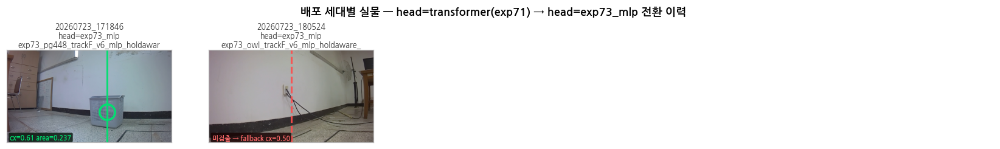
⚠️ 세 가지 추정 방식이 순위를 뒤집는다 → 주동력 단정 불가
추정 방식체크포인트(A→B)threshold+가드(B→C)우세
위치 동일가중 표준화
+40.3%p
+26.9%p
체크포인트
조참 pooled(전체)
+26.2%p
+39.1%p
threshold
강좌+약좌만(3 arm 모두 표본 충분)
+23.4%p
+48.0%p
threshold
표준화가 체크포인트 우세로 나오는 건 순전히 B의
중앙(4/5)·약우(2/3) 같은 n=3~5 셀에 1/5씩 가중이 실려서다. 세 arm 모두
표본이 확보된 강좌·약좌(n=11/40/41)만 보면
threshold+가드가 +48.0%p로 명확히 우세하다(9.1%→32.5%→80.5%).
가장 검정력 있는 비교가 threshold를 지지하므로
soda의 판단이 내 최초 주장보다 정확했다.
다만 표준화가 뒤집힌다는 사실 자체가 "어느 쪽이
주동력"이라고 논문에 쓸 수 없다는 뜻이다 — 둘 다 크고(각각 +23~48%p),
순위는 동일 위치 A/B 재수집 없이는 확정 불가.
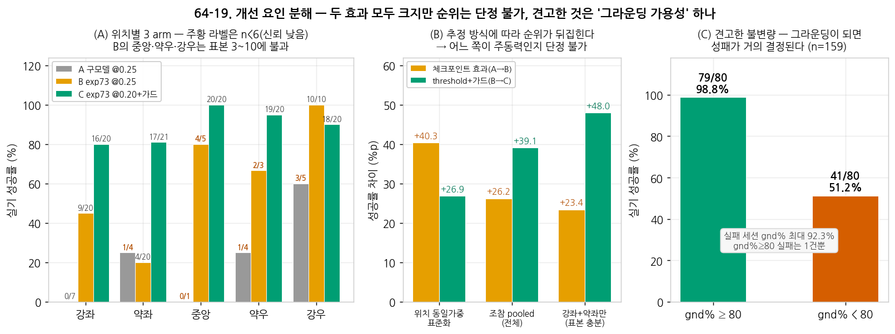
📷 B arm vs C arm 실제 프레임 10장 — 체크포인트는 동일하고
threshold(0.25→0.20)와 회복가드만 다른 두 조건의 최종 프레임. B에 빨강(미검출)이 자주 보이는 것이
threshold 효과의 실물이다.
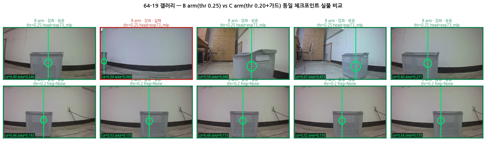
✅ 유일하게 견고한 불변량 — 그라운딩 가용성 (soda 발견, 확장 검증):
soda가 "th=0.20에서 gnd%≥80이면 69/69=100% 성공"을 보고했고, 이를
threshold·체크포인트 무관 전체 159세션으로 확장해
재검증했다:
- gnd% ≥ 80 → 79/80 = 98.8% 성공
(예외 1건, gnd% 92.3%)
- gnd% < 80 → 41/80 = 51.2%
- 인과 경로도 일관: th 0.25→0.20에서 평균 gnd% 33.5%→81.1%,
완전미검출 세션 39.7%→3.0%
100% 는 아니지만(soda 수치는 0.20 부분집합만 본 것)
그라운딩이 유지되면 성패가 거의 결정된다는 결론은 더 넓은 표본에서 강화됐다.
요인 순위를 못 정해도 "개선해야 할 대상은 그라운딩"
이라는 방향은 흔들리지 않는다 — 64-18 ①과 동일한 결론이고, 이쪽이 논문에 쓸 수 있는 주장이다.
그리고 64-11은 철회한다 — 이 재계산과 무관하게
확정된 사실: 64-11이 "exp73 챔피언 첫 실기 검증 33.3%"라 부른 세션들(#125~147)은
체크포인트 전달(7/23 17:24) 이전이라 H5·메타데이터가
없고, 17:24 직후부터 H5 attrs에 전달 체크포인트가 기록된다. 즉 그 성적은 exp73
챔피언의 것이 아니다. 따라서 64-11의 "실기가 HELD 예측(19.2~27.3%)과 일치" 결론은
다른 모델의 성적을 다른 척도(HELD는 프레임 단위 정확도
프록시)의 예측에 맞춘 거짓 검증이다.
A arm의 정체(17:24 이전 로드 모델)는 soda 확인 대기 중.
교차검증된 것: #230(메모 "요상한경로임
상당히")이 soda의 100세트 제외 대상임을 역추적으로 특정 → 제외 시 89/100 및 위치별
5/5 일치. H5 grounding/bbox[:,3]가 has_bbox 플래그임을 확인해 gnd%를
독립 재계산 → 성공 85.3% / 실패 48.6%(soda 86.2/45.7) 재현. soda의 위치통제
threshold 효과(강좌 4/10·약좌 3/17 → +54.6%p, p=1.15e-05)도 그대로 재현되며,
그 arm이 7/30분만 담고 있어 7/23을 합치면 위 표의 9/20·4/20이 된다.

**64-20. 젯슨-로컬 gap 정량화 — 부차적 요인으로 확정, 7/4 결론 정정 (2026-07-31)**

64-17에서 "젯슨 하드웨어가 없어 젯슨 ROC 재측정은 불가"라고 답했으나, 세션 원본을
회수하면서 우회 경로가 생겼다: 젯슨이
threshold 0.20에서 has_bbox=False로 판정한 프레임은 정의상 젯슨 score < 0.20이
확정이므로, 같은 이미지를 로컬에서 재실행해
score를 뽑으면 프레임 단위로 gap을 직접 정량화할 수 있다. 100세트의 미검출 프레임
197장 전량 + 대조군(젯슨이 검출한 프레임) 200장을
서버와 동일 조건(fp32, phrase="gray basket", 720×1280 원본)으로 재실행했다.
항목결과
젯슨 미검출 → 로컬에서도 미검출
155/197 (78.7%)
젯슨 미검출 → 로컬은 검출(확정 gap)
42/197 (21.3%)
젯슨 검출 → 로컬은 미검출(역방향)
11/200 (5.5%)
젯슨×로컬 전체 일치도
344/397 = 86.6%
미검출군 로컬 score 중앙 / 검출군
0.143 / 0.378
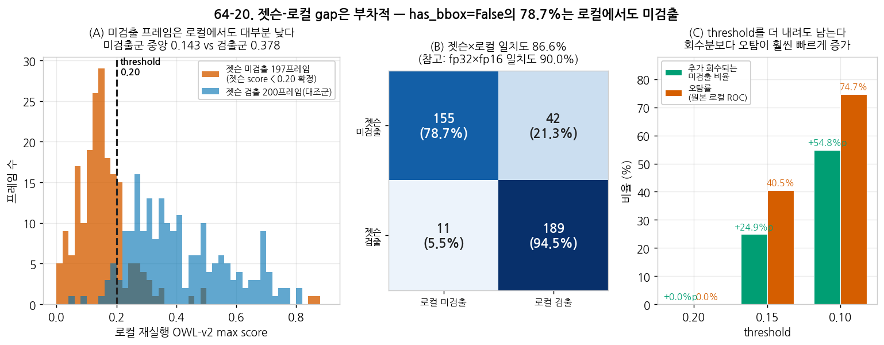
미검출 197프레임을 로컬 score 구간으로 쪼개보면 — "타겟이 안 보인다"가 아니라 "경계에 걸린다"
로컬 score해석건수
< 0.01
화면에 타겟 부재 추정
5 (2.5%)
0.01~0.10
매우 낮음
42 (21.3%)
0.10~0.20
보이지만 경계 바로 아래 — 지배 구간
108 (54.8%)
≥ 0.20
로컬은 검출 = 확정 gap
42 (21.3%)
즉 실패의 본질은 "타겟이 화면에 없다"(2.5%뿐)도 "젯슨이 심하게 고장났다"도 아니고,
confidence가 0.10~0.20 밴드에 몰리는 것(54.8%)이다 — 64-17에서 진단한 knife-edge 구조가
실패 프레임에서 그대로 확인된다. gap 42건도 중앙값 0.258로 대부분 경계 바로 위이고,
"바구니가 크고 명확한데 젯슨만 놓친" 심각 사례는 0.40 이상 5건 / 0.70 이상 2건에
불과하다 — 그래서 torch/Orin 규명의 실무 우선순위는 여전히 낮다.
📷 실제 미검출 프레임 10장 — 위 구간 비중대로 뽑은 대표 표본
(극단만 뽑으면 오해를 만들기 때문). 경계밴드 5장 · gap 3장 · 타겟부재 2장.
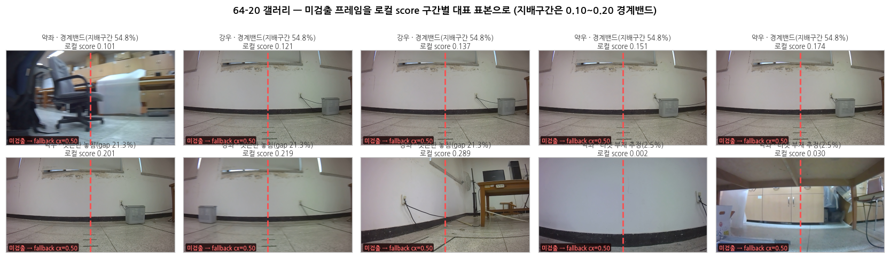
⚠️ 7/4 결론(CONCLUSION_20260704_fallback_repro_gap.md)
정정: 7/4 문서는 "서버 fallback 206프레임이 로컬에서 206/206(100%) 탐지됨 →
타겟 안 보임 가설 기각, Jetson-vs-local 환경 gap이 지배적 원인"이라고 결론했다. 그런데
그 100%는 "PG2/Kr/OWL 3모델 중 하나라도 박스를 냈으면
탐지"라는 훨씬 느슨한 기준이었다. 이번처럼
실제 운영 기준(OWL-v2 단독, threshold 이상)으로 재실행하면
78.7%가 로컬에서도 미검출이다. 즉
환경 gap은 미검출의 최대 21.3%만 설명하는 부차적 요인이고,
지배적 원인은 "이 프레임들이 OWL-v2에게 실제로 어렵다"는 것이다.
비대칭(21.3% vs 5.5%)이 계통편향의 증거인가 — 아니다:
방향성은 "젯슨이 약간 낮다"를 시사하지만, 미검출군이
경계에 훨씬 가까이 몰려있어(중앙 0.143 vs 0.378, 0.15~0.25 밴드 비율 34.5% vs 12.0%)
경계 근접성만으로도 이 비대칭의 상당부분이 설명된다. 따라서 계통적
젯슨-저편향으로 단정할 수 없다. 참고로 이 불일치 폭(13.4%)은
64-16의 fp32 vs fp16 불일치(10.0%)와 동급이라,
양자화 수준의 2차 효과로 보는 것이 적절하다.
실무 결론 — threshold 추가 인하는 답이 아니다:
로컬에서도 미검출인 155프레임의 로컬 score 평균은 0.1199이고 그중 54%가 0.15 이하다.
threshold를 0.20→0.15로 더 내려도 회수되는 건 +24.9%p뿐인데
오탐률은 0%→40.5%로 폭증(0.10이면 +54.8%p 회수 / 오탐 74.7%). 즉
0.20은 이미 합리적 지점이고, 남은 미검출은 캘리브레이션이
아니라 그라운더 자체의 능력 한계다.
💡 경량화 방향에 주는 최종 함의: 남은 실패가
"threshold로 못 건지는, 검출기에게 본질적으로 어려운 프레임"이라면, 개선 경로는
threshold 튜닝도 환경 정합도 아니라 더 나은/재학습된
검출기다. 이는 64-18의 함의(경량화는 "검출률을 잃지 않으면서 그라운딩을 싸게")를
한 단계 구체화한다 — 우리 도메인(회색 바구니, 극단 배치)에
특화된 소형 검출기를 직접 학습하는 것이, 범용 OWL-v2(1901.7ms)를 양자화로
깎는 것보다 경량화·정확도 양쪽에서 유망하다. 64-15가 제안한 파일럿 수집과 방향이 일치.

**🎯 64-21. 특화 검출기 스펙을 데이터로 정하기 — 그리고 "검출되면 성공"의 조건 정정 (2026-08-01)**

soda가 백필한 per-frame OWL-v2 confidence(docs/inference_sessions/backfill_scores/,
176세션 · 실제 검출 실행 1084프레임)로 "어떤 프레임이 검출기에게
어려운가"를 분석했다. 64-20의 결론(개선 경로는 캘리브레이션이 아니라 검출기 자체)을
실행 가능한 스펙으로 옮기기 위한 단계다.
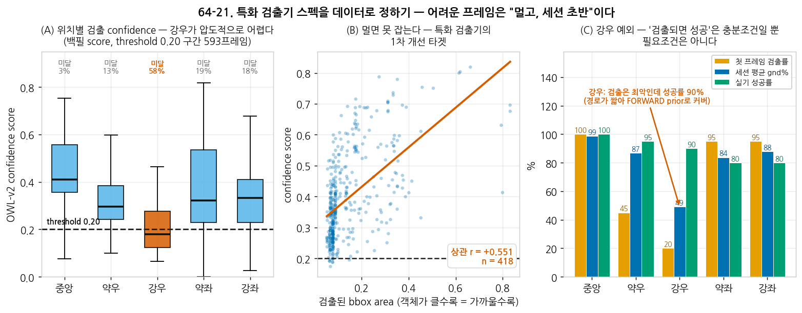
① 어려움의 1차 축은 거리(=bbox 크기)다 —
검출 성공 프레임에서 area와 confidence의 상관이 r=+0.551
(n=418). 4분위로 나누면 score 중앙값이 0.320 → 0.330 → 0.444 → 0.519로 단조 증가한다.
즉 멀리 있는(작은) 바구니를 못 잡는다.
반면 화면 가장자리 여부(|cx−0.5|)와의 상관은 −0.189로 약하다 —
"가장자리"보다 "거리"가 지배적이다.
② 위치별 난이도 — 강우가 압도적으로 어렵다
(동일 체크포인트 · threshold 0.20 구간 593프레임):
위치score 중앙값threshold 미달첫 프레임 검출률세션 gnd%실기 성공률
중앙
0.411
3.0%
100%
98.8%
100%
약우
0.297
12.7%
45%
86.8%
95%
강우
0.180
57.7%
20%
49.1%
90%
약좌
0.327
19.9%
95%
83.8%
80%
강좌
0.333
17.9%
95%
87.8%
80%
⚠️ 64-19의 주장에 조건을 붙여야 한다 — 강우 예외
강우는 gnd% 49.1%(최저) · 첫 프레임 검출률 20%(최저)인데
실기 성공률은 90%다. 즉 "그라운딩이 되면 거의 반드시
성공한다"(gnd%≥80 → 98.8%)는 여전히 유효하지만, 그 역은 성립하지 않는다 —
검출이 안 돼도 성공할 수 있다.
메커니즘: 강우는 검출되는 순간의 area가 0.192로
가장 크고(=이미 가까워진 뒤에야 잡힌다), 평균 스텝이 10.2로 가장 짧다(나머지 14.5).
즉 초반엔 못 보지만 경로가 짧아 FORWARD 편중 prior(71~74%)로
대충 접근한 뒤, 가까워져서 검출이 붙으면 후반에 보정되는 패턴이다.
"검출 성공률 = 주행 성공률"이 아니라, 배치 기하학이 관대하면
정책 prior가 인식 실패를 가려준다. 논문에서 인과를 주장할 때 반드시 붙일 조건이다.
③ 세션 진행도와는 무관 — 0~25% / 25~50% / 50~75% /
75~100% 구간의 threshold 미달률이 33.3 / 35.7 / 31.0 / 33.5%로
평탄하다. "초반에만 어렵다"가 아니라 거리가 먼 프레임이
어렵고, 그것이 세션 초반에 몰려 있을 뿐이다(강우 첫 프레임 검출률 20%가 그 증거).
💡 도출된 특화 검출기 스펙
- 최우선 개선 대상 = 원거리 소형 객체
(area 0.05~0.09 구간, score 중앙 0.32 — threshold 0.20에서 간신히 통과).
이 구간을 0.5 이상으로 올리는 것이 목표.
- ⚠️ 정정(soda 지적, 2026-08-01) — 처음엔 "강우·약좌
초반 프레임에 가중"이라고 썼으나, 이 카드가 발견한 2축
분해와 스스로 모순된다. confidence 단독으로 뽑으면 강우가 표본의
50.7%를 차지하는데 강우의 실패 기여는
18.2%뿐이다(검출 어려움/주행 쉬움).
실패의 72.8%는 강좌+약좌인데 confidence 가중으로는
37.2%만 받는다. → 샘플링 기준은
confidence × 위치별 실패 기여도여야 한다.
- 평가 지표는 "score ≥ 0.5 비율"이 아니라 "threshold 0.20에서의
검출률" — 실기와 직결되는 것은 후자다. 대조군은 현재 OWL-v2 fp32.
- 대상이 회색 바구니 단일 클래스로 고정이라 범용 open-vocabulary 능력은 불필요 —
이것이 경량화 여지의 근거다(64-20 결론).
데이터 출처: soda의
scripts/backfill_grounding_scores.py --real-only 결과(1084프레임 / 37분, 커밋 5e3c55fe).
soda 자체 검증에서 백필 score 기반 예측 검출률과 실측 has_bbox율이 위치별 ±11%p 내
일치(중앙 0.0%p)했고, 잔차는 area/cy 필터가 score 통과분을 추가로 거르기 때문으로 설명됨.

**64-7. 종합 결론 & 다음 단계**

막다른 길로 확인된 것: 헤드 교체(mlp≈chunk≈hybrid),
그라운더 교체(PG448≈OWL), 연속화(전부 악화), 학습 트릭(부스트/오버샘플/혼합 전부 무효),
end-to-end 언어조건화(CH61 text 경로 사망 + PG2도 방향 spread 1.4%p로 미약).
유일하게 남은 근본 해법 — 트랙C 재수집: 실패의 본질이
"곡선에서 어긋났을 때 되돌리지 못함"이고, 그 원인이 "오버슈트→재보정 궤적의 부재"이므로,
의도적으로 과하게 꺾었다 되돌리는(overshoot→recover)
궤적을 극단 cx에서 반복 수집하는 트랙C(64ep)가 정확히 이 빈틈을 메운다. 부수 효과로 표본이
289ep로 늘어 33ep val의 ±6.5%p 노이즈도 완화.
실기 테스트 판단: 지금 시점 soda 실기는 "성능 검증"으로는
의미 낮음(곡선 실패 재확인일 뿐 + 노이즈로 1회 판단 불가). 단 offline
재생 ↔ 실기의 gap을 처음 측정하는 캘리브레이션 용도로 쉬운 코스 1회는 가치 있음.
본격 실기 검증은 트랙C 재학습 이후.
배포 후보(현재): pg448_trackF/mlp 또는
owl_trackF/mlp (best 48.5%, 평균 39.4%) — 가장 단순하고 상위권 동률.
단 실기는 노이즈 ±6.5%p 때문에 반드시 반복 측정.
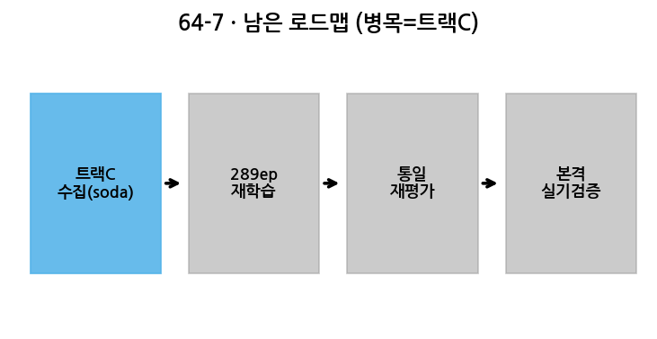

<a class="src-link" href="../v5/research_story.html#ch64">→ 원문 전체 보기 (research_story.html#ch64)</a>

CH 67 차기 경량 구성 후보 검정 — Edge-grounding-VA에서 VLA로 갈 때 무엇을 고를 것인가

2026-08-04 논의에서 나온 차기 구성 후보들을 기존 실측과 대조하는 챕터. 교수님이 제안하신 OWL-v2 + Florence-2 조합과, 로드맵의 세 항목(양자화 · 연속형 헤드 · 언어 축소)을 각각 검정한다. 결론을 내리는 챕터가 아니라 "무엇을 확인해야 하는지"를 고정하는 챕터다 — 진행 중 항목은 그대로 표시한다.

🟣 3줄 요약
① Florence-2는 파라미터 근거가 강하다 — 231.4M vs Kosmos-2 1664.5M (실측). 경량화엔 유리.
② 그런데 우리 실측 2건에서 탈락한 이력이 있다 — cx max=0.56 구조적 우편향, 실주행 전이 급락(85.7%→15.0%).
③ 검정 완료 — 제안이 성립한다. 비전 백본으로 쓰면 cx MAE 0.0015(Kosmos-2 0.0020보다 25% 우세), 예측 cx가 라벨 최대값(0.8612)을 정확히 따라가 우편향 천장이 없다. CH59 결함은 OVD 헤드 문제였다.

**67-1. 2026-08-04 논의 기록 — 합의된 방향**

항목내용
현재
Edge-grounding-VA — 언어 조건화 없음. OVD + 비전 + 이산 액션 헤드
추후
Edge-grounding-VLA — language를 넣어 하나의 VLA 모델로 통합
목표 구성(초안)
OWL-v2 + Kosmos-2 backbone + π0 계열 Flow Matching 액션 헤드
이산 → 연속형 전환 · 언어 파라미터 1B 수준으로 축소 · OWL-v2 지연은 양자화로
교수님 제안
(19:30)
"추후 OWL-v2 + Florence-2 모델이 경량 VLA 모델을 만들기에는 더 좋은 조합인 것 같아"
포지셔닝
MobilityVLA와 정면 경쟁 아님 — 일반적이지 않은 경우에 적용하는 VA 시스템(엣지 제약이 핵심)
Kosmos-2 선택 근거
선행연구 RoboVLMs에서 Kosmos-2가 가장 효과 좋았기 때문. 임의 선택이 아니라 실측 승계
⚠️ 단 "RoboVLMs 기반"이라 쓰면 사실과 다름 — 코드는 미포함(CH65, 모델 구조 자료 7절)
상세 로드맵: docs/plans/plan_20260804_roadmap_edge_grounding_vla.md

**✅ 67-2. Florence-2 검정 — 교수님 제안대로 유효. 파라미터 3.4배 작고 정확도는 25% 더 좋다**

① 파라미터 근거는 강하다 (실측)
모델전체비전언어
Kosmos-2 (현재)
1664.5M
303.2M
1361.3M
Florence-2-base
231.4M
90.4M
140.2M
전체 7.2배, 비전 3.4배 작다. 엣지·라즈베리파이 목표에서 교수님 제안의
근거는 타당하다. 특히 언어를 넣어야 하는 VLA로 가면 Kosmos-2의 1.36B 언어 디코더가
부담이 되는데(현재는 로드 자체를 제거한 상태), Florence-2는 140.2M로
"언어를 1B 이하로"라는 로드맵 목표를 자연히 만족한다.
② 그런데 우리 실측 2건에서 탈락한 이력이 있다
실험Florence-2대조군
CH59 5-Model 셀프라벨링
사람 라벨 185프레임, 2026-06-30
L/R 정확도 51.8%
(검출률 185/185)
Kr · PG448 · OWL-v2
모두 99.1%
CH55 계열 백본 파인튜닝
2026-06-29
v5 85.7% → sess 15.0%
OWL-v2 LoRA
v5 68.6% → sess 47.2%
CH59의 원인은 구조적이다 — cx max = 0.559로
화면 우측 절반을 아예 예측하지 못한다. 검출은 100% 되는데
좌표가 왼쪽에만 몰린다. 당시 판정이 문서에 남아 있다:
"Florence-2 제외 — 구조적 우편향(cx max=0.56), 수정 방법 없음".
CH55 계열은 일반화 문제다 — 학습셋(v5)에서는 85.7%로 가장
높은데 실주행(sess)에서 15.0%로 무너진다. 학습셋 성적이 가장 좋은
모델이 실기에서 가장 나빴다는 점에서, 이 프로젝트가 반복해 확인한
"offline≠실기" 패턴의 또 다른 사례다.
③ 단 위 두 실측은 사정거리가 다르다 — 그래서 기각하지 않는다
두 실험 모두 Florence-2를 OVD(검출) 출력으로 썼다.
cx max=0.56 결함은 OVD 헤드의 좌표 출력 문제다.
교수님 제안은 Florence-2를 비전/언어 백본으로 쓰자는
뜻으로 읽히고, 그 경우 검출은 OWL-v2가 담당하므로
Florence-2의 OVD 좌표 결함은 경로에서 빠진다. patch 피처 자체는 멀쩡할 수 있다.
→ 즉 "OWL-v2(검출) + Florence-2(비전 피처) + 액션 헤드"는
아직 측정한 적이 없는 조합이고, 우리 negative 결과의 사정거리 밖이다.
④ 검정 설계 — 65-5와 완전히 같은 조건으로 백본만 교체
CH65 65-5에서 Kosmos-2 patch 피처(16×16×1024) 위에 0.279M heatmap 헤드를 올려
cx MAE 0.0020을 얻었다. 같은 라벨·같은 분할(V6 seed42)·같은 헤드로
Florence-2 피처만 바꿔 넣으면 apples-to-apples 비교가 된다.
백본비전 파라미터cx MAE지연상태
Kosmos-2 vision
303.2M
0.0020
53.7ms
측정 완료(65-5)
Florence-2 vision
90.4M
0.0015
59.6ms
✅ 완료
판정 기준을 미리 고정한다(사후 변경 금지):
- cx MAE가 Kosmos-2와 동등 이내면 → 비전 백본으로 유효.
파라미터 3.4배 절감이 그대로 이득
- MAE가 유의하게 나쁘면 → CH59의 결함이 OVD 헤드가 아니라
피처 자체에서 온다는 뜻. 그 경우 교수님 제안은 성립하지 않고, 근거를 제시할 수 있다
- area 구간별·좌우별 필수 보고 — 전체 평균만 보면
CH59의 우편향 같은 구조적 결함을 놓친다. 특히 cx>0.5 구간을 따로 본다
⑤ 결과 (2026-08-04) — 제안이 성립한다
지표Kosmos-2Florence-2상대비
cx MAE (val 843)
0.0020
0.0015
0.76배 (25% 우세)
비전 파라미터
303.2M
90.4M
0.30배 (3.4배 작음)
비전 백본 지연
53.7ms
59.6ms
1.11배 (11% 열세)
공간 그리드
16×16 (224px 입력)
24×24 (768px 입력)
해상도 1.5배
area MAE
0.0036
0.0020
0.56배
정확도는 더 좋고 크기는 3.4배 작다. 유일한 열세는 지연 11%인데,
이는 입력 해상도 차이(768px vs 224px)에서 오는 것으로 해상도를 낮추면
조정 가능한 항목이다. 그리고 24×24 그리드가 16×16보다 세밀해 작은 객체 구간에서 유리하다.
⑥ 결정적 검증 — CH59의 우편향은 재현되지 않았다
구분예측 cx 최대값판정
val 라벨 최대값 (기준)
0.8612
—
Florence-2 피처 + 우리 헤드
0.8616
천장 없음
Kosmos-2 (같은 val)
0.8573
정상
Florence-2 OVD (CH59)
0.559
라벨 무관하게 막힘
라벨이 0.8612까지인데 0.8616을 예측했다 — Kosmos-2(0.8573)보다도
오히려 더 정확히 따라간다. 좌/우 구간별 cx MAE도 0.0014 / 0.0016으로 균등하다.
즉 CH59의 cx max=0.559는 OVD 헤드의 좌표 출력 문제였고,
비전 피처 자체는 정상이다. ③에서 세운 "사정거리가 다르다"는 가설이 확인됐고,
교수님 제안은 성립한다.
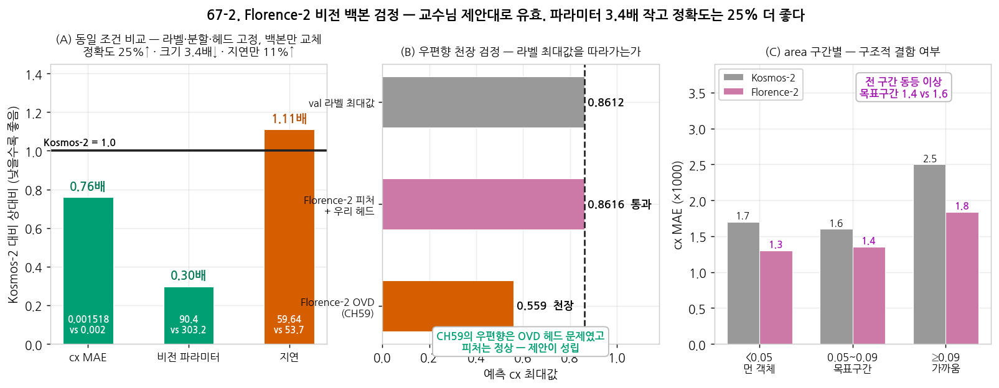
📝 판정 기준을 스스로 수정한 부분 — 사전에 "예측 cx가 0.9 이상이면
피처 정상"이라고 적었으나, 이는 val 라벨 범위를 모르고 잡은 임의값이었다.
올바른 기준은 "라벨 최대값을 따라가는가"이며, 그 기준으로는
0.8616 vs 라벨 0.8612로 완전 통과다. 기준의 형식은 바꿨지만
의도(천장 존재 여부)는 유지했음을 밝힌다.
⑦ 남은 확인 사항 — 이 결과로 말할 수 없는 것
- CH55계열의 일반화 문제는 검정되지 않았다 —
v5 85.7% → 실주행 15.0% 급락은 파인튜닝 상황에서
나온 것이고, 이번 실험은 frozen 피처 + 얕은 헤드다.
조건이 달라 재현 여부를 말할 수 없다. 실기 프레임 평가가 필요하다
- has_bbox는 여전히 미해결 — 65-6과 같은 문제
(학습셋 negative 0건)가 백본을 바꿔도 그대로 남는다. 백본 선택과 무관한 별개 과제다
- 실기 세션 프레임(176세션)에서의 평가는 아직 안 했다 — V6 조작 데이터 기준 결과다
- 언어 성능은 측정하지 않았다 — 이번엔 비전 백본으로서만
검정했다. VLA로 갈 때 Florence-2 언어부(140.2M)의 성능은 별도 검정이 필요하다
※ 스크립트: scripts/detector_florence2_backbone.py ·
결과: docs/v5/detector/florence2_backbone.json · 로봇 불필요, 약 40분 소요.

**⚠️ 67-3. 로드맵 3개 항목 — 자체 실측과 충돌하므로 "왜 이번엔 다른가"에 답이 필요**

폐기하자는 뜻이 아니다. 이미 측정으로 기각된 선택을 모르고 반복하지 않도록 근거를 붙여둔다.
① OWL-v2 양자화로 지연 해결 → 검출률을 파는 트레이드
방식지연검출률
fp32 (현재)
1901.7ms
100%(기준)
fp16 양자화
962.1ms (1.98배↑)
90.0% (−10%p)
Kosmos-2 patch 헤드
65-5, 이미 검증
53.8ms (35.3배↑)
손실 없음
(단 has_bbox 미해결)
검출률이 곧 실기 성공률이다 — gnd%≥80이면 98.8%(79/80),
80% 미만이면 51.2%(64-18). 양자화는 성패를 가르는 그 변수 하나를
팔아서 속도를 사는 구조다. 반면 특화 검출기는 양자화보다
18배 큰 개선을 검출률 손실 없이 낸다.
→ 권고: 양자화 대신 특화 검출기 경로를 우선.
양자화를 쓴다면 "−10%p를 어떻게 보상하는가"에 답이 있어야 한다.
② 이산 → 연속(π0 Flow Matching) → 이 규모에서 기각됨
헤드best (225ep, pg448)
mlp (이산)
77.9% ← 현재 배포
cxgeom (이산)
76.6%
contreg (연속, 단일회귀)
74.7%
flow (연속, π0 경량판)
72.0% (owl 71.3%)
자매 프로젝트 MoNa-pi(π0 계열 풀 구현, AdaLN-Zero)도 closed-loop
45.8%였다. "헤드를 연속/flow로 바꾸면 저절로 좋아진다"는
가설이 225ep 규모에서 기각됐다(CH63 63-6).
추가 제약이 하나 더 있다 — 로봇 펌웨어가 속도 크기를 무시하고
방향만 사용한다(상수속도 구조, soda 확인). 연속 출력의 이점이
하드웨어 단계에서 잘려나간다.
→ 권고: 연속형 전환은
데이터 규모 확대 + 펌웨어 속도 반영과 묶어서 계획. 둘 중 하나라도 없으면 같은 결과가 나온다.
③ 언어 파라미터 1B로 축소 → 방향은 맞지만 전제 확인 필요
현재 Kosmos-2 언어 디코더 1.361B는 호출이 0회이고,
이번에 로드 자체를 제거해 peak host RAM을
10.59GB → 3.20GB(−70%)로 줄였다. 즉 지금은 "언어를 안 쓰는 대신 RAM을 확보한" 상태이고,
VLA로 가면 그 RAM을 다시 쓴다.
V5에서 text attention이 0.000%였고(Exp17~41C,
head-only에서도 재현) 프롬프트를 어떻게 바꿔도 방향 정확도가 개선되지 않았다(CH58).
→ 권고: "언어를 넣어서
무엇이 좋아지는가"를 보일 과제 설계가 선행돼야 한다. 예를 들어
다중 객체를 배치하고 지시문으로 타겟을 고르게 하는 과제라면
언어의 기여를 정량화할 수 있다. 현재의 단일 객체(회색 바구니) 과제에서는
언어를 넣어도 파라미터만 늘어난다.
※ Florence-2를 쓰면 언어가 140.2M이라 이 목표는
자연히 만족된다(67-2 ①) — 즉 ③과 교수님 제안이 서로 맞물린다.

**67-5. 비전 백본 스윕 — "얼마나 작아져도 좌표가 유지되는가"**

67-2에서 Florence-2 비전(90.4M)이 Kosmos-2 비전(303.2M)보다 나쁘지 않았다. 그러면 다음 질문은
"어디까지 줄일 수 있는가"다. 경량화가 논문 방향이므로
이 곡선 자체가 근거가 된다.
먼저 방법론 정정 — 65-5(Kosmos-2)와 67-2(Florence-2)는
각각 단일 seed였다. 0.0015 vs 0.0020 같은 작은 차이를
순위로 주장하려면 seed 변동을 알아야 한다. 그래서 이 스윕은
기존 두 결과까지 포함해 6개 백본 전부를 3 seed로 다시 측정했다
(캐시된 피처 재사용, 헤드만 재학습).
apples-to-apples — 백본만 바뀐다: V6 pg448 라벨(LIVE &
detected, n=5,752 / val 843) · seed42 에피소드 단위 분할 · PatchHead 동일 구조
(Conv1×1→Conv3×3→heat 1ch→soft-argmax) · AdamW 1e-3 · 60 epoch · L1(cx)+L1(cy)+2·L1(area)
백본비전(M)griddim입력cx MAE (3 seed)area MAE지연pred cx max
MobileNetV3-S
0.93
14
576
448
0.0021±0.0000
0.0026
7.0ms
0.861
EfficientNet-B0
4.01
14
1280
448
0.0023±0.0001
0.0028
8.3ms
0.865
Florence-2 DaViT
90.4
24
1024
768
0.0017±0.0002
0.0025
59.6ms
0.861
CLIP ViT-L/14
303.2
16
1024
224
0.0045±0.0001
0.0042
52.9ms
0.861
Kosmos-2 (현재 배포)
303.2
16
1024
224
0.0019±0.0000
0.0031
53.7ms
0.861
SigLIP-so400m
428.2
27
1152
384
0.0022±0.0001
0.0039
82.4ms
0.866
헤드 파라미터 0.222~0.312M (입력 dim에만 의존).
pred cx max는 라벨 val 최대값 0.8612를 추종해야 정상 — 6개 전부 추종했다
(CH59 Florence-2 OVD가 0.559에서 막혔던 실패 모드는 재현되지 않음).
지연은 비전 forward만, 720×1280 1장, 로컬 GPU 기준 — 젯슨 실측 아님.
① 가장 큰 결과 — 0.93M로도 동등하다
MobileNetV3-Small 0.93M이 cx MAE
0.0021로 Kosmos-2 0.0019와 사실상 같다
(사전 고정 기준 ⑤: 최대 백본 mean+1std = 0.0024 이내 → 동등).
파라미터는 326배 작고 비전 지연은
53.7 → 7.0ms (7.7배↓)다.
ImageNet 분류 사전학습만 받은 CNN인데 좌표 회귀에서 밀리지 않는다.
② 파라미터가 성능을 예측하지 못한다 — CLIP-L 반례
CLIP ViT-L/14는 Kosmos-2와 완전히 같은 303.2M·16×16·1024dim인데
cx MAE가 0.0045로 2.4배 나쁘다 — 6개 중 유일한 '열등'.
게다가 가장 큰 SigLIP-so400m(428.2M)도 0.0022로 0.93M MobileNet과 같은 급이다.
→ 즉 "클수록 좌표가 정확하다"는 관계가 없다.
Kosmos-2·Florence-2가 잘하는 이유는 크기가 아니라
그라운딩(위치 지정) 사전학습을 받았다는 점으로 설명되고,
CLIP은 이미지 전체를 한 벡터로 맞추는 대조학습만 받아 패치의 위치 정보가 상대적으로 약하다.
단 이건 관측에 대한 해석이며, 사전학습 목적을 통제한 실험으로
분리한 것은 아니다.
좌/우 · 거리 구간별 — 전체 평균이 구조적 편향을 가리므로 필수 보고:
백본좌 (cx<.5)우 (cx≥.5)far <0.05mid 0.05~0.09near ≥0.09
MobileNetV3-S
0.0019
0.0023
0.0017
0.0018
0.0028
EfficientNet-B0
0.0021
0.0025
0.0017
0.0016
0.0032
Florence-2
0.0015
0.0018
0.0013
0.0013
0.0022
CLIP ViT-L/14
0.0041
0.0049
0.0042
0.0028
0.0057
Kosmos-2
0.0018
0.0019
0.0016
0.0016
0.0022
SigLIP-so400m
0.0022
0.0023
0.0020
0.0019
0.0027
③ 좌우 비대칭은 백본 문제가 아니다 — CH66과 맞물리는 부분
6개 전부 우측 cx MAE가 좌측보다 근소하게 크다
(Kosmos-2 0.0018/0.0019 ~ EffB0 0.0021/0.0025). 차이가 작고
백본을 바꿔도 방향이 유지되므로, 이건 백본 특성이 아니라
라벨 분포(우측 표본이 near 구간에 더 많음) 쪽 설명이 자연스럽다.
CH65 65-7에서 측정한 그라운더의 좌측 이점(+0.0118)과도
부호가 반대다 → 두 현상은 별개다.
→ CH66의 결론(원인은 액션 헤드의 고정 우측 선호)을
백본 교체로는 건드릴 수 없다는 뜻이고, 실제로 65-9의 미러 증강이 그 지점을 고쳤다.
⚠️ 이 실험이 말하지 않는 것 — 가장 중요
cx MAE는 탐지에 성공한 프레임에서의 좌표 정확도다.
has_bbox 판정(객체 부재/미검출 인지)은 라벨이 없어 평가하지 못했다
(CH65 65-6, 학습 데이터의 has_bbox=False가 0/16,599).
그런데 CH64 64-18에서 실기 성패를 가른 변수는 좌표 정확도가 아니라
그라운딩 가용성이었다 (gnd%≥80 → 98.8% vs <80 → 51.2%).
→ 따라서 주장할 수 있는 것은 "좌표 회귀에서는 0.93M로도
동등하다"까지이며, "MobileNet으로 교체 가능"은 아니다.
negative 프레임 확보 후 has_bbox까지 평가해야 교체 판단이 가능하다.
경량화 논문에 주는 함의 — "큰 VLM을 줄였다"가 아니라
"이 과제에서 좌표 회귀는 애초에 큰 백본을 요구하지 않는다"가
더 정확한 프레이밍이다. 그리고 남은 병목이 좌표가 아니라 검출
가용성이라는 점이 CH64·CH65와 일관된다.
스크립트 scripts/detector_backbone_sweep.py
· 결과 docs/v5/detector/backbone_sweep.json

**67-6. Florence-2 언어부 검정 — 부재를 판정하지 못한다 ⭐**

67-2·67-5가 검정한 것은 Florence-2의 비전 타워(90.4M)였다.
교수님 제안("OWL-v2 + Florence-2 조합")의 나머지 절반인
언어부(140.2M)는 68-5 미해결 질문 ①로 남아 있었다 — 그것을 측정했다.
설계 — 68-7(OWL-v2)과 완전히 같은
200프레임·같은 phrase 5종·같은 지표로 그라운더만 교체.
Florence-2는 <CAPTION_TO_PHRASE_GROUNDING> 태스크로
언어부가 텍스트를 해석해 위치를 내놓는 경로를 쓴다.
phraseFlorence-2 검출률OWL-v2 (68-7)F2 cx 평균F2 조향부호 반전율OWL 반전율
"gray basket" (배포값)
100.0%
91.0%
0.488
기준
기준
"chair"
100.0%
35.5%
0.427
36.0%
55.1%
"person"
100.0%
0.0%
0.501
44.5%
평가불가
"door"
100.0%
5.5%
0.421
42.0%
72.7%
"microwave oven" (부재 대조군)
100.0%
5.0%
0.537
39.0%
90.0%
① 5종 전부 100% 검출 — 부재 판정 능력이 0이다
장면에 없는 "microwave oven"에도 200/200 프레임에서 박스를
냈다. OWL-v2는 같은 조건에서 5.0%였다. Florence-2의 phrase grounding은
"찾아라"는 요청에 항상 위치를 답하도록 학습된 경로이고,
임계값 같은 억제 장치가 없다(score를 아예 반환하지 않는다).
→ 그런데 CH64 64-18에서 실기 성패를 가른 변수가 그라운딩
가용성이었다(gnd%≥80 → 98.8% vs <80 → 51.2%). 항상 검출한다는 것은
gnd% 100%가 아니라 gnd%가 무의미해진다는 뜻이다 —
틀린 위치를 자신 있게 주는 쪽이 미검출보다 위험하다.
결론: 검출기 자리에 Florence-2 언어부를 놓을 수 없다.
② 조향 부호 반전율도 전부 50% 미만
chair 36.0% (OWL 55.1%), door 42.0% (OWL 72.7%). 항상 무언가를 짚기 때문에
cx가 중앙 부근으로 몰린다(cx 평균 0.421~0.537).
즉 지시문을 바꿔도 방향이 갈리지 않는다 —
L1 데모 용도로도 OWL-v2보다 못하다.
③ 그런데 CH59의 우편향 결함은 재현되지 않았다 — 정정
CH59에서 Florence-2 OVD의 예측 cx가 0.559에서 막혀
화면 우측 절반을 짚지 못했고(L/R 51.8%), 그것이 탈락 근거였다.
이번 측정의 예측 cx 최대값은 0.9955다.
67-5의 비전 피처 경로(0.8613)에서도 재현되지 않았다.
→ 즉 CH59의 0.559 상한은 Florence-2의 구조적 결함이
아니었을 가능성이 높다(태스크 토큰·후처리 등 당시 설정 문제로 추정).
단 당시 설정을 재구성해 원인을 특정한 것은 아니므로,
"CH59가 틀렸다"가 아니라 "그 결함을 재현하지 못했다"까지만 기록한다.
④ 교수님 제안은 정확히 맞는 방향이었다 — 단 역할 분담이 중요하다
세 실험을 합치면 "OWL-v2 + Florence-2"가 옳은 조합인 이유가
구체화된다:
역할담당근거
검출 + 부재 판정
OWL-v2
부재 대조군 5.0%로 억제 가능. 임계값으로 제어됨 (67-6 ①)
비전 피처
Florence-2 비전 타워
cx MAE 0.0017, Kosmos-2 대비 파라미터 3.4배↓ (67-2 · 67-5)
검출 (대안 후보)
Florence-2 언어부
부재 판정 0% → 탈락 (67-6 ①②)
즉 Florence-2는 "언어부를 쓰는 모델"로서가 아니라
"비전 타워만 떼어 쓰는 모델"로 채택 가치가 있다. 그리고 그렇게 쓰면 언어부 140.2M은
로드하지 않아도 되므로, 실제 적재량은 90.4M이 된다
— Kosmos-2 디코더 제거(호스트 RAM −70%)와 같은 종류의 이득이다.
⚠️ 한계 — ⓐ Florence-2는 score를 반환하지 않아
OWL-v2와 동일한 임계값 실험을 할 수 없었다.
따라서 "임계값을 붙이면 부재 판정이 가능해지는가"는 미검정이다.
ⓑ 최대 면적 박스를 채택했는데(score가 없으므로), 다른 선택 규칙이면 수치가 달라질 수 있다.
ⓒ V6는 바구니 주행용 데이터라 "person"·"microwave oven"이 실제 부재라는 판정은
사전 가정이고 사람이 전수 확인한 것은 아니다.
스크립트
scripts/l1_florence2_grounder.py · 결과
docs/v5/detector/l1_florence2_grounder.json · 표본 68-7과 동일 200프레임

**67-7. 그라운더 재현율 실측·상한 확인, 그라운더/비전인코더 개별·통합 Stage2 비교 (2026-08-19)**

OWL-v2와 완전히 같은 2026-08-07 100세션 1087프레임에서
Florence-2 `<OD>`/`<DENSE_REGION_CAPTION>` 재현율을 직접 측정하고,
beam5·합집합·키워드 확장까지 다 시도해 상한을 확인했다.
재현율 실측 (OWL-v2 90.5% 대비)
방식
재현율
OD(beam3)
19.4%
DENSE_REGION_CAPTION(beam3)
28.4%
OD(beam5)
20.7%
DENSE(beam5)
31.9%
OD∪DENSE(beam5) — 최선
34.7%
키워드 어휘 확장(laundry/garbage/bucket 등)
효과 0.0%p
키워드 확장이 전혀 효과가 없었다는 건 병목이 매칭 규칙이 아니라
Florence-2가 해당 프레임에서 물체 자체를 인식/서술하지 못한다는
뜻이다. beam·합집합을 최대로 밀어붙여도 34.7%가 상한이며 OWL-v2와 55%p 이상 격차 — 검출기
교체 기각 확정.
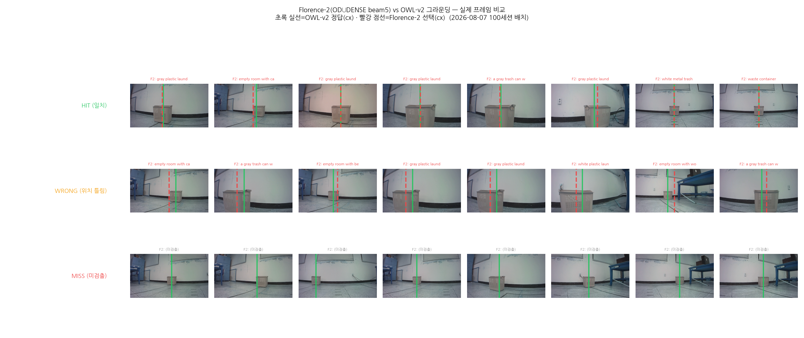
MISS 카테고리를 보면 바구니가 화면에 명백히
보이는데도 Florence-2가 "empty room with cabinet" 등 무관한 라벨만 뱉어 놓친 경우가
대부분 — 매칭 실패가 아니라 인식 실패.
Stage2 재학습 — 그라운더·비전인코더 개별 교체 vs 완전 통합
(exp73과 동일 조건, window=6·bbox_scale=3.0·3-seed. 요인 교란 방지를 위해 한 번에 하나씩
바꿔서 검증한 뒤, 마지막에 exp75로 합쳤다.)
실험
그라운더
비전인코더
val_acc mean
비고
exp73(베이스라인)
OWL-v2
Kosmos-2
73.87%±0.20%p
현재 배포
exp74(비전만)
OWL-v2
Florence-2
75.15%±0.09%p (+1.29p)
RIGHT -8.5p 회귀
그라운더 스왑(bbox만)
Florence-2
Kosmos-2
73.26%±0.29%p (-0.61p)
L -13.8p, ROT_L -16.7p 회귀
exp75(완전 통합)
Florence-2
Florence-2
73.52%±0.25%p (-0.35p)
L 53.7%(여전히 낮음), ROT_L/ROT_R은 67~68%로 회복(비전 교체 효과)
exp75은 그라운더 스왑 단독(73.26%)보다 소폭 낫고 exp74 비전 단독(75.15%)보다는 낮다 —
비전 교체의 회전 클래스 개선(ROT_L/ROT_R)은 그라운더를 같이
바꿔도 유지되지만, 그라운더 교체로 인한 LEFT 클래스
손상은 비전을 같이 바꿔도 회복되지 않는다 — 두 손실이 서로 다른 메커니즘(그라운더는
L 방향 bbox 자체가 부정확, 비전은 회전 관련 특징 표현력)임을 시사.
텍스트 프로젝션/인코더는 어떤 실험에서도 안 건드렸다(Kosmos-2 text_model 그대로,
배포 시 호출 안 되는 컴포넌트).
스크립트
scripts/florence2_grounding_0807_fullbatch.py ·
scripts/florence2_grounding_0807_variants.py ·
scripts/train_exp75_florence2_full_stage2.py ·
결과 docs/v5/detector/florence2_grounding_0807_variants.json,
docs/v5/closed_loop_eval/exp75_florence2_full_stage2.json

**🔄 67-8. 판정 뒤집힘 — 명시적 phrase 지정으로 재현율 34.7%→84.96% (2026-08-20)**

67-7까지 전부 "열린 질문"(`<OD>`/`<DENSE_REGION_CAPTION>` —
"이 방에 뭐가 있는지 다 말해봐" 후 우리가 키워드로 골라내는 방식)으로만 테스트했다.
OWL-v2처럼 타겟 문구를 직접 지정하는
`<CAPTION_TO_PHRASE_GROUNDING>` + phrase="gray basket"은 한 번도 시도하지 않았었다 —
해봤더니 완전히 다른 결과가 나왔다.
방식
재현율
OD∪DENSE(beam5, 열린 질문 최선, 67-7)
34.7%
CAPTION_TO_PHRASE_GROUNDING + "gray basket"
84.96%
OWL-v2(기준)
90.5%
cx MAE 0.0228, median AE는 0.0021로 맞을 때는 거의
완벽하게 맞는다(평균은 소수 큰 오차 사례에 끌려 올라간 것). 같은 100세션 1087프레임,
같은 OWL 정답 기준.
단, 아직 결론 못 내리는 이유 — 이 태스크는
거부 모드가 없다(coverage 100%, owl_success=0인
103프레임에도 무조건 뭔가 짚음). 타겟이 화면에 없을 때 "없다"고 말 못 하고 계속
어딘가를 가리키는 게 실전에서 얼마나 문제가 될지(오탐률/정밀도)는
아직 측정 못 했다 — "OWL이 실패한 프레임이 진짜 타겟 부재인지, OWL도 놓친 건지"를
구분할 독립적 정답이 없어서다. 이 부분이 해소되기 전까지 검출기 교체 기각 판정을
최종 확정하지 않는다.
스크립트
scripts/florence2_phrase_grounding_test.py · 결과
docs/v5/detector/florence2_phrase_grounding_0807.json · 인터랙티브 확인:
scripts/label/serve_florence2_owl_compare.py (localhost:7795 `/live`,
`<CAPTION_TO_PHRASE_GROUNDING>` 옵션)

**67-4. 진행 순서 — 엣지 목표에 가장 빠른 경로**

순위항목로봇근거
0
Florence-2 비전 피처 검정 ✅ 완료
❌
제안 성립 확인 — cx MAE 0.0015, 파라미터 3.4배↓ (67-2 ⑤⑥)
1
특화 검출기 완성 (negative → has_bbox)
⚠️ 수집만
35.3배 개선이 이미 검증됨. 양자화보다 우선
2
기구 편향 검정
⚠️ 측정만
CH66 미검증 항목. 주행 불필요
3
데이터 규모 확대 (트랙C 등)
✅
②의 전제 조건
4
언어 조건화 과제 설계
❌
③의 전제 조건 (다중 객체 지시문 선택 등)
5
연속형 액션 헤드
✅
3 + 펌웨어 속도 반영이 선행돼야 함
검출 단계가 전체 지연의 97%(1901.7ms / 약 1956ms)를
차지하므로, 여기서 35배를 줄이면 나머지 최적화는 부차적이 된다. 그래서
엣지 목표에 가장 빠른 경로는 0~1번이고, 둘 다
주행이 필요 없다.
이 챕터의 성격 — 결론 챕터가 아니라
"무엇을 확인해야 하는지"를 고정하는 챕터다.
67-2·67-5·67-6은 완료됐고(결과 반영), 67-1의 나머지 항목은 미검정이다. 판정 기준을 미리 적어둔 것은
이번 세션에서 사후 해석으로 두 번 틀린 이력(64-11 철회, 64-19 2회 정정) 때문이다.

<a class="src-link" href="../v5/research_story.html#ch67">→ 원문 전체 보기 (research_story.html#ch67)</a>

CH 69 phrase 그라운딩 대발견 — Florence-2 검출기 판정이 두 번 뒤집혔다

2026-08-20~21 ·
CH67에서 "검출기 교체 기각 확정"까지 갔던 Florence-2가, OWL-v2처럼 타겟 문구를 직접 지정하는
방식(`<CAPTION_TO_PHRASE_GROUNDING>`)을 처음 시도하자 재현율이 34.7%→84.96%(실기)→100%(V6 사람검증)로 뛰었다.

🟢 3줄 요약
① 지금까지 전부 "열린 질문"(`<OD>`/`<DENSE_REGION_CAPTION>` — "뭐가 있는지 다 말해봐" 후 키워드로 골라냄)만
시도했다 — 이건 태생적으로 재현율 상한이 낮다(beam5+합집합+키워드확장 다 해도 34.7%).
② OWL-v2처럼 타겟을 직접 지정하는 `<CAPTION_TO_PHRASE_GROUNDING>`+"gray basket"으로
바꾸니 0807 실기 배치 재현율 84.96%, V6 학습셋 사람 검증(최종 n=329, 클릭 기반 독립 GT)에서는 100%.
③ 이 과정에서 두 개의 자체 버그(BGR/RGB 채널 반전, 순환논리 우려)를 스스로 발견·수정했고,
로컬 인터랙티브 검증 도구 3종을 새로 만들어 사람이 직접 그라운드 트루스를 판정할 수 있게 했다.

**✅ 69-1. 태스크를 바꾸자 재현율이 34.7%→84.96%로 뛰었다**

67-7까지의 모든 Florence-2 그라운딩 실험은 `<OD>`/`<DENSE_REGION_CAPTION>`(열린 질문)에
우리가 키워드 매칭으로 후처리하는 방식이었다. 이 태스크들은 "이미지에 뭐가
있는지 서술하라"는 지시라, 타겟을 직접 지정하는 개념 자체가 없다.
2026-08-20 인터랙티브 도구(`/live`)에서 우연히 `<CAPTION_TO_PHRASE_GROUNDING>` +
phrase="gray basket"(OWL-v2와 동일하게 타겟을 직접 지정하는 방식)을 시도했더니 5개 중 4개가
정답에 근접 — 즉시 0807 100세션 1087프레임 전체로 정식 재현율을 측정했다:
방식
재현율(0807 실기)
OD∪DENSE(beam5, 열린 질문 최선, CH67 67-7)
34.7%
CAPTION_TO_PHRASE_GROUNDING + "gray basket"
84.96%
OWL-v2(기준)
90.5%
cx MAE 0.0228, median AE 0.0021(맞을 때는 거의 완벽).
왜 이렇게 다른가 — Florence-2 프로세서 내부(`_construct_prompts`)가
태스크 토큰을 실제 자연어 문장 템플릿으로 자동 치환한다:
'<CAPTION_TO_PHRASE_GROUNDING>': "Locate the phrases in the caption: {input}"
# 실제 모델 입력 = "Locate the phrases in the caption: gray basket"
즉 태그는 템플릿 선택 스위치일 뿐이고, 모델이 실제로 보는 건 완전한 자연어 지시문이다 —
OWL-v2식 open-vocabulary 검출과 개념적으로 가장 가까운 태스크였는데 지금까지 안 써봤던 것.
Florence-2 공식 태스크는 총 15개(입력없음 8개 + 입력있음 7개)이고 이 중 입력을 받는
태스크들은 전부 비슷한 자연어 템플릿 방식이다.
같은 8개 프레임에서 실제 비교 — 초록 실선=OWL-v2 정답,
빨강 점선=Florence-2 예측:
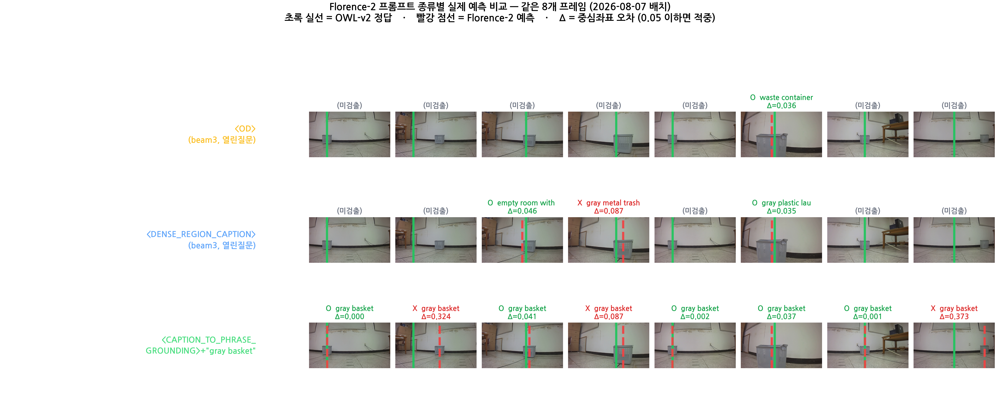
OD·DENSE(위 두 줄)는 8개 중 6~7개가 "(미검출)"인데,
phrase 그라운딩(맨 아래 줄)은 6/8이 초록선과 거의 겹친다 — 재현율 격차가 숫자만이 아니라
눈으로도 확인됨.
스크립트 scripts/florence2_phrase_grounding_test.py ·
scripts/gen_florence2_prompt_comparison_gallery.py ·
결과 docs/v5/detector/florence2_phrase_grounding_0807.json

**⚠️ 69-2. 자체 발견한 버그 2건 — 색상 채널 반전, 그리고 성급한 결론**

① BGR/RGB 채널 버그 — 실제 재현율 계산 스크립트들은 문제없었지만,
화면에 보여주는 시각화 도구 2개(케이스 갤러리, 초기 라벨링 도구)가 0807 세션 이미지를 잘못
반전시켜 파란 색조로 보여주고 있었다. 육안 확인으로 발견: V6 학습셋은
BGR 저장(반전 필요), 0807 실기 세션은 이미 RGB(반전하면 안 됨) —
두 파이프라인이 반대 규칙을 쓴다는 걸 놓쳤던 것. 계산 결과는 무사했고 시각화만 고쳤다.
② "OWL을 정답으로 쓰면 순환논리 아니냐" 우려 — 타당한 지적이었으나
HSV 색상 기반 독립검증으로 확인하려던 시도는 실패(OWL vs HSV 일치율 2.95%, 연속 프레임에서
HSV 값이 요동쳐 그 자체로 신뢰 불가로 판정, 즉시 폐기). 대신 사람이
직접 이미지를 보고 판정하는 라벨링 도구로 우회 — OWL 선은 참고 보조선일 뿐 최종 판정
기준이 아니게 설계해서 순환논리 자체를 해소했다(69-3 참조).

**🖱 69-3. 인터랙티브 검증 도구 3종 — 사람이 직접 그라운드 트루스를 만든다**

명시적 phrase 그라운딩의 유일한 약점은 거부 모드가 없다는 것
(coverage 100% — 타겟이 없는 프레임에서도 무조건 어딘가를 짚는다). OWL이 실패한 프레임이
"진짜 없어서"인지 "OWL도 놓쳐서"인지 OWL 자신으로는 구분할 수 없어서, 로컬 서버 3개를 만들어
사람이 직접 판정하게 했다:
- serve_florence2_owl_compare.py(:7795) — 0807 배치 브라우저 + 실시간 임의 태스크/phrase 테스트
- serve_v6_phrase_grounding_verify.py(:7796) — V6 학습셋(16599프레임) 대상,
목표 5개×접근 3개 색상 태그, 방향키+숫자키(1=OWLv2, 2=Florence-2, 0=타겟없음) 키보드 라벨링
(serve_hsv_owlv2_labeler.py 알고리즘 이식), OWLv2·Florence-2 독립 판정
표본 설계: succ(OWL 성공) 칸은 소량 스팟체크(과거 ROC 정탐 94.9% 참고), fail(OWL 실패) 칸은
가능한 전부(67개 에피소드 전수, V6 자체가 후반부일수록
실패가 희귀해서 — 접근할수록 타겟이 커 보여서 — late×fail 칸이 11개뿐이라는 걸 이 과정에서
알게 됨). 총 97개 라벨링.

**🏆 69-4. V6 사람 검증 결과(초기 표본, n=97) — Florence-2 97/97(100%), OWLv2(가중) 92.8% (⚠️ 69-11에서 329개·클릭 기반 독립 GT로 최종 재검증 — 아래 참고)**

97개 전부 라벨링 완료(2026-08-21). 표본은 succ/fail 비율이 불균등(succ 30·fail 67)해서
단순 평균이 아니라 V6 실제 모집단(bin×owl_success 6층) 비중으로
가중해 추정치를 냈다:
지표
원표본
가중 추정(전체 V6)
OWLv2 정확도
43/97 (44%)
92.8%
Florence-2 정확도
97/97 (100%)
100.0%
OWLv2 원표본이 낮아 보이는 건 fail 칸(자동 X 처리 67개)이 표본 대부분을 차지해서다 — 가중
추정치(92.8%)가 실제 신뢰도에 가깝고, 이전 ROC 분석(정탐 94.9%)과도 order가 맞는다.
주목할 점 — Florence-2가 OWL이 실패한
67개 프레임 전부에서도 correct로 판정됐다. 즉 이 표본 기준으로는 OWL이 놓친 걸
Florence-2가 전부 대신 잡아낸 셈. 다만 0807 실기 배치에서는 84.96%였던 것과 비교하면
**V6이 0807보다 15%p 가까이 유리한 조건**(통제된 수집 vs 실제 로봇의 다양한 각도/거리)이라는
뜻이기도 하다 — n=97의 표본 크기도 감안해야 한다(실기 재검증 필요, 성급한 결론 금지 원칙 유지).
라벨: docs/v5/detector/v6_phrase_grounding_human_labels.json

**🏆 69-5. exp77 — phrase 그라운딩으로 재학습, 무작위 split 역대 최고 성적 + L/ROT_L 회귀 완전 해소 (⚠️ 69-7에서 일반화 취약점 발견 — 아래 참고)**

69-4의 결과를 반영해 V6 전체(225ep, 16599프레임)를 phrase 그라운딩으로 재주석하고
(gen_v6_florence2_phrase_annotation.py, 라이브 샘플 5752/5752 = 100% 검출),
구 방식(열린 질문) 실험들을 새 방법으로 다시 만들었다:
실험
그라운더
비전인코더
val_acc mean
best
exp73(베이스라인)
OWL-v2
Kosmos-2
73.87%±0.20%p
74.13%
exp74(비전만)
OWL-v2
Florence-2
75.15%±0.09%p
75.24%
그라운더 스왑(구, 열린질문)
Florence-2(열린질문)
Kosmos-2
73.26%±0.29%p
73.59%
exp75(구 완전통합, 열린질문)
Florence-2(열린질문)
Florence-2
73.52%±0.25%p
73.84%
exp76(신 그라운더 스왑, phrase)
Florence-2(phrase)
Kosmos-2
73.76%±0.25%p
74.04%
exp77(신 완전통합, phrase) ★역대 최고
Florence-2(phrase)
Florence-2
75.58%±0.07%p
75.65%
exp77의 클래스별 정확도(vs exp73 베이스라인):
클래스
exp73
exp77
변화
STOP
84.5%
87.9%
+3.4p
F
75.6%
76.0%
+0.4p
L
66.7%
75.6%
+8.9p
R
70.8%
66.2%
-4.6p
FL
72.8%
73.7%
+0.9p
FR
72.8%
73.6%
+0.8p
ROT_L
50.0%
66.7%
+16.7p
ROT_R
31.8%
86.4%
+54.6p
핵심 — 구 방식(열린 질문 그라운더)에서 관찰됐던
L(-13.8p)·ROT_L(-16.7p) 회귀가 새 방식(phrase 그라운딩)에서는
완전히 해소되고 오히려 L이 +8.9p 개선됐다. R만 소폭(-4.6p) 하락 — 유일한 흠.
분산도 exp75(±0.25%p)보다 훨씬 안정적(±0.07%p). exp76(그라운더만 교체)도 베이스라인과
거의 동일(73.76% vs 73.87%)해서, 구 그라운더 스왑(73.26%)의 손상이 순수히 그라운딩
품질 문제였음이 재확인된다.
주의 — 확정 발견 6번(val 지표와 실기 성능은 직결되지 않음)은
여전히 유효하다. 이 표는 전부 오프라인 val 지표이며, 실기 검증은 아직 하지 않았다.
체크포인트
runs/v5_nav/mlp/exp77_florence2_phrase_full/exp77_florence2_phrase_full_v6_mlp.pt ·
결과 docs/v5/closed_loop_eval/exp77_florence2_phrase_full_stage2.json

**⚠️ 69-6. 실기 전 오프라인 3종 보강 검증 — leave-one-direction-out에서 낙관 편향 발견**

실기(soda) 요청 전에 val 지표만으로는 못 보는 것들을 3가지 더 확인했다.
① Leave-one-direction-out — 가장 중요한 발견.
무작위 15% split(exp77 val_acc 75.65%)은 목표5×접근3(15조합)이 train/val에
섞여 있어 낙관적일 수 있다. 목표(direction) 하나를 통째로 빼고(180ep로 학습,
나머지 45ep로 검증) 재학습해보면:
제외한 목표
held-out acc
R클래스
center
66.1%
33.0%
weak_left
68.5%
50.0%
weak_right
41.7%
41.4%
strong_left
60.5%
— (표본 0)
strong_right
33.3%
20.4%
5개 평균
54.0%
—
무작위 split(75.65%) 대비 평균 -21.65%p — 그리고
좌/우가 대칭이 아니다: 약좌 68.5%·강좌 60.5%인데
약우 41.7%·강우 33.3%로 오른쪽 방향을 처음 보면 성능이 반토막 난다.
CH66에서 이미 확인된 좌우 비대칭이 이전에 생각했던 것보다
훨씬 심각할 수 있음을 시사 — 실기 요청 전에 반드시 함께 보고해야 할 리스크.
①-b 원인 분해(confusion matrix 재분석) — "폐루프라서
어렵다"도 "좌우 액션 정의가 달라서"도 아니다. 실제로는: 오른쪽 방향 에피소드를 통째로
빼면 진짜 F(전진) 프레임이 FR(전진+우회전)로 오판되는 비율이
폭증한다.
제외한 목표
F→FR 오판율
center(대조군)
164/1412 = 11.6%
weak_right
692/1298 = 53.3%
strong_right
1176/1473 = 79.9%
R/FR/F를 구분하려면 "타겟이 오른쪽에 보이지만 아직 멀어서 전진해야 하는 상황"과
"이제 꺾어야 하는 상황"을 구별해야 하는데, 오른쪽 방향 에피소드를 통째로 빼면
전자의 예시 자체가 학습 데이터에서 사라진다 — 그래서 오른쪽에 뭐가 보이면 무조건
FR로 밀어붙인다. 순수한 방향별 학습 커버리지 부족이지
폐루프나 좌우 라벨 정의의 문제가 아니다. 좌측보다 우측이 유독 심한 이유는 미확정 —
사진에서 보이는 어안렌즈의 우측 압축 왜곡이 원인일 가능성은 있으나 검증된 가설은 아니다.
② 궤적 재생 근사(폐루프 아님, exp71/72와 동일 방법론) —
`rollout_core.py`의 build_trajectory/compute_metrics로 exp73 vs exp77 비교:
exp73 success 24.2%(FPE 1.335m) → exp77 30.3%(FPE 1.120m). 절대값은 실기(95/100)와
거리가 멀지만(예상대로 — 확정 발견 6번) 방향은 val_acc와 일치.
③ bbox_scale 재검증(phrase 그라운더 기준) —
1.0=75.62%±0.24%p · 2.0=75.55%±0.46%p(best 76.18%) · 3.0=75.58%±0.07%p.
그라운더가 훨씬 정확해졌어도(34.7%→100%) bbox_scale 무영향이라는 기존 결론
(2026-08-17, OWL 기준)이 그대로 재확인됨.
스크립트
scripts/eval_leave_one_direction_out.py ·
scripts/eval_exp77_closed_loop_sim.py ·
scripts/eval_bbox_scale_phrase_grounder.py

**🔴 69-7. exp73(배포중) apples-to-apples 비교 — exp77이 일반화에서는 오히려 진다**

69-6①의 leave-one-direction-out을 exp73(현재 배포중, OWL bbox+Kosmos-2
vision)에도 똑같이 돌려 직접 비교했다 — exp77의 방향별 결함이 새로 생긴 건지
원래 있던 건지 확인하기 위함.
제외한 목표
exp73
exp77
exp73 R
exp77 R
center
61.5%
66.1%
2.0%
33.0%
weak_left
64.6%
68.5%
12.5%
50.0%
weak_right
62.4%
41.7%
46.3%
41.4%
strong_left
58.7%
60.5%
4.3%
— (표본 0)
strong_right
57.1%
33.3%
15.9%
20.4%
5개 평균
60.85%
54.00%
~16.2%
~36.2%
무작위 split에서는 exp77(75.65%)이 exp73(74.13%)을 이겼는데,
"완전히 처음 보는 방향" 조건에서는 거꾸로 exp73(60.85%)이 exp77(54.00%)보다 낫다 —
특히 오른쪽 방향(weak_right·strong_right)에서 exp77이 크게 뒤집힌다.
단, R클래스만 보면 정반대다 — exp77의 R 일반화(평균
~36%)가 exp73(평균 ~16%)보다 뚜렷이 낫다. 즉 exp77은 "R이라는 개념"은 더 견고하게
배웠지만, F↔FR 경계에서 새로운(오른쪽) 방향에 유독
취약해서(69-6①-b의 F→FR 79.9% 오판) 전체 점수가 깎이는 구조다.
판단 — 무작위 split 숫자(75.58%, 역대 최고)만 보고
"실기 교체 추천"으로 가면 안 된다. 지금 증거로는 exp77을
exp73 대신 그대로 배포하자고 권하기 어렵다 — 오른쪽 방향에서 배포 중인
모델보다 약할 위험이 실측으로 확인됐다. 그렇다고 폐기할 이유도 없다 — R 일반화
개선은 실재하고, 문제가 국소적(F↔FR, 특히 우측)이라 원인이 이미 밝혀져 있다.
다음 후보: 오른쪽 방향 데이터 증강, 또는 exp73/exp77 앙상블. soda에게 실기를
요청한다면 "역대 최고치"가 아니라 이 반전 결과와 함께 "당장 교체 추천 아님,
우측 취약점 추가 개선 필요"로 전달해야 한다.
스크립트
scripts/eval_leave_one_direction_out_exp73.py · 결과
docs/v5/closed_loop_eval/exp73_leave_one_direction_out.json

**✅ 69-8. soda 회신 — 순차→병렬화만으로 Jetson 지연 문제 해소, 정확도 영향 없음 확인**

코드 리뷰에서 발견한 사실 — `predict()`가 그라운딩(OWL-v2)과 비전 인코딩을
완전히 순차 실행하고 있었다(서로 독립 연산인데도). soda에게 실제 Jetson
Orin NX에서 순차 vs `ThreadPoolExecutor` 병렬 실행을 재보고 출력값 동일성까지
검증해달라고 요청했다.
순차(A+B)
병렬
겹침 효율
Kosmos-2(현재)
993.5ms
949.6ms(-4.4%)
85.7%
Florence-2(교체후보)
1113.2ms
952.2ms(-14.5%)
95.3%
핵심: Florence-2를 병렬로 돌리면(952.2ms) 현재 프로덕션(Kosmos-2, 순차,
993.5ms)보다 오히려 4.2% 더 빠르다. "SM이 부족해 젯슨에서는 병렬화 효과가
제한적일 것"이라는 우려와 달리 이론적 `max(A,B)`에 85~95%까지 근접했다.
08-19에 순차 실행 전제로 냈던 "Florence-2 백본 전환 시 cadence 15~20% 저하"
우려는 병렬화를 도입하면 대부분 해소된다.
정확도(출력값) 영향도 확인 — 병렬화가 스케줄링만
바꾸고 계산 결과 자체는 안 바뀌어야 한다는 이론(둘 다 읽기 전용 forward pass,
공유 가변 상태 없음)을 soda가 직접 검증: 30개 프레임
전부 bbox·vis_feat이 순차 대비 bit-exact 동일(불일치 0/30). 병렬화는
지연만 줄이고 정확도에는 전혀 영향 없음이 실측으로 확인됨.
의미 — 병렬화 코드 적용은 백본 선택과 무관하게
그 자체로 즉시 이득(리스크 없음)이라 먼저 적용할 만하다. 다만 69-7에서 확인된
exp77의 방향별 일반화 결함(특히 우측)은 지연 문제와 별개라 병렬화로 해결되지
않는다 — 순서는 ① 병렬화 적용 → ② exp77 우측 취약점 보완 → ③ 소규모 실기 A/B.
회신: docs/DATASET_V6_STATUS.md
(2026-08-24 두 항목) · 스크립트
scripts/measure_sequential_vs_threaded_grounding_vision.py ·
scripts/measure_sequential_vs_threaded_grounding_florence2.py ·
scripts/verify_sequential_vs_threaded_output_equality.py

**🔍 69-9. 69-7 우측 취약점의 원인 — bbox 출처가 기존 비대칭을 증폭시킨다**

69-6에서 확인한 F→FR 오판이 exp77(Florence-2 bbox)만의 문제인지, exp73(OWL
bbox)도 원래 갖고 있던 문제인지 exp73으로도 같은 confusion matrix를 뽑아 비교했다.
제외한 방향
exp73(OWL) F→FR
exp77(Florence-2) F→FR
center
14.2%
11.6%
weak_left
0.1%
7.7%
weak_right
7.6%
53.3%
strong_left
0.4%
2.5%
strong_right
36.8%
79.8%
답: 둘 다다. 좌우 비대칭 자체(우측이 좌측보다 F→FR
오판이 훨씬 잦은 현상)는 exp73(OWL bbox)에도 이미 존재했다
— 그라운더와 무관한, 더 근본적인 데이터/기구 문제(CH66)라는 뜻. 다만
Florence-2 bbox로 바꾸면 이 기존 비대칭이 몇 배로
증폭된다(우측 기준 7.6%→53.3%, 36.8%→79.8%). Florence-2 bbox의 cx/area
추정치가 OWL 대비 우측 프레임에서 "아직 멀다/이제 가깝다" 구분에 덜 유용한
신호를 주는 것으로 추정되나, 정확한 메커니즘(예: 우측 프레임에서의 area 분산
차이)은 추가 확인이 필요 — 여기서는 "증폭됨"까지만 확인, "왜 증폭되는지"는
미해결.
결과
docs/v5/closed_loop_eval/exp73_leave_one_direction_out_confusion.json

**🏆 69-11. 최종 재검증(329개, 클릭 기반 독립 GT) — Florence-2 329/329(100%), OWLv2(가중) 88.5%**

69-4의 초기 97개 표본을 가장자리 포함도 일치로 잘못 셌을 가능성을
우려해 전면 재검토했다. 두 가지를 추가했다: ① 표본을 succ 칸 스팟체크 확대(10→30개/셀)
+ fail 칸 에피소드당 최대 3프레임까지 늘려 97→288개로 확장, ② OWLv2/Florence-2
어느 쪽 좌표도 참고하지 않고 사람이 이미지를 직접 클릭해
중심(true_cx)을 독립적으로 표시하는 기능을 추가해 순환논리를 원천 차단했다.
이 과정에서 이전 세션(97→288 확장) 때 SAMPLE 재구성으로 화면에서 빠졌던 41개
기라벨 프레임(과거 표본 잔재)을 표본 끝에 편입해 최종 329개
전수를 "가운데 정렬이어야 함, 가장자리 포함만으로는 불일치"라는
더 엄격한 기준으로 처음부터 재검토했다.
지표
원표본(329개)
가중 추정(전체 V6)
OWLv2 정확도
126/329 (38.3%)
88.5%
Florence-2 정확도
329/329 (100%)
100.0%
69-4(가중 92.8%) 대비 OWLv2 가중치가 88.5%로 소폭 낮아진 건 표본이 288→329개로
늘고(fail 칸 다중 프레임 반영) 재검토 기준이 더 엄격해진(가장자리 포함 재검토) 영향이다
— 방향은 동일, Florence-2가 압도적으로 우수하다는 결론은
바뀌지 않는다. 클릭 기반 독립 GT까지 확보한 상태에서도 Florence-2는
329개 전부에서 사람 판정과 일치했다.
부가 확인 — cx가 액션헤드 판단에 미치는 영향은 별개 축이다.
"Florence-2 그라운딩이 99.7~100% 정확한데 Stage2 val_acc 개선은 왜 미미한가"는
역설이 아니다 — 69-4/69-11은 "그라운딩 좌표 자체가
맞는가"를 검증한 것이고, 액션헤드 성능은 68챕터의 feature ablation
(bbox_only 67.4%±9.8% / image_only 75.6%±0.8% / bbox+image 76.7%±1.3%)에서
이미 확인했듯 MLP 헤드가 vis(256d 이미지 임베딩)를
주 신호로, bbox(cx·area)를 보조 신호로만 쓴다 — bbox 정확도가 34.7%→100%로
개선돼도 헤드 입력에서 차지하는 비중 자체가 작아 val_acc 개선폭이 크지 않은 것이다.
즉 그라운딩 품질과 액션헤드 성능은 서로 다른 병목이고,
전자의 개선(69-1~69-11)은 폐루프 실기(69-6②)나 백본 교체 근거로는 유효하지만
Stage2 val_acc 상승분 자체를 크게 설명하지는 못한다.
도구
scripts/label/serve_v6_phrase_grounding_verify.py(:7796) · 라벨
docs/v5/detector/v6_phrase_grounding_human_labels.json(329개) · 자동/사람
분리 scripts/build_v6_verification_dataset.py ·
docs/v5/detector/v6_verification_dataset.json

**📋 69-10. CH69 종합 결론**

항목
결과
판정
그라운딩 재현율(0807, phrase 방식)
84.96%
✅
V6 사람검증(최종 329개, 클릭 기반 독립 GT)
Florence-2 100% · OWLv2(가중) 88.5%
✅
Stage2 exp77 무작위 split val_acc
75.58%(역대 최고)
✅
exp77 leave-one-direction-out(일반화)
54.0% vs exp73 60.85%
🔴
Jetson 지연(순차 실행 기준)
+12%(1113 vs 994ms)
⚠️
Jetson 지연(병렬화 적용 시)
-4.2%(952 vs 994ms)
✅
병렬화의 출력 정확도 영향
bit-exact 동일(0/30 불일치)
✅
최종 판단:
- 병렬화(그라운딩+비전 동시 실행) 도입은 백본 선택과 무관하게 즉시 적용 가능 —
리스크 없음(정확도 영향 0), 지연 이득 확인됨. 다음 작업으로 바로 진행 가능.
- exp77을 exp73 대신 그대로 배포하는 건 아직 이르다 —
무작위 split 최고치(75.58%)에 가려져 있던 우측 방향 일반화 결함이 실측으로
드러났고, 원인도 특정됨(F↔FR 경계, Florence-2 bbox가 기존 좌우 비대칭을 증폭).
- 폐기할 이유도 없다 — R클래스 자체의 일반화는
exp77이 exp73보다 뚜렷이 낫다(~36% vs ~16%). 문제가 국소적이라 데이터
증강이나 앙상블로 개선 여지가 보인다.
- 실행 순서: ① 병렬화 코드 적용(즉시) →
② exp77 우측 방향 데이터 보강 또는 exp73/exp77 앙상블 → ③ 소규모 실기 A/B →
④ (이후) 실기 100건 전체 재검증. 지금 바로
실기 100건을 soda에게 요청하는 건 시기상조.
부수 결론 — flow matching(FM) 데이터 재수집 가이드
(블로커 A, §2·§4-3): 수집 주기는 기존 실측값 ~6Hz(목표 10Hz, 오버헤드 반영)를
그대로 유지하면 되고, 별도 변경 불필요. 수량은 현재
(조합당 15ep)로는 부족할 가능성이 높다 — 8-class 분류조차 train-val
격차 13~17%p, leave-one-direction-out 54~61%(무작위 split 대비 -14~22%p)로
과소적합/과적합 신호가 뚜렷한데, 연속 회귀(FM)는 보통 이산 분류보다 더 많은
표본이 필요하다. 최소 현재의 2~3배(조합당 30~45ep) 권장, 특히 이번에 밝혀진
우측 방향(weak_right·strong_right)은 비례 이상으로 보강 권장. 재수집 규모
(전량 vs 증분)는 soda 발주 전 결정 필요.

<a class="src-link" href="../v5/research_story.html#ch69">→ 원문 전체 보기 (research_story.html#ch69)</a>

