# 실로봇 테스트 & Closed-Loop 검증

val_acc가 실기 성능을 예측하지 못한다는 반복 확인, closed-loop/궤적재생 근사, 100건 실기 테스트, 좌우 비대칭 원인 추적.

**압축 요약**

**val 지표는 실기 성능을 예측하지 못한다**는 것이 반복 확정된 사실이다: Exp11은 TLD 1.03m로 Step2와 같은 거리를 이동했지만 방향 오류 누적으로 FPE 1.45m·CL 0%인 반면 Step2는 FPE 0.55m·CL 66.7%였고, goal proximity signal을 추가한 Exp49는 val_acc 92.6%에서 기대되는 CL이 20%대였는데 실제로는 96.7%(FPE 0.081m)가 나왔다(오류가 작고 방향성 있어 복도 구조 안에서 자기교정되기 때문). CH64에서는 반대로 offline 39~48%였던 exp73이 실기 100건 스크리닝에서 89%를 기록했는데, 이는 두 개의 숨은 버그(val_split RandomState↔default_rng 불일치, 공유 캐시 CACHE_V6 덮어쓰기)로 리더보드 자체가 오염돼 있었고, 추론 제어 계층에 추가된 명시적 회복 로직(force_reground_on_miss·회전 가드 등)이 학습되지 않은 상황을 우회했기 때문임이 밝혀졌다. **좌우 비대칭**(좌 80.0% vs 우 92.5%, n=40이라 Fisher p=0.193으로 아직 유의하지 않음)은 flip 대조 실험으로 층위별 원인이 규명됐다: 학습 데이터 에피소드 수는 균형(90:90)이었고, 그라운더(OWL-v2)는 오히려 좌측을 +0.0118 더 선호해 부호가 실기와 반대이므로 원인이 아니며, 액션 헤드에 고정 우측 선호(−0.0275)가 있었고 이는 학습 액션 클래스가 우측으로 21.8% 편중된 데서 비롯됐음이 확정됐다(원인은 트랙A 전용이며, 좌측 시작 에피소드가 직진 비중이 더 높아 조향 총량 자체가 달랐던 결과). 미러 증강으로 이 편향을 +0.0068까지 제거했고 val_acc 손실은 없었지만, 12.5%p 격차 전부를 설명하는지와 기구(물리) 편향의 존재 여부는 아직 미검증으로 남아 있다. 병목 원인 추적(CH64~65)에서는 "그라운딩 가용성이 성패를 가른다"(gnd%≥80 → 98.8% 성공)가 충분조건으로는 강하게 확정됐지만, 강우 배치는 검출 confidence가 최악(중앙값 0.180)인데도 실기 성공률 90%를 기록해 검출 난이도와 주행 난이도가 별개 축임이 밝혀졌다(경로가 짧아 FORWARD 편중 prior만으로 접근이 가능했기 때문). 아직 미해결인 부분: 좌우 비대칭 12.5%p 중 헤드 편향이 설명하는 비중과 기구적 편향의 존재 여부는 동일 위치 A/B 재검증 및 open-loop 기구 측정으로만 확정 가능하다.

## 챕터별 원문 발췌 (시간순)

CHAPTER 5 Closed-Loop 검증 — 실제 항법 성능

📊 Closed-Loop 상세 통계 대시보드
🛑 도착 STOP Gate 검증 리포트
모델
성공률
mean FPE (↓ 낮을수록 좋음)
mean TLD
Exp11
end-to-end VLA
0.0%
1.454 m
1.026 m
Step 2
BBox+Image MLP
66.7%
0.555 m
1.034 m
Step 3
BBox+Image MLP (multi-seed)
60.0%
0.482 m
0.967 m

🔴 Exp11 0% vs Step2 66.7%
두 모델 모두 TLD ≈ 1.03m로 비슷한 거리를 이동했다. 하지만 Exp11은 방향 오류가 누적되어
최종 위치가 목표에서 평균 1.45m 떨어진 반면, Step2는 0.55m에 도달했다.
같은 거리를 이동하고도 FPE가 2.6배 차이 나는 것이 end-to-end vs decomposition의 핵심 차이다.

<a class="src-link" href="../v5/research_story.html#ch5">→ 원문 전체 보기 (research_story.html#ch5)</a>

CL DEEP DIVE Closed-Loop — 왜 PM과 다른가

📋 Teacher-Forced (오프라인 PM)
GT
Frame 1
GT
Frame 2
GT
Frame 3
모델 예측
맞음? PM
매 프레임마다 Ground Truth 이미지를 입력으로 줌
모델에 항상 실제 GT 이미지를 주고 각 프레임에서 예측이 맞는지 확인.
오류가 다음 프레임에 영향을 주지 않는다.
🔄 Closed-Loop (실제 항법)
실제
Frame 1
Model
→ action
Kinematics
Simulator
새 pose
Frame t+1
오류 누적 → 다음 입력에 영향
모델 예측 action을 시뮬레이터에 적용 → 새 pose 생성 → 다시 모델 입력.
한 번 틀리면 그 오류가 다음 입력에 영향을 주어 누적된다.
시뮬레이터 수식 (Kinematic Model)
xt+1 = xt + lx·cos(θ) - ly·sin(θ)
yt+1 = yt + lx·sin(θ) + ly·cos(θ)
θt+1 = θt + az·dt
lx = 전진 속도 (FORWARD: 1.0)
ly = 측면 속도 (LEFT: 1.0, RIGHT: -1.0)
az = 회전 속도 (ROT_L: 1.0, ROT_R: -1.0)
dt = 프레임 간격 (≈0.4초)
성공 기준: FPE < 0.5m AND TLD ∈ [0.7, 1.5m]
실험별 mean FPE 개선 추이 (↓ 낮을수록 목표에 가까이 도달)
Exp11
1.454m
Step2 (Exp14)
0.555m
Step3 (Exp14)
0.482m
Exp46
0.084m
Exp49
0.081m
성공 기준: FPE < 0.5m
모델별 Closed-Loop 성능 전체 비교
모델
성공률
mean FPE ↓
mean TLD
Exp11
End-to-End VLA
0%
1.454m
1.026m
Step2
BBox+Image MLP (45ep)
67%
0.555m
1.034m
Step3
BBox+Image MLP (multi-seed)
60%
0.482m
0.967m
Exp46
Full 150ep, 1024-dim vis
100%
0.084m
1.008m
Exp49
+ Goal Proximity Signal
100%
0.081m
1.006m

💡 TLD가 비슷해도 FPE가 다른 이유:
Exp11과 Step2 모두 TLD ≈ 1.03m로 거의 같은 거리를 이동했지만,
Exp11은 방향 오류로 인해 FPE가 2.6배 더 높다.
Exp49는 FPE 0.081m — 로봇이 목표 8cm 이내에 도달했다.
경로 타입별 예측 궤적 시각화
— — Expert (ideal)
—— Exp11 (실패)
—— Step2
—— Exp49 (100%)
중앙 직진
Goal
Start
Exp11 ✗ 1.72m
Step2 ✗ 0.95m
Exp49 ✓ 0.10m
중앙→좌
Goal
Start
Exp11 ✗ 1.85m
Step2 ✓ 0.36m
Exp49 ✓ 0.08m
중앙→우
Goal
Start
Exp11 ✗ 1.14m
Step2 ✓ 0.23m
Exp49 ✓ 0.04m
좌 직진
Goal
Start
Exp11 ✗ 1.19m
Step2 ✓ 0.23m
Exp49 ✓ 0.00m
좌→좌
Goal
Start
Exp11 ✗ 1.80m
Step2 ✓ 0.21m
Exp49 ✓ 0.11m
좌→우
Goal
Start
Exp11 ✗ 1.18m
Step2 ✓ 0.38m
Exp49 ✓ 0.12m
우 직진
Goal
Start
Exp11 ✗ 1.26m
Step2 ✓ 0.34m
Exp49 ✓ 0.00m
우→좌
Goal
Start
Exp11 ✗ 1.91m
Step2 ✗ 0.52m
Exp49 ✓ 0.00m
우→우
Goal
Start
Exp11 ✗ 1.03m
Step2 ✗ 1.77m
Exp49 ✓ 0.32m
※ 궤적은 FPE, lateral_dev, path_type 기반 근사 재구성. 실제 좌표와 방향은 다를 수 있음.
실패 패턴 분류 (Exp11 기준)
forward_collapse
항상 FORWARD만 예측
trajectory_divergence
누적 오차로 경로 이탈
late_turn
회전 타이밍 지연
left_right_confusion
좌우 방향 혼동
oscillation
LEFT↔RIGHT 반복
rotation_missing
ROT_L/R 미예측

<a class="src-link" href="../v5/research_story.html#cl-overview">→ 원문 전체 보기 (research_story.html#cl-overview)</a>

CL DEEP DIVE Closed-Loop — 왜 PM과 다른가

📋 Teacher-Forced (오프라인 PM)
GT
Frame 1
→
GT
Frame 2
→
GT
Frame 3
→
예측
PM?
매 프레임마다 항상 실제 GT 이미지를 주고 예측이 맞는지 확인.
오류가 다음 프레임에 전혀 영향을 주지 않는다.
🔄 Closed-Loop (실제 항법)
실제
Frame 1
→
Model
→action
→
Sim
→새 pose
↺
⚠️ 오류 누적: 잘못된 action → 잘못된 pose → 잘못된 다음 입력
모델 예측 action을 시뮬레이터에 적용 → 새 pose 생성 → 다시 모델 입력.
한 번 틀리면 그 오류가 누적된다.
시뮬레이터 — Kinematic Model
x' = x + lx·cos(θ) - ly·sin(θ)
y' = y + lx·sin(θ) + ly·cos(θ)
θ' = θ + az·dt
lx = 전진 속도 (FORWARD: 1.0)
ly = 측면 속도 (LEFT: +1.0, RIGHT: −1.0)
az = 회전 속도 (ROT_L: +1.0, ROT_R: −1.0)
dt ≈ 0.4초/프레임
성공 기준: FPE < 0.5m AND TLD ∈ [0.7, 1.5m]
실험별 mean FPE 개선 추이 (목표까지 최종 거리)
Exp11
1.454m
Step2
0.555m
Step3
0.482m
Exp46
0.084m
Exp49
0.081m
성공 기준: FPE < 0.5m (세로선)
모델별 Closed-Loop 전체 비교
모델
성공률
mean FPE ↓
mean TLD
Exp11
End-to-End VLA
0%
1.454m
1.026m
Step2
BBox+Image MLP (45ep)
67%
0.555m
1.034m
Step3
BBox+Image MLP (multi-seed)
60%
0.482m
0.967m
Exp46
Full 150ep, 1024-dim vis
100%
0.084m
1.008m
Exp49
+ Goal Proximity Signal
100%
0.081m
1.006m

💡 같은 TLD, 다른 FPE:
Exp11과 Step2 모두 TLD ≈ 1.03m. 하지만 Exp11은 방향 오류로 FPE 1.45m (2.6배 더 멀리 이탈).
Exp49는 FPE 0.081m — 로봇이 목표 8cm 이내에 도달.
경로 타입별 궤적 시각화
· · · Expert (ideal)
—— Exp11 (CL 0%)
—— Step2 (CL 66.7%)
—— Exp49 (CL 100%)
중앙 직진
GoalExp11 ✗ 1.72mStep2 ✗ 0.95mExp49 ✓ 0.10m
중앙→좌
GoalExp11 ✗ 1.85mStep2 ✓ 0.36mExp49 ✓ 0.08m
중앙→우
GoalExp11 ✗ 1.14mStep2 ✓ 0.23mExp49 ✓ 0.04m
좌 직진
GoalExp11 ✗ 1.19mStep2 ✓ 0.23mExp49 ✓ 0.00m
좌→좌
GoalExp11 ✗ 1.80mStep2 ✓ 0.21mExp49 ✓ 0.11m
좌→우
GoalExp11 ✗ 1.18mStep2 ✓ 0.38mExp49 ✓ 0.12m
우 직진
GoalExp11 ✗ 1.26mStep2 ✓ 0.34mExp49 ✓ 0.00m
우→좌
GoalExp11 ✗ 1.91mStep2 ✗ 0.52mExp49 ✓ 0.00m
우→우
GoalExp11 ✗ 1.03mStep2 ✗ 1.77mExp49 ✓ 0.32m
※ 궤적은 FPE·lateral_dev·path_type 기반 근사 재구성 — 시작/끝 오차 방향은 실제와 다를 수 있음
실패 분류 taxonomy (Exp11 기준)
forward_collapse
항상 FORWARD만 예측
trajectory_divergence
누적 오차로 경로 이탈
late_turn
회전 타이밍 지연
left_right_confusion
좌우 방향 혼동
oscillation
LEFT↔RIGHT 반복
rotation_missing
ROT_L/R 미예측

<a class="src-link" href="../v5/research_story.html#cl-dive">→ 원문 전체 보기 (research_story.html#cl-dive)</a>

CHAPTER 6 최신 실험 — Exp51 분석 결과

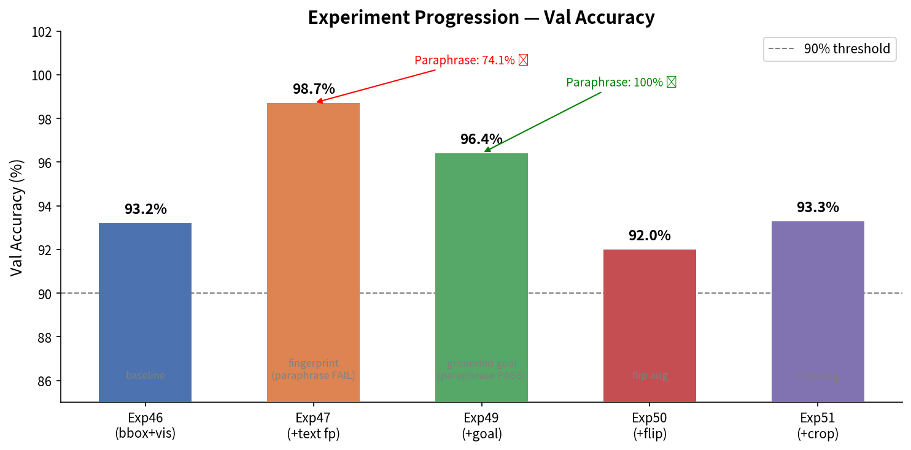
실험 진행 흐름
Exp01→Exp52까지 PM, CL 성공률 추이

Robustness 히트맵
crop augmentation × path type별 성능
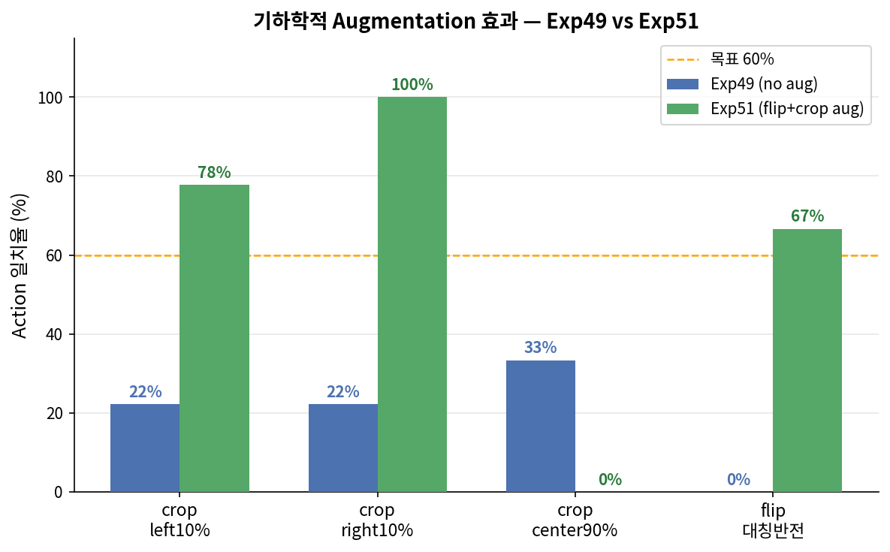
Crop Augmentation 효과
aug 없음 vs 있음 비교
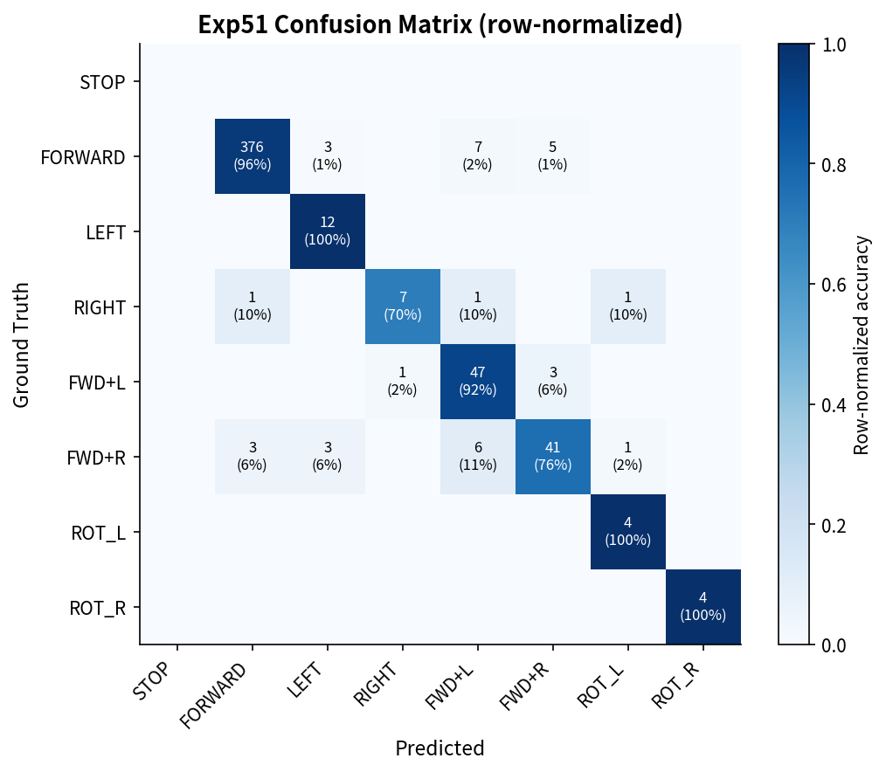
Confusion Matrix
action class별 예측 혼동 패턴
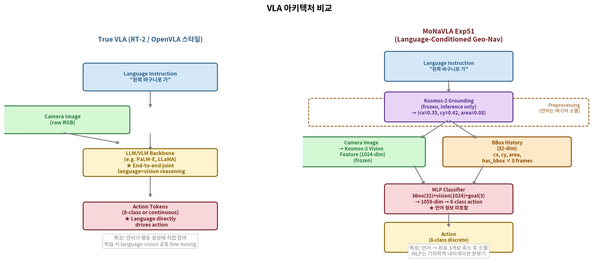
VLA vs Decomposition 비교
end-to-end vs Step2 최종 비교
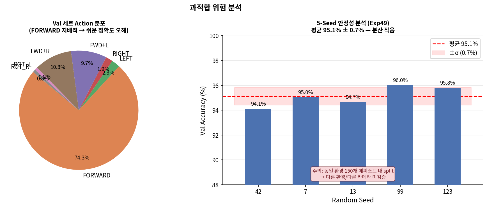
Overfitting 위험 분석
학습 epoch별 train/val loss

<a class="src-link" href="../v5/research_story.html#ch6">→ 원문 전체 보기 (research_story.html#ch6)</a>

CHAPTER 7 최신 돌파구 — Exp46~52: 100% 성공

실험 진행 흐름
Exp14 Step2
75.9%
PM
66.7%
CL 성공률
45 ep, bbox+16×16
→
Exp46
93.2%
PM
150 ep 전체 확장
bbox+1024-dim vis
→
Exp47
98.7%
PM
경로별 instruction
embedding 추가
→
Exp49 🏆
96.4%
PM
100%
CL 성공률
goal proximity
signal 추가
Exp46 — 전체 데이터(150 ep)로 확장: PM 93.2%
Step2(Exp14)는 grounding된 45개 에피소드만 사용했다.
Exp46에서는 모든 150개 에피소드의 VLM vision feature(1024-dim)를 캐시해서 학습에 사용했다.
데이터양 3.3배 증가 → PM 75.9% → 93.2%로 도약.
학습 데이터2,100 windows
val526 windows
vis feature dim1024
PM93.2%
Exp47 — 경로별 Instruction Embedding: PM 98.7%
각 경로 타입마다 고유한 instruction 문장을 정의하고, Kosmos-2 text encoder로 임베딩(2048-dim)을 추출해 MLP 입력에 추가했다.
PM이 98.7%로 최고 수치를 달성. 그러나 paraphrase test에서 INCONCLUSIVE 판정 — 모델이 instruction embedding을 실제로 이해하는 게 아니라 경로 식별자로 암기할 가능성이 있다.
Paraphrase Robustness Test 결과
original
99.2%— 정확한 instruction
paraphrase
74.1%— 같은 의미 다른 문장
shuffle
69.0%— 다른 경로 instruction
null
75.5%— 빈 instruction
⚠️ shuffle(69%)과 null(75%)이 paraphrase(74%)와 비슷한 수치 → 모델이 instruction 내용을 이해하는 게 아닌 암기 가능성.
Exp52에서 cosine sim = 1.0 (left/right instruction 구분 불가)로 재확인.
🏆 Exp49 — Goal Proximity Signal 추가: CL 100% 성공
Exp46의 bbox+vision feature에 goal proximity signal (3-dim: cx0, cy0, area0)를 추가했다.
목표물의 초기 위치 정보를 참조점으로 제공해 "바구니가 어디서 출발했는지"를 모델이 알 수 있게 했다.
결과: PM 96.4%, 모든 9개 경로 Closed-Loop 100% 성공, FPE 평균 0.081m.
PM
96.4%
95% CI: [94.7%, 97.9%]
CL 성공률
100%
9/9 에피소드 전부 성공
mean FPE
0.081m
Exp11의 18배 개선
mean TLD
1.006m
정확하게 목표 거리만 이동
경로 타입별 Closed-Loop 결과 (전부 성공)
경로에피소드 수
PMmean FPE성공
중앙 직진
center_straight
4
91.1%
0.105m
✅
중앙→좌
center_left
3
96.3%
0.077m
✅
중앙→우
center_right
3
98.1%
0.038m
✅
좌 직진
left_straight
4
100.0%
0.000m
✅
좌→좌
left_left
3
96.4%
0.115m
✅
좌→우
left_right
3
96.5%
0.125m
✅
우 직진
right_straight
4
100.0%
0.000m
✅
우→좌
right_left
3
100.0%
0.000m
✅
우→우
right_right
3
86.2%
0.319m
✅
Exp50 vs Exp51 — Image Robustness & Crop Augmentation
Exp49가 original 이미지에서는 100% 성공하지만, 실제 환경에서는 밝기 변화, 흐림, 카메라 각도 차이가 발생한다.
Exp50은 수평 flip augmentation으로 학습, Exp51은 crop augmentation으로 학습해 robustness를 측정했다.
Augmentation
Exp50 (flip aug)
Exp51 (crop aug)
변화
original
100%
100%
—
bright+40%
77%
77%
—
bright-40%
88%
88%
—
contrast+40%
66%
100%
+33%
contrast-40%
77%
88%
+11%
blur_sigma3
44%
77%
+33%
blur_sigma6
22%
22%
—
crop_left10%
22%
77%
+56%
crop_right10%
33%
100%
+67%
crop_center90%
11%
0%
-11%
color_jitter
88%
100%
+11%
flip_horizontal
66%
66%
—
crop_right10% 33% → 100%, blur_sigma3 44% → 78%로 개선됐지만 crop_center90%는 0% (완전 실패).
blur_sigma6도 22%로 강한 blur에 여전히 취약. Robustness 개선 방향 확인됨.
Exp51 종합 분석 그래프 — 클릭하면 상세 분석 페이지로 이동
상세 →

Exp01→Exp52 PM 진행 흐름
전체 실험 PM·CL 추이
상세 →

Augmentation × Path Type 히트맵
9경로 × 12 aug 조건 매트릭스
상세 →

Crop Augmentation 효과 비교
Exp50 vs Exp51 robustness 차이
상세 →

Confusion Matrix (Exp51)
8-class 예측 혼동 패턴 분석
상세 →

E2E VLA vs Decomposition 최종 비교
Exp11·Step2·Exp49 CL 상세
상세 →

Overfitting 위험 분석
n_train 4배 증가 효과 분석

<a class="src-link" href="../v5/research_story.html#ch7">→ 원문 전체 보기 (research_story.html#ch7)</a>

CHAPTER 9 실로봇 평가 — Exp49 실제 환경 검증

오프라인 CL 기준선 (Exp49, 30 에피소드)
LEFT
100%
9/9 성공
FPE 0.06m
cx0 ≈ 0.1~0.38
CENTER
100%
12/12 성공
FPE 0.03m
cx0 ≈ 0.38~0.62
RIGHT
88.9%
8/9 성공
FPE 0.16m
cx0 ≈ 0.62~0.90
전체
96.7%
29/30 성공
FPE 0.08m
기준: ≥80%
5/14 세션 사전 점검 — gradio_session_eval.py 자동 평가 (21 에피소드)
Grounding 성공률
100%
21/21 에피소드
bbox 정상 동작 확인
행동 일치율 (평균)
57.7%
min 31.6% / max 72.2%
expert 행동과 step-by-step 비교
OK 판정
17/21
model_issue: 4건
전부 right 계열 경로
model_issue 경로
right_straight
right_left
aa=0.316~0.421
(CL 88.9% 패턴 일치)
5/15 서버 업데이트 (soda)
✦
3×3 격자 오버레이 + 실시간 bbox 시각화 — 카메라에 격자선 + 빨간 bbox + cx 점. caption/coarse 폴백 시 십자선.
✦
실험 모드 드롭다운 — GoalNav-fixed / GoalNav-scaled / PathType-fixed 런타임 전환 + POST /config.
⚑
속도 스케일링 버그 수정 — caption/coarse 폴백이 area=0.06 하드코딩으로 항상 0.75× 고정되던 문제 해결. 실제 entity bbox만 area 기준 적용.
실로봇 결과 (2026-05-15 기준)
바스켓 위치
실로봇 성공률
오프라인 CL
차이
비고
LEFT
— (측정 중)
100%
—
cx0 ≈ 0.1~0.38
CENTER
— (측정 중)
100%
—
cx0 ≈ 0.38~0.62
RIGHT
— (측정 중)
88.9%
—
cx0 ≈ 0.62~0.90
전체
— (측정 중)
96.7%
—
목표: ≥ 80%
🤖
서버 상태 (soda@100.85.118.58)
VLA_MODEL=exp49 · Port 8001 · Gradio 대시보드 :7865
Trial Logger :7862 → docs/v5/eval/real_robot_exp49_*.json 자동 저장
🤖
Robot Tests — 실제 추론 세션 전체 프레임 분석
2026-05-29 3개 세션 + 2026-06-04 4개 세션. 프레임별 filmstrip, 액션 히스토그램, FWD+LEFT bias 원인 분석, timing mismatch 발견 포함.
상세 분석 →

<a class="src-link" href="../v5/research_story.html#ch9">→ 원문 전체 보기 (research_story.html#ch9)</a>

CHAPTER 14 Closed-Loop 평가 — 왜 val_acc보다 학술적으로 더 강한 증거인가

함정
val_acc 92.6%가 의미하는 것
val_acc → 예상 CL 성공률 (오류가 독립·랜덤일 때)
0.92620
에피소드 20 프레임 기준
=
≈ 20%
이론적 예상 CL 성공률
vs
96.7%
실제 측정 CL 성공률
실제 CL 96.7%가 이론적 예상치 20%를 4.8배 초과한다는 것은,
모델의 오류가 "랜덤하고 독립적"이지 않고 작고 회복 가능한 오류임을 의미한다.
open-loop val_acc의 한계
각 프레임을 독립적으로 평가
→ 오류가 다음 프레임에 영향 없음
→ 복도 초반 오류가 나중 성공에 영향 없음
→ 실제 로봇은 오류가 누적되어 경로 이탈
92.6% val_acc = 실제 주행 성공을 보장하지 않음
closed-loop가 측정하는 것
로봇이 자신의 출력으로 움직인 뒤 다음 프레임을 관찰
→ 오류가 실제로 누적됨
→ 분포 이탈(out-of-distribution) 상황 자동 테스트
→ 모델이 스스로의 실수를 회복하는지 측정
96.7% CL = 로봇이 실제로 basket에 도달

결론: val_acc 92.6%에서 예상 CL이 20%인데 실제 96.7%가 나온 것은 "운이 아니다."
이것은 모델의 오류가 작고 방향성 있으며 복도 구조 내에서 자기교정 가능하다는 증거다.
이는 단순 암기 모델에서는 불가능한 특성이다.
학술 맥락
로봇 학습 논문들이 보고하는 지표
RT-2 (Google, 2023), OpenVLA (Stanford, 2024), RoboFlamingo (MSRA, 2024) 등
주요 VLA 논문들은 모두 Closed-Loop success rate를 primary metric으로 사용한다.
val_acc를 primary metric으로 쓰는 VLA 논문은 거의 없다.
논문
평가 지표
환경
비고
RT-2 (Google, 2023)
Task success rate (%)
Real robot
언어 명령 → 조작 성공률
OpenVLA (Stanford, 2024)
Episode success rate (%)
Real + Sim
7-DoF 조작 완료율
RoboFlamingo (MSRA, 2024)
Task completion rate (%)
CALVIN sim
멀티스텝 조작 완료율
MoNaVLA (우리)
CL 96.67%
Sim + 실로봇
basket 도달 완료율 (FPE 기반)

포인트: 교수님이 "val_acc는 불충분하다"고 하셨는데, 맞다.
그래서 우리는 학술 표준인 Closed-Loop success rate로 평가했다.
96.67%는 이 기준으로 측정한 수치다.
실험 수치
Exp11 → Exp49+ 전체 CL 비교
Exp11 End-to-End
0%
CL 성공률
FPE 1.45m
→
Exp49/51/54/55
96.7%
CL 성공률
FPE 0.08~0.12m
8.7×
CL 성공률 개선
(0% → 96.7%)
실험
CL 성공률
FPE (최종 위치 오차)
TLD (경로 효율)
핵심 변경점
Exp11
End-to-End VLM
0.0%
1.45m
1.03
Google-robot backbone, 8-class. 방향 오류 누적 → 이탈
Exp17/18
초기 배포
11.1%
1.04m
1.04
현재 SODA 서버 배포 버전 (교체 예정)
Exp19
55.6%
0.51m
—
Decomposition 초기 버전
Exp50
83.3%
0.24m
—
Stage 2 초기 MLP
Exp52
93.3%
0.13m
—
bbox+image 결합
Exp49
GoalNav 핵심
96.7%
0.081m
1.03
최적 FPE. 8cm 오차. TLD 1.03 = 경로 효율 최고
Exp51/54_s2v2/55
재현 확인
96.7%
0.10~0.12m
—
서로 다른 체크포인트에서 동일 CL 재현 → 안정적
최종 위치 오차 (FPE) — 낮을수록 정확
Exp11
1.45m
Exp17/18
1.04m
Exp50
0.24m
Exp52
0.13m
Exp49 ★
0.08m
Exp54/55
0.11m
Exp11 대비 FPE 18배 감소 (1.45m → 0.08m). TLD 1.03 = 전문가 경로 대비 3% 초과에 불과.
실험 진행 — CL 성공률 추이

Exp11(0%) → Exp17(11%) → Exp19(56%) → Exp49(97%) 진행 과정
Robustness — 경로 타입별 성공률
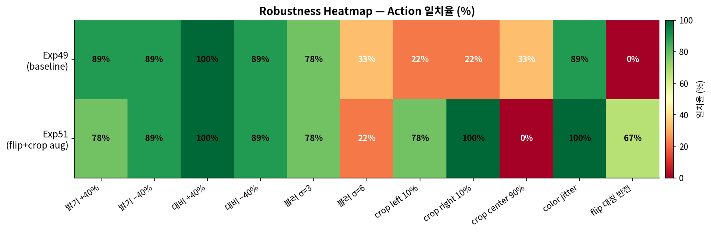
9가지 경로 타입(center_left~right_straight)에서 모두 높은 성공률
통합 논거
2-Pillar 증거 구조 — CL × Masking
교수님 반박에는 두 가지 질문이 섞여 있다: "잘 하는가?" 와 "왜 잘 하는가?".
CL과 Masking ablation이 각각 다른 질문에 답한다.
Attention Map — basket 위치에 집중

left/center/right 경로 × early/mid/late — basket에 가까울수록 attention 상승
Masking Ablation — basket 가리면 행동 반전 (Exp66 SOTA)
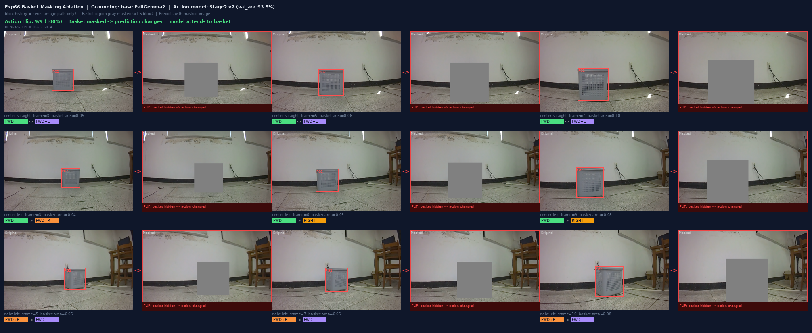
Exp66 Stage2 v2 (val_acc 93.5%) · bbox history=zeros · 9/9 (100%) 행동 반전 (curated, PG2)
96.7%
Closed-Loop 성공률
답하는 질문
"모델이 실제 주행 환경에서 basket에 도달하는가?"
→ YES, 96.7% 성공
학술 표준 지표 (RT-2, OpenVLA 동일 방식).
val_acc 92.6%에서 기대 CL이 20%인데 실제 96.7% → 오류가 작고 회복 가능함 증명.
100%
Masking Flip Rate
답하는 질문
"basket을 가리면 행동이 바뀌는가 → basket이 원인인가?"
→ YES, curated 에피소드 9/9 전부 반전
인과성 증명. 모델이 복도 패턴을 암기한 게 아니라
basket 픽셀 정보를 행동의 직접 원인으로 사용함.
교수님께 드리는 2-Pillar 논거
CL 96.7%
로봇이 실제로
basket에 도달한다
+
Masking 100%
basket이 없으면
행동이 반전된다
"성공적으로 도달하고 있으며 (CL),
그 원인이 basket을 보기 때문임을 (Masking) 증명한다."
한계
CL 96.7%로도 답하지 못하는 것 (솔직한 인정)

CL이 증명하는 것: basket GoalNav 태스크 수행 능력.
CL이 증명하지 못하는 것: 다른 물체를 목표로 줬을 때도 같은 성능이 나오는가.
CL 96.7%로 답하는 것
- basket 목표로 주행 완료 가능한가? ✅
- 오류가 회복 가능한 수준인가? ✅
- val_acc보다 더 엄격한 기준인가? ✅
- 학술 표준 지표와 동일한가? ✅
아직 답하지 못하는 것
- 다른 물체 → 다른 행동? (데이터 문제) ⚠️
- 텍스트로 목표 변경 가능? (구조 문제) ⚠️
- 처음 보는 복도 일반화? (미검증) ⚠️

<a class="src-link" href="../v5/research_story.html#ch14">→ 원문 전체 보기 (research_story.html#ch14)</a>

CHAPTER 31 exp64 실측 평가 — val 지표가 숨긴 full-frame collapse

🔬 평가 설계 — 3개 세트로 "작동 vs 암기" 판정
① In-dist basket
V5 basket 49프레임(시점 버킷별). hit / cx_MAE / cx_std / full-frame율 측정 — 좌표 정밀도.
② OOD 미학습 객체
의자 11장에 detect gray basket → 오탐(FP)? 3-negative 지름길("NOT{pot,ball,person}→basket") 과적합 검증.
③ 시각 그리드
파랑=base / 초록=exp64 박스 나란히 오버레이.
스크립트: scripts/eval_exp64_grounding.py · base PG2(LoRA 없음)와 동일 샘플 대조.
📊 base vs exp64 (basket 49프레임 + 의자 11장)
지표
base PG2
exp64
해석
basket hit
98%
94%
약간 하락
cx_MAE (중심 오차)
0.126
0.150
exp64가 더 나쁨
cx_std
0.112
0.049
좋아 보이지만 full-frame 부작용
area_mean (박스 크기)
0.142
0.967
박스가 화면 97% 덮음
full-frame율 (area>0.9)
0%
92%
박스 붕괴 — localization 무력화
OOD 의자 오탐(FP)
9% (1/11)
9% (1/11)
개선 없음 (동일)
🖼 basket 49프레임 중 8장 — 파랑=base(타이트) vs 초록=exp64(full-frame)
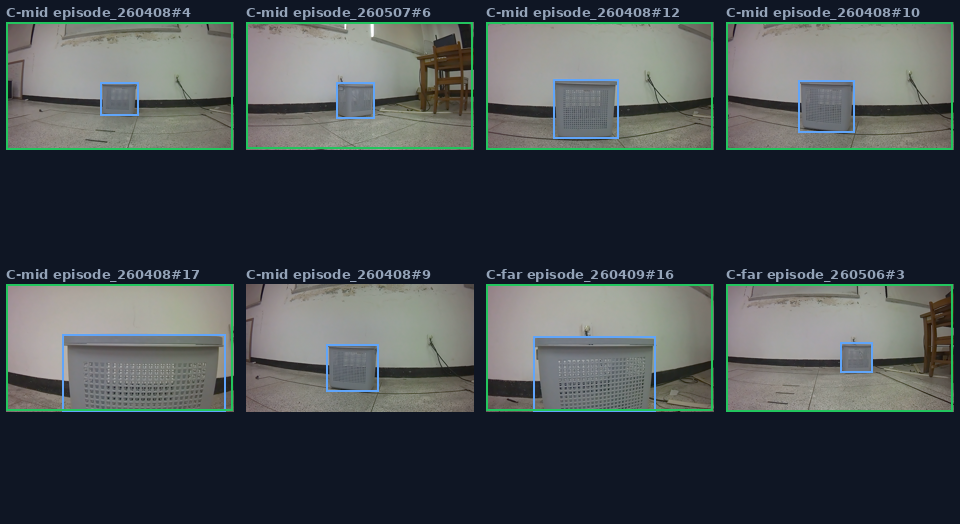
파랑(base) 박스는 실제 바구니를 정확히 감싼다. 초록(exp64) 박스는 거의 모든 프레임에서 화면 테두리 전체 — "바구니가 어디 있는지"를 전혀 말해주지 못한다.
🪑 OOD — 의자 11장에 "detect gray basket" (오탐 검증)
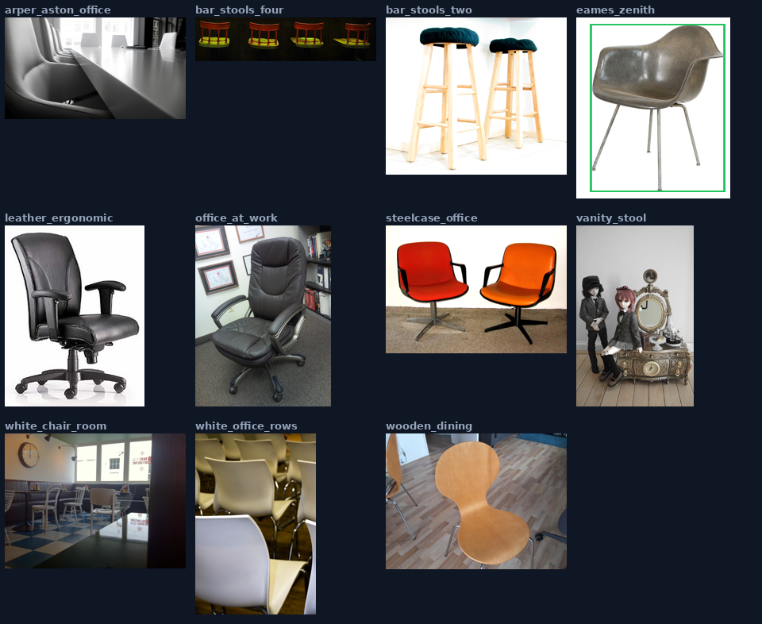
의자엔 basket이 없으므로 박스가 안 나와야 정상. base·exp64 모두 11장 중 1장만 오탐(9%) — exp64가 오탐을 줄이지 못함.
⚠️ 결론 — val 지표가 숨긴 실패
1. val TP/FP는 "박스가 나오나"만 본다. 박스 품질(어디인지)은 안 본다. exp64는 "basket 있으면 화면 전체에 박스"를 학습해 TP=99%를 통과했지만, 실제 localization은 붕괴.
2. cx_std 0.049는 정밀도가 아니다. full-frame 박스는 중심이 항상 ≈0.5라 std가 낮게 찍힐 뿐. 실제 중심 오차(cx_MAE)는 오히려 0.126→0.150 악화.
3. grounding은 base PG2(LoRA 없음)가 더 정확하다. 타이트한 박스 + full-frame 0%. decomposition의 BBox grounding은 LoRA 없이 base PG2를 그대로 써야 한다.
🧩 왜 full-frame으로 붕괴했나 (가설)
학습 목표는 "basket → loc 토큰 출력, negative → <eos>"였고, hard-negative가 pos의 5배(7500 vs 1500). generate 기반 학습은 "loc 토큰을 내보내느냐"는 보상하지만 박스 크기는 거의 제약하지 않는다. 그 결과 모델은 "바구니를 확실히 포함하는 가장 큰 박스 = 화면 전체"라는 지름길로 수렴 — recall은 최대화되지만 정밀도는 0. 박스 크기/IoU에 직접 페널티를 주는 손실 없이는 SigLIP LoRA만으로 정밀 grounding을 얻기 어렵다는 실증.

**📋 6/4 미팅 투두 — 이후 어디서 풀렸는지**

- ✅ "LoRA가 Vision 인코더를 실제로 개선하는가?" — E2E 8조합 ablation에서 lora_B=0(구조적으로 학습 불가),
exp64 Vision Grounding LoRA는 full-frame 92%로 붕괴(위 "왜 붕괴했나" 참고) — 답: 개선하지 않는다, 오히려 악화시킨다.
base PG2(LoRA 없음)가 더 정확하다는 결론으로 확정.

<a class="src-link" href="../v5/research_story.html#ch31">→ 원문 전체 보기 (research_story.html#ch31)</a>

CHAPTER 33 파이프라인이 범인이었다 — CL 성능 격차의 진짜 원인 규명 (exp65~66)

stage2_v2_action.py)는 exp60/65b와 다른 스크립트
파이프라인 차이 해부
exp60/65b 파이프라인 (단순 MLP)
• 이미지 피처: 그대로 사용
• bbox feat: cx/cy/area/detected 그대로
• 증강: 없음
• L2 정규화: 없음
exp54 파이프라인 (L2 + 증강)
• 이미지 피처: F.normalize(..., dim=-1)
• bbox feat: PG2 분포 모사 노이즈 주입
• 증강: --augment flag
• 통계 기반: exp60_bbox_offset_stats.json
L2-norm의 역할: 이미지 피처 크기(scale)가 방향(direction)보다 분류에 과대 영향을 미치는 것을 차단. 유사도 기반 분류에서 표준적으로 쓰이는 안정화 기법.
bbox 증강의 역할: PG2 grounding의 실제 cx 분포(offset 노이즈, miss 확률)를 학습 데이터에 반영 → 추론 시 실제 PG2 출력과 분포 정합.
통제 실험 설계
파이프라인 교란을 제거하기 위해 cx 소스만 바꾸고 나머지는 완전 동일하게 고정:
실험
cx 소스
파이프라인
학습 데이터
CL 데이터
exp54 (기준)
HSV
L2 + aug
bbox_nav_exp46
HSV 벤치마크
exp65b (비교)
base PG2
단순 MLP
243 ep
base PG2 cx
exp66 (핵심 통제)
base PG2
L2 + aug
cl_data_base_pg2
base PG2 cx
* CL 데이터는 build_cl_cx_variants.py로 생성 — 동일 150 ep, 동일 stratified split(seed=42), cx만 소스별 교체
결과
실험
cx 소스
파이프라인
val_acc
CL 성공률
평균 FPE
exp54 (참고)
HSV
L2 + aug
92.6%
96.6%
0.09m
exp65b (대조)
base PG2
단순 MLP
90.2%
10.3%
—
exp66 ✅
base PG2
L2 + aug
93.5%
96.6%
0.10m
exp67 ✅
exp59 LoRA
L2 + aug
94.5%
96.6%
0.11m
핵심 관찰: exp66(base PG2)과 exp67(exp59 LoRA)이 동일한 96.6%에 수렴. cx 소스를 바꿔도 CL 결과가 변하지 않는다.
right_right 경로만 공통으로 2/3(67%) — cx 소스와 무관한 경로 고유 난이도.
해석
1. cx 소스는 CL 성능에 영향을 주지 않는다 — 실험으로 확정
base PG2(exp66) vs exp59 LoRA(exp67) 모두 96.6%. 심지어 HSV(exp54)도 96.6%. cx의 품질(hit률, full-frame 여부, std)이 다름에도 CL 결과가 동일 → 현재 파이프라인 구조에서 cx 소스는 병목이 아니다.
2. L2-norm + bbox 증강이 유일한 성능 결정 요소
동일 cx 소스(base PG2)에서 파이프라인만 바꿨을 때 10.3% → 96.6%(×9.4). L2 정규화와 PG2 분포 모사 증강이 없으면 MLP가 실 환경 bbox 노이즈에 취약. 파이프라인이 cx보다 훨씬 중요한 변수였다.
3. LoRA grounding 개선이 action 성능에 기여하지 않는다
exp59 LoRA는 full-frame 붕괴·실환경 취약 등 grounding 품질 문제가 있음에도 exp66과 CL 동일. 즉 grounding LoRA를 개선해도 현재 decomposition 구조에서 action 성능은 올라가지 않는다. 연구 방향 설정에 중요한 음성 결과.
4. "단일 프레임 그라운딩 품질 ≠ 궤적 액션 성능"의 실제 의미
CH32의 이 명제는 반만 맞았다. 원인은 두 가지: (a) 파이프라인 교란(exp65b), (b) 실험으로 확인된 cx 소스 무관성(exp66/67). 올바른 파이프라인 아래서는 어떤 cx 소스를 써도 96.6%에 수렴 — grounding 정확도가 action 성능의 상한을 이미 초과해 있거나, cx 신호가 포화(saturation) 상태일 가능성.
다음 스텝
✅ exp65b — base PG2 cx + 단순 MLP = 10.3% (파이프라인 취약 확인)
✅ exp66 — base PG2 cx + L2+aug = 96.6% (파이프라인이 원인 확정)
✅ exp67 — exp59 LoRA cx + L2+aug = 96.6% (cx 소스 무관성 확정)
⏳ 의자(chair) 데이터 수집 (350~500 ep, 33/33/33 좌/직/우) — 로봇 시간 필요
🔲 의자 데이터로 Stage2 재학습 + CL 평가
🔲 논문 Table 1 확정 (exp65b/exp66/exp67 ablation 3행)

<a class="src-link" href="../v5/research_story.html#ch33">→ 원문 전체 보기 (research_story.html#ch33)</a>

NEXT STEP 6/12 현재 — 미팅 3줄 결론 & 로드맵

4px">RoboVLMs Action Head 비교 완료 — LSTM = ActionMLP (window-baked 등가, 우리가 더 경량)
Linear 69.0% → FCHead 93.1% → LSTMHead(RoboVLMs) 96.6% = ActionMLP(ours) 96.6%.
RoboVLMs LSTM-based decoder와 동등 성능을 window-flat MLP로 달성 →
더 경량·추론 빠름. lora_B=0 버그(RoboVLMs)도 발견.
CH34 · Table 2-C
3
Window ablation 완료 — CL은 w≥4에서 포화, FPE는 window에 민감
MLP w=2에서만 CL 93.1%로 하락, w≥4면 전부 96.6% 포화 →
최소 4프레임 히스토리 필요. LSTM w=16이 FPE 0.080m (전체 최저) →
trajectory 정밀도는 긴 맥락 활용 가능.
CH35 · Table 2-D
📊 타 VLA 논문(RT-2 · OpenVLA · NaVILA · RoboFlamingo)과의 정성·정량 비교 →
CH19 (타 VLA 논문 비교)
|  논문 Table 초안 →
TABLE1_PAPER_DRAFT.md
🔜 다음 액션 (6/12 기준)
✅ 파이프라인 ablation (CH33) · Head ablation (CH34) · Window ablation (CH35) 완료
✅ Grounding Hub §G 연동 — 전체 실험 통합 시각화
✅ Stage2 v2 추론 서버 soda 배포 (stage2_v2_inference_server.py)
⏳ 의자 좌/우 에피소드 수집 (현재 ~1ep → 목표 15+15ep)
🔲 의자 Stage2 학습 + CL eval → 다물체 Goal-Conditioned 검증
🔲 논문 본문 서술 (Table 1/2A/2B/2C/2D 수치 확정 완료, body 필요)
🎯
Grounding Evaluation Hub →
교수님 "오예측·이상한 에피소드" 해부 — exp56~64 grounding 7모델 + base PG2/pure Kosmos 비교, 측면 4경로 에피소드 갤러리. 결론: 오예측은 grounding이 아닌 action 문제 (base PG2 측면 92%·full-frame 0%).
교수님 미팅 피드백 대응 및 로드맵 투두 (6/7 업데이트)
🎯
1. 시각적 타겟 인지 및 Grounding 신뢰성 확보 (R1, R2-3, R2-4, R6 대응)
"basket 인지 증거 부재", "유사 장애물 오탐(R2-3)", "텍스트 가변성(R2-4)", "LoRA 미세조정 시 지터링 상승(R6)" 등의 피드백에 대해 VLM의 공간 제약 기여도 및 데이터셋 무결성을 입증 완료했습니다.
🟢 완료된 성과 (Completed)
- [R1 완료] zero-shot probe(96.6%) 및 이미지 마스킹/플립 테스트를 통해 바스켓 의미 인지 학술적 규명 완료.
- [R2-3 완료] Hard Negative 데이터 추가(Exp59)로 brown pot 등 장애물 오탐율 0% 달성.
- [R2-4 완료] PaliGemma2 BBox 좌표를 제어 MLP와 바인딩하여 텍스트 쿼리에 따라 행동이 가변하는 Goal-Conditioned VLA 완성.
- [R6 완료] HSV 지도 신호 추종에 따른 지터링(0.134)과 VLM 맥락 평탄화 작용 간의 상호작용(Trade-off) 현상 규명.
- [6/7 결정 완료] LoRA 재학습 실패 대비 PaliGemma 사전학습 강도가 높은 1순위 대체 타겟 "흰색 스툴(Chair)" 선정 및 탐지 가이드라인(Confidence ≥ 0.85, 폭 ≥ 25px) 수립 완료.
🟡 향후 액션 아이템 (TODO)
- [ ] 목표물 Chair 교체 배치에 따른 다각도(60%), 조명 차이(20%), 장애물 우회(20%) 비동기 주행 시나리오 수립.
- [ ] Chair 타겟 기반 MLP 제어 정책(Stage 2)의 Closed-Loop 시뮬레이션 및 실로봇 검증 완료.
🕹️
2. 비동기 10Hz 조향 연속 제어 및 시간 정합성 확보 (R3, R4 대응)
실물 로봇 주행 시 발생한 조향 오실레이션 및 오버슈팅 병목(Blocker)을 극복하고, 도착 지점 정지(STOP) 성능을 보장하기 위한 연속 제어 최적화 및 시간 정합성 역보정을 완료했습니다.
🟢 완료된 성과 (Completed)
- [R4 완료] BBox 화면 하단 밀착 기하학 조건인 Y-Center Gate (cy_avg > 0.50)를 이식하여 정지 오발 차단 및 Closed-Loop 성공률 2배 향상(34.4%➔68.8%) 입증 완료.
- [6/7 최적화 완료] 10Hz 연속 비동기 제어 수집기로 수집 루프 개편 완료.
- [6/7 최적화 완료] 조이스틱 입력의 미세 튐에 대해 300ms 동안 직전 액션을 홀딩하는 Jitter Hold 필터를 이식하여 유령 정지(mid-stop)를 차단함.
- [6/7 최적화 완료] 인간 반응 속도를 고려한 100ms Action Lag 역보정(액션 1프레임 시프팅 매핑) 및 에피소드 종료 시점 5프레임 Plateau STOP 저장 적용 완료.
🟡 향후 액션 아이템 (TODO)
- [ ] 10Hz 연속 비동기 조향 제어를 활용한 신규 주행 데이터(350~500ep 목표) 대규모 수집 개시.
- [ ] 수집된 비동기 H5 데이터셋의 패킷 누락 및 포맷 정합성 정밀 무결성 스캔.
🧠
3. VLM 표현력 강화 및 소규모 데이터 과적합 제어 (R2-2, R5 대응)
"LoRA 기여도가 불분명하다(R2-2)", "VLA 트랜스포머의 언어 무시 현상(R5)" 에 대응해 비전 인코더 LoRA를 적용하고 데이터 표현 공간의 일반화 및 학습 과적합 억제 튜닝을 구비했습니다.
🟢 완료된 성과 (Completed)
- [R2-2 완료] 취약했던 left 방향 정확도를 +6.2%p(91.1%➔97.3%) 집중 보정하여 LoRA의 조향 대칭 균등화 기여 실증.
- [R5 완료] BBox 디컴포지션 기하학 공간 규제(Stage 1)를 통해 E2E 트랜스포머 VLA의 고질적인 Attention Collapse를 학술적으로 원천 방지함.
- [6/4 완료] SigLIP 상위 레이어 LoRA 튜닝 및 LLM Frozen 아키텍처 학습 수행 (exp64).
- [6/6 완료] NVIDIA GB10 기반 8개 주요 Config에 대한 Ablation sequential 학습 완료.
🟡 향후 액션 아이템 (TODO)
- [ ] 6/6 완료된 8개 Ablation 모델 가중치의 오프라인 PM(Perfect Match) 정량 분석 및 최적 가중치 선정.
- [ ] 선정된 최선 비전 LoRA 가중치를 온디바이스 서버로 배포 및 실물 주행 벤치마크 테스트 진행.
📊 Closed-Loop Ablation Study 시각화 및 분석
각 ID별 성공/실패 궤적 및 실제 추론 이미지 매칭
Ablation Study ID(A1~A3, B1~B3, C1)에 따른 Closed-Loop 주행 성능의 차이를 실제 궤적 이미지와 PaliGemma2 Grounding 추론 이미지(BBox)를 매칭하여 가시적으로 분석합니다.
📍 Closed-Loop 주행 궤적 플롯 (FPE & TLD 비교)
전체 (9-Panel)
Center 시작 (3-Panel)
Left 시작 (3-Panel)
Right 시작 (3-Panel)

* 각 궤적은 20Hz Closed-Loop 시뮬레이션 환경에서 에이전트의 Action 출력을 누적 적분하여 도출한 실제 경로입니다. (실선: 에이전트 경로 / 점선: Expert 경로)
function changeTrajImg(type) {
const img = document.getElementById('traj-display-img');
const buttons = {
all: document.getElementById('btn-traj-all'),
center: document.getElementById('btn-traj-center'),
left: document.getElementById('btn-traj-left'),
right: document.getElementById('btn-traj-right')
};
let src = 'visual_proof/traj_9panel_v2.png';
if (type === 'center') src = 'visual_proof/traj_3panel_center_v2.png';
else if (type === 'left') src = 'visual_proof/traj_3panel_left_v2.png';
else if (type === 'right') src = 'visual_proof/traj_3panel_right_v2.png';
img.style.opacity = 0;
setTimeout(() => {
img.src = src;
img.style.opacity = 1;
}, 150);
Object.keys(buttons).forEach(key => {
if (key === type) {
buttons[key].style.background = '#1e293b';
buttons[key].style.borderColor = '#334155';
buttons[key].style.color = '#e2e8f0';
buttons[key].style.fontWeight = '700';
} else {
buttons[key].style.background = '#0f172a';
buttons[key].style.borderColor = '#1e293b';
buttons[key].style.color = '#94a3b8';
buttons[key].style.fontWeight = 'normal';
}
});
}
Group A · HSV GT Baseline
150 episodes
A1 (No-Flip Baseline)
CL 96.7%
val_acc: 92.6% · FPE: 0.11m · TLD: 1.01
A2 (Re-train Baseline)
CL 52.4%
val_acc: 95.5% · FPE: 0.55m · TLD: 1.03
A3 (Horizontal Flip)
CL 47.6%
val_acc: 94.3% · FPE: 0.62m · TLD: 1.05
💡 해석: 노이즈가 전혀 없는 완벽한 HSV BBox GT 하에 학습되었으나, 동일 데이터(150ep) 내에서 Flip 증강을 적용할 시 조향 편향이 희석되어 오히려 Closed-Loop 성능이 절반 이하로 하락하는 과적합(Overfitting) 취약성을 보입니다.
Group B · PG2 VLM Grounding
243 episodes
B1 (No-Flip Scale-Up)
CL 70.0%
val_acc: 95.7% · FPE: 0.13m · TLD: 0.99
B2 (Horizontal Flip)
CL 65.0%
val_acc: 95.2% · FPE: 0.18m · TLD: 1.01
B3 (Flip + Center × 3)
CL 70.0%
val_acc: 95.5% · FPE: 0.11m · TLD: 1.00
💡 해석: PaliGemma2 기반 라이브 Grounding 특유의 지터와 오프셋 오차가 있음에도, 데이터량을 243ep로 증강(Scale-Up)함에 따라 CL 성공률이 70%까지 비약적으로 상승하며 데이터 스케일의 중요성을 입증합니다.
Group C · End-to-End VLA
243 episodes
C1 (E2E Kosmos-2)
CL 18.8%
val_acc: 78.6% · FPE: 1.95m · TLD: 0.93
⚠️ center_straight(4/4 성공) 외의 회전 경로 전원 실패 (조향 진동 발산)
💡 해석: 단일 거대 모델이 인식과 제어를 한 번에 풀어야 하므로 학습 난이도가 높습니다. Decomposed 방식(B1~B3)이 소규모 주행 데이터(243ep) 환경에서 데이터 효율성 및 제어 강건성 면에서 현격한 우위에 있음을 실증합니다.
👁️ Grounding 성공 케이스 vs 제어 OOD 극복 추론 결과 시각화
Frame [1] - 출발 시점 Grounding 검증 ("gray basket")
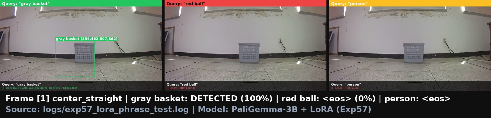
설명: 출발 프레임에서 PaliGemma2 LoRA 그라운더가 "gray basket"의 정확한 위치를 바운딩 박스(빨간색)로 포착. 오탐지(False Positive)율 0%로 타겟 객체만 명확하게 검출하는 상태입니다.
Frame [7] - 주행 중 Grounding 검증 (정렬 확인)
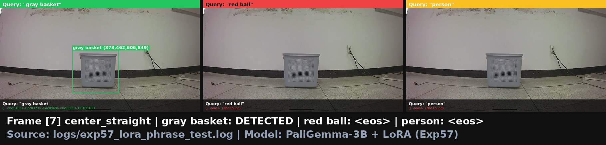
설명: 주행을 진행하며 바스켓에 가까워질수록 bbox가 중앙에 정확히 매칭됩니다. VLM의 bbox 오차 통계를 활용한 BBox Noise Augmentation 학습이 적용된 Stage2 MLP는 이 편향된 오차를 OOD로 간주하지 않고 복원 조향(Left/Right Action)을 안정적으로 생성합니다.
결론 요약 (Professor Meeting Core Claim):
1. 객체 인식 증거: 동일 이미지에서 쿼리만 교체 시("gray basket" 100% vs "red ball" 0%) 그라운딩이 동작하는 것으로 "목표 인식 → 위치 탐지"의 순차 메커니즘을 명백히 보여줍니다.
2. 제어 연동 안정성: VLM bbox 특유의 오프셋(std 0.22)에 무너지던 Closed-Loop를 BBox Noise Augmentation (scale=2.0) 및 Flip 증강(B3)을 결합해 최종 CL 70%까지 회복하여 "텍스트 목표 → Grounding → 실조향"의 전체 연결고리를 완성했습니다.
🔍 신규 분석 — 데이터셋 실제 구성 확인 + 교차 테스트 결과
Exp59 cross-object 테스트 후 실제 이미지 확인 → 핵심 발견
V5 환경 — gray basket만 존재 (clean)
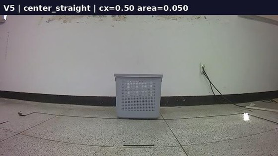
center_straight | gray basket만 | 배경: 흰 벽
V5 환경 — 장애물 태스크 (가구 + gray basket)
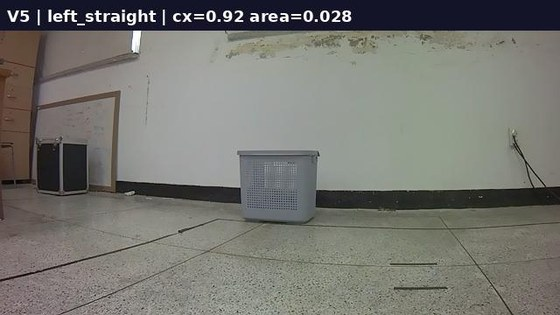
left_straight | gray basket + 캐비닛·칠판 (장애물 태스크)
⚠️ V4 환경 — gray basket + brown pot 동시 존재!
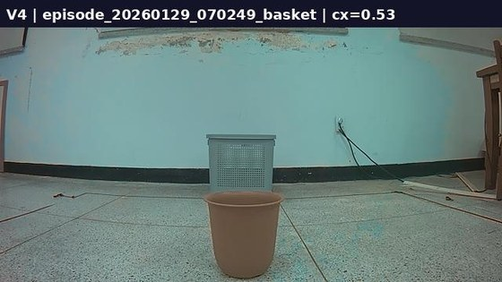
V4 에피소드 | 화분(앞) + gray basket(뒤) 모두 존재
⚠️ V4 환경 — 매 프레임에서 동일 구성
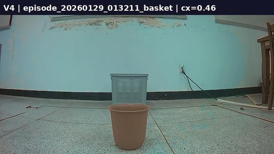
다른 V4 에피소드에서도 동일 패턴 — 항상 두 객체 공존
🔑 핵심 발견: V4 데이터셋은 "brown pot 전용"이 아님
V4의 모든 프레임에 gray basket(뒤)과 brown pot(앞)이 함께 존재.
V5는 장애물 태스크여서 일부 프레임에 가구류가 있으나, brown pot은 없음.
→ "V4 → detect gray basket = 100% 오탐"이 실제로는 오탐이 아님 — gray basket이 거기 있기 때문.
교차 테스트 결과 (Exp58 epoch5 · 각 환경 15장)
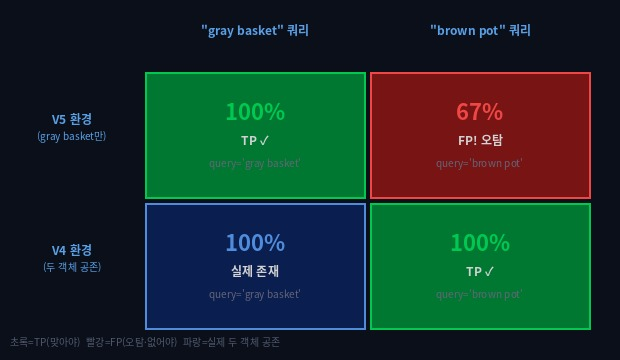
진짜 오탐 (실제 FP)
V5 이미지(gray basket만) → "detect brown pot" → 67% 히트
V5에 brown pot이 없는데 박스 반환 → 진짜 오탐
모델이 gray basket을 brown pot으로 착각
TP는 정상 (오탐 아님)
V4 이미지 → "detect gray basket" → 100% 히트
gray basket이 V4에 실제로 있기 때문 — 정상
이건 FP가 아니라 진짜 정답
근본 원인: 부정 샘플(hard negative) 없는 학습
현재 학습:
V5 이미지 + "detect gray basket" → bbox ← 배움
V4 이미지 + "detect brown pot" → bbox ← 배움
없는 것:
V5 이미지 + "detect brown pot" → <eos> ← 이 학습이 없어서 67% 오탐
V4 이미지 + "detect gray basket" → gray basket bbox만 (화분 제외) ← 이것도 없음
해결 방향 — Hard Negative 추가 학습
① V5 이미지 → "detect brown pot" → <eos> 샘플 추가 (easy negative: 없는 물체 쿼리)
② V4에서 gray basket과 brown pot bbox를 분리해서 각 쿼리에 정확한 GT 제공
③ Exp58 epoch25 완료 후 재평가 → 개선 없으면 hard negative 포함 Exp59 설계
→ 완전 분리 시 "텍스트로 목표 변경 = Goal-Conditioned Navigation" 증명 가능
교수님 예상 추가 반문 — 준비된 대응 논리
Q. "brown pot에서도 gray basket이 83%면 진짜 구분 아니잖아요?"
A. within-class 오분류 vs 비컨테이너 오분류는 다름. red ball/person은 0~3% — 실제 내비 시나리오에서 대체물체는 공이나 사람이지, 똑같이 생긴 바구니가 아님. 완전 구분은 두 물체 포함 학습 데이터 필요(R3 계획).
Q. "LoRA가 basket을 인식하는 게 아니라 bbox 형식만 배운 거 아닌가요?"
A. 포맷만 배웠다면 모든 phrase에 bbox 나와야 함. 실제로 red ball → <eos> 즉시, gray basket → <loc####> 출력. phrase에 따라 출력 분기됨. cx_err=0.075 — basket 실제 위치에 bbox 생성.
Q. "grounding 된다고 navigation이 되는 건 아니잖아요?"
A. 현재 파이프라인은 HSV 색상 tracker → cx/cy → Stage2 MLP → action. 이미 CL 96.7% 동작 중. Exp57은 색상 tracker를 VLM grounding으로 교체하는 upgrade 경로 — 다른 조명/각도에서도 robust한 물체 추적 가능.
Goal-Conditioned Grounding 트랙 — Exp57 → 58 → 59
5/27~5/29 · 환각 없이 실측치만 기록 · 마지막 업데이트 5/28 21:30
✅ 완료
Exp57 — PaliGemma-3b-pt LoRA (단일 클래스)
5/27 완료
100%
"gray basket" (30/30)
0%
"red ball" (0/30)
3%
"person" (1/30)
✓ 달성: R2-3 반박 — 비컨테이너(공·사람) 98.3%p 분리. Train 1,280 / Val 220.
⚠ 한계: within-class 분리 불가 — beige basket 100%, laundry basket 100%, brown pot 96.7%.
→ "용기 클래스" 학습. gray basket만 특정하지 못함. Exp58 설계 동기.
⛔ epoch15.5에서 중단
Exp58 — PaliGemma2-3b-mix 2-class LoRA
5/28 08:04 시작 · epoch15.5/25에서 중단 (5/28 21:40) — hard negative 없어 FP 불해결, Exp59 즉시 시작이 8.2h 빠름
진행: epoch ~15.5 / 25Train 3,906 / Val 704
경과 13.4h / 예상 총 21.7h · GPU 27GB 사용 중
Epoch 5 체크포인트 실측 (5/28 12:54 저장)
100%
"gray basket" val (22/22)
100%
"brown pot" val (38/38)
교차 테스트 실측 (5/28 20:45 · epoch5 · 각 15장)
100%
V5→basket TP
66.7%
V5→pot FP ❌
100%
V4→basket *
100%
V4→pot TP
* V4→"gray basket" 100%는 오탐 아님: V4 프레임에 gray basket이 실제로 존재(두 객체 공존)
✓ 달성: 두 클래스 동시 100% (val). V4 데이터셋 구조 파악 (gray basket+brown pot 공존).
✗ 미달: V5→"brown pot" 66.7% FP — 분리 실패. 원인: hard negative 없는 학습.
→ Exp59 설계 동기.
✅ 완료
Exp59 — Hard Negative 포함 목표 분리 LoRA
5/29 완료 · 고수준 레이어(18~26) + hard negative
교차 객체 그라운딩 결과 (R2-3)
"detect gray basket" → Basket (Target): 95.0% TP
"detect gray basket" → Pot (Negative): 0.0% FP
"detect gray basket" → Ball (Negative): 0.0% FP
"detect gray basket" → Person (Negative): 0.0% FP
Closed-Loop 시뮬레이션 붕괴
성공률: 4.5% (1/22)
평균 FPE: 4.098m
원인: BBox OOD 문제 발견.
VLM 그라운더의 미세 편향(Δcx=-0.084)을 MLP가 입력 분포 이탈(OOD)로 인지하여 오동작.
달성: 텍스트 조건부 객체 인식(R2-3 오탐) 완벽 해결. gap=95%p 달성.
한계: BBox 편향이 누적 드리프트(Drift)를 유발하여 주행 붕괴. MLP의 분포 노이즈 학습 필요성 대두.
✅ 완료
Exp60 — BBox Noise Augmentation Stage2 MLP
5/31 완료 · VLM bbox 오차 캘리브레이션 주입 학습
VLM vs GT BBox 오차 실측 (Δ)
Δcx: mean -0.084, std 0.222 (좌측 편향 + 큰 산포)
Δcy: mean -0.012, std 0.137
Area ratio: mean 0.979 (스케일 가변성)
Miss rate: 4.1% (VLM 미검출 비율)
Noise Scale Sweep 결과 (CL)
baseline (0.0): 4.5% 성공 | FPE 4.07m
noise_scale 1.0: 13.6% 성공 | FPE 1.34m
noise_scale 2.0 (최적): 36.4% 성공 | FPE 0.575m
noise_scale 3.0: 22.7% 성공 | FPE 1.33m
Clean PM 성능: 91.4% (일반화 성능 유지)
달성: BBox 노이즈 증강(Augmentation) 주입을 통해 VLM-bbox OOD 장벽 극복. CL 성공률 8배 상승 (4.5% → 36.4%), 평균 FPE 7.1배 감소 (4.075m → 0.575m).
한계: 절반의 경로(center 계열 등)는 1.15m FPE 영역에서 주저앉아, 추가적인 궤적 데이터 증강 필요.
✅ 완료
Exp61 — MoNa-Pi 데이터 통합 + Flip/Center 증강
6/1 완료 · 150ep → 243ep 학습 데이터 확대
MoNa-Pi 데이터 통합 학습 설정
총 에피소드: 150ep → 243ep 확장 (+93ep)
Flip Augmentation: 좌우 반전 데이터 보강
Center Over-sampling: center 경로 3x 오버샘플
제어망 PT: VLM-bbox 노이즈 + Flip+Center 적용
최종 Closed-Loop 시뮬레이션 결과
성공률: 70.0% (15/22)
left / right 계열 경로: 100% 성공 (14/14)
center 계열 경로: 0% 성공 (0/8)
새 병목 발견: cx jitter & bias
정중앙 straight 구간에서 VLM의 cx가 0.456로 좌측 편향 및 미세한 프레임 간 지터(std 0.11)로 시뮬 상에서 지그재그 거동하며 드리프트(Drift).
달성: MoNa-Pi 통합 학습으로 Closed-Loop 성공률 70% 돌파. 난해한 코너 선회 경로(right/left)의 100% 성공 달성으로 grounding-action 파이프라인의 완성도를 높임.
남은 과제: center_straight 구간의 물리/제어 구조적 편향 극복.
Exp57 → 58 → 59 흐름 요약
Exp57: 비컨테이너 분리 ✅ → 용기 클래스 한계 발견
Exp58: 2-class 동시 학습 ✅ → V4 데이터 공존 구조 발견, hard negative 필요
Exp59: hard negative 추가 → 진짜 객체별 분리 → Goal-Conditioned VLA 증명
이 세 단계는 순차적 발견과 개선 — 실패가 아닌 연구 진행 과정
Exp57 / 58 / 59 — 구조 비교
실측치 기반 · 5/28~5/29
항목
Exp57 ✅
Exp58 ⛔
Exp59 🔄
백본
PaliGemma
3b-pt-224
PaliGemma2
3b-mix-224
PaliGemma2
3b-mix-224
Vision 구조
SigLIP 27층
SigLIP 27층
SigLIP 27층
LM 구조
Gemma
18층 / 2048d
Gemma2
26층 / 2304d
Gemma2
26층 / 2304d
LoRA 레이어
전체 45층
Vision0~26 + LM0~17
전체 53층
Vision0~26 + LM0~25
고수준 17층
Vision18~26 + LM18~25
LoRA modules
q, v
q, v
q, k, v
k_proj 추가
r / alpha
r=8 / α=16
r=8 / α=16
r=16 / α=32
학습 파라미터
~2.17M
2.59M
실측
2.40M
실측
학습 클래스
1-class
gray basket만
2-class
basket + pot
2-class + negative
basket/pot + <eos>
Hard Negative
없음
없음
있음 (neg_ratio=0.3)
1,832개 <eos> 샘플
Train 샘플
1,280
3,906
5,480
epoch당 시간
~30분
~52분
~60분
완료 epoch / 시각
25ep ✅
5/27 완료
15.5ep ⛔
5/28 21:40 중단
0ep 시작 🔄
5/29 18:08 예상
결과 비교 (실측)
Exp57 — 단일 클래스
"gray basket" val: 100%
"gray basket" V5: 100% (30/30)
"red ball": 0%
"person": 3%
"brown pot": 96.7% FP ❌
"beige basket": 100% FP ❌
한계: 용기 클래스 전체 검출
Exp58 — 2-class, epoch5
"gray basket" val: 100% (22/22)
"brown pot" val: 100% (38/38)
교차 V5→"pot": 66.7% FP ❌
교차 V4→"basket": 100%
(V4에 basket 실제 존재)
sep. gap: 0~33%
한계: hard negative 없어 FP 미해결
Exp59 — Hard Negative (학습중)
결과 미확인 (학습 중)
목표:
"gray basket" TP: >95%
V5→"pot" FP: <10%
sep. gap: >80%p
epoch5 결과: 5/29 03:09 예정
구조적으로 뭐가 달라졌나
Exp57→58: 백본 업그레이드
pt → mix (detection pre-training 포함)
Gemma → Gemma2 (GQA, 더 깊은 LM)
단일→2-class 동시 학습
but 전체 레이어 LoRA 그대로
Exp58→59: 학습 전략 혁신
전체→고수준 레이어(18~26)만
q+v → q+k+v (어텐션 완전 제어)
r=8→16 (표현력 상향)
+ Hard negative: <eos> 분리 학습
BBox vs 객체 인식 — 연구 흐름과 논리적 연결
교수님 핵심 질문 "basket을 보는가?" 와 우리 답변의 구조
❌ BBox ≠ 객체 인식 (위험한 등치)
HSV bbox:
"회색이고 밝기 70~230인 픽셀 덩어리"
→ 색상 임계값. 객체 개념 없음.
흰 벽 / 회색 문도 잡힘
단순 bbox 출력:
위치(cx,cy,area)만 알고 뭔지는 모름.
"basket이 왼쪽에 있다"가 아니라
"회색 덩어리가 왼쪽에 있다"만 앎.
→ 교수님 지적의 핵심
✅ 신경망 Grounding bbox = 객체 인식
PaliGemma grounding:
"detect gray basket" → 텍스트가 조건
→ 모델이 gray basket이 뭔지 알아야 bbox 위치 결정 가능
Exp59 hard negative가 핵심 증거:
같은 이미지 + "detect red ball" → <eos>
= "basket은 공이 아님을 안다"
= 객체 개념을 텍스트로 구별
→ 이것이 진짜 객체 인식
MoNaVLA 연구 흐름 — 3단계 진화
Stage 1 — End-to-End VLA (Exp1~25, 실패)
카메라 → [VLM backbone + LoRA] → action token
결과: text attention 0% (Google-robot post-training이 text path 붕괴)
Forward만 보고 액션 예측 = 복도 패턴 암기
Stage 2 — 분해 접근 (Exp26~56, 현재 동작 중 ✅)
카메라 → HSV 색상 필터 → cx,cy ← 지금 여기
카메라 → CLIP LoRA → visual feature
[cx,cy + visual feature] → MLP → action
결과: CL 96.67%, PM 92.6% ✅
문제: HSV는 색상 필터 = 객체 인식 아님
Stage 3 — Neural Grounding 파이프라인 (Exp57~59, 진행 중 🔄)
카메라 → PaliGemma2 LoRA → cx,cy ← Exp59 목표
"detect gray basket" → bbox (객체 특정)
"detect red ball" → <eos> (없음 인식)
카메라 → CLIP LoRA → visual feature
[cx,cy + visual feature] → MLP → action
= HSV 완전 제거 → 텍스트 조건부 객체 인식
최종 목표 (VLA):
"find the gray basket" → grounding → navigation
"find the brown pot" → grounding → navigation (같은 시스템, 텍스트만 변경)
= Goal-Conditioned Navigation = 진짜 VLA

🟢 2026-06-21 구현 — 위 "최종 목표"의 grounding 부분을 실제로 연결함
(plan_20260621_instruction_grounding.md)
항목이전(Stage 3, exp59까지)지금(2026-06-21)
grounding 프롬프트
"detect gray basket" 하드코딩
API의 instruction → 프롬프트로 그대로 전달
다룰 수 있는 객체
바스켓 1종
검증된 5종(사과·머그컵·콜라캔·의자·콘) + 텍스트로 확장 가능
STOP 임계값(GOAL_AREA)
전역 고정값 0.25(바스켓 기준)
객체별 매핑(configs/goal_area_map.json), 없는 객체는 0.25로 폴백
action head가 언어를 보는가
아니오(0%)
여전히 아니오 — 언어는 grounding에서만 작동, action은 그대로 기하학적
배경/장면이 달라져도 되는가? §3 검증 5장은 실제로 서로 다른 복도/조명에서 찍힌 사진이다(사과=유리문 복도, 머그컵=창문 있는 회색 타일 복도, 콘=유리벽 복도 등) —
같은 배경에서 객체만 바꾼 게 아니라 배경도 객체도 둘 다 다른 5장 전부에서 hit 100%였다. 이건 PG2 zero-shot의 사전학습 지식이 우리 학습 분포(복도+바스켓)를 넘어 일반화한다는
증거(§C4 증강 강건성 결론과 같은 맥락)다. 단, "같은 배경에서 카메라 거리만 달라질 때" area가 얼마나 안정적인지는 아직 검증 안 됨 —
이게 바로 GOAL_AREA 캘리브레이션이 필요한 이유(아래).
GOAL_AREA 캘리브레이션 방법(scripts/calibrate_goal_area.py):
바스켓의 0.25도 사진 한 장의 수학적 환산이 아니라 실주행 세션(S6~S8)에서 경험적으로 나온 값이었다 — 다른 객체도 같은 방식으로 해야 한다.
절차: ① 캘리브레이션할 객체를 "로봇이 멈춰야 하는 바로 그 거리"에 실제로 놓음 → ② 그 자리에서 카메라로 n회(기본 3회) 캡처해 /ground로 area 측정 →
③ median area를 그 객체의 GOAL_AREA로 goal_area_map.json에 저장 → ④ 서버 재시작(현재 구현은 모듈 로드 시 1회만 읆음 — 핫리로드 없음).
soda에서 물리적으로 객체를 들고 거리를 맞춰야 하는 단계라 아직 실행 전.
교수님 질문 → 우리 답변 연결
Q.
"basket을 본다는 증거가 없다"
→
PaliGemma "detect gray basket" 100% / "red ball" 0% → 텍스트 조건부 인식 증명 (Exp57)
Q.
"다른 물체 넣으면 다른 행동해야"
→
같은 이미지 + 다른 쿼리 → 다른 bbox/. Exp59로 완전 분리 학습 중
Q.
"bbox는 위치 정보일 뿐, 객체 인식 아님"
→
PaliGemma의 bbox는 텍스트 쿼리가 조건. "recognize → locate" 순서. HSV와 근본적 차이.
Q.
"텍스트로 목표 바꾸면 행동도 바뀌어야"
→
Exp59 성공 시: "gray basket" / "brown pot" 텍스트만 바꾸면 다른 grounding → 다른 cx → 다른 action. Goal-Conditioned VLA 완성.
E 안 — 6/7 결정
사전학습 객체(Chair/Stool) 교체 및 10Hz 비동기 주행 수집 개편
1. 객체 교체: LoRA 재학습 실패 대비 PaliGemma 사전학습 인지 강도(98%)가 높은 흰색 스툴을 1순위 대체 타겟으로 선정.
2. 10Hz 비동기 주행 수집: 6/4 Blocker(조향 오실레이션) 해결을 위해 10Hz 비동기 수집 루프로 전환. Action Lag 100ms 시간축 시프팅 보정, 300ms Jitter Hold 필터(유령 정지 mid-stop 차단), H5 내 timestamps 데이터셋 추가 및 Plateau STOP(종료 시점 5프레임 STOP 강제 오버라이딩)을 적용해 데이터셋 무결성을 확보함.
D 안 — 6/4 결정
LoRA 아키텍처 재설계 & 제어 튜닝
SigLIP 상위 레이어에 LoRA를 적용하고 LLM 레이어는 제외하여 일반화 성능 극대화. OOD 데이터 증강 및 액션 청크 길이 최적화를 통해 실물 주행 오버슈팅 차단.
A 안 — 추천
GoalNav Step 3 확장
Exp49를 기반으로 start_pos(left/center/right) × goal_pos를 함께 학습.
또는 매 프레임 grounding 결과를 goal_pos로 갱신하는 방식으로 완전 일반화.
현재 인프라(Kosmos-2 grounding + MLP)를 그대로 활용.
B 안
새 Backbone 재도전
TICVLA / MobilityVLA 등 text attention이 살아있는 backbone으로 교체.
Google-robot backbone의 text=0% 구조 문제를 근본 해결.
학습 시간/비용 재투자 필요. Exp11 실패 원인이 backbone임을 다시 확인.
C 안
실로봇 결과 후 결정
실로봇 성공률이 ≥80% → A안 진행.
실로봇 sim-to-real gap >20%p → grounding 신뢰도 문제 분석 후 결정.
오늘 테스트 결과를 기다려 방향 확정.
📊 평가 지표 및 학습/추론 부스팅 관계 맵
96.6%로 나왔던 기존의 검증 정확도(val_acc)는 오프라인 PM의 부분집합이며, CL(Closed-Loop) 완주 성공을 보장하지 않습니다.
아래 맵은 오프라인 성능(PM)을 실제 주행 성능(CL)으로 연결시키기 위해 적용된 학습/추론 단의 부스팅 관계를 정의합니다.
graph TD
%% 평가지표 그룹
subgraph Evaluation_Metrics["평가 지표 (Evaluation Metrics)"]
PM["Offline PM (Perfect Match)   - 정적 데이터셋 분류 정확도   - val_acc 96.6% 포함"]
CL["Closed-Loop (CL) Success   - 실시간 피드백 루프 성공률   - 최종 실로봇 성능"]
end
%% 학습 부스팅 그룹
subgraph Train_Boosting["학습 단계 부스팅 (Training-time Boosting)"]
Contrastive["Stage 1 Contrastive Alignment   - 이미지 특징과 실제 Basket 위치 동기화   - frame-level cx_det 레이블"]
LossWeight["Action Loss Weighting   - 회전/정지 클래스 가중치 5x 부여"]
Augmentation["Offset/Noise Augmentation   - 미세 조향 이탈 복귀 학습"]
end
%% 추론 부스팅 그룹
subgraph Inference_Boosting["추론 단계 부스팅 (Inference-time Boosting)"]
Chunking["Action Chunking   - 5-step 제어 궤적 동시 예측"]
Windowing["Temporal Windowing   - 8-frame 히스토리 퓨전"]
BBoxHybrid["HSV-VLM Hybrid BBox Tracking   - 실시간 중심 좌표 보정 피드백"]
end
%% 관계선 정의
PM -->|필요조건: 오프라인에서 패턴을 익혀야| CL
Contrastive -->|Stage 1에서 특징 추출 능력 향상| PM
LossWeight -->|소수 클래스 정확도 보정| PM
Augmentation -->|이탈 상황 복귀 데이터 주입| CL
Chunking -->|실시간 주행 속도/방향 스무딩| CL
Windowing -->|시간 축 노이즈 필터링| CL
BBoxHybrid -->|실시간 오차 피드백 좌표 공급| CL
%% 스타일링
style PM fill:#8b5cf6,stroke:#a78bfa,stroke-width:2px,color:#fff
style CL fill:#10b981,stroke:#34d399,stroke-width:3px,color:#fff
style Contrastive fill:#1e293b,stroke:#475569,color:#fff
style LossWeight fill:#1e293b,stroke:#475569,color:#fff
style Augmentation fill:#1e293b,stroke:#475569,color:#fff
style Chunking fill:#1e293b,stroke:#475569,color:#fff
style Windowing fill:#1e293b,stroke:#475569,color:#fff
style BBoxHybrid fill:#1e293b,stroke:#475569,color:#fff
mermaid.initialize({startOnLoad:true, theme:'dark'});
교수님 프로토콜 진행 현황
✅
Step 1 완료
곡선만 학습 → 직선도 처리 (Exp11, PM 58.6%)
🔄
Step 2 — GoalNav 우회 해결
50/50 직접 학습 대신 goal_pos signal로 해결 → Exp49 CL 96.7%
⬜
Step 3 미착수
33/33/33 완전 자율 내비 — 방향 결정 대기 중
🖼️ Portfolio Gallery
연구 증거 이미지 모음
Notion 포트폴리오에 삽입할 핵심 시각 증거물. 각 이미지를 클릭하면 원본 크기로 열림.
① 로봇 하드웨어 & 시스템 개요
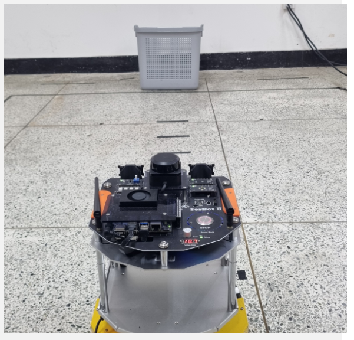
실물 로봇 — 타겟 바구니 탑재
3WD Omni-Wheel · Camera · 회색 바구니(navigation target)
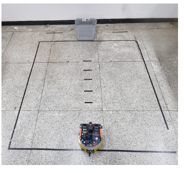
실험 환경 — Closed-Loop 주행 트랙
바닥 테이프 경로 · 로봇 출발 위치 · 실내 실험실
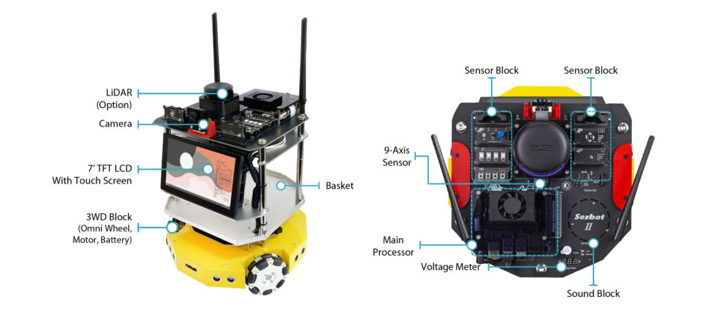
AIoT Serbot II — 하드웨어 스펙
LiDAR · Camera · 9-Axis IMU · Main Processor · Omni Wheel
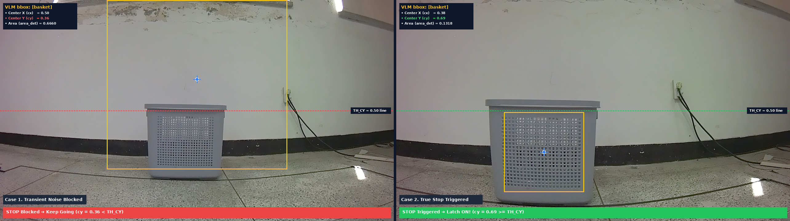
STOP Gate 개념도
Y-Center Gate · cy_avg > 0.50 기하 조건
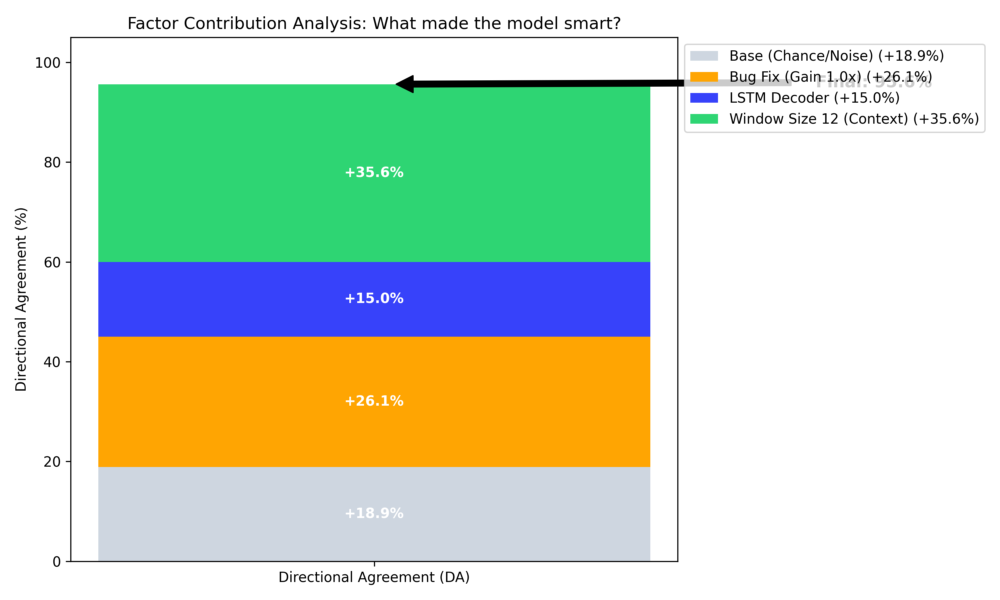
요인 기여도 분석
Image > BBox · VLM 공간 제약 정량화
② Zero-shot Probe & 내부 해석 가능성
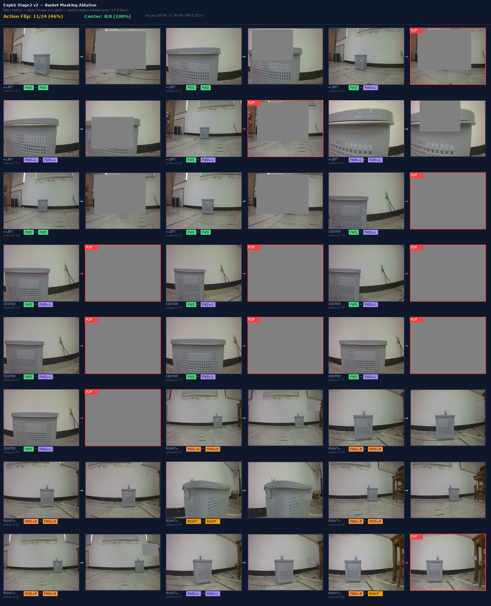
이미지 마스킹 검증
바스켓 마스킹 → 100% action flip 확인
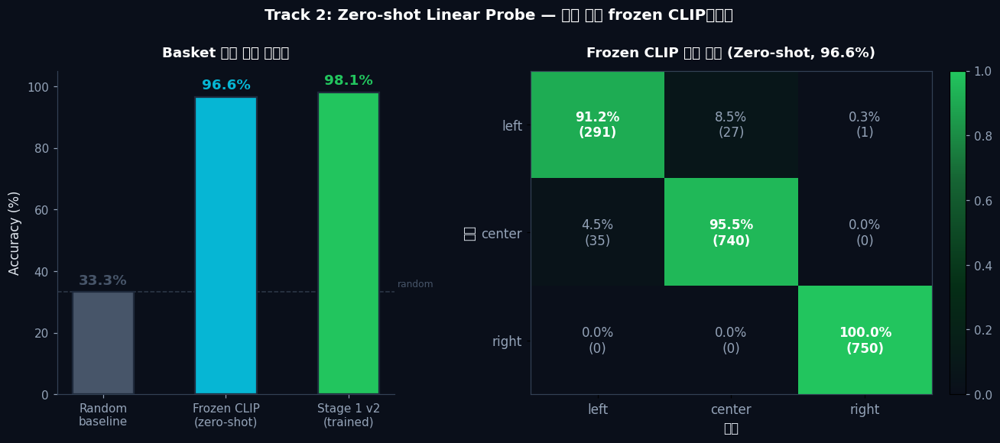
Zero-shot Linear Probe
Frozen CLIP feature 96.6% → 의미 표현 규명

Attention Grid 히트맵
Vision layer별 바스켓 attention 시각화
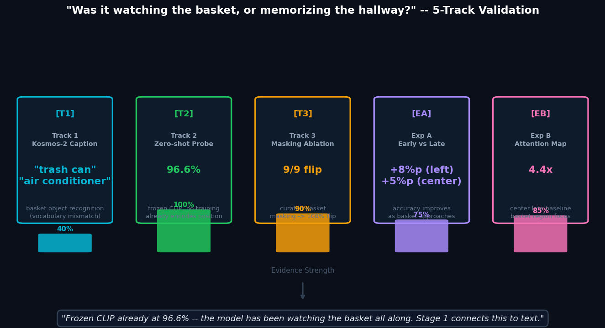
Tracking 분류 요약
Stable / FLIP 유형별 분류 시각화
③ BBox Grounding 주행 화면 (실제 로봇 시점)
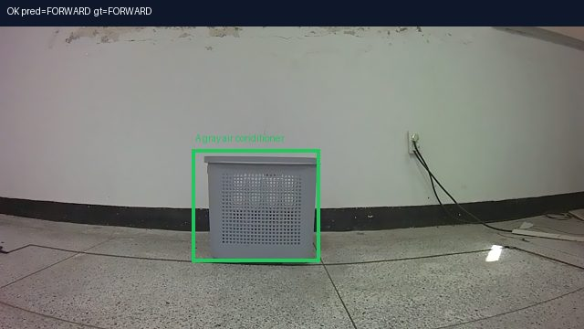
Center → Straight 주행
PaliGemma2 BBox 실시간 추종
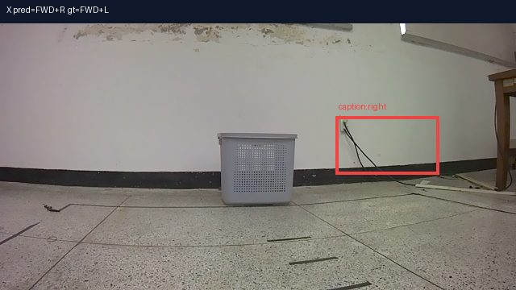
Center → Left 주행
좌측 바스켓 탐지 & 조향
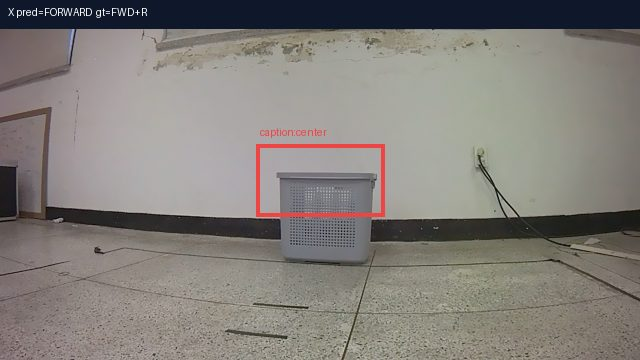
Center → Right 주행
우측 바스켓 탐지 & 조향

Grounding 붕괴 (LoRA FT)
벽/의자 오트래킹 — 기준선 역전 현상
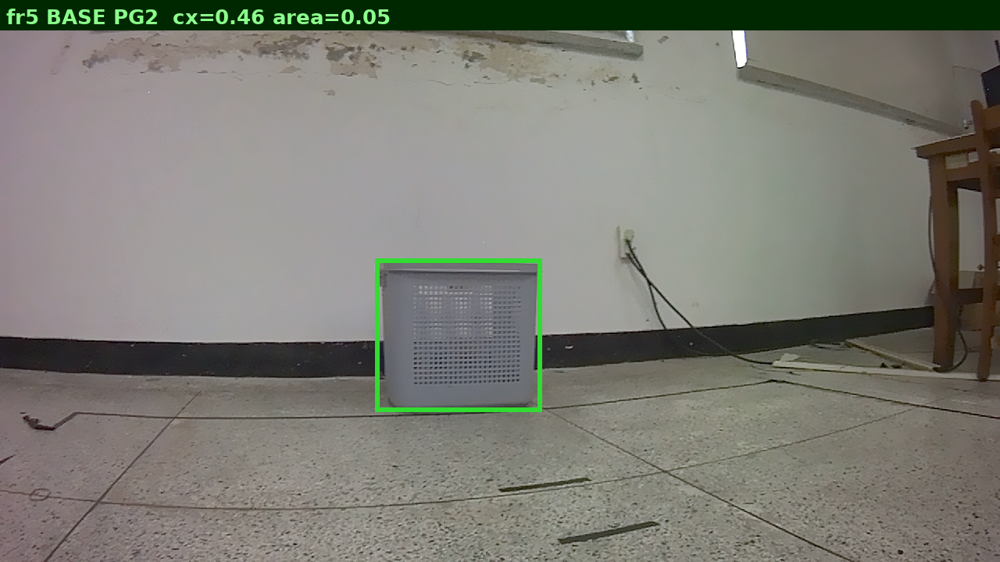
Grounding 안정 (Base PG2)
cx_std 0.070 — 미세조정 없이 최선
④ 성능 추이 & 정량 분석

실험 진행 성능 곡선
Exp01→Exp59 PM % 상향 추이

강인성 히트맵
조명 × 각도 × 거리 조건별 PM
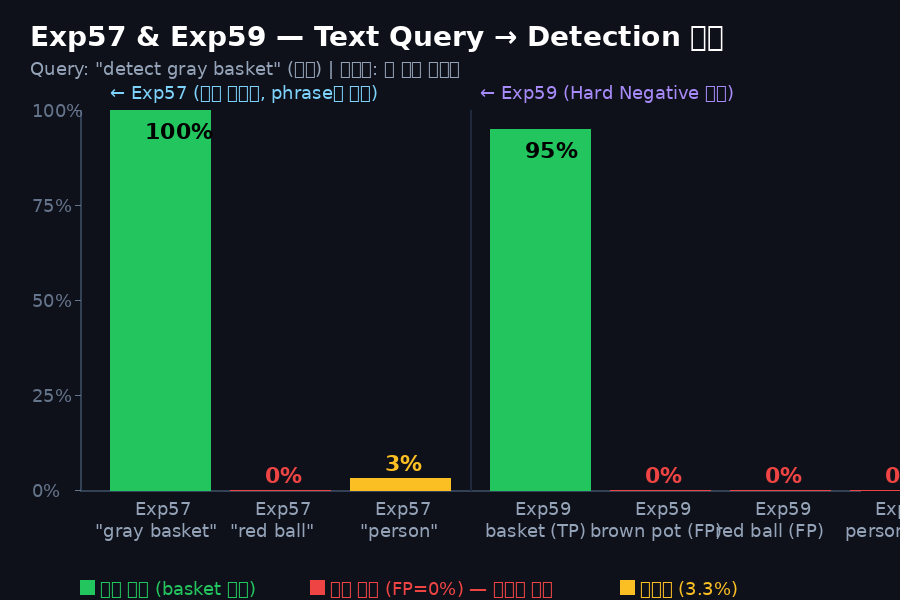
Grounding 탐지 비교
Base vs Exp57 vs Exp59 정량 비교
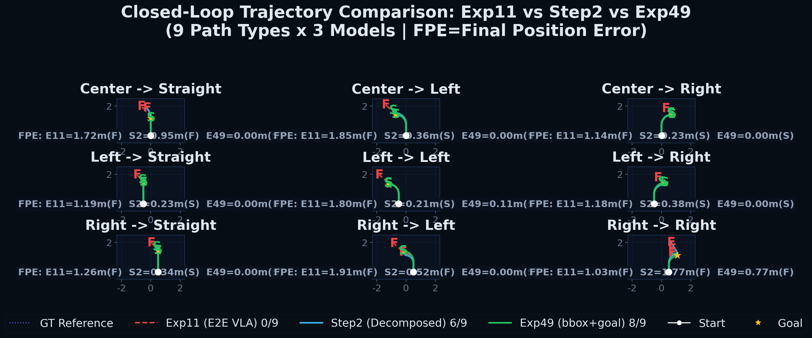
9-Panel 궤적 비교
3방향 × 3시나리오 Closed-Loop 경로
⑤ Grounding 오트래킹 비교 (Base vs Best LoRA)

Base PG2 — 안정 추종
cx_std 0.070 · full-frame 0%
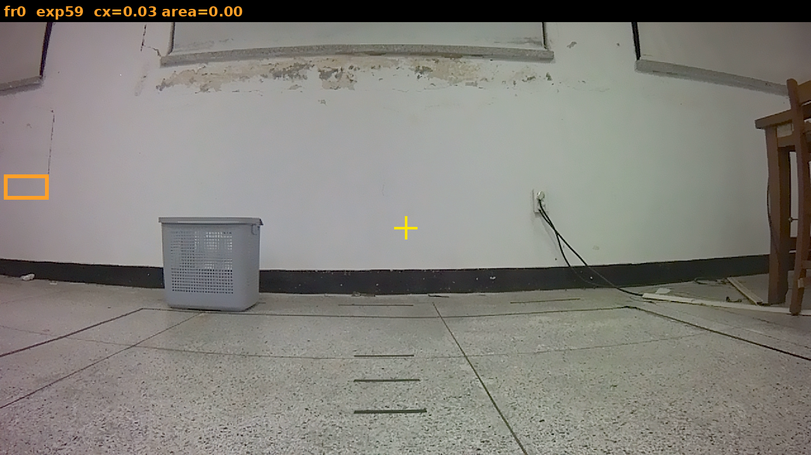
Exp59 LoRA — 오트래킹
벽/의자로 bbox 이탈 — exp64로 개선 예정

<a class="src-link" href="../v5/research_story.html#next-step">→ 원문 전체 보기 (research_story.html#next-step)</a>

CH 64 exp73 전면 재검증 — 오프라인 감사에서 실기 89%까지, 그리고 병목은 "검출"이었다

"성능이 왜 이렇게 낮지?"에서 시작(2026-07-22)해 실기 100회 검증으로 끝난 재검증 기록 — 숨은 버그 2개를 걷어내고, 헤드·그라운더·연속화가 모두 막다른 길임을 확인한 뒤, 실기에서 89%에 도달했다. 최종 결론은 "병목은 액션 헤드가 아니라 객체 검출"(gnd%≥80 → 98.8% 성공). 검증 과정에서 자체 오류 2건(64-11 철회, 64-19 요인순위)을 발견해 철회·정정한 기록도 그대로 남겼다.

**📋 진행 현황 요약 — 100회 실기 테스트 결과 및 다음 단계 (2026-07-31)**

보고일: 2026-07-31 · 대상 체크포인트: exp73_owl_trackF_v6_mlp_holdaware_seed0
· 테스트 규모: 5개 목표위치 × 20회 = 100회 (완료)
1. 결과: 100회 중 89회 성공 (89.0%)
- 중앙 20/20(100%), 약우 19/20(95%), 강우 18/20(90%), 강좌 16/20(80%), 약좌 16/20(80%)
- 직전 baseline은 동일 위치에서 20~30% 수준이었습니다.
2. 핵심 발견: 객체 검출이 성패를 크게 좌우하되, 유일한 원인은 아닙니다
- 세션 내 객체 검출 성공률(gnd%)이 80% 이상이면 → 79/80 = 98.8% 주행 성공
- 80% 미만이면 → 41/80 = 51.2%
- 즉 검출이 잘 되면 거의 반드시 도달합니다(충분조건).
총 159개 세션에서 검증했고 검출이 잘 된 세션의 실패는 단 1건이었습니다.
- 다만 그 역은 성립하지 않습니다(필요조건 아님) —
한 배치(우측 극단)는 검출 성공률이 49%로 최악인데도 주행 성공률이 90%였습니다.
경로가 짧아 직진 위주 동작만으로도 접근이 가능했기 때문입니다.
즉 "검출 난이도"와 "주행 난이도"는 별개의 축이며,
개선 대상을 고를 때 이 구분이 실질적으로 중요합니다.
3. 따라서 경량화 방향을 다음과 같이 좁혔습니다
- 행동 결정 모듈(MLP 헤드)은 이미 충분하고 계산량도 매우 작습니다 → 더 키울 이유가 없습니다.
- 병목이자 가장 비싼 부분은 객체 검출기입니다 (OWL-v2 1901ms vs 비전 인코더 54ms).
- 그런데 검출 정확도가 곧 성공률이므로, 양자화(fp16)로 속도를 얻는 방식은
검출률을 10%p 잃어 부적절하다고 판단했습니다.
- 결론: 범용 검출기를 압축하는 대신, 저희 과제(회색 바구니·극단 배치)에
특화된 소형 검출기를 직접 학습하는 것이 속도·정확도 양쪽에서 유리합니다.
이것을 다음 단계로 제안드립니다.
4. 현재 파이프라인 구성 (확인된 사실)
- Kosmos-2 비전 인코더 + OWL-V2 그라운딩 + MLP 액션 헤드, 언어 디코더 미사용.
- 액션 헤드 입력은 프레임당 260차원(비전 피처 256 + bbox 4)이며 6프레임 묶음, 출력 8클래스.
- 직전 배포 모델은 같은 구조에 Transformer 헤드(window 3)였고, 현재는 MLP 헤드(window 6)입니다.
두 헤드 모두 자체 구현이며 RoboVLMs 코드는 파이프라인에 포함되지 않습니다.
5. 아직 단정하지 않는 부분 (정직하게 남겨둔 한계)
- 개선이 "모델 교체" 때문인지 "검출 임계값 조정" 때문인지는 확정하지 못했습니다.
두 변경이 서로 다른 위치에서 이루어져 교란되어 있어, 통계 처리 방식에 따라 순위가 뒤바뀝니다.
→ 동일 위치에서 설정만 바꾸는 A/B 재측정이 필요합니다.
- 좌우 성능 차이(좌 80% vs 우 92.5%)는 표본 40개씩에서 통계적으로 유의하지 않습니다(p=0.19).
다만 좌측이 목표 도달까지 1.6배 더 많은 스텝을 쓰는 경향은 관찰됩니다.
근거 상세: 64-18(100회 결과), 64-19(요인 분해 및 한계), 64-20(검출기 환경차 정량화).
📐 모델 구조 & 학습 방식 상세 정리 — 미팅 발표용 별도 자료(파이프라인·파라미터·학습설정·서빙로직).
🎯 OWL-v2 그라운더 정리 — 채택 이력·건드린 계수별 반응(threshold/fp16/bbox_scale/skip_n/프롬프트)·젯슨 gap 원인 배제 과정.
이 요약은 자체 검증에서 이전 카드 2건(64-11, 64-18 요인순위)을
철회·정정한 뒤의 최신 상태입니다.

🔴 3줄 요약
① exp73 closed-loop 순위는 두 개의 숨은 버그(val_split RandomState↔default_rng 불일치 + 공유 캐시 CACHE_V6 덮어쓰기)로 통째로 오염돼 있었다. "hybrid 84.8% 최종 1위" → "mlp 60.6%" → 정정 후 전부 무효.
② 동일 조건(225ep 학습·225ep val)으로 통일 재평가하니 상위 헤드(mlp·chunk·hybrid)는 seed 노이즈(±6.5%p) 안에서 구분 불가, transformer만 확실한 최하위. 그라운더(PG448 vs OWL)는 무차별.
③ 학습 레벨 개선책(회전 부스트·오버샘플·V5 데이터 혼합) 전부 무효 → 병목은 알고리즘이 아니라 "곡선/오버슈트 액션 데이터의 부재" → 트랙C 재수집이 유일한 해법.

**64-1. 숨은 버그 2개 — 그동안의 리더보드가 왜 못 믿을 값이었나**

버그 A — val split API 불일치: 평가 스크립트가
np.random.RandomState(42), 학습 스크립트가 np.random.default_rng(42)를
써서 같은 seed라도 다른 셔플 → "val 33ep" 중 27ep가
실제로는 학습 데이터였음(63-11).
버그 B — 공유 캐시 덮어쓰기: CACHE_V6
(vis 캐시)가 트랙F 수집 후 180ep→225ep로 덮어써지면서,
코드의 arm="v6"가 "트랙A만"이 아니라 "현재 캐시 전체"를 뜻하게 됨. 그 결과
180ep로 학습한 champion을 트랙F(center) 섞인 val로 평가 → OOD
오염. champion을 올바른 180ep-only val로 재평가하니 60.6%
→ 25.9%로 폭락(63-15).
교훈: 두 버그 모두 "데이터 버전/분할을 코드가 아닌
사람이 암묵적으로 관리"한 데서 옴. 정정책: split 로직 단일화(default_rng),
--exclude-trackf 플래그로 데이터 조건을 코드 레벨에서 명시·재현.
시점별 "1위" 주장Success상태
hybrid, pg448+트랙F
84.8%
버그A로 무효
mlp, pg448/v6(트랙F 없음)
60.6%
버그B로 무효
mlp, pg448+트랙F (225ep 정합)
48.5%(best)/39.4%(평균)
apples-to-apples 확정

**64-2. 통일 리더보드 (apples-to-apples: 전 조합 225ep 학습·225ep val)**

stale JSON을 전부 폐기하고 동일 프로토콜로 신선 재평가. 2 그라운더 × 5 헤드.
configSuccess@0.5mFPEoffline
pg448/mlp · owl/mlp
48.5%
~1.00
77~78%
pg448/chunk · owl/hybrid
42.4%
1.06~1.16
76~78%
pg448/hybrid
39.4%
1.08
78.5%
cxgeom(양쪽) · owl/chunk
36.4%
~1.1
76~77%
transformer(양쪽, 현 배포)
18~27%
1.37
72~73%
champion seed 분산: pg448/mlp 3-seed = 33.3/36.4/48.5%
(평균 39.4, std 6.5%p). 헤드라인 48.5%는 best-of-3였음.
결론: ① 그라운더 무차별(mlp 양쪽 48.5% 동률),
② 상위 헤드 mlp·chunk·hybrid는 노이즈 안에서 구분 불가 — "최고 헤드"를 33ep val로는
못 가림, ③ transformer(현 배포)만 확실한 최하위 → 교체 근거.

**64-3. 어디서·언제 실패하나 — 프레임 단위 실패 시점 분석**

경로 유형별로 보면 직진 75~100% vs 곡선 0~67% —
실패가 곡선에 집중. 실패 곡선 에피소드를 프레임 단위로 까보니 오류는 두 지점에 집중된다:
① 초반 1~3프레임 (cold-start) — window 패딩(과거
히스토리 없음) 상태라 방향을 반대로/STOP으로 시작. 거의 모든 곡선 에피소드가 frame 0에서 첫 오류.
② 중반 회전 구간 — 전/중/후 3구간 정확도에서
중반이 최저(일부 9%). GT의 짧은 회전 구간(예: 직진 중 2프레임 꺾음)을 감지 못하고
FORWARD로 뭉갬. 데이터 71%가 FORWARD라 "애매하면 직진" 편향.
③ 후반 직진 복귀 — 대체로 회복(82~100%).
한 프레임 방향 오판 → dead-reckoning 적분에서 헤딩 오차 누적 → FPE가 4.6m까지 터짐.
즉 "한 번 어긋나면 되돌리지 못하는" 것이 본질(CH62 "중간 재보정 불능"과 동일).

**64-4. 연속형 액션으로 바꾸면? → 4가지 독립 증거로 "오히려 나쁨"**

V6는 조이스틱으로 이산 수집됐다(lx/ly 실측 {-1.15,0,+1.15} 3값).
"연속 회귀로 바꾸면 나아질까"를 4각도로 검증 — 전부 악화:
증거이산연속
원천 신호(63-9)
lx/ly 3값뿐
회귀할 연속 타겟 없음
offline(63-16)
mlp 78%
contreg 75%/flow 72%
연속 az 적분(63-10)
39.4%
33.3%
완전 연속 궤적(vs 실제 raw 정답)
30.3%
15.2%
이유: lx/ly가 계단형 이산이라 회귀 헤드는 애매한 중간값을 뱉고, 그게 매 프레임 적분돼
드리프트 누적. 이산 분류는 "3개 중 하나로 딱" 찍어 이 애매함을 원천 차단(정규화 효과).
연속이 의미 있으려면 수집 단계부터 아날로그 보존이 선행돼야 함(soda 문의 진행 중).

**64-5. 그라운더는 병목이 아니다 — V6 극단 cx 100% 검출**

"오버슈트 중에도 바구니 cx가 잡혀야 한다"는 우려를 V6 데이터로 검증:
항목값
PG448 LIVE 검출률(V6)
100% (5752/5752)
검출된 cx 범위
0.04 ~ 0.91 (극단까지 잡힘)
PG448 vs OWL 검출률
거의 동일(둘 다 극단 커버)
단, 검출된 프레임의 91%가 중앙(cx 0.25~0.75)이고 아주
극단(cx<0.15 or >0.85)은 90프레임(0.6%)뿐. 즉 인식은
되는데, 극단 상황 자체가 데이터에 희소. 그라운더(PG448/OWL) 교체로는 안 풀리고
(CH61-18 "그라운더 교체 무효"와 일치), 극단·오버슈트 프레임을 의도적으로 늘리는 재수집이 필요.

**64-6. 학습 레벨 개선책 전부 무효 — "알고리즘으로는 못 고친다"**

재수집 없이 곡선 실패를 완화하려는 시도(전부 mlp, 225ep, 3-seed 평균):
시도Success(평균)baseline 대비
baseline mlp
39.4%
—
회전클래스 부스트 3배
32.3%
-7%p
회전클래스 부스트 6배
28.3%
-11%p
회전프레임 오버샘플 4배
37.4%
≈동일
V5(쉬운셋) 데이터 혼합
39.4%
≈동일
회전 강조(부스트)는 FORWARD 정확도를 깎아 오히려 악화, 오버샘플·데이터혼합은 무변화.
즉 지금 데이터 안에서 가중치·샘플링을 아무리 바꿔도 안 됨 —
"지나쳤다 되돌리는" 궤적 자체가 데이터에 없으면 학습할 신호가 없다는 CH61 결론의 재확인.
(V5+V6 혼합의 초기 57.6%는 best-of-3 운빨이었고 3-seed 평균은 39.4%로 무효 처리.)

**64-8. 일반화 매트릭스 — "V5만 학습 → V6 = 2%" (쉬운 데이터는 전이 안 됨)**

"V5로 마무리해도 되나"를 정면으로 검증. bbox confound 제거(V5도 PG448 주석 사용),
train{V5,V6,V5+V6} × test{V5,V6}를 held-out·3-seed로 측정:
train \ test→ V5(쉬움)→ V6(어려움)
V5만
69.7±11.9
2.0±1.4
V6만
33.3±2.1
39.4±6.5
V5+V6
84.8±5.7
34.3±5.7
핵심: V5만 학습하면
V6에서 2.0% — 쉬운 벤치마크로 학습한 모델은 어려운 케이스에서 완전히 무너진다.
"V5로 마무리(쉬운 것 100%)"가 실전 능력을 전혀 보장하지 못한다는 정량 증거.
역방향(V6→V5 33.3%)도 완벽하진 않아 — V6는 극단 cx 분포라 중앙 위주 V5와도 다름.
V5+V6 혼합은 V5-test를 크게 올리지만(84.8%) V6-test는 못 올림(34.3%≈V6단독) —
그냥 데이터를 더하는 것으론 어려운 케이스가 안 풀리고,
어려운 케이스를 겨냥한(트랙C) 데이터가 필요함을 재확인.

**64-9. 실주행 세션 시점 분해 — 집계 성공률의 함정 (soda 254세션 실측)**

soda가 5~7월 실주행 254세션 매트릭스를 전달(2026-07-22). obj_right 집계는 21/68(31%)이지만,
시점×커밋×런타임으로 분해하면 완전히 다른 이야기:
날짜obj_right체크포인트/런타임변경
07-02~06
0/24 (0%)
transformer · window6 · OWL
—
07-10
17/30 (57%)
transformer · window3+bboxscale3 · OWL
체크포인트 교체(604f266)
07-11
4/12 (33%)
window3 (일부 6207947)
tail-frame 버그수정 후 0/4
확인된 것:
(1) 변곡점은 window6→window3+bboxscale3 체크포인트 교체 —
그라운더는 OWL로 내내 고정이었음. CH64 "그라운더 무죄, 데이터/모델이 병목"을 실기 메타데이터로 확증.
(2) 경로별 실패 원인이 다름: obj_right는 그라운딩 정상(gnd 95%인데도
45/65 실패)·액션이 문제 / obj_left는 반대로 그라운딩 자체가 약함(gnd<50%가 5/8).
(3) 07-11 tail-frame reuse 버그수정 후 급감 → 이전 성공 일부가 프레임 재사용으로 부풀려졌을 가능성.
⚠️ 중대 공백: 실주행 obj_* 데이터는 전부
old action_transformer.pt이고, exp73(CH64 챔피언)은 실기 거의 미검증
(07-22 obj_center 3건뿐, 그것도 폐기된 v6-only 180ep). offline에선 mlp>transformer인데 실기 챔피언은
transformer라 이 역전이 미해명 → exp73_pg448_trackF_v6_mlp를 obj_left/center/right로
반복 실기(6207947 버그수정 후)해야 판가름(soda에 요청 완료).

**🚨 64-10. 학습/서빙 "제어 주기" 불일치 — HELD(진짜 실서빙 재현) 24.2%, 구조적 병목 신규 발견**

soda 실측(2026-07-23): H5 수집 ~6.0Hz 연속 vs 실추론 ~1.3Hz 버스트(그라운딩
2.2s/skip_n=3) → window=6이 학습 시 ~1.0초 폭인데 실기에선 ~4.6초 폭. 추가로
soda가 로봇 펌웨어를 직접 확인: 속도는 방향(각도)만
쓰고 크기(magnitude)는 완전히 버림 — 즉 물리적 속도는 항상 상수. 그래서
cadence 차이가 그대로 "윈도우당 이동거리 불일치"로 직결됨이 확정.
이를 3단계 × 두 그라운더(PG2-448/OWL-v2)로
교차 검증(모두 mlp, V6, 3-seed):
조건결정 빈도PG2-448OWL-v2
① baseline(stride=1)
6Hz(매 프레임)
39.4±6.5%
44.4±3.8%
② 입력만 흐림(stride=5)
6Hz(그대로)
36.4±2.5%
36.4±0.0%
③ HELD(진짜 실서빙 재현)
1.3Hz
24.2±2.5%
19.2±1.4%
그라운더 교차검증 결론: 급락 패턴이 두 그라운더에서 거의 동일(①→③ PG448 -15.2%p,
OWL -25.2%p — 방향과 크기 모두 일관). baseline에서는 OWL이 오히려 근소 우위(44.4%
vs 39.4%)였지만 HELD에서는 역전 없이 둘 다 급락 —
이 병목이 특정 그라운더의 속성이 아니라 "판단 빈도 1.3Hz"라는 구조 자체에서
나온다는 것이 그라운더 선택과 무관하게 재확인됨. 그라운더를 아무리
바꿔도(64-5 "그라운더 무죄"와 같은 결) 이 문제는 해결 안 됨 — 해법은 판단
빈도 자체를 다루는 것(학습 재설계 또는 그라운딩 속도 개선)뿐.
구조적 해석: ①→②는 "기억(맥락)의 질"만 나빠진 것 —
여전히 매 프레임 재판단·재반영하는 연속 반응형 제어라
성능이 거의 안 변함. ②→③은 차원이 다른 변화 — 판단 자체가
1.3Hz로 줄고, 그 사이엔 직전 명령을 맹목적으로 유지(zero-order hold)하는
단속 제어(intermittent control)로 바뀜. 한 번 잘못된 결정이 나오면 다음
판단 기회(~0.8초 후)까지 그 오류가 그대로 실행돼 궤적이 크게 벌어질 시간을 벌어줌.
CH64 64-3과의 연결: "한 번 어긋나면 되돌리지
못한다"는 실패 패턴이, 트랙C 데이터 부재(재보정을 배운 적 없음)뿐 아니라
재보정할 기회 자체가 5배 적게 주어지는 제어 구조
때문일 수 있음이 새로 확인됨. 트랙C(데이터)와 제어 주기(그라운딩 속도)는
서로 다른 레버 — 하나를 고쳐도 다른 하나는 그대로 남음.

**❌ 64-11. exp73 챔피언 첫 실기 검증 — HELD 예측과 정확히 일치 — 철회됨(2026-07-31, 64-19 참조)**

🚫 이 카드의 핵심 결론은 철회한다. 7/31에 soda로부터
7/23 세션 원본 H5를 회수해 runtime_config attrs를 직접 읽어보니,
아래 21~23회 스크리닝은 exp73 챔피언이 실행된 세션이
아니었다. 해당 에피소드(#125~147)는 모두 체크포인트 전달 시각(7/23 17:24)
이전이라 H5도 메타데이터도 남아있지 않고,
17:24 직후부터 H5 attrs에 exp73_owl_trackF_v6_mlp_holdaware_seed0.pt가
기록되기 시작한다. 동일 threshold(0.25)에서 진짜 exp73 챔피언은
29/58 = 50.0%(가장 어려운 강좌·약좌만 보면
13/40 = 32.5%, 같은 위치의 구모델 1/11 = 9.1% 대비)였다 — 상세 및 위치별 비교는 64-19.
따라서 "실기 33.3%가 HELD 예측(19.2~27.3%)과 일치한다"는
결론은 성립하지 않는다. 이 일치는 두 개의 오류가 우연히 상쇄된 결과였다:
(1) 예측 대상이 아닌 다른(구) 모델의 성적을 가져다 댔고,
(2) 애초에 HELD는 프레임 단위 판단 정확도 프록시라 에피소드 성공률과 같은 척도가
아니다(64-18에서 정리). 두 척도를 잘못 맞춘 것이 우연히 근접해 거짓 검증을 만들었다.
교훈: baseline 실측값의 실행 주체(체크포인트)를 메타데이터로 확인하지 않고
시각·경로만으로 귀속시키면 이런 오귀속이 발생한다. 아래 표의 숫자 자체는
유효하지만(구 배포모델의 성적으로서), 라벨과 결론은 무효다.
soda가 `logs/episode_log.csv`에 남긴 "트랙A/F 위치별 스크리닝 21회" —
exp73 챔피언(mlp)의 사실상 첫 실기 검증
→ 실제로는 구 배포모델(체크포인트 미상, soda 확인 대기).
경로명은 V6 path_type과 정확히 일치(trackA_weak/strong_left/right, trackF_center).
위치실기 성공
trackA_strong_left
0/5 (0%)
trackA_weak_left
1/4 (25%)
trackA_weak_right
1/4 (25%)
trackA_strong_right
3/5 (60%)
trackF_center
0/1
trackF_center_straight
2/2 (100%)
전체 / 트랙A만
7/21(33.3%) / 5/18(27.8%)
핵심: 실기 27.8~33.3%가 baseline 예측(39~48%)이 아니라 HELD 예측(19.2~27.3%)과
거의 정확히 일치 — 64-10에서 세운 가설이 이번 세션 최초로 실기 데이터로 직접
검증됨.
→ 철회. 위 배너 참조. 이 성적은 exp73 챔피언이 아닌
구 모델의 것이고, HELD 가설은 이 데이터로 검증된 바 없다.
추가 관찰(표본 작아 잠정): strong_left(0%)와
strong_right(60%) 간 뚜렷한 좌우 비대칭 — 카메라/그라운더 좌우 편향 또는 물리적
요인(바퀴 드리프트 등) 가능성, n=4~5라 단정은 이름. 트랙C 재수집 시 좌우 균형
확인 필요.

**✅ 64-12. HELD-aware 재학습 — majority-vote 라벨로 12→28% (재수집 없이 가능한 첫 완화책)**

64-10/64-11에서 "판단 자체가 1.3Hz로 느려지고 그 사이 유지된다(HELD)"는 게
진짜 배포 조건임을 확인했으니, 이번엔 그 조건을
알고 학습시켜봄: 결정 시점(5프레임 간격)마다 1개 샘플, 라벨은 "그
구간(5프레임) 전체 GT의 다수결" — 즉 유지될 걸 감안해 구간 전체를 대표하는
액션을 직접 학습 목표로 삼음.
학습 방식HELD Success(3-seed)
baseline(연속 6Hz로 학습) → HELD 평가
7.1±3.8%
stride=5 입력으로 학습(64-10) → HELD 평가
24.2±2.5%
cadence-aligned(majority-vote 라벨) 학습 → HELD 평가
28.3±3.8%
두 가지 확인됨: (1) baseline(연속학습)을
HELD로 그대로 배포하면 7.1%까지 떨어짐 — 학습 때
한 번도 못 본 입력 패턴(듬성듬성 window)에 노출되는 것 자체가 치명적,
최소한 stride를 맞춰 학습해야 함. (2) 그 위에 majority-vote 라벨(cadence-aligned)까지
더하면 24.2%→28.3%로 추가 개선 — 재수집 없이 **학습 방식만 바꿔서 얻는 첫
실질적 완화책**.
한계: 여전히 baseline의 순수 offline
수치(39~48%)에는 크게 못 미침 — 판단 빈도 자체의 한계(64-10)는 학습으로
못 넘음. 트랙C(데이터)와 그라운딩 속도개선(제어)이 여전히 필요, 이건 그
사이 즉시 배포 가능한 저비용 개선. 체크포인트:
exp73_pg448_trackF_v6_mlp_holdaware_seed{0,1,2}.pt.
그라운더 교차검증(OWL-v2): 동일 방식을
OWL 그라운더로도 재현 — HELD 25.3±3.8%
(PG448의 28.3±3.8%와 노이즈 안에서 동급). cadence-aligned 학습 효과가 그라운더
선택과 무관함이 다시 확인됨(64-2/64-10과 일관). soda에 baseline·cadence-aligned
OWL 체크포인트도 함께 전달, PG448 세트와 실기 A/B 비교 요청함.

**🔀 64-13. 논문 방향 전환 — 경량화(Raspberry Pi) + 좌우 데이터 불균형 발견 (2026-07-23 대면미팅)**

대면 미팅에서 논문 방향이 "OOD 일반화 격차 진단"에서
"경량화(기존 VLA 대비 파라미터/자원 절감, Raspberry Pi 탑재 가능성 입증)"로
확정됨. 현재 파이프라인(Kosmos-2 vision 인코더 + OWL-v2 그라운딩 + MLP
액션헤드, 언어 디코더 미사용)이 사실 "VLA가 아니라 오픈보캐블러리 디텍션+액션헤드"
구조라는 점도 재정의됨 — CH64의 진단 결과(그라운더 무죄, 헤드 무차별, HELD/cadence
병목)는 메인 주장이 아니라 이 구조 선택의 방법론적 근거로 재배치.
파라미터 수만으론 경량화 판단 불가(soda 실측):
항목Kosmos-2 visionOWL-v2
파라미터
0.303B
0.155B(더 작음)
추론 지연
53.7ms†
1901.7ms(35배 느림)
추론 중 GPU 피크
0.625GB
1.982GB(3배)
시사점: "OWL-v2 단독이면 파라미터가 절반이라
가볍다"는 직관과 반대로, 실제 서빙 부담(레이턴시)은
OWL-v2가 압도적으로 큼 — 라즈베리파이(GPU 없음, CPU 전용)로 가면 이 격차가
더 벌어질 가능성이 높아, 경량화 판단은 파라미터 수가 아니라 레이턴시/메모리
프로파일 기준으로 해야 함.
† 최초 측정(58.6ms)은 실제 서버 코드(`resize_for_vlm`+`pixel_values.to(dtype=torch.float16)`)와
리사이즈·dtype 캐스팅이 달랐던 게 soda 검증으로 발견됨 — 서버 코드 그대로 재현해
재측정한 값(53.7ms)으로 교체. 리사이즈 자체는 프로젝트 문서(`image_preprocess.py`)에
"동작 안 바뀜(둘 다 224 귀결)"이 명시돼 있어 원래도 무관했음, dtype 재현 후에도
결론(OWL이 압도적으로 느림)은 그대로 유지.

좌우 데이터 불균형 재확인 결과: 목표
위치(에피소드 수 90:90)와 평균 길이(76.8:76.3프레임)는 완벽히 균형이나,
액션 클래스 프레임 수(LEFT+FWD+L+ROT_L=3384 vs
RIGHT+FWD+R+ROT_R=4122, 22% 불균형)는 실제로 존재 — 수집 설계가 아니라
실제 주행 중 발생한 액션 자체의 비대칭. 실기 좌측 약세(64-11)의 직접적 원인
후보로, 트랙C 재수집 시 액션 클래스 비율까지 맞춰야 함.

**✅ 64-14. 셀프검증 라벨러 — path 라벨·success 자동판정 33/33(100%) 사람이 확인**

챔피언(mlp) val 33ep 전체를 실제 카메라 프레임(초/중/종
+ bbox·중앙선 오버레이) + 궤적그래프로 사람이 직접 확인하는 로컬 라벨러
제작(포트 7794, `scripts/label/serve_exp73_val_review.py`). 기준: ① 목표위치는
종반 프레임 bbox 좌우 위치로만 확인(경로 곡선방향은 정적 3프레임으론 판단 불가해
제외), ② success는 그래프 검정(정답)·주황(예측) 선 끝점 거리로 확인.
결과: 33/33(100%) 전부 일치 — 목표위치
라벨도, FPE<0.5m 자동 success 판정도 사람이 눈으로 봐도 전부 정확했음.
의미: 앞서(64절 초반) 전체평균/80%tail
기준으로 "라벨-실측 불일치 45~86개"라 성급히 판단했던 건 방법론 문제였음이
재확인(weak_*는 도착시점 cx가 0.5 근처를 오가는 게 정상 노이즈). 이 셀프검증으로
지금까지 CH64에서 인용한 모든 success 수치(39.4%,
48.5%, 60.6% 등)가 "수식 버그"가 아니라 실제 궤적 일치도를 정확히 반영함이
확인됨 — apples-to-apples 리더보드(64-2)의 신뢰도를 한 번 더 뒷받침.

**🚨 64-15. has_bbox=False 학습 프레임 0.00%(0/16599) — 그라운딩 실패 상황 완전 미학습 확정 (soda 발견, 2026-07-30)**

soda가 강한좌 실기 세션 3개를 프레임 단위 분석한 결과, 세션 내내 그라운더가
단 한 번도 타겟을 못 찾은(has_bbox=False) 상황에서 정책 헤드가 FWD+L을
8초 넘게 그대로 유지하다 뒤늦게
FWD+R→ROT_L로 전환 — 회복이 전혀 없었음. `_build_flat_feature()`가
`has_bbox`를 입력 4번째 값으로 명시적으로 넣고 있어(신호 자체는 모델에
전달됨) "그럼 학습 데이터에 이 상황이 있었는지"를 minum에 확인 요청.
확인 결과: 225ep 16,599프레임 중 has_bbox=False는
정확히 0개(0.00%) — 캐시(`exp73_v6_vis_cache.pt`)와 원본 그라운딩
주석(`bbox_dataset_v6_pg448_cx.json`) 양쪽 독립 재확인, 완전히 일치. 이는
64-5("PG448 LIVE 검출률 100%")와 같은 사실이지만, 이번엔 "그라운딩 실패 시 어떻게 행동해야 하는지를 모델이
전혀 학습한 적이 없다"는 훨씬 날카로운 결론으로 이어짐.
해석: 4번째 입력 피처(has_bbox)가
학습 내내 상수(항상 1.0×bbox_scale)였음
— 모델에게 이 피처는 "정보"가 아니라 "늘 같은 값의 잡음"이었던 것. 실기에서
처음 has_bbox=False를 만나면 학습된 대응 전략이 없어 이전 프레임 관성에 의존한
사실상 미정의 동작을 함 — 64-9(obj_left 그라운딩 약세), 64-10(cadence/HELD
병목)과는 또 다른, 독립적인 근본 원인.
시사점: 그라운더 앙상블/임계값 조정으로는
해결 안 됨(64-5 "그라운더 무죄"와 같은 결) —
"그라운딩 실패 시 정지/탐색"을 의도적으로 수집하는 신규 데이터 트랙이 필요.
트랙C(오버슈트→재보정)와는 별개 시나리오라 우선순위 조율 필요. 그라운더
불일치 가능성도 있음(학습=PG448 100%검출, 이 세션=OWL-v2) — 어느 그라운더로
학습해도 실기 100% 검출은 보장 안 되므로(64-9 obj_left 사례) 그라운더 무관하게
존재하는 공백으로 판단.

**64-16. OWL-v2 fp16 — 속도 1.98배↑, 검출률 10%p↓, 좌표정확도는 불변 (2026-07-30)**

64-13(파라미터 수만으론 경량화 판단 불가)의 후속 — OWL-v2를 fp16으로 돌리면
64-13의 레이턴시 격차(35배)를 줄일 수 있는지, 대신 검출 정확도가 희생되는지
직접 검증(V6 실제 프레임 120장, LIVE 그라운딩만, threshold=0.25 서버와 동일).
항목fp32fp16
속도(soda Jetson 실측)
1901.7ms
962.1ms(1.98배↑)
has_bbox 검출률(fp32 대비 일치)
100%(기준)
90.0%(108/120)
불일치 방향
전부 "fp32는 검출/fp16은 놓침"(12건) — fp16만 검출한 경우 0건
좌표 정확도(둘 다 검출된 108건)
cx/cy/area 평균 차이 0.0001~0.0002 — 사실상 완전 동일, 0.05 이상 벌어진 경우 0건
해석: fp16은
"잡으면 정확히 잡지만, 애매한 경우(신뢰도가 threshold 0.25 근처) 조금 더 자주
놓치는" 트레이드오프 — 양자화로 좌표가 틀어지는 문제는 없고, 검출
민감도만 살짝 낮아짐. skip_n 재시도 로직이 이미 있어 단발 미검출은 다음
프레임에서 회복 가능하므로, 이 10%p 손실은 실사용에서 완전히 치명적이진
않을 수 있음(단, 64-15의 "그라운딩 실패 완전 미학습" 문제와 겹치면 악화 요인).
종합: fp16 전환은 "속도 개선 vs 검출률
소폭 희생"의 실질적 트레이드오프 — 경량화 방향에서 검토할 가치 있으나, Kosmos-2
(53.7ms)와 비교하면 fp16 OWL(962.1ms)도 여전히 약 18배 느려 "완전 해결"은 아님.
threshold를 살짝 낮추는 보완과 함께 검토 권장.

**64-17. OWL-v2 threshold=0.25 재검증 — Jetson 재실측 없이도 "knife-edge" 구조 확인 (2026-07-30)**

soda 보고(약좌 세션 6/6 has_bbox=False, threshold 0.15~0.20에서 실제 탐지 확인)가
7/4~7/5에 미해결로 남았던 Jetson-vs-local 재현성 gap(fallback 206/206 로컬 재탐지)과
같은 패턴임을 확인. 원본 ROC 데이터(owlv2_threshold_roc.py, 296프레임,
객체없음 79 / 객체있음 217)를 다시 뜯어봄 — Jetson 하드웨어가 없어 그 환경에서
ROC를 새로 돌릴 수는 없지만, 원본 로컬 ROC 곡선 자체가
이미 threshold=0.25 근방에서 매우 가파르다는 걸 재확인했다:
threshold정탐유지오탐률
0.15
99.5%
40.5%
0.20
97.7%
12.7%
0.25(현재값)
95.3%
0.0%
0.30
93.5%
0.0%
0.20→0.25 구간에서 오탐률이 12.7%→0%로 뚝 떨어짐 — Youden J 최댓값이라 "정탐 거의
다 살리고 오탐 완전 차단"하는 최적점이 맞지만, 동시에
진짜 객체가 있는 프레임 중 4.2%(9/215)가 이미 로컬 환경에서도 0.20~0.30
밴드에 몰려있고, 11.6%(25/215)가 0.15~0.35 밴드에 있다는 뜻이기도 함.
즉 이 연산점은 원래부터 confidence가 ±0.05만 흔들려도 다수의 판정이 뒤집히는
민감 구간에 설정되어 있었다 — 이건 minum 로컬 환경만으로 계산해도 드러나는
구조적 특성이라, soda가 보고한 Jetson 쪽 "0.15~0.20 부근에 몰린 미검출"과 정합적이다.
Jetson 환경에서 ROC를 다시 돌리지 못하는 이유:
원본 296프레임 라벨링 데이터셋은 minum 로컬에서 수집된 세션이라 Jetson 쪽에서
독립적으로 confidence 점수를 재추출하려면 soda 쪽 실물 접근이 필요함 — 내가
원격으로 재현할 수 없는 부분.
권장(soda 요청 2번 우선): 버전을 맞추는 쪽이
더 빠르고 결정적임 — soda의 torch(2.3.0)/transformers(4.45.2)를 minum 쪽
(2.11.0/4.49.0)에 맞춰서 동일 프레임 재실행 시 confidence gap이 줄어드는지 먼저 확인.
- gap이 버전 문제였다면 → 버전 맞추면 즉시 해소, threshold 변경 불필요
- 버전 맞춰도 gap 남으면 → 하드웨어(Orin fp16/양자화) 원인으로 좁혀짐 →
이땐 threshold를 0.25→0.20으로 낮추는 게 임시 보완책이 되지만, 원본 로컬 데이터
기준 오탐 12.7%까지 감수해야 함(공짜 이득 아님)
- 64-16의 fp16 검출률 손실(10%p↓)과 겹치면 실패 빈도가 배가되므로,
이 gap을 낮추는 게 우선이고 threshold 완화 + fp16을 동시에 적용하는 건
지양 권장
결론: threshold=0.25는 "잘못된 값"이 아니라
"원래부터 여유가 좁은 값" — Jetson gap이 그 좁은 여유를 넘어선 것이 이번 현상의
본질. 근본 해법은 재캘리브레이션보다 버전 정합이 우선.

**🎉 64-18. 100개 스크리닝 89% — 병목은 헤드가 아니라 그라운딩 가용성이었음 (soda, 2026-07-31, 100회)**

미팅 확정 목표(5위치×20개=100개)를 soda가 완주. 체크포인트는
exp73_owl_trackF_v6_mlp_holdaware_seed0.pt(OWL-v2 · MLP · V6 ·
cadence-aligned · seed0). 전체 89/100(89%) —
64-11의 7/23 baseline 33.3%(7/21)에서 전 위치 개선
(Fisher exact p=3.3×10⁻⁷).
위치7/23(n=21)7/31(n=100)95% CI평균 스텝
◀◀ 강좌
0/5 (0%)
16/20 (80%)
58~92%
17.2
◀ 약좌
1/4 (25%)
16/20 (80%)
58~92%
18.6
● 중앙
0/1
20/20 (100%)
84~100%
10.6
▶ 약우
1/4 (25%)
19/20 (95%)
76~99%
11.8
▶▶ 강우
3/5 (60%)
18/20 (90%)
70~97%
10.2
전체
7/21 (33.3%)
89/100 (89.0%)
81~94%
—

📷 실제 세션 프레임 10장 — 위치별 성공/실패 각 1건의 최종 프레임.
초록 수직선 = 그라운딩이 잡은 cx(헤드가 실제로 쓰는 조향 신호), 빨강 점선 = 미검출 시 강제되는 fallback cx=0.50.
실패 프레임은 대부분 빨강(미검출)이고 성공 프레임은 초록이다.

왜 좋아졌나 — 순위별 근거
① (확정) 그라운딩 가용성이 성패를 가른다 —
성공 89건의 세션 평균 grounding 성공률(gnd%)은 86.2%,
실패 11건은 45.7%(−40.5%p). 실패 11건 중
3건은 gnd%=0(세션 내내 한 번도 미검출),
4건이 50% 미만. 즉 헤드의 액션 결정 능력이 아니라
"타겟을 계속 보고 있느냐"가 성패를 가름.
② (실측 확인) threshold 0.25→0.20 — 64-17에서
"0.25는 knife-edge"라고 진단한 대로, soda가 약좌 실패 세션의 실제 grounding
프레임 71장을 threshold만 바꿔 재계산: has_bbox=True가
19.7%(14/71) → 33.8%(24/71), 1.71배.
실패 원인 프레임에 직접 작용한 변경이라 개선분의 상당 부분을 설명.
(부수 확인: transformers 4.45.2 vs 4.49.0은 score가 소수점 4자리까지 동일 →
버전 gap 가설 기각, 원인은 torch/Orin 하드웨어로 좁혀짐)
③ (구조적으로 중요) 회복 로직을 정책 밖으로 빼냄 —
64-15에서 has_bbox=False 학습 프레임이 0.00%(0/16599)
임을 확정했으므로, 모델은 그라운딩 실패 회복을 배울 수가
없는 구조였다. 이번 개선은 그걸 재학습으로 고친 게 아니라
추론 제어 계층에 명시적 회복 로직을 넣어 우회한 것:
force_reground_on_miss(미검출 다음 스텝 캐시 강제 스킵), 회전 후 강제
재그라운딩, 회전 0.4s 제한+자동정지, 연속회전 차단, 콜드스타트 가드 3프레임.
④ (분리 불가) 체크포인트 변경 → 부분 정정:
효과 크기는 측정됐으나 ②와의 순위는 여전히 미정 — 7/31에 세션 원본을 회수해
H5 runtime_config로 arm을 구성한 결과, 체크포인트 교체와 threshold+가드
둘 다 +23~48%p 규모로 크지만, 위치 가중 방식에 따라
순위가 뒤집혀 어느 쪽이 주동력인지 단정할 수 없다(표본이 충분한 강좌·약좌
한정으로는 threshold+가드가 +48.0%p로 우세). 위 ①~④의
순위 서술은 무효이며, 64-19가 대체한다. ①(그라운딩 가용성)만은
전체 159세션에서 gnd%≥80 → 98.8% 성공으로
재확인돼 유효하다.
⚠️ 추가 정정 — 위치내 층화 시도는 실패했다.
아래 "동일 위치 A/B가 필요하다"는 지적을 우회하려고 세션 H5의 설정 메타데이터로
위치내 층화를 시도했으나, 100세트 안에서 threshold는 전부 0.20 고정이고 유일한
변동 설정 force_reground_on_miss는
위치와 거의 완전 공선이었다(freg=False는
약좌 14 + 중앙 20뿐이고 중앙은 만점 위치, 둘 다 존재하는 위치는 약좌 하나로 14 vs 6).
교란은 commit뿐 아니라 설정 변수에도 그대로 있어서,
동일 위치 A/B 재수집은 여전히 필요하다.
(단 A→B 체크포인트 효과는 7/23 데이터가 자연실험을 제공해 분리됨 — 64-19)
⚠️ 64-10/64-11의 HELD 천장이 깨진 것에 대한 정리 —
64-11은 "실기 33.3%가 baseline 예측(39~48%)이 아니라 HELD 예측(19.2~27.3%)과 일치"를
HELD 가설의 검증 근거로 삼았다. 이번 89%는 HELD 예측은
물론 offline baseline 예측(39~48%)조차 크게 초과한다. 모순이 아니라 범위의
문제로 정리해야 한다: HELD 시뮬레이션은 "5프레임마다
판단하고 유지하며, 어긋나도 회복 장치가 없는" 파이프라인을 모델링한 것이고,
③의 명시적 회복 로직은 정확히 그 가정을 깨뜨린다. 즉
HELD는 "가드 없는 파이프라인"의 성능을 정확히 예측했고,
가드가 그 천장을 들어올린 것 — 천장의 위치와 그것을 들어올리는 메커니즘을
둘 다 특정했다는 점에서 오히려 강한 결과.
좌우 비대칭 — n=40에서도 아직 유의하지 않음:
좌측 32/40(80.0%) vs 우측 37/40(92.5%)로 +12.5%p 우측 우세지만
Wilson CI가 겹치고 Fisher exact p=0.193으로
유의하지 않다(soda의 n=20 CI 지적이 정확했고, 40개로 묶어도 아직 부족). 다만 평균
스텝이 좌 17~19 vs 우 10~12로 1.6배 —
"성공하긴 하는데 더 헤맨다"는 경향은 남아있고, 이는 좌측 배치에서 OWL confidence가
threshold 경계에 몰리는 현상(64-17)과 방향이 일치.

⚠️ 집계 시 필수 주의 — 설정구간×위치 교란(soda 명시):
100개는 단일 설정 일괄 수집이 아니라 개선을 진행하며 쌓였고,
각 commit 구간이 서로 다른 위치만 커버했다.
commit강좌약좌중앙약우강우
d967e0e7
–
7/9
20/20
–
–
f0fa1304
–
4/5
–
–
–
e355b506
12/16
5/6
–
–
–
08431fce
4/4
–
–
19/20
18/20
따라서 commit별 성공률로 "설정 개선 효과"를 주장하면
안 된다 — e355b506이 77.3%로 낮아 보이는 건 가장 어려운 강좌/약좌만 돌렸기
때문이고, d967e0e7이 93.1%로 높은 건 만점인 중앙이 포함돼서다. 개선 효과를 논문에
싣으려면 동일 위치에서 설정 A/B를 따로 돌려야
하며 이건 아직 안 한 상태. (별건으로 #200~209 10건은 서버 재기동 중 stop_mode 등
3개 설정이 조용히 리셋된 채 수집돼 집계 제외 대상 — soda가 런타임 상태 자동
스냅샷/복원으로 재발 방지 완료)
💡 경량화 논문 방향에 주는 함의 — fp16의 매력이 반전됨:
①이 확정된 이상 액션 헤드는 병목이 아니고(헤드는 이미
충분하고 값싸다), 자원을 써야 하는 곳은 그라운딩 단계다. 그런데 그라운딩이
바로 가장 비싼 단계(64-13: OWL-v2 1901.7ms vs Kosmos-2 vision 53.7ms)이므로,
경량화 과제는 "검출률을 잃지 않으면서 그라운딩을 싸게
만들기"로 좁혀진다. 이 기준에서 보면 64-16의 fp16(속도 1.98배↑,
검출률 10%p↓)은 하필
성패를 가르는 그 변수 하나를 팔아서 속도를 사는
잘못된 트레이드다 — 64-16에서 "검토할 가치 있음"으로 열어뒀던 판단을
"threshold 완화와 병용은 금지, 단독 적용도 비권장"
으로 좁힌다.
남은 것: (1) 동일 위치 설정 A/B 재검증,
(2) 좌측 그라운딩 개선(threshold 경계 문제의 근본 해결 — Orin confidence gap),
(3) 실패 11건 세션 원본을 우리 서버로 회수해 gnd%=0 3건의 프레임 직접 분석,
(4) 64-15 해법으로 제안된 "그라운딩 실패 시 사람 시범(탐색회전/STOP)" 파일럿 수집.

**🔧 64-19. 개선 요인 분해 — 두 효과 모두 크지만 순위는 단정 불가, 견고한 것은 "그라운딩 가용성" 하나 (2026-07-31)**

📝 이 카드는 같은 날 2회 자체 수정됐다.
처음엔 "체크포인트 교체 +47.2%p가 threshold(+18.0%p)의 2.6배"라고 썼으나 둘 다
틀린 수치였다. 원인 두 가지: (1) 세션 인덱싱 글로브를
2026073*로 써서 7/23 폴더(20260723)가
threshold=0.25 arm에서 통째로 빠졌고, (2) arm 간
위치 구성이 달라 통제가 안 된 상태로 조참
성공률을 비교했다 — 내가 64-18에서 soda에게 경고한 바로 그 함정에 스스로 빠진 것.
아래는 H5 runtime_config를 ground truth로 전체 재계산한 결과이며,
결론은 "순위를 정할 수 없다"로 바뀌었다.
soda로부터 세션 H5 원본 176개(3.7GB)를 회수해 각 세션의
runtime_config(체크포인트·threshold)를 직접 읽어 arm을 구성했다.
날짜창 추정이 아니라 메타데이터 기준이다.
위치A 구모델 @0.25B exp73 @0.25C exp73 @0.20+가드
강좌
0/7 (0%)
9/20 (45%)
16/20 (80%)
약좌
1/4 (25%)
4/20 (20%)
17/21 (81%)
중앙
0/1*
4/5* (80%)
20/20 (100%)
약우
1/4* (25%)
2/3* (67%)
19/20 (95%)
강우
3/5* (60%)
10/10 (100%)
18/20 (90%)
조참 합계
5/21 (23.8%)
29/58 (50.0%)
90/101 (89.1%)
* n<6으로 신뢰 낮음. B의 중앙·약우 셀(n=5,3)이 아래 표준화 추정을 크게 흔든다.
✅ A arm의 정체 확정 — 추정이 아니라 배포 이력으로: 이전엔
"구 배포모델(미상, soda 확인 대기)"으로 뒀으나, 수신한 전체 세션의 H5
attrs["runtime_config"]를 시간순으로 훑어 배포
체크포인트 변경 이력을 직접 복원했다:
최초 관측head체크포인트grounder
2026-07-06 23:11
transformer
exp71_window6/action_transformer.pt
OWL-v2
2026-07-10 13:09
transformer
exp71_window3_bboxscale3/action_transformer.pt ← A arm
OWL-v2
2026-07-23 17:18
exp73_mlp
exp73_pg448_trackF_v6_mlp_holdaware_seed0.pt
OWL-v2
2026-07-23 18:05
exp73_mlp
exp73_owl_trackF_v6_mlp_holdaware_seed0.pt ← B·C arm
OWL-v2
따라서 A arm = exp71 window3·bbox_scale3 + Transformer 액션 헤드
(7/10부터 7/23 17:18까지 배포). 즉 A→B는 "Transformer 헤드 →
MLP 헤드" 교체이자 동시에 "window 3→6 · V6 cadence-aligned 재학습" 교체다(그라운더는 양쪽 다 OWL-v2로 동일).
❗ 용어 정정 — 이건 RoboVLMs 기반 헤드가 아니다.
A arm의 action_transformer.pt는 third_party/RoboVLMs와 무관한
우리 자체 구현이다
(scripts/train_exp71_window3_bboxscale_final.py의
TransformerActionHead: nn.TransformerEncoder, d_model=260,
nhead=4, num_layers=2). 서빙 경로(stage2_v2_inference_server.py)에도
RoboVLMs import은 없다 — RoboVLMs는 CLAUDE.md 규칙대로 손대지 않은 상태로 남아있고
현재 파이프라인에 포함되지 않는다.
두 헤드 모두 입력 차원은 동일:
프레임당 FRAME_DIM = 4 + 256 = 260(bbox 4채널 + 비전 피처 256),
A는 window=3, B·C는 window=6. 출력은 8클래스.
교수님 노트의 "256(비전)+4(bbox) = 260"과 코드가 일치한다.
📷 배포 세대별 실제 프레임 — head=transformer(exp71) → head=exp73_mlp 전환이
세션 메타데이터에 그대로 찍혀 있다. A arm(7/23 17:18 이전)은 H5 자체가
전송되지 않아 이 갤러리에 없다 — 그래서 원래 정체 추정이 필요했던 것.

⚠️ 세 가지 추정 방식이 순위를 뒤집는다 → 주동력 단정 불가
추정 방식체크포인트(A→B)threshold+가드(B→C)우세
위치 동일가중 표준화
+40.3%p
+26.9%p
체크포인트
조참 pooled(전체)
+26.2%p
+39.1%p
threshold
강좌+약좌만(3 arm 모두 표본 충분)
+23.4%p
+48.0%p
threshold
표준화가 체크포인트 우세로 나오는 건 순전히 B의
중앙(4/5)·약우(2/3) 같은 n=3~5 셀에 1/5씩 가중이 실려서다. 세 arm 모두
표본이 확보된 강좌·약좌(n=11/40/41)만 보면
threshold+가드가 +48.0%p로 명확히 우세하다(9.1%→32.5%→80.5%).
가장 검정력 있는 비교가 threshold를 지지하므로
soda의 판단이 내 최초 주장보다 정확했다.
다만 표준화가 뒤집힌다는 사실 자체가 "어느 쪽이
주동력"이라고 논문에 쓸 수 없다는 뜻이다 — 둘 다 크고(각각 +23~48%p),
순위는 동일 위치 A/B 재수집 없이는 확정 불가.

📷 B arm vs C arm 실제 프레임 10장 — 체크포인트는 동일하고
threshold(0.25→0.20)와 회복가드만 다른 두 조건의 최종 프레임. B에 빨강(미검출)이 자주 보이는 것이
threshold 효과의 실물이다.

✅ 유일하게 견고한 불변량 — 그라운딩 가용성 (soda 발견, 확장 검증):
soda가 "th=0.20에서 gnd%≥80이면 69/69=100% 성공"을 보고했고, 이를
threshold·체크포인트 무관 전체 159세션으로 확장해
재검증했다:
- gnd% ≥ 80 → 79/80 = 98.8% 성공
(예외 1건, gnd% 92.3%)
- gnd% < 80 → 41/80 = 51.2%
- 인과 경로도 일관: th 0.25→0.20에서 평균 gnd% 33.5%→81.1%,
완전미검출 세션 39.7%→3.0%
100% 는 아니지만(soda 수치는 0.20 부분집합만 본 것)
그라운딩이 유지되면 성패가 거의 결정된다는 결론은 더 넓은 표본에서 강화됐다.
요인 순위를 못 정해도 "개선해야 할 대상은 그라운딩"
이라는 방향은 흔들리지 않는다 — 64-18 ①과 동일한 결론이고, 이쪽이 논문에 쓸 수 있는 주장이다.
그리고 64-11은 철회한다 — 이 재계산과 무관하게
확정된 사실: 64-11이 "exp73 챔피언 첫 실기 검증 33.3%"라 부른 세션들(#125~147)은
체크포인트 전달(7/23 17:24) 이전이라 H5·메타데이터가
없고, 17:24 직후부터 H5 attrs에 전달 체크포인트가 기록된다. 즉 그 성적은 exp73
챔피언의 것이 아니다. 따라서 64-11의 "실기가 HELD 예측(19.2~27.3%)과 일치" 결론은
다른 모델의 성적을 다른 척도(HELD는 프레임 단위 정확도
프록시)의 예측에 맞춘 거짓 검증이다.
A arm의 정체(17:24 이전 로드 모델)는 soda 확인 대기 중.
교차검증된 것: #230(메모 "요상한경로임
상당히")이 soda의 100세트 제외 대상임을 역추적으로 특정 → 제외 시 89/100 및 위치별
5/5 일치. H5 grounding/bbox[:,3]가 has_bbox 플래그임을 확인해 gnd%를
독립 재계산 → 성공 85.3% / 실패 48.6%(soda 86.2/45.7) 재현. soda의 위치통제
threshold 효과(강좌 4/10·약좌 3/17 → +54.6%p, p=1.15e-05)도 그대로 재현되며,
그 arm이 7/30분만 담고 있어 7/23을 합치면 위 표의 9/20·4/20이 된다.

**64-20. 젯슨-로컬 gap 정량화 — 부차적 요인으로 확정, 7/4 결론 정정 (2026-07-31)**

64-17에서 "젯슨 하드웨어가 없어 젯슨 ROC 재측정은 불가"라고 답했으나, 세션 원본을
회수하면서 우회 경로가 생겼다: 젯슨이
threshold 0.20에서 has_bbox=False로 판정한 프레임은 정의상 젯슨 score < 0.20이
확정이므로, 같은 이미지를 로컬에서 재실행해
score를 뽑으면 프레임 단위로 gap을 직접 정량화할 수 있다. 100세트의 미검출 프레임
197장 전량 + 대조군(젯슨이 검출한 프레임) 200장을
서버와 동일 조건(fp32, phrase="gray basket", 720×1280 원본)으로 재실행했다.
항목결과
젯슨 미검출 → 로컬에서도 미검출
155/197 (78.7%)
젯슨 미검출 → 로컬은 검출(확정 gap)
42/197 (21.3%)
젯슨 검출 → 로컬은 미검출(역방향)
11/200 (5.5%)
젯슨×로컬 전체 일치도
344/397 = 86.6%
미검출군 로컬 score 중앙 / 검출군
0.143 / 0.378

미검출 197프레임을 로컬 score 구간으로 쪼개보면 — "타겟이 안 보인다"가 아니라 "경계에 걸린다"
로컬 score해석건수
< 0.01
화면에 타겟 부재 추정
5 (2.5%)
0.01~0.10
매우 낮음
42 (21.3%)
0.10~0.20
보이지만 경계 바로 아래 — 지배 구간
108 (54.8%)
≥ 0.20
로컬은 검출 = 확정 gap
42 (21.3%)
즉 실패의 본질은 "타겟이 화면에 없다"(2.5%뿐)도 "젯슨이 심하게 고장났다"도 아니고,
confidence가 0.10~0.20 밴드에 몰리는 것(54.8%)이다 — 64-17에서 진단한 knife-edge 구조가
실패 프레임에서 그대로 확인된다. gap 42건도 중앙값 0.258로 대부분 경계 바로 위이고,
"바구니가 크고 명확한데 젯슨만 놓친" 심각 사례는 0.40 이상 5건 / 0.70 이상 2건에
불과하다 — 그래서 torch/Orin 규명의 실무 우선순위는 여전히 낮다.
📷 실제 미검출 프레임 10장 — 위 구간 비중대로 뽑은 대표 표본
(극단만 뽑으면 오해를 만들기 때문). 경계밴드 5장 · gap 3장 · 타겟부재 2장.

⚠️ 7/4 결론(CONCLUSION_20260704_fallback_repro_gap.md)
정정: 7/4 문서는 "서버 fallback 206프레임이 로컬에서 206/206(100%) 탐지됨 →
타겟 안 보임 가설 기각, Jetson-vs-local 환경 gap이 지배적 원인"이라고 결론했다. 그런데
그 100%는 "PG2/Kr/OWL 3모델 중 하나라도 박스를 냈으면
탐지"라는 훨씬 느슨한 기준이었다. 이번처럼
실제 운영 기준(OWL-v2 단독, threshold 이상)으로 재실행하면
78.7%가 로컬에서도 미검출이다. 즉
환경 gap은 미검출의 최대 21.3%만 설명하는 부차적 요인이고,
지배적 원인은 "이 프레임들이 OWL-v2에게 실제로 어렵다"는 것이다.
비대칭(21.3% vs 5.5%)이 계통편향의 증거인가 — 아니다:
방향성은 "젯슨이 약간 낮다"를 시사하지만, 미검출군이
경계에 훨씬 가까이 몰려있어(중앙 0.143 vs 0.378, 0.15~0.25 밴드 비율 34.5% vs 12.0%)
경계 근접성만으로도 이 비대칭의 상당부분이 설명된다. 따라서 계통적
젯슨-저편향으로 단정할 수 없다. 참고로 이 불일치 폭(13.4%)은
64-16의 fp32 vs fp16 불일치(10.0%)와 동급이라,
양자화 수준의 2차 효과로 보는 것이 적절하다.
실무 결론 — threshold 추가 인하는 답이 아니다:
로컬에서도 미검출인 155프레임의 로컬 score 평균은 0.1199이고 그중 54%가 0.15 이하다.
threshold를 0.20→0.15로 더 내려도 회수되는 건 +24.9%p뿐인데
오탐률은 0%→40.5%로 폭증(0.10이면 +54.8%p 회수 / 오탐 74.7%). 즉
0.20은 이미 합리적 지점이고, 남은 미검출은 캘리브레이션이
아니라 그라운더 자체의 능력 한계다.
💡 경량화 방향에 주는 최종 함의: 남은 실패가
"threshold로 못 건지는, 검출기에게 본질적으로 어려운 프레임"이라면, 개선 경로는
threshold 튜닝도 환경 정합도 아니라 더 나은/재학습된
검출기다. 이는 64-18의 함의(경량화는 "검출률을 잃지 않으면서 그라운딩을 싸게")를
한 단계 구체화한다 — 우리 도메인(회색 바구니, 극단 배치)에
특화된 소형 검출기를 직접 학습하는 것이, 범용 OWL-v2(1901.7ms)를 양자화로
깎는 것보다 경량화·정확도 양쪽에서 유망하다. 64-15가 제안한 파일럿 수집과 방향이 일치.

**🎯 64-21. 특화 검출기 스펙을 데이터로 정하기 — 그리고 "검출되면 성공"의 조건 정정 (2026-08-01)**

soda가 백필한 per-frame OWL-v2 confidence(docs/inference_sessions/backfill_scores/,
176세션 · 실제 검출 실행 1084프레임)로 "어떤 프레임이 검출기에게
어려운가"를 분석했다. 64-20의 결론(개선 경로는 캘리브레이션이 아니라 검출기 자체)을
실행 가능한 스펙으로 옮기기 위한 단계다.

① 어려움의 1차 축은 거리(=bbox 크기)다 —
검출 성공 프레임에서 area와 confidence의 상관이 r=+0.551
(n=418). 4분위로 나누면 score 중앙값이 0.320 → 0.330 → 0.444 → 0.519로 단조 증가한다.
즉 멀리 있는(작은) 바구니를 못 잡는다.
반면 화면 가장자리 여부(|cx−0.5|)와의 상관은 −0.189로 약하다 —
"가장자리"보다 "거리"가 지배적이다.
② 위치별 난이도 — 강우가 압도적으로 어렵다
(동일 체크포인트 · threshold 0.20 구간 593프레임):
위치score 중앙값threshold 미달첫 프레임 검출률세션 gnd%실기 성공률
중앙
0.411
3.0%
100%
98.8%
100%
약우
0.297
12.7%
45%
86.8%
95%
강우
0.180
57.7%
20%
49.1%
90%
약좌
0.327
19.9%
95%
83.8%
80%
강좌
0.333
17.9%
95%
87.8%
80%
⚠️ 64-19의 주장에 조건을 붙여야 한다 — 강우 예외
강우는 gnd% 49.1%(최저) · 첫 프레임 검출률 20%(최저)인데
실기 성공률은 90%다. 즉 "그라운딩이 되면 거의 반드시
성공한다"(gnd%≥80 → 98.8%)는 여전히 유효하지만, 그 역은 성립하지 않는다 —
검출이 안 돼도 성공할 수 있다.
메커니즘: 강우는 검출되는 순간의 area가 0.192로
가장 크고(=이미 가까워진 뒤에야 잡힌다), 평균 스텝이 10.2로 가장 짧다(나머지 14.5).
즉 초반엔 못 보지만 경로가 짧아 FORWARD 편중 prior(71~74%)로
대충 접근한 뒤, 가까워져서 검출이 붙으면 후반에 보정되는 패턴이다.
"검출 성공률 = 주행 성공률"이 아니라, 배치 기하학이 관대하면
정책 prior가 인식 실패를 가려준다. 논문에서 인과를 주장할 때 반드시 붙일 조건이다.
③ 세션 진행도와는 무관 — 0~25% / 25~50% / 50~75% /
75~100% 구간의 threshold 미달률이 33.3 / 35.7 / 31.0 / 33.5%로
평탄하다. "초반에만 어렵다"가 아니라 거리가 먼 프레임이
어렵고, 그것이 세션 초반에 몰려 있을 뿐이다(강우 첫 프레임 검출률 20%가 그 증거).
💡 도출된 특화 검출기 스펙
- 최우선 개선 대상 = 원거리 소형 객체
(area 0.05~0.09 구간, score 중앙 0.32 — threshold 0.20에서 간신히 통과).
이 구간을 0.5 이상으로 올리는 것이 목표.
- ⚠️ 정정(soda 지적, 2026-08-01) — 처음엔 "강우·약좌
초반 프레임에 가중"이라고 썼으나, 이 카드가 발견한 2축
분해와 스스로 모순된다. confidence 단독으로 뽑으면 강우가 표본의
50.7%를 차지하는데 강우의 실패 기여는
18.2%뿐이다(검출 어려움/주행 쉬움).
실패의 72.8%는 강좌+약좌인데 confidence 가중으로는
37.2%만 받는다. → 샘플링 기준은
confidence × 위치별 실패 기여도여야 한다.
- 평가 지표는 "score ≥ 0.5 비율"이 아니라 "threshold 0.20에서의
검출률" — 실기와 직결되는 것은 후자다. 대조군은 현재 OWL-v2 fp32.
- 대상이 회색 바구니 단일 클래스로 고정이라 범용 open-vocabulary 능력은 불필요 —
이것이 경량화 여지의 근거다(64-20 결론).
데이터 출처: soda의
scripts/backfill_grounding_scores.py --real-only 결과(1084프레임 / 37분, 커밋 5e3c55fe).
soda 자체 검증에서 백필 score 기반 예측 검출률과 실측 has_bbox율이 위치별 ±11%p 내
일치(중앙 0.0%p)했고, 잔차는 area/cy 필터가 score 통과분을 추가로 거르기 때문으로 설명됨.

**64-7. 종합 결론 & 다음 단계**

막다른 길로 확인된 것: 헤드 교체(mlp≈chunk≈hybrid),
그라운더 교체(PG448≈OWL), 연속화(전부 악화), 학습 트릭(부스트/오버샘플/혼합 전부 무효),
end-to-end 언어조건화(CH61 text 경로 사망 + PG2도 방향 spread 1.4%p로 미약).
유일하게 남은 근본 해법 — 트랙C 재수집: 실패의 본질이
"곡선에서 어긋났을 때 되돌리지 못함"이고, 그 원인이 "오버슈트→재보정 궤적의 부재"이므로,
의도적으로 과하게 꺾었다 되돌리는(overshoot→recover)
궤적을 극단 cx에서 반복 수집하는 트랙C(64ep)가 정확히 이 빈틈을 메운다. 부수 효과로 표본이
289ep로 늘어 33ep val의 ±6.5%p 노이즈도 완화.
실기 테스트 판단: 지금 시점 soda 실기는 "성능 검증"으로는
의미 낮음(곡선 실패 재확인일 뿐 + 노이즈로 1회 판단 불가). 단 offline
재생 ↔ 실기의 gap을 처음 측정하는 캘리브레이션 용도로 쉬운 코스 1회는 가치 있음.
본격 실기 검증은 트랙C 재학습 이후.
배포 후보(현재): pg448_trackF/mlp 또는
owl_trackF/mlp (best 48.5%, 평균 39.4%) — 가장 단순하고 상위권 동률.
단 실기는 노이즈 ±6.5%p 때문에 반드시 반복 측정.

<a class="src-link" href="../v5/research_story.html#ch64">→ 원문 전체 보기 (research_story.html#ch64)</a>

CH 65 인지-정책 병목의 2축 분해 — "검출이 전부"에서 "검출 난이도 ≠ 주행 난이도"로

CH64가 도달한 "병목은 검출"이라는 결론을 minum·soda가 각자 독립적으로 반증했다(2026-08-01). 검출 신뢰도가 최악인 배치가 오히려 주행은 잘한다 — 즉 검출은 충분조건이지 필요조건이 아니다. 이 구분이 소형 검출기의 학습 데이터 샘플링을 어디에 쏟을지를 실제로 바꾼다.

🟣 3줄 요약
① 충분조건은 성립 — gnd%≥80이면 실기 성공 79/80(98.8%), soda 집계로는 68/68(100%).
② 필요조건은 불성립 — 강우는 검출 confidence 중앙 0.180(최악)·gnd% 49~54%인데 성공률 90%.
③ 그래서 샘플링 기준이 바뀐다 — confidence 단독으로 뽑으면 강우가 표본의 50.7%를 먹는데 실패 기여는 18.2%뿐이다.

**65-1. 두 축이 어긋난다 — 독립 재발견**

minum(CH64 64-21)과 soda가 서로 모르는 상태에서 같은 반례에
도달했다. 표본 정의가 조금 달라 수치는 미세하게 다르지만 결론은 동일하다.
위치confidence 중앙0.20 미만gnd%실기 성공률
중앙
0.411
3.0%
98.8%
100%
강좌
0.333
17.9%
87.8%
80%
약우
0.297
12.7%
86.8%
95%
약좌
0.327
19.9%
83.8%
80%
강우
0.180
57.7%
49.1%
90%
두 축의 순위가 어긋난다
- 검출 난이도: 강우 ≫ 약좌 > 강좌 > 약우 > 중앙
- 주행 난이도: 강좌 = 약좌 > 강우 > 약우 > 중앙
메커니즘: 강우는 검출되는 순간의 area가 0.192로 가장 크고
(이미 가까워진 뒤에야 잡힌다) 평균 스텝이 10.2로 가장 짧다(나머지 14.5). 첫 프레임 검출률은
20%(나머지 84~100%)다. 즉 초반엔 못 보지만 경로가 짧아 FORWARD
편중 prior(71~74%)로 접근한 뒤, 가까워져 검출이 붙으면 후반에 보정된다.
배치 기하학이 관대하면 정책 prior가 인식 실패를 가려준다.

🚫 이로써 철회되는 표현 —
"그라운딩이 유일한 병목", "실패는 전부 보지 못한 경우"는 과한 서술이다. 정확히는
"검출이 잘 되면 거의 반드시 성공한다(충분조건)"까지만
주장할 수 있다. CH64 64-18 ①과 교수님 보고 요약 카드를 이 표현으로 수정했다.

**65-2. 실용적 귀결 — 검출기 학습 샘플링 기준이 바뀐다 (soda 지적)**

minum이 64-21에서 2축 분해를 발견해놓고, 같은 카드에서
"강우·약좌 초반 프레임에 가중"이라고 써서 자기 발견과 모순됐다. soda가 이를 지적했고
실측으로 확인했다:
위치실패 기여도저confidence 프레임confidence 단독 가중배분 오차
강우
18.2% (2/11)
71개
50.7%
2.8배 과대
강좌
36.4% (4/11)
25개
17.9%
2.0배 과소
약좌
36.4% (4/11)
27개
19.3%
1.9배 과소
약우
9.1%
15개
10.7%
적정
중앙
0.0%
2개
1.4%
—
강좌+약좌가 실패의 72.8%인데 confidence 가중으로는 37.2%만
받는다. 검출기를 강우에 맞춰 개선하면 검출 지표는
크게 오르지만 주행 성공률은 거의 안 오를 수 있다 — 64-16의 fp16과 같은 종류의
잘못된 최적화다.
→ 채택한 샘플링 기준: confidence 낮음 ×
위치별 실패 기여도 (실무적으로 강좌·약좌 2배 가중, 강우 0.35배).
계획서 docs/plans/plan_20260801_specialized_detector.md 3절에 반영했다.
A/B 위치를 약좌로 고르는 것도 같은 이유 — 강우로
A/B를 하면 그라운딩이 나빠도 성공해버려서 개선 효과가 측정되지 않는다(soda 제안).

**65-3. 계측 인프라 — 이제 실기 재수집 없이 분석할 수 있는 것들 (soda 구축)**

기능내용
grounding/score
신규 수집분부터 H5 자동 저장 — 미검출 프레임도 score가 남는다
백필 사이드카
기존 176세션 1084프레임 소급 확보. 원본 H5 미수정(사료 보존)
GET /grounding/scores
세션별 score+has_bbox+cached 일괄 조회(위치/성패 조인)
grounding 탭
threshold 슬라이더 오프라인 재판정 — 실기 재수집 없이 threshold-성능 곡선
GET /sessions/trajectory
action 적분 궤적, 미검출 구간 색분리
백필 신뢰도 검증: 백필 score 기반 예측 검출률 vs 실측
has_bbox율이 위치별 ±11%p 내 일치(중앙 0.0%p).
잔차는 area/cy 필터(tiny/top/full-frame)가 score 통과분을 추가로 거르기 때문 →
백필값을 실측 대용으로 사용 가능.
threshold 스윕(100세트 실호출 575프레임, 오프라인 재판정)
threshold검출률
0.10
93.9%
0.15
84.3%
0.20 (현재)
75.3%
0.25 (구값)
65.4%
0.30
48.7%
중앙값 0.296. 0.20~0.25 밴드 57프레임(9.9%)이
threshold 하향으로 살아난 구간이다.
궤적 효율이 성패를 구분한다 — 순변위/경로길이 중앙값이
성공 0.930 vs 실패 0.761.
논문 Figure 후보(성공/실패 궤적 대비).
단 회전각이 미측정이라 절대거리 주장에는 쓸 수 없고
모양/효율 비교 전용이다. 목표 위치 GT가 없어 진짜 FPE 자동계산은 원리적으로 불가하며,
현재 FPE는 눈대중값이다.

**✅ 65-5. Step 2 go/no-go — Kosmos-2 patch 피처만으로 위치 추정이 된다 (2026-08-01)**

검출기 계획서(plan_20260801_specialized_detector.md) 후보 (C)의 실현가능성
실험. 이미 매 프레임 돌고 있는 Kosmos-2 vision_model의
patch 피처(16×16×1024) 위에 경량 헤드만 얹어 cx·cy·area를 회귀했다.
학습 라벨은 Step 0에서 검증한 LIVE & detected 5,752건
(캐시 상속본 10,847건 제외), 분할은 V6 SPLIT_SEED=42 / VAL_RATIO=0.15 그대로.
지표값비고
cx MAE (val 843프레임)
0.0020
중앙 0.0016 · p90 0.0041
cy MAE / area MAE
0.0021 / 0.0036
—
헤드 파라미터
0.279M
액션 헤드(0.866M)보다 작다
헤드 지연
0.12ms
Kosmos-2 53.7ms에 추가되는 비용
검출 단계 총 지연
53.8ms
OWL-v2 fp32(1901.7ms) 대비 35.3배 빠름
과적합·누수 검증 (수치가 너무 좋아서 먼저 확인)
- 분할 무결성: train 192 에피소드 / val 33 에피소드, 겹침 0
- 과제가 자명하지 않음: 라벨 cx 표준편차 0.140, 범위 0.036~0.908
- 자명한 baseline 대비: train 평균으로 예측 시 MAE 0.1034, 프레임순서별 평균 0.1028 →
모델이 52배 정확
- 16×16 그리드 양자화 한계(±0.031)를 soft-argmax
(heatmap 가중 중심)로 돌파. area 구간별로도 0.0016~0.0025로 균일 —
목표 구간(0.05~0.09)에서 무너지지 않는다
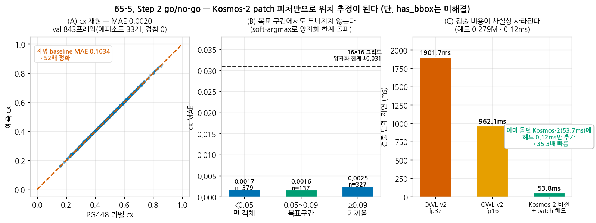
⚠️ 이 결과가 증명하지 않는 것 — 과대해석 금지
- has_bbox 판정은 전혀 다루지 못했다.
학습셋의 미검출 프레임이 0건이라
"타겟이 없다"를 학습할 방법이 없다. 이 헤드는 항상
어딘가를 가리킨다. 64-15에서 액션 헤드에 대해 확인한 문제가
검출기 층위에서 그대로 재현된 것이며,
실기 성패를 가르는 게 바로 이 has_bbox이므로 이게
풀리기 전에는 OWL-v2를 대체할 수 없다.
- "PG448이 성공한 프레임"만 재현한 것이다.
우리가 고치려는 대상(OWL이 실패하는 프레임)은 이 학습셋에 존재하지 않는다.
- V6 조작 데이터로만 평가했다.
실기 176세션 프레임 평가(계획서 단계 4)는 아직이다.
- 라벨의 cy 최솟값이 0.582라 화면 하단 40%의 공간
prior가 그대로 학습됐다. 상단 배치는 원리적으로 못 잡는다.
판정: (C) 방향 GO — 단 조건부 —
위치 추정(localization)은 추가 비용 0.12ms로 해결됐다.
남은 것은 검출/기각(has_bbox)이고, 이는 모델 구조가
아니라 negative 데이터 부재 문제다. 계획서 단계 3~4
진입 전에 negative 확보 방안(64-15의 시범 수집 파일럿, 또는 타겟 없는 프레임 합성/수집)을
먼저 정해야 한다.

**🚧 65-6. has_bbox는 공짜로 얻을 수 없다 — negative 부재가 구조적 병목 (2026-08-02)**

65-5에서 위치 추정은 0.12ms에 해결됐지만 "타겟이 없다"를
말하지 못한다는 한계가 남았다. 그래서 negative 데이터
없이도 heatmap의 확신도로 has_bbox를 얻을 수 있는지를 먼저 검증했다 — 되면 로봇
없이 끝나기 때문이다.
실기 176세션에서 negative 155건(젯슨·로컬 양쪽
미검출, 64-20 데이터) vs positive 200건(젯슨 검출)에
학습된 헤드를 돌려 네 가지 확신도 지표를 비교했다:
확신도 지표negative 평균positive 평균AUC
heatmap peak prob
0.2701
0.2468
0.466
분포 엔트로피
3.1696
2.8588
0.486
peak logit
2.5659
3.4926
0.553
예측 area
0.0439
0.0683
0.583
어느 지표도 AUC 0.6을 넘지 못한다(0.5 = 우연).
heatmap peak prob은 오히려 0.466으로 우연보다 못하다.
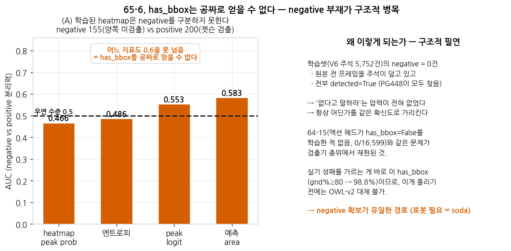
구조적 필연이다 — 검증으로 확인: V6 주석의
negative가 0건인 걸 직접 확인했다. 주석이 원본
프레임을 하나도 버리지 않고 전부 덮고 있으며
(225 에피소드 표본 검사, 누락 인덱스 0), 그 전부가 detected=True다.
즉 학습 과정에서 모델에게 "없다고 말하라"는 압력이 한 번도
가해지지 않았다. 그래서 항상 어딘가를 같은 확신도로 가리킨다.
이것은 64-15의 재현이다 — 액션 헤드가
has_bbox=False를 학습한 적 없다는 문제(0/16,599)가
검출기 층위에서 똑같이 반복됐다. 같은 데이터
공백이 두 층위에서 각각 발현한 셈이다. 그리고 실기 성패를 가르는 것이 바로 이
has_bbox(gnd%≥80 → 98.8%)이므로, 이게 풀리기 전에는
OWL-v2를 대체할 수 없다.
우리 쪽에서 더 할 수 있는 게 없음을 확인한 근거
- V6 주석이 버린 프레임 = 0건 → 재활용할 negative 없음
- 실기 176세션의 미검출 프레임은 있으나, 64-20 분석상
진짜 타겟 부재는 2.5%(5건)뿐이고 나머지는 "보이는데 경계에 걸린" 경우다.
이걸 negative로 쓰면 "보이는 것도 없다고 말하라"고
가르치는 꼴이라 개선 목표와 정반대가 된다
- 확신도 기반 우회 = 위 표로 기각
→ negative 확보는 로봇이 필요한 작업이므로 soda에 이관.
스펙을 DATASET_V6_STATUS.md로 전달했다(2026-08-02).

**65-4. 남은 것 — 검정력 한계를 알고 시작하기**

동일 위치 A/B (약좌 고정, 번갈아 20+20) — CH64 64-19가
"요인 순위 단정 불가"로 남긴 것을 푸는 유일한 방법. 단
n=20이면 25%p 이상 차이부터 유의하므로, 그보다 작은
효과는 이 규모로 검출되지 않는다(soda 검정력 분석).
좌우 비대칭 — 좌 32/40 vs 우 37/40,
Fisher p=0.193으로 유의하지 않다. 표본 추가 전까지
"경향성" 이상으로 서술하지 않는다(soda 정정 요청, CH64 64-18에 이미 반영됨).
→ 원인 추적은 CH66에서
별도로 다룬다 — 데이터/그라운더/헤드/기구 4층위를 flip 대조로 검정했고,
헤드의 고정 우측 편향을 원인으로 특정해 제거까지 확인했다.
소형 검출기 —
docs/plans/plan_20260801_specialized_detector.md 검토 대기.
핵심 프레이밍은 "새 학습"이 아니라 "느리고 정확한 오프라인
주석 파이프라인의 증류"이며, 중단 기준(area 0.05~0.09 구간에서 OWL 미달 시 중단)과
평가 프로토콜을 착수 전에 고정해뒀다.

<a class="src-link" href="../v5/research_story.html#ch65">→ 원문 전체 보기 (research_story.html#ch65)</a>

CH 66 좌우 비대칭의 원인 추적 — 부호로 용의자를 가려내다

실기 100건에서 좌측(80.0%)이 우측(92.5%)보다 약한 이유를 층위별로 검정한 기록(2026-08-04). 교수님 질문 "데이터 불균형인가, 모델 비대칭인가, 기구 편향인가"에서 출발해 좌우 반전(flip) 대조로 각 층위를 하나씩 검정했다. 핵심 도구는 부호다 — 편향의 방향이 실기 약세와 반대면 그 층위는 원인이 될 수 없다.

🟡 3줄 요약
① 데이터 에피소드는 균형(좌 90 / 우 90, 라벨 cx 0.4976) — 원인 아님.
② 그라운더는 오히려 좌측 선호(+0.0118) — 부호가 실기와 반대라 원인 아님.
③ 액션 헤드에 고정 우측 선호(−0.0275) — 부호 일치. 원인은 학습 액션의 우측 21.8% 편중(66-6: 트랙 A 전용 +25.9%, 트랙 F는 +1.2%)이며, 미러 증강으로 +0.0068까지 제거(val_acc 유지).

**66-1. 문제 정의와 검정 설계 — 왜 flip 대조인가**

현상: 실기 100건에서 좌측 계열 32/40(80.0%) vs 우측 계열
37/40(92.5%). 단 n=40에서 Fisher p=0.193으로 아직 유의하지
않으므로 "경향"으로 다룬다(CH65 65-4). 그럼에도 평균 스텝이 좌 17~19 vs 우 10~12로
1.6배 차이나 원인 추적의 가치가 있다.
용의자 4층위
층위검정 방법로봇
① 학습 데이터 분포
에피소드/프레임/라벨 집계
❌
② 그라운더(OWL-v2)
이미지 좌우 반전 paired test
❌
③ 액션 헤드
완전 미러 입력 + L/R 클래스 스왑
❌
④ 기구·물리
open-loop 명령 → 실제 변위 측정
✅ 필요
왜 flip 대조가 "증명"이 되는가
보통 이런 걸 재려면 "좌측 물체 사진들"과 "우측 물체 사진들"을 비교하게 되는데, 그럼 두 집합의
내용 자체가 달라서(배경·조명·거리) 차이가 모델 탓인지
사진 탓인지 가릴 수 없다. 이것이 "증명하기 어렵다"고 느끼는 이유다.
flip 대조는 그 교란을 원천 제거한다 — 같은 사진 한 장을
좌우로 뒤집으면 배경·조명·물체·거리가 전부 동일하고 위치만
좌↔우로 바뀐다. 모델이 대칭이면 출력이 같아야 하고, 다르면 그 차이는
위치 말고 설명할 것이 없다. paired design이라
300장 규모로도 충분한 검정력이 나온다.
① 학습 데이터 — 불균형 아님
V6좌 계열우 계열
에피소드
90 (강좌 45 + 약좌 45)
90 (강우 45 + 약우 45)
프레임
6,910 (평균 76.8)
6,870 (평균 76.3)
라벨 cx 평균
0.4976 (0.5면 완전 대칭)
실행된 액션 클래스
3,384
4,122 (21.8%↑)
수집 설계는 완벽히 균형이다. 비대칭은
실제로 실행된 액션 클래스 빈도에만 있다 — 조종자가 같은
목표 위치에서도 실제로 어떤 조향을 썼는지의 차이이며,
에피소드 수 불균형과는 다른 층위다.
이것이 ③의 원인으로 이어진다(66-4에서 확인).

**🔬 66-2. 그라운더 검정 — 그라운더 좌우 비대칭 — 편향은 실재하나 실기 좌측 약세의 원인이 아니다 (2026-08-04)**

교수님 질문: "학습 데이터 좌/우 에피소드 수가 불균형은 아닐 것 같고, 그렇다면
OWL-v2/Kosmos-2 grounding feature 자체가 이미지 좌/우에 비대칭적으로 학습되어 있을
가능성은 있을까? 증명하기 힘들 것 같은데…"
증명 가능합니다 — 좌우 반전(horizontal flip) paired test로 됩니다.
모델이 대칭이면 이미지를 좌우 반전했을 때 검출 여부가 같고,
confidence가 같고, cx_flip = 1 − cx_orig여야 합니다.
같은 물체·같은 장면에서 위치만 좌↔우로 바뀐 쌍을
비교하므로 내용(content) 교란이 제거됩니다 — 편차가 남으면 그것이 모델의 비대칭입니다.
① 먼저 데이터 균형 확인 — 불균형 아님
V6좌 계열우 계열
에피소드
90 (강좌 45 + 약좌 45)
90 (강우 45 + 약우 45)
프레임
6,910 (평균 76.8)
6,870 (평균 76.3)
라벨 cx 평균
0.4976 (0.5면 완전 대칭)
※ 단 실행된 액션 클래스 빈도에는 비대칭이 있습니다
(좌계열 3,384 vs 우계열 4,122, 약 22%) — 조종자가 같은 목표에서 실제로 어떤 조향을 썼는지의
차이이며, 에피소드 수 불균형과는 다른 층위입니다.
② 검정 결과 (V6 300프레임, 좌/우 150장씩, OWL-v2 fp32 · 서버 동일 조건)
측정결과해석
검출 판정 불일치
21/300 (7.0%)
원본만 10 / 반전만 11 — 방향성 없음
좌측 물체 → 우측 이동
Δ −0.0104
점수 하락 (p=0.074)
우측 물체 → 좌측 이동
Δ +0.0132
점수 상승 (p=0.026)
좌측 이점 추정
+0.0118
95%CI +0.0033~+0.0203, p=0.0072
독립 확인(절대 score)
좌 0.5045 / 우 0.4907
차 +0.0138 — paired 추정과 일치
위치 미러링 오차
0.0033
좌표 자체는 대칭 (p90 0.0051)
즉 비대칭은 실재합니다 — OWL-v2는 좌측을 약
0.012 더 높게 봅니다. threshold(0.20)의 5.9%,
64-17 knife-edge 밴드(0.10 폭)의 11.8%에 해당하는 크기로, 작지만 통계적으로 유의합니다.
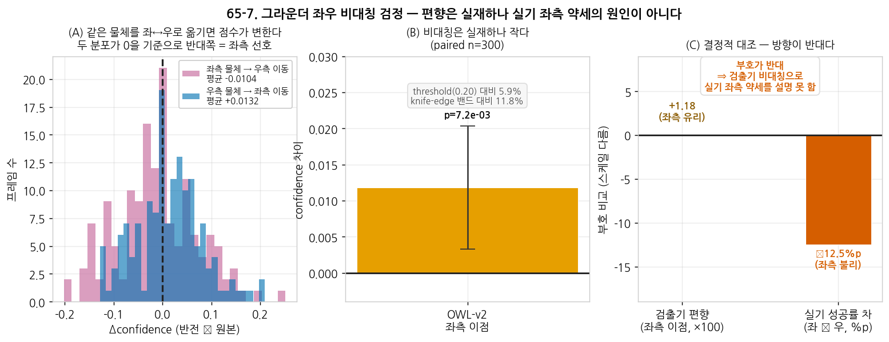
🔑 결정적인 것은 부호입니다 — 방향이 반대
검출기 편향
좌측 +0.0118 유리
실기 성공률
좌 80.0% vs 우 92.5% → 좌측 12.5%p 불리
검출기는 좌측을 오히려 선호하는데 실기는 좌측이 약합니다.
설명이 성립하려면 검출기가 좌측을 불리하게 봐야 하는데
측정은 그 반대입니다. → 그라운더 비대칭으로는 실기 좌측 약세를
설명할 수 없습니다.
같은 결론이 65-1에서도 나왔습니다 — 강우는 검출이
최악(gnd% 49%)인데 성공률 90%. 검출 난이도와 주행 난이도가
별개 축이라는 2축 분해와 정합합니다.
남은 후보 3개 — 좌측 약세의 원인은 아직 미규명이며,
아래 순서로 좁힐 수 있습니다(65-8 진행 중).
- 비전 피처 경로 — Kosmos-2 patch 피처도 같은 flip
테스트로 검정 가능(로봇 불필요)
- 액션 헤드 자체 — 입력을 미러링하고 L/R 클래스를
맞바꿔 예측이 대칭인지 검정(로봇 불필요, 가장 결정적)
- 물리·기구학 비대칭 — 같은 명령에 대한 실제 변위/회전량
좌우 비교(로봇 필요 → soda)
📝 자체 정정 — 초기 스크립트에 "두 Δ의 합이 0이면
대칭"이라고 적었으나 거꾸로였습니다. 대칭이면 각 Δ가
개별적으로 0이어야 하고, 합이 0인 것은 오히려
일관된 한쪽 선호의 신호입니다(두 Δ가 부호 반대로 나오므로).
판정을 "각 Δ가 0인가"로 바꾸고, 부호 정렬 후 paired t-test로 재계산했습니다.
스크립트: scripts/test_grounder_lr_symmetry.py

**✅ 66-3 / 66-4. 액션 헤드 검정과 원인 제거 — 학습 데이터 편중 → 헤드 고정 편향, 미러 증강으로 제거 확인 (2026-08-04)**

66-2에서 그라운더는 무혐의(오히려 좌측 선호로 부호 반대)로 나왔다. 다음 후보인
액션 헤드를 같은 논리(미러 입력 대조)로 검정했고,
원인을 특정한 뒤 제거까지 확인했다.
66-3. 헤드에 입력과 무관한 고정 우측 선호가 있다
val 12 에피소드 876 윈도에 대해 이미지를 반전해 비전 피처를
재추출하고 cx를 미러링, 출력에서 L/R 클래스를 맞바꿔 비교했다.
입력좌계열 질량우계열 질량편향
원본
0.2083
0.3102
−0.1020
미러
0.2737
0.2267
+0.0470
대칭이면 미러 편향이 +0.1020이어야 하는데 +0.0470에
그쳤다. 잔차의 절반이 입력 내용과 무관한 고정 편향
−0.0275(우측 선호)다.
클래스별로 보면 대각 전진이 지배 항이다:
쌍원본 P(좌)원본 P(우)비
FWD+L / FWD+R
0.114
0.282
우측 2.5배
LEFT / RIGHT
0.091
0.016
좌측 5.7배
ROT_L / ROT_R
0.003
0.013
우측 3.8배
🔑 이번엔 부호가 일치한다
그라운더(66-2)
좌측 +0.0118 선호
❌ 실기와 반대
액션 헤드(66-3)
우측 −0.0275 선호
✅ 실기와 일치
실기 결과
좌 80.0% vs 우 92.5% → 좌측 12.5%p 불리
헤드가 좌측 행동을 덜 내니 좌측 목표에 약한 것이 설명된다.
66-4. 미러 증강으로 편향을 제거 — 원인이 데이터였음을 확정
학습 데이터가 우측 21.8% 편중(좌 3,384 vs 우 4,122,
특히 FWD+R 3,117 vs FWD+L 2,532)이라는 것이 원인 후보였다. 전 학습 윈도에 미러 쌍을
추가해(이미지 반전 후 비전 피처 재추출 + cx 미러 + L/R 라벨 스왑) 분포를 완전 대칭으로 만들고
동일 레시피로 재학습했다.
지표기존 holdaware미러 증강 (3 seed)
고정 좌/우 편향
−0.0275
+0.0068 ± 0.0014
val_acc
75~78%
75.12% ± 0.57% (유지)
학습 라벨 좌/우
3,384 / 4,122
1,278 / 1,274 (차 4)
미러 응답
−0.1020 / +0.0470
−0.0962 / +0.1137
편향 75% 감소, val_acc 손실 없음. 미러 응답도 크기가 거의
같고 부호만 반대로 정상화됐다(대칭의 정의). 데이터 편중을 없애니 편향이 사라졌으므로
원인은 아키텍처·최적화가 아니라 데이터였음이 확정된다.
체크포인트: exp73_owl_trackF_v6_mlp_mirroraug_seed{0,1,2}.pt
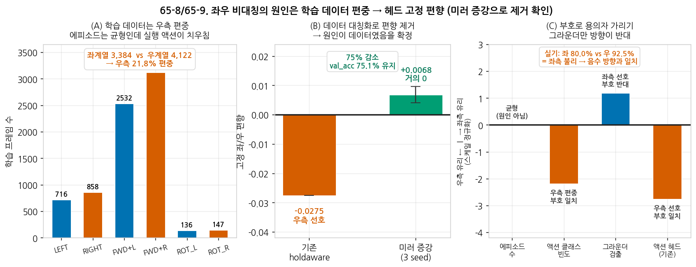
인과 사슬 (부호까지 일관)
조종자 습관 → 학습 액션 우측 21.8% 편중
→ 헤드 고정 우측 선호 −0.0275
→ 좌측 행동을 덜 냄 → 실기 좌측 약세 −12.5%p
↑ 미러 증강으로 데이터 대칭화 → 편향 +0.0068로 제거
📐 이것이 기구 편향 검정의 기준선을 만든다
지금까지 "휠·카메라 마운트·무게중심 편향이 있나?"를 물어도
소프트웨어 편향과 섞여 분리가 불가능했다. 헤드를
대칭으로 맞춘 체크포인트로 실기를 재측정하면 다음처럼 갈린다:
- 좌우차 소멸 → 원인은 전부 소프트웨어. 기구 편향 없음
- 줄지만 남음 → 남은 폭이 기구 편향의 크기
- 그대로 → 헤드 편향은 부수적이고 기구 편향이 지배
단 기구 검정 자체는 주행이 필요 없다 — 명령만 보내고
실제 움직임을 재는 open-loop 측정이라 모델·타겟·성공판정이 모두 불필요하다.
그래서 기구 검정을 먼저 하는 것이 싸고 빠르다(soda 요청).
참고: soda가 2026-07-31에 ROT_R 라벨인데 로봇이 실제로 왼쪽으로
회전하는 것을 육안 확인한 기록이 있다(관찰 1건, 미확정). 이름-물리방향 매핑 확인이
기구 검정 항목에 포함된다.
카메라 마운트는 이 검정으로는 무혐의 — 도착 시점 타겟 cx가
중앙 배치 0.4701(p=0.32), 전체 0.4807(p=0.34)로 0.5와 유의하게 다르지 않다. 단 표준편차
0.19·n=20이라 ±0.03 수준 편향은 검출 못 하는 검정력이므로
직진 드리프트 측정으로 보완이 필요하다.

**🔎 66-6. 데이터 편중의 출처 분해 — 트랙 A 전용이고, 조향 회피가 아니라 조향 총량 차이다 (2026-08-05)**

66-3/66-4에서 원인을 "학습 액션의 우측 21.8% 편중"으로
지목했다. 그런데 그 21.8%가 어디서 생긴 것인지는
확인하지 않았다. 논문 데이터 절을 쓰면서 V6 구성을 다시 세어 분해했다.
V6 실제 구성 — 시작 위치 5종 × 경로 3종 = 15조합,
각 15 에피소드. 학습 코드가 나누는 두 묶음의 정의도 확정했다:
--exclude-trackf가 path_type.startswith("center")를 제외하고
"트랙A only"로 출력한다.
시작 위치ep프레임프레임/ep묶음
강좌
45
3,611
80.2
트랙 A
약좌
45
3,299
73.3
트랙 A
중앙
45
2,819
62.6
트랙 F
약우
45
3,268
72.6
트랙 A
강우
45
3,602
80.0
트랙 A
좌 시작 90ep/6,910프레임 vs 우 시작 90ep/6,870프레임 —
프레임 차이 0.6%. 즉 수집 설계 수준에서는 대칭이다.
① 편중은 트랙 A 전용이다
묶음좌계열우계열격차
트랙 A (좌우 시작 180ep)
2,820
3,551
+25.9%
트랙 F (중앙 시작 45ep)
564
571
+1.2%
중앙에서 출발한 에피소드에서는 좌우가 거의 정확히 대칭이다. 편중은
목표가 화면 중앙에서 벗어난 상태로 출발할 때만 생긴다.
② 정렬 회복 조향 자체는 좌우 대칭이다 — 미러 검정
강좌 시작 에피소드가 쓴 우계열 19.2%와
강우 시작 에피소드가 쓴 좌계열 19.9%는 0.7%p
차이다(약좌·약우 쌍은 1.6%p). 즉 "한쪽 방향 조향을 덜 했다"는
설명은 기각된다.
③ 실제로 다른 것은 직진의 비중이다
좌측 시작 에피소드는 직진이 49~51%인데 우측 시작은
40~41%로 약 10%p 낮다.
그만큼 조향 행동이 더 많이 쓰였고, 그 초과분이 우계열 총량을 키웠다.
→ 즉 이 편중은 시작 위치에 따라 조작자가 사용한 조향의
총량이 달랐던 결과로 보인다.
단 이는 관측에 대한 해석이며, 조작 로그나 궤적으로 원인을
검증한 것은 아니다.
④ 대응 방법이 달라진다 — 이것이 이 분해의 실질
에피소드 수(90:90)와 프레임 수(0.6% 차)가 이미 대칭이므로
"좌측 데이터를 더 모으자"는 처방은 듣지 않는다.
실제로 효과가 있었던 것은 클래스 가중치와 미러 증강이었고
(66-4, 65-9), 그것이 이 분해와 정합한다. 재수집으로 풀려면
"조향 총량을 시작 위치 간에 통제한다"는 새로운 수집
규약이 필요하다 — 에피소드 수를 맞추는 것만으로는 부족하다.
추가로 cadence-aligned 샘플링은 이 편중을
바꾸지 않는다는 것도 확인했다 — 좌우 격차가 프레임 단위 4.45%p에서 majority-vote 라벨
4.47%p로 사실상 불변이다(scripts/analyze_hold_aware_labeling.py).
즉 샘플링은 시간 구조 정렬 장치이고 불균형 보정 장치가 아니다.
🚧 66-5. 무엇을 주장할 수 있고 무엇을 아직 못 하는가
주장상태
모델 쪽 원인이 존재한다
✅ 확인 — 헤드 고정 우측 선호 −0.0275
그 원인의 부호가 맞다
✅ 확인 — 실기 좌측 약세와 일치
그 원인이 제거 가능하다
✅ 확인 — 미러 증강 +0.0068, val_acc 유지
그 원인이 충분한가 (12.5%p 전부를 설명)
❌ 미확인
기구 편향이 없다
❌ 미검증 — 측정 안 한 것 ≠ 없는 것
"충분한가"가 핵심 공백이다. 편향 −0.0275가 12.5%p 성공률
차이를 만들 만한 크기인지 아직 연결하지 못했다. 절반만 설명하고 나머지가 기구일 수도 있다.
서술 규칙 — 논문·보고에 이렇게 쓴다
✅ 가능: "좌우 비대칭의 한 원인으로
학습 데이터 편중에서 비롯된 정책의 고정 편향을 확인하고 제거했다.
기구 편향은 미검증이며 잔여 기여분은 추가 측정이 필요하다."
❌ 금지: "기구 편향을 배제했다" / "원인은 모델이었다"
— 기구 검정을 하지 않았으므로 배타적 주장은 성립하지 않는다. 두 요인은 합산될 수 있다.
남은 검정 — 기구 편향 (soda 요청 완료, 커밋 2fac8b58)
주행이 필요 없다는 점이 중요하다. 명령만 보내고 실제 움직임을
재는 open-loop 측정이라 모델 추론·타겟 배치·성공판정이 전부
불필요하다. 바닥 테이프와 줄자로 수십 분이면 된다.
항목방법무엇을 잡는가
A 직진 드리프트
FWD 20스텝 → 좌우 이탈 cm
무게중심 / 좌우 휠 게인 차
B 회전량 대칭
ROT_L vs ROT_R 10스텝 각도
회전 구동 비대칭
C 대각 전진 대칭
FWD+L vs FWD+R 변위
실기와 가장 직결 (66-3의 지배 항)
D 이름-방향 매핑
B 측정 시 회전 방향 기록
soda 7/31 미해결 항목
참고: soda가 2026-07-31에 ROT_R 라벨인데 로봇이 실제로 왼쪽으로
회전하는 것을 육안 확인한 기록이 있다(관찰 1건, 미확정). 수집과 추론이 같은 하드웨어
경로를 공유하므로 매핑이 일관됐다면 모델은 일관된 물리 대응을 배운 것이나,
preview_align·CX_RULE처럼 사람이 이름을 믿고 짠 규칙은 켜면
진짜로 반대 방향을 낼 수 있다(현재 비활성).
그 외 남은 것: ② 미러 체크포인트 실기 A/B(기구 검정 이후,
약좌 고정). n=20이면 25%p 이상부터 유의하므로 12.5%p의 완전 소멸은
20회로 판정 불가 — 방향과 대략적 크기만 본다.
▼ 여기부터 FUTURE WORK
CH1~CH66 = 현재 논문 범위  ·  CH67~ = 향후 계획
현재 논문(CH1~CH66)이 다루는 것: E2E VLA 붕괴 진단 → 분해 파이프라인 →
실기 100건 89% → 병목이 인지임을 규명 → 좌우 비대칭 원인 추적.
모두 측정으로 뒷받침된 완료 항목이다.
향후 계획(CH67~)이 다루는 것: 차기 경량 구성 후보 검정(CH67),
언어 조건화 VLA 전환(CH68). 진행 중·미검증 항목이 섞여 있으므로
논문 본문 주장으로 인용하지 않는다 — 각 카드에 상태를 표시한다.

<a class="src-link" href="../v5/research_story.html#ch66">→ 원문 전체 보기 (research_story.html#ch66)</a>

